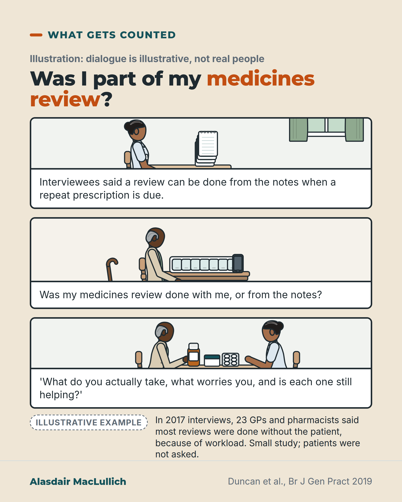

# G051: A medicines review you were not part of

- Category: C06 Medicines and prescribing burden
- Audience: public
- Series: What gets counted
- Post type: criticism
- Visual format: comic strip (3 panels)
- Status: text text_final, visual final
- Working id: C06-P03 (candidate C06-29)

## Insight

GPs and pharmacists interviewed in 2017 said most medication reviews were done from the notes without the patient, and stopping medicines was harder because it needs a conversation; you can ask for a review that includes you.

## Angle and position

The review that counts as done may not have included the person. Framed as workload and systems, dated, with the study's limits.

Basis: mixed: empirical finding (what interviewees said, Duncan 2019; SMR survey, Agwunobi 2025); ethical judgement (a review should include the person) marked as such

## X (1029 characters)

```text
A medication review can happen without you in the room.

In 2017, researchers interviewed 23 GPs and pharmacists in England and Scotland. They said most reviews were done from the notes, without the patient, because of workload. Several called it a 'tick box' exercise, meaning it was done to be recorded as done. They also said people who are frail and take many medicines should be prioritised for a review with the patient, but time pressure got in the way.

The same professionals said carrying on a medicine was easier than stopping it, because stopping needs a conversation, and that takes time.

This was a small interview study. It did not count how often this happens, and patients were not asked. Since 2020, England has offered 'structured medication reviews' to some people. A survey of pharmacists who do them, answered by those who chose to reply, found most were by phone. A phone call still involves the person.

We think a review of your medicines should include you. You can ask your practice for one that does.
```

## LinkedIn (1845 characters)

```text
A medication review can happen without you in the room.

In 2017, researchers interviewed 23 GPs and pharmacists in England and Scotland about how reviews of long-term medicines worked in practice. They said most were done from the notes, without the patient, often when a repeat prescription was due. The reason they gave was workload. Several called it a 'tick box' exercise, meaning it was done to be recorded as done. They also said people who are frail and take many medicines should be prioritised for a review with the patient, but time pressure got in the way.

The same professionals said it was easier to carry on a medicine than to stop it. Stopping needs a conversation with the person, and a conversation takes time.

This was a small interview study of what professionals said. It did not count how often reviews leave the person out, and patients were not asked. The interviews were done before a change. Since 2020, practices in England have offered a 'structured medication review' to some people. These include care home residents and people on many medicines. In a survey of pharmacists who carry these out and chose to reply, most were by phone, and only about 1 in 4 said they sent people information beforehand.

National guidance in England says a medication review should involve the person taking the medicines, with the aim of agreeing what to do.

That is a question of respect as much as efficiency: in our view, decisions about your medicines should be made with you. The GPs and pharmacists interviewed described a good review as starting with three things:
1. What you actually take, including what you have stopped.
2. What worries you about any of it.
3. The pros and cons of carrying on or stopping each medicine.

If you have not had that conversation, you can ask your practice for a review that includes one.
```

## Bluesky (270 characters)

```text
In 2017 interviews, 23 GPs and pharmacists said most medication reviews were done from the notes, without the patient, because of workload.

Small study; patients weren't asked.

A review of your medicines should include you. You can ask your practice for one that does.
```

## Threads (459 characters)

```text
A medication review can happen without you in the room.

In 2017 interviews, 23 GPs and pharmacists said most reviews were done from the notes, without the patient, because of workload. Stopping a medicine was harder, because it needs a conversation.

A small study, and patients were not asked.

We think a review of your medicines should include you. You can ask your practice for one: what you take, what worries you, and whether each medicine still helps.
```

## Source reply

Sources: Duncan 2019 https://doi.org/10.3399/bjgp19X701321 ; Agwunobi 2025 https://doi.org/10.1136/bmjopen-2024-097012

## Visual



Alt text: Three-panel illustrative comic. A GP at her desk beside a stack of repeat prescription requests, then an older man at his kitchen table with a pill organiser and phone wondering if his review included him, then the two talking over his medicine boxes. Study note: in 2017, 23 GPs and pharmacists said most reviews were done without the patient. Small study.

Editable source: `visuals/src/G051.html`

Design instructions: Single card, sand ground. Three stacked comic panels drawn with kit: GP at desk with notepad stack; older Black man at kitchen table with pill organiser, phone, stick; same man and GP talking over medicine boxes. Illustrative badge. No evidence chart. Duncan 2019 study note.

## Sources and verification

- C06-29-a (supported_with_qualification): In 2017 interviews, 13 GPs and 10 pharmacists in England and Scotland said that, because of workload, most medication reviews were done remotely without involving the patient; several called them a 'tick box' exercise.
  - Source: Duncan P, Cabral C, McCahon D, Guthrie B, Ridd MJ. Efficiency versus thoroughness in medication review: a qualitative interview study in UK primary care. Br J Gen Pract. 2019;69(680):e190-e198.
  - Passage: ""In total, 13 GPs and 10 pharmacists were interviewed." "Analysis of semi-structured interviews with GPs and pharmacists working in the South West of England, Northern England, and Scotland, sampled for heterogeneity. Interviews took place between January and October 2017." "Due to high workload pressures and time constraints, interviewees reported that most medication reviews were conducted remotely, without involving the patient. Several GPs and pharmacists described the medication reviews as a ‘tick box’ exercise, which they did in the quickest way possible without involving the patient. Two GPs and most pharmacists argued that a ‘proper’ medication review required patient involvement and could not be done remotely"" (Abstract (Design and setting; Results); full text Results (Patient-centredness: Involving patients versus being time efficient))
- C06-29-b (supported_with_qualification): When a repeat prescription came up with a review overdue, GPs could sign it anyway, do a remote review from the notes, or book a review appointment.
  - Source: Duncan P, Cabral C, McCahon D, Guthrie B, Ridd MJ. Efficiency versus thoroughness in medication review: a qualitative interview study in UK primary care. Br J Gen Pract. 2019;69(680):e190-e198.
  - Passage: ""For requests where the medication review was out of date, GPs could then either ignore this and sign the prescription, carry out a remote medication review using the patient’s notes, or arrange a medication review appointment over the phone, face-to-face, or in the patient’s home"" (Full text, Results (The role of others in medication reviews))
- C06-29-c (supported_with_qualification): Interviewees said it was easier to continue medicines than to stop them, because stopping required involving the patient and created extra work; the authors concluded medicines were rarely stopped or reduced.
  - Source: Duncan P, Cabral C, McCahon D, Guthrie B, Ridd MJ. Efficiency versus thoroughness in medication review: a qualitative interview study in UK primary care. Br J Gen Pract. 2019;69(680):e190-e198.
  - Passage: ""Interviewees argued that it was easier to continue medicines than it was to stop them, particularly because stopping medicines required involving the patient and this generated extra work." "Practices tended to prioritise being efficient (getting the work done) rather than being thorough (doing it well), so that most medication reviews were carried out with little or no patient involvement, and medicines were rarely stopped or reduced."" (Abstract (Results; Conclusion))
- C06-29-d (supported): This is a qualitative study of professionals' views from practices in a trial; it did not interview patients or measure how often reviews exclude them.
  - Source: Duncan P, Cabral C, McCahon D, Guthrie B, Ridd MJ. Efficiency versus thoroughness in medication review: a qualitative interview study in UK primary care. Br J Gen Pract. 2019;69(680):e190-e198.
  - Passage: ""One limitation was that interviewees were recruited from practices involved in a trial; practices, the GPs, and pharmacists who take part in clinical trials may not be representative of all practices." "It was outside the scope of this study to interview other health professionals involved in medication reviews, such as nurses, and to interview patients about their experiences of medication review."" (Full text, Discussion (Strengths and limitations))
- C06-29-e (supported_with_qualification): NICE guidance emphasises involving the person in medication review; NICE defines a medication review as a structured examination of a person's medicines aiming to reach agreement with the person about treatment.
  - Source: Duncan P, Cabral C, McCahon D, Guthrie B, Ridd MJ. Efficiency versus thoroughness in medication review: a qualitative interview study in UK primary care. Br J Gen Pract. 2019;69(680):e190-e198.; National Institute for Health and Care Excellence. Medicines optimisation: the safe and effective use of medicines to enable the best possible outcomes. NICE guideline NG5. London: NICE; 2015. [Web page not opened; search-engine extract only]
  - Passage: "Duncan 2019 (peer-reviewed description of NICE): "The National Institute for Health and Care Excellence recommends that patients with frailty, multimorbidity, and polypharmacy should undergo regular medication review, and emphasises the importance of involving them in this process." "This does not align with NICE guidance, which puts a strong emphasis on involving patients and their families in decisions about their medicines, and on reducing medicine waste." NICE NG5 (search-engine extract only, page not opened): Medication review is defined as "a structured, critical examination of a person's medicines with the objective of reaching an agreement with the person about treatment, optimising the impact of medicines, minimising the number of medication‑related problems and reducing waste". Search summary also states: "During a structured medication review, healthcare professionals should take into account the person's, and their family members or carers where appropriate, views and understanding about their medicines, as well as their concerns, questions or problems with the medicines."" (Duncan 2019 full text (How this fits in; Discussion); NICE NG5 via search extract)
- C06-29-f (supported_with_qualification): Since September 2020 England has had structured medication reviews (SMRs), distinct from re-authorising repeat prescriptions; in a survey of 120 clinical pharmacists doing them, most were by telephone, and only 26% said they gave patients information in advance.
  - Source: Agwunobi AJ, Seeley AE, Tucker KL, Bateman PA, Clark CE, Clegg A, et al. Understanding structured medication reviews delivered by clinical pharmacists in primary care in England: a national cross-sectional survey. BMJ Open. 2025;15(9):e097012.
  - Passage: "Introduction: "SMRs were formally introduced via NHS England (NHSE) in September 2020,8 as distinct from the act of re-authorising repeat prescriptions or a review of specific medicines during a long-term condition review. However, full implementation was delayed due to the COVID-19 pandemic 9". Abstract: "Patient selection was largely driven by the primary care contract specification: care home residents, patients with polypharmacy, patients on medicines commonly associated with medication errors, patients with severe frailty and/or patients using potentially addictive pain management medication. Only 26% (n=36) of respondents reported providing patients with information in advance. The majority of SMRs were undertaken remotely by telephone and were 21–30 min in length." Introduction: "A qualitative interview study with clinical pharmacists delivering SMRs remotely in primary care in England between 2020–2022 reported that early implementation, without the opportunity for adequate clinical knowledge development, consultation training provision and skills acquisition, fell short of policy aspirations for holistic, personalised reviews."" (Abstract (Results); full-text Introduction via Scite)
- C06-29-g (partly_supported): Some structured medication reviews start from a request by patients, carers or family members, or from patients self-referring.
  - Source: Agwunobi AJ, Seeley AE, Tucker KL, Bateman PA, Clark CE, Clegg A, et al. Understanding structured medication reviews delivered by clinical pharmacists in primary care in England: a national cross-sectional survey. BMJ Open. 2025;15(9):e097012.
  - Passage: "Table footnotes: "*120 respondents were asked to tick all that apply.†Ardens/EMIS searches, medicines manager, administrative team, care coordinator, patients self-referring.‡People with incentivised medicines-related indicators listed by NHS England,16 people with frequent hospital admissions, people with mental health problems, people who are housebound, people using medication compliance aids or with compliance issues, people with complex discharge needs, people on 4–9 medicines, people with a clinical need as requested by other health professionals, patients, carers or family members."" (Full text, Results (table footnotes on patient identification and selection) via Scite)
- C06-29-h (supported_with_qualification): GPs and pharmacists described the ideal review as finding out what the person actually takes, sharing concerns and discussing pros and cons of continuing or stopping; there is no clear evidence that reviews as practised improve clinical outcomes.
  - Source: Duncan P, Cabral C, McCahon D, Guthrie B, Ridd MJ. Efficiency versus thoroughness in medication review: a qualitative interview study in UK primary care. Br J Gen Pract. 2019;69(680):e190-e198.
  - Passage: ""Both the pharmacists and GPs described the ‘ideal’ scenario of a patient-centred medication review, whereby the clinician finds out what the patient is actually taking, shares concerns, and has an informative discussion about the pros and cons of continuing or stopping certain higher-risk medicines." "Although a patient-centred model of medication review appears to be a reasonable approach to reducing harmful polypharmacy, there is a lack of evidence that medication review, as currently practised, or in the ‘ideal’ form described, actually improves clinical outcomes."" (Full text, Discussion (Implications for research and practice))

Verification notes: Duncan 2019 full text: 23 professionals, 2017, remote reviews due to workload, 'tick box', stopping harder; limitations stated. Agwunobi 2025 full text: SMRs since 2020 (background), mostly by phone, about 1 in 4 sent information. NICE NG5 via Duncan and search extract, phrased generally. 'You can ask' phrased as suggestion (C06-29-g partly supported, used only as suggestion). Involvement argued as judgement, not outcome benefit. Comic panel 1 worded as what interviewees said; SMR survey respondents described as self-selected.

## Attention and follow potential

Pause: Many people have had a 'review' recorded that they never took part in.

Gain: Permission and words to ask for a review that includes them.

Follow: Posts that show the gap between what is recorded and what people experience.

## Open issues

None.
