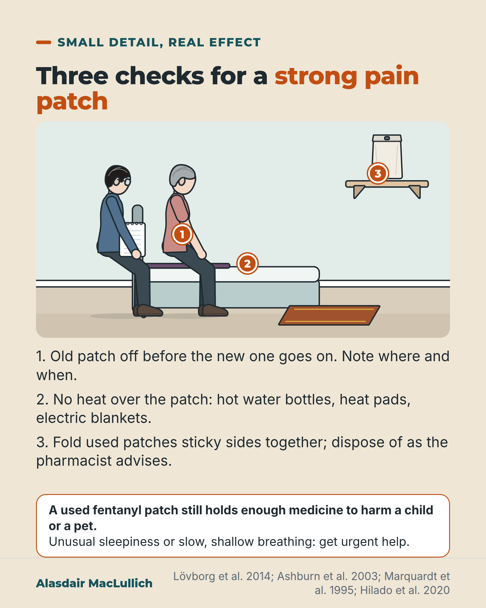

# G052: A used patch still contains medicine

- Category: C06 Medicines and prescribing burden
- Audience: both
- Series: Small detail, real effect
- Post type: public_explanation
- Visual format: annotated scene
- Status: text text_final, visual final
- Working id: C06-P04 (candidate C06-08)

## Insight

Strong pain patches need three habits: old patch off before the new one, no heat on the patch, and used patches folded sticky sides together and disposed of as advised.

## Angle and position

Patches look low-effort, which hides their three specific hazards.

Basis: empirical finding (Lovborg 2014, Ashburn 2003, residual drug studies) with clinical interpretation (the three habits)

## X (896 characters)

```text
A used fentanyl patch (a strong painkiller) still holds a substantial amount of medicine after it has been worn for its full time. Enough to seriously harm a child or a pet.

Three habits for strong painkiller patches (fentanyl or buprenorphine).

Take the old patch off before the new one goes on. One Swedish region's incident reports included 13 reports of too high a dose. In 7, an old patch had been left in place. Most reports were of patches put on by health staff. Write down where and when each patch went on.

Keep heat off the patch: hot water bottles, heat pads, electric blankets. In a small volunteer study (10 people), heating a new fentanyl patch for its first 4 hours gave blood levels almost 3 times higher over those hours.

Fold used patches sticky sides together and dispose of them as the pharmacist advises.

Unusual sleepiness or slow, shallow breathing needs urgent help.
```

## LinkedIn (1586 characters)

```text
A used fentanyl patch (a strong painkiller) still holds a substantial amount of medicine after it has been worn for its full time. Enough to seriously harm a child or a pet.

Patches look like the easy option compared with tablets. They have three hazards of their own, and each has a simple habit that prevents it.

1. Old patch off before the new one goes on. In one Swedish region's incident reports (mostly patches applied by health staff), 7 of the 13 reports of too high a dose involved an old patch left in place. Incident reports can't show how often this happens overall. The habit: check for the old patch, remove it, and write down where and when the new one went on.

2. No heat on the patch. Heat makes the skin absorb the medicine faster. In a small volunteer study (10 people), heat over a new fentanyl patch for its first 4 hours gave blood levels almost 3 times higher over those hours. Heat applied later also caused a rapid rise. Heat over buprenorphine patches also raised blood levels in volunteers. Keep hot water bottles, heat pads and electric blankets off the patch.

3. Fold used patches in half, sticky sides together, and dispose of them as the leaflet or pharmacist advises, out of reach of children and pets.

Know the warning signs of too much: unusual sleepiness, or slow, shallow breathing. If you see these, or if a child has touched or chewed a patch, get urgent medical help. If a pet has, call a vet straight away.

If you care for someone who uses a strong painkiller (opioid) patch, ask the prescriber or pharmacist to show you these three checks.
```

## Bluesky (292 characters)

```text
A used fentanyl patch (a strong painkiller) still holds enough medicine to seriously harm a child or pet.

Three habits. Old patch off before the new one goes on. No hot water bottles or heat pads over it. Fold used patches sticky sides together and dispose of them as the pharmacist advises.
```

## Threads (498 characters)

```text
A used fentanyl patch (a strong painkiller) still holds a substantial amount of medicine. Enough to seriously harm a child or a pet.

Take the old patch off before the new one goes on. In one Swedish region's incident reports, 7 of 13 too-high-dose reports involved an old patch left on.

Keep heat pads and hot water bottles off it: heat speeds absorption.

Fold used patches sticky sides together; dispose of them as the pharmacist advises. Unusual sleepiness or slow breathing needs urgent help.
```

## Source reply

Sources: Marquardt 1995 https://doi.org/10.1177/106002809502901001 ; Hilado 2020 https://doi.org/10.7759/cureus.6755 ; Lövborg 2014 https://doi.org/10.1186/2050-6511-15-31 ; Ashburn 2003 https://doi.org/10.1016/s1526-5900(03)00618-7

## Visual



Alt text: Drawn bedroom scene: an older woman and man sit on the edge of a bed, he holding a notepad. Numbered markers point to the arm, the bed covers and a medicine bag on a high shelf. Three checks for a strong pain patch: take the old one off first, no heat over it, fold used patches sticky sides together. A used patch can still harm a child or pet.

Editable source: `visuals/src/G052.html`

Design instructions: Single card, sand ground. Annotated bedroom scene (kit): older couple on bed edge, notepad, shelf with medicine bag, rug; pins 1 to 3; numbered text below and warning panel. No hot water bottle drawn; pin 2 sits on the bed covers.

## Sources and verification

- C06-08-a (supported_with_qualification): A used fentanyl patch still contains a substantial amount of drug after its wearing period, enough to harm a child.
  - Source: Marquardt KA, Tharratt RS, Musallam NA. Fentanyl remaining in a transdermal system following three days of continuous use. Ann Pharmacother. 1995;29(10):969-71.; Hilado MA, Getz A, Rosenthal R, Im DD. Fatal transdermal fentanyl patch overdose in a child. Cureus. 2020;12(1):e6755.; Finlay F, Dunne JR. Accidental fentanyl exposure in pets [abstract]. In: BSAVA Congress Proceedings 2019. Gloucester: British Small Animal Veterinary Association; 2019. p. 549.
  - Passage: "Marquardt 1995: "Nine patches were applied and removed by hospice nurses after 3 days of continuous use on hospice patients with cancer." "Analysis showed 0.7-1.22 mg remaining in the 2.5-mg patches and 4.46-8.44 mg remaining in the 10.0-mg patches. These numbers represent 28-84.4% of the original contents." Hilado 2020: "This case highlights the dangers of not properly disposing of used fentanyl patches as they may still contain enough fentanyl to cause respiratory failure and subsequent unintentional death in children." Finlay and Dunne 2019: "Discarded patches may still contain 50% of original drug -enough to cause serious harm/death"" (Marquardt 1995 Abstract; Hilado 2020 Abstract; Finlay and Dunne 2019 abstract)
- C06-08-b (supported_with_qualification): Heat over a fentanyl patch increases the amount of drug absorbed, and heat exposure has been identified by the UK regulator as a factor in unintentional overdose.
  - Source: Ashburn MA, Ogden LL, Zhang J, Love G, Basta SV. The pharmacokinetics of transdermal fentanyl delivered with and without controlled heat. J Pain. 2003;4(6):291-7.; Hilado MA, Getz A, Rosenthal R, Im DD. Fatal transdermal fentanyl patch overdose in a child. Cureus. 2020;12(1):e6755.; Medicines and Healthcare products Regulatory Agency. Transdermal fentanyl patches: reminder of potential for life-threatening harm from accidental exposure, particularly in children. Drug Safety Update. London: MHRA; 2018. [Web page not opened; search-engine extract only]
  - Passage: "Ashburn 2003: "This was an open, 3-period, crossover study that evaluated the pharmacokinetics and safety of 25 microg/h transdermal fentanyl administered with and without local heat." "However, significant differences were seen during the first 4 hours, with C(max) and AUC values almost 3 times higher for the heated administrations than for the administrations without heat." "The addition of heat at 24 hours resulted in rapid increases in serum fentanyl concentrations for both groups". Hilado 2020 (full text): "Skin temperature elevation can lead to a gradual 10-to 15-fold increase in cutaneous blood flow, enhancing the absorption of the transdermal fentanyl [2]." MHRA search extract (not opened): factors possibly related to unintentional overdose include "exposure of the patch to a heat source, possibly resulting in increased fentanyl absorption."" (Ashburn 2003 Abstract; Hilado 2020 Introduction; MHRA Drug Safety Update (search extract))
- C06-08-c (supported_with_qualification): Heat over a buprenorphine patch has also been shown to increase blood levels.
  - Source: Thomas S, Hammell DC, Hassan HE, Stinchcomb AL. In vitro-in vivo correlation of buprenorphine transdermal systems under normal and elevated skin temperature. Pharm Res. 2023;40(5):1249-58.
  - Passage: ""Application of external heat using a heating pad over buprenorphine transdermal system, Butrans® has been shown to increase systemic levels of buprenorphine in human volunteers."" (Abstract (Background))
- C06-08-d (supported): Putting on a new patch without removing the old one is a recognised cause of too-high doses of opioid patches.
  - Source: Lövborg H, Holmlund M, Hägg S. Medication errors related to transdermal opioid patches: lessons from a regional incident reporting system. BMC Pharmacol Toxicol. 2014;15:31.; Lampert A, Seiberth J, Haefeli WE, Seidling HM. A systematic review of medication administration errors with transdermal patches. Expert Opin Drug Saf. 2014;13(8):1101-14.
  - Passage: "Lovborg 2014 Abstract: "In the study 151 MEs were identified. The three most common error types were wrong administration time 67 (44%), wrong dose 34 (23%), and omission of dose 20 (13%)." Full text (Scite excerpt): "Of the 34 MEs with wrong dose, 13 were cases of too high dose, 10 were cases of too low dose, and 4 with unspecified wrong dose. Of the cases with too high dose, 7 were cases where the old patch were not removed before a new patch was applied." "The second case concerns a patient who received a higher dose than prescribed. At admittance to hospital health care personnel found two sets of patches of the prescribed dose on the patient". "Educating healthcare personnel in transdermal opioid pain management and the importance of carefully checking patient for old patches before applying new ones would likely reduce the risk of overdosing." Lampert 2014: "The systematic investigation of published errors illustrated that every step in the transdermal patch administration process is prone to errors. Thereby, the lack of knowledge and awareness of the importance of a correct administration practice were a major source of risk."" (Lovborg 2014 Abstract, Results and Discussion (full-text excerpts); Lampert 2014 Abstract)
- C06-08-e (supported_with_qualification): Used patches should be folded in half with the sticky sides together before disposal, and disposed of as advised so children and pets cannot reach them.
  - Source: Hilado MA, Getz A, Rosenthal R, Im DD. Fatal transdermal fentanyl patch overdose in a child. Cureus. 2020;12(1):e6755.; Finlay F, Dunne JR. Accidental fentanyl exposure in pets [abstract]. In: BSAVA Congress Proceedings 2019. Gloucester: British Small Animal Veterinary Association; 2019. p. 549.; Medicines and Healthcare products Regulatory Agency. Transdermal fentanyl patches: reminder of potential for life-threatening harm from accidental exposure, particularly in children. Drug Safety Update. London: MHRA; 2018. [Web page not opened; search-engine extract only]
  - Passage: "Hilado 2020 (full text): "Regarding patch disposal, the FDA has placed fentanyl patches on its \"flush list\" and advises folding them in half and flushing them down the toilet after use. However, it is ideal to hand them over to a drug take-back site where they can be properly discarded [10]." Finlay and Dunne 2019: "Discarded patches should be folded putting the sticky sides of each patch together so that it sticks to itself. They should then be wrapped in paper or plastic before disposal". "Used patches should be disposed of carefully and not be put in a wastepaper bin where pets may find and ingest them". MHRA search extract (not opened): patients and caregivers should follow the instructions on the patch carton and in the accompanying leaflet." (Hilado 2020 Discussion; Finlay and Dunne 2019 abstract; MHRA search extract)
- C06-08-f (supported_with_qualification): Too much opioid from a patch can cause dangerous slowing of breathing; signs to watch for include unusual drowsiness and slow or shallow breathing, and anyone accidentally exposed needs urgent medical help.
  - Source: Lövborg H, Holmlund M, Hägg S. Medication errors related to transdermal opioid patches: lessons from a regional incident reporting system. BMC Pharmacol Toxicol. 2014;15:31.; Hilado MA, Getz A, Rosenthal R, Im DD. Fatal transdermal fentanyl patch overdose in a child. Cureus. 2020;12(1):e6755.; Medicines and Healthcare products Regulatory Agency. Transdermal fentanyl patches: reminder of potential for life-threatening harm from accidental exposure, particularly in children. Drug Safety Update. London: MHRA; 2018. [Web page not opened; search-engine extract only]
  - Passage: "Lovborg 2014: "Harm was reported in 26 (17%) of the included cases, of which 2 (1%) were regarded as serious harm (nausea/vomiting and respiratory depression)." Hilado 2020: "they may still contain enough fentanyl to cause respiratory failure and subsequent unintentional death in children." MHRA search extract (not opened): "Urgent medical attention should be sought for anyone accidentally exposed to a fentanyl patch."" (Lovborg 2014 Abstract; Hilado 2020 Abstract; MHRA search extract)

Verification notes: Residual drug: Marquardt 1995, Hilado 2020 full text, Finlay and Dunne abstract; fentanyl patches only (nothing opened on buprenorphine); kept to 'substantial amount' (no percentage). Heat: Ashburn 2003 abstract, 'during the heated hours' (total dose not significantly different, so effect described as a rise during heating); buprenorphine from Thomas 2023 background (supporting sentence only). Old patch: Lövborg 2014 full text, 7 of 13. Disposal: fold, as pharmacist advises; no flushing. Warning signs: sources name respiratory depression; urgent help partly on MHRA search extract. Buprenorphine heat sentence limited to 'raised blood levels in volunteers' (second-hand, C06-08-c). Disposal drawn as a lidded container out of reach, not a pharmacy return route (UK route not confirmed).

## Attention and follow potential

Pause: Most people do not know a used patch is still dangerous, or that a hot water bottle changes the dose.

Gain: Three concrete habits and the warning signs.

Follow: Practical medicine safety that families can use tonight.

## Open issues

None.
