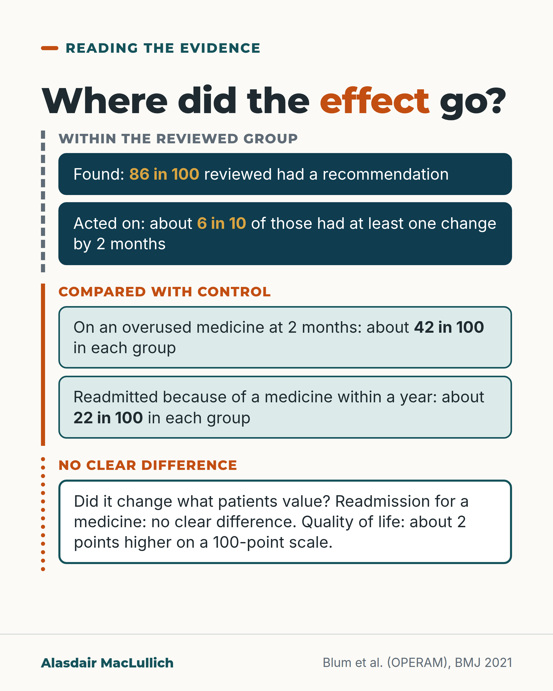

# G053: Read a medicines-review trial as a chain

- Category: C06 Medicines and prescribing burden
- Audience: practitioners
- Series: Reading the evidence
- Post type: evidence_interpretation
- Visual format: diagram (flow chain)
- Status: text text_final, visual final
- Working id: C06-P05 (candidate C06-04)

## Insight

In OPERAM the review flagged problems for most people, but at 2 months overuse was about 42 in 100 in both groups and drug-related readmissions were about 22 in 100 in both; effects can be lost at each step.

## Angle and position

Revised angle: read the trial step by step and test each step against the control group. Do not say the trial reduced inappropriate prescribing.

Basis: empirical finding (OPERAM results, Cochrane 2023); clinical interpretation (the chain test for reading trials)

## X (853 characters)

```text
A European trial's medicines review flagged a possible change for 86 in 100 of the older people it reviewed. Two months later, the reviewed group's medicines looked much like the control group's.

OPERAM: 2,008 people aged 70 or over in hospital, each on 5 or more regular medicines, were assigned by ward to a medicines review or usual care. In the review group, a doctor and a pharmacist used STOPP/START software.

At least one change was made for about 6 in 10 of those with a recommendation. At 2 months, about 42 in 100 in each group were on a medicine judged overused. Over a year, about 22 in 100 in each group were readmitted because of a medicine. No clear difference at either step.

Check such trials in order: found, recommended, acted on, kept, outcome changed. At each step, ask whether the reviewed group differed from the control group.
```

## LinkedIn (2043 characters)

```text
A European trial's medicines review flagged a possible change for 86 in 100 of the older people it reviewed. Two months later, the reviewed group's medicines looked much like the control group's.

OPERAM enrolled 2,008 people aged 70 or over, each with at least 3 long-term conditions and at least 5 regular medicines, admitted to university hospitals in four countries. In the intervention arm, a doctor and a pharmacist reviewed the medicines once during the admission, using STOPP/START checklist software, and sent recommendations to the GP.

The steps, in order:
1. Found: 86 in 100 people reviewed had at least one recommendation, almost 3 each on average.
2. Acted on: by 2 months, at least one was carried out for about 6 in 10 of those with a recommendation (491 of 789).
3. Different from control: at 2 months about 42 in 100 people in each group were on a medicine judged overused, and about 70 in 100 in each group were missing one judged indicated. Both groups took about 11 long-term medicines. No clear difference.
4. Outcome: over a year, about 22 in 100 in each group were readmitted because of a medicine. No clear difference. Quality of life at 12 months was about 2 points higher with the review on a 100-point scale, a small difference among many secondary outcomes.

The authors' own summary says inappropriate prescribing 'was reduced'. The randomised comparison at 2 months did not show a clear difference in overuse (about 42 in 100 in each group). The trial team suggested one hospital review may not survive a year of other prescribers; that is their explanation, not a finding.

A Cochrane review of 38 trials of medicines reviews and similar pharmaceutical care found it uncertain whether they reduce inappropriate prescribing, with low or very low certainty evidence. That is an evidence gap, not proof that reviews fail.

The test for any trial like this: at each step, did it differ from the control group, and was the outcome one patients value? (OPERAM measured readmission, falls, death and quality of life.)
```

## Bluesky (298 characters)

```text
OPERAM: 2,008 people aged 70+ got a medicines review or usual care. It flagged a change for 86 in 100.

In both groups, about 42 in 100 took an overused medicine at 2 months and about 22 in 100 were readmitted for a medicine problem in a year. No clear difference.

Check each step against control.
```

## Threads (496 characters)

```text
A European trial called OPERAM studied 2,008 people aged 70 or over in hospital. About half were assigned to a medicines review. It flagged a possible medicines change for 86 in 100 reviewed.

At 2 months, about 42 in 100 in both groups were on a medicine judged overused. Over a year, about 22 in 100 in both groups were readmitted because of a medicine. No clear difference.

When you read a medicines-review trial, check each step against the control group, not only within the reviewed group.
```

## Source reply

Sources: OPERAM, Blum 2021 https://doi.org/10.1136/bmj.n1585 ; Cochrane, Cole 2023 https://doi.org/10.1002/14651858.CD008165.pub5

## Visual



Alt text: Chain diagram of the OPERAM medicines review trial. Within the reviewed group: 86 in 100 had a recommendation; about 6 in 10 of those had at least one change by 2 months. Compared with control: about 42 in 100 on an overused medicine in each group; about 22 in 100 readmitted for a medicine within a year in each group. No clear difference in readmission; quality of life about 2 points higher.

Editable source: `visuals/src/G053.html`

Design instructions: Single card. Five boxes in two bracket groups: dashed grey left rule (within reviewed group, deep teal boxes with gold figures, claims C06-04-b, C06-04-c), solid orange left rule (compared with control, mint boxes, C06-04-d, C06-04-e), dotted rule for no clear difference box.

## Sources and verification

- C06-04-a (supported): OPERAM enrolled 2,008 adults aged 70 or over with multimorbidity and polypharmacy admitted to university hospitals in four European countries; a doctor and pharmacist used STOPP/START software to review medicines; the main outcome was a first drug-related readmission within 12 months.
  - Source: Blum MR, Sallevelt BTGM, Spinewine A, O'Mahony D, Moutzouri E, Feller M, et al. Optimizing Therapy to Prevent Avoidable Hospital Admissions in Multimorbid Older Adults (OPERAM): cluster randomised controlled trial. BMJ. 2021;374:n1585.
  - Passage: ""110 clusters of inpatient wards within university based hospitals in four European countries (Switzerland, Netherlands, Belgium, and Republic of Ireland) defined by attending hospital doctors." "2008 older adults (≥70 years) with multimorbidity (≥3 chronic conditions) and polypharmacy (≥5 drugs used long term)." "Clinical staff clusters were randomised to usual care or a structured pharmacotherapy optimisation intervention performed at the individual level jointly by a doctor and a pharmacist, with the support of a clinical decision software system deploying the screening tool of older person's prescriptions and screening tool to alert to the right treatment (STOPP/START) criteria to identify potentially inappropriate prescribing." "Primary outcome was first drug related hospital admission within 12 months."" (Abstract (Setting, Participants, Interventions, Main outcome measures))
- C06-04-b (supported): Step 1-2 of the chain: of 916 people who received the review, 789 (86.1%) had at least one STOPP/START recommendation, a mean of 2.75 each; 2,331 recommendations in all, two thirds to stop or change and one third to start a medicine.
  - Source: Blum MR, Sallevelt BTGM, Spinewine A, O'Mahony D, Moutzouri E, Feller M, et al. Optimizing Therapy to Prevent Avoidable Hospital Admissions in Multimorbid Older Adults (OPERAM): cluster randomised controlled trial. BMJ. 2021;374:n1585.
  - Passage: ""Of 916 patients who received the intervention (), 789 (86.1%) had at least one STOPP/START recommendation provided to their attending hospital doctor, with a mean of 2.75 (SD 2.24) recommendations for each participant ()." "In total, 2331 recommendations were made, of which 1524 (65.4%) were STOPP recommendations and 807 (34.6%) were START recommendations."" (Full text, Results (Intervention: recommendations))
- C06-04-c (supported_with_qualification): Step 3: by 2 months, at least one recommendation had been carried out for 491 people, 62.2% of those with a recommendation, mostly stopping a medicine.
  - Source: Blum MR, Sallevelt BTGM, Spinewine A, O'Mahony D, Moutzouri E, Feller M, et al. Optimizing Therapy to Prevent Avoidable Hospital Admissions in Multimorbid Older Adults (OPERAM): cluster randomised controlled trial. BMJ. 2021;374:n1585.
  - Passage: ""After two months, at least one of these recommendations was successfully implemented in 491 participants (62.2% of all participants in the intervention group with ≥1 recommendation), with a mean of 1.16 (SD 1.48) implemented recommendations for each participant, primarily discontinuation of potentially inappropriate drugs ()."" (Full text, Results; Abstract)
- C06-04-d (supported): Step 4: at 2 months, the proportion of people with an overused, underused or misused medicine, and the number of long-term medicines, were about the same in the intervention and control groups.
  - Source: Blum MR, Sallevelt BTGM, Spinewine A, O'Mahony D, Moutzouri E, Feller M, et al. Optimizing Therapy to Prevent Avoidable Hospital Admissions in Multimorbid Older Adults (OPERAM): cluster randomised controlled trial. BMJ. 2021;374:n1585.
  - Passage: "Methods: "Secondary outcomes within two months after enrolment included the presence of drug overuse and misuse (based on STOPP criteria), drug underuse (defined by START criteria), and clinically significant drug-drug interactions". Table 5 (Control n, events (%); Intervention n, events (%); odds ratio (95% CI); P): "Drug misuse§:  2  893  378 (42.3)  832  355 (42.7)  0.99 (0.81 to 1.20)  0.92  Drug overuse§:  2  893  376 (42.1)  832  348 (41.8)  0.99 (0.82 to 1.20)  0.91  Drug underuse§:  2  893  638 (71.4)  832  583 (70.1)  0.91 (0.70 to 1.17)  0.45  Mean (SD) No of long term drugs¶:  2  893  11.0 (4.27)  833  11.2 (4.54)  −0.13 (−0.49 to 0.22)  0.47". Abstract conclusion (for contrast): "Inappropriate prescribing was common in older adults with multimorbidity and polypharmacy admitted to hospital and was reduced through an intervention to optimise pharmacotherapy, but without effect on drug related hospital admissions."" (Full text, Methods (Outcomes) and Table 5; Abstract (Conclusions))
- C06-04-e (supported): Step 5: within 12 months, 21.9% of the intervention group and 22.4% of the control group had a first drug-related readmission (hazard ratio 0.95, 95% CI 0.77 to 1.17); falls and deaths also did not clearly differ; quality of life at 12 months was slightly better with the intervention.
  - Source: Blum MR, Sallevelt BTGM, Spinewine A, O'Mahony D, Moutzouri E, Feller M, et al. Optimizing Therapy to Prevent Avoidable Hospital Admissions in Multimorbid Older Adults (OPERAM): cluster randomised controlled trial. BMJ. 2021;374:n1585.
  - Passage: "Abstract: "In the intervention group, 211 participants (21.9%) experienced a first drug related hospital admission compared with 234 (22.4%) in the control group. In the intention-to-treat analysis censored for death as competing event (n=375, 18.7%), the hazard ratio for first drug related hospital admission was 0.95 (95% confidence interval 0.77 to 1.17)." Results: "Drug related outcomes, pain, activities of daily living status, and drug adherence did not differ significantly between the groups, except for quality of life at 12 months, which was better in the intervention group (between group adjusted mean difference 2.29, 95% confidence interval 0.31 to 4.26,)." Table 4: "First drug related hospital admission in patients with ≥1 STOPP recommendation implemented after two months*  156/875 (17.8)  64/398 (16.1)  0.88 (0.65 to 1.19)  0.41" (* Post hoc analysis)." (Abstract (Results); full text Results (Secondary outcomes) and Table 4)
- C06-04-f (supported_with_qualification): The OPERAM authors suggest the effect of a single review may not persist over a year of contacts with other doctors, and that high mortality may have diluted benefit.
  - Source: Blum MR, Sallevelt BTGM, Spinewine A, O'Mahony D, Moutzouri E, Feller M, et al. Optimizing Therapy to Prevent Avoidable Hospital Admissions in Multimorbid Older Adults (OPERAM): cluster randomised controlled trial. BMJ. 2021;374:n1585.
  - Passage: ""Firstly, the impact of a single time point pharmacotherapy optimisation might not persist over a one year follow-up, during which multiple contacts with doctors might occur. Although we provided evidence based recommendations on inappropriate prescribing to patients’ GPs, including reasons for stopping or starting drugs, the contacts with other doctors (eg, specialists) over one year might have resulted in new potentially inappropriate drugs or discontinuation of appropriate drugs, which could have negated an intervention effect." "Secondly, the high mortality rate of the population, approaching 20% at 12 months,"" (Full text, Discussion (Potential explanations for lack of effect))
- C06-04-g (supported): Across 38 randomised trials, it is uncertain whether medication review and similar pharmaceutical care reduce inappropriate medicines, and they may make little or no difference to hospital admissions or quality of life.
  - Source: Cole JA, Goncalves-Bradley DC, Alqahtani M, Barry HE, Cadogan C, Rankin A, et al. Interventions to improve the appropriate use of polypharmacy for older people. Cochrane Database Syst Rev. 2023;10(10):CD008165.
  - Passage: ""We identified 38 studies, which includes an additional 10 in this update." "It is uncertain whether pharmaceutical care reduces the proportion of patients with one or more PIM (risk ratio (RR) 0.81, 95% CI 0.68 to 0.98; I= 84%; 13 studies, 4534 participants; very low-certainty evidence)." "Pharmaceutical care may make little or no difference to hospital admissions (data not pooled; 14 studies, 4797 participants; low-certainty evidence). Pharmaceutical care may make little or no difference to quality of life (data not pooled; 16 studies, 7458 participants; low-certainty evidence)." "It is unclear whether interventions to improve appropriate polypharmacy resulted in clinically significant improvement."" (Abstract (Main results; Authors' conclusions))

Verification notes: All OPERAM figures from full text (Blum 2021): 86 in 100 (denominator 916 receiving intervention), 491/789, 42 vs 42 overuse, 70 in 100 underuse, about 11 drugs, 22 in 100 readmission (non-significant, described as 'no clear difference'), QoL about 2 points. Authors' 'reduced' wording quoted, with the randomised 2-month comparison stated beside it. C06-04-f labelled as authors' explanation. Cochrane 2023 abstract: low/very low certainty, framed as evidence gap. Follow invitation included (1 of 12). Quality-of-life difference described as small, one of many secondary outcomes.

## Attention and follow potential

Pause: A well-known trial whose abstract conclusion is easy to misread.

Gain: A reusable test for any medicines-review trial: within-group change versus difference from control, step by step.

Follow: The Reading the evidence series, invited explicitly here.

## Open issues

None.
