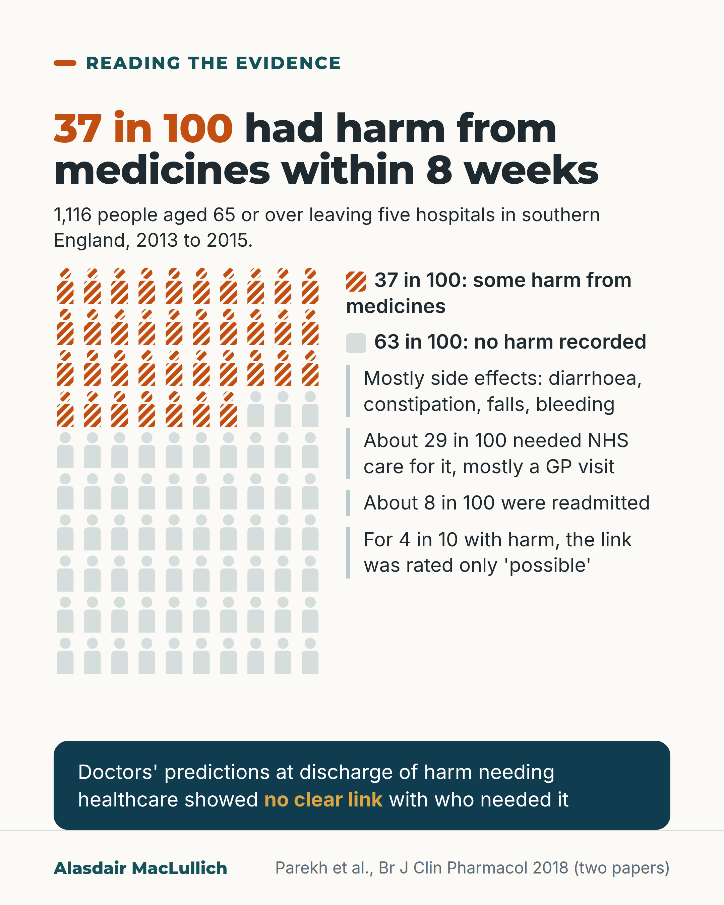

# G054: Predicting medicine harm after discharge

- Category: C06 Medicines and prescribing burden
- Audience: practitioners
- Series: Reading the evidence
- Post type: evidence_interpretation
- Visual format: chart (10 by 10 icon array)
- Status: text text_final, visual final
- Working id: C06-P06 (candidate C06-13)

## Insight

37 in 100 older people had some medication-related harm within 8 weeks of discharge, and discharging doctors' predictions of harm needing healthcare showed no clear link with who needed it.

## Angle and position

The prediction result is the one to act on: follow-up targeted by hunch will miss people.

Basis: empirical finding (Parekh 2018 incidence and prediction papers); ethical/clinical judgement (follow-up should not depend on hunch) marked as 'we think'

## X (880 characters)

```text
Doctors discharging older people were asked to predict, for each patient, whether a medicines problem would need healthcare in the next 8 weeks (a hospital readmission or community healthcare).

Their predictions showed no clear link with who did.

The study followed 1,116 people aged 65 or over (average age 82) leaving the medical wards of five teaching hospitals in southern England. 37 in 100 had some harm from medicines within 8 weeks, mostly side effects such as falls, bleeding, diarrhoea or constipation. For 4 in 10 of them the link was rated only 'possible'. About 8 in 100 of everyone were readmitted because of it.

Most predictions came from junior doctors, who write most discharges. Doctors did better when they felt confident.

Whether routine follow-up prevents harm is not yet settled. We think medicines follow-up after discharge should not depend on a hunch.
```

## LinkedIn (1848 characters)

```text
Doctors discharging older people were asked to predict, for each patient, whether a medicines problem would need healthcare in the next 8 weeks (a hospital readmission or community healthcare).

Their predictions showed no clear link with who did.

The PRIME study followed 1,116 people aged 65 or over leaving five teaching hospitals in southern England (2013 to 2015).

What happened:
1. 37 in 100 had some harm from their medicines within 8 weeks of going home.
2. Harm mostly meant side effects: diarrhoea, constipation, falls, bleeding. It also included harm from not taking a medicine as prescribed. For 4 in 10 people with harm, the link was rated possible rather than probable or definite.
3. About 29 in 100 of everyone followed up needed NHS care because of it, mostly a GP visit. About 8 in 100 were readmitted.
4. Three quarters of the harm events came from medicines prescribed at discharge.

Then the prediction study, which covered 1,066 of these people. Most predictions came from doctors in their first few years after qualifying, who usually write the discharge. The study found no clear difference by experience, but few predictions came from senior doctors, so it could have missed one.

The result that goes the other way: doctors did better when they felt confident, particularly for harm serious enough to bring someone back into hospital.

Our reading: if judgement at discharge does not reliably pick out who is at risk, follow-up offered only to those who look at risk will miss people. We think who gets medicines follow-up after discharge should not depend on a hunch. That is a judgement. Whether a check after discharge prevents harm is not settled, though approaches that include explaining medicines to patients have had better results.

Who in your service checks medicines after discharge, and how are they chosen?
```

## Bluesky (287 characters)

```text
Of 1,116 people aged 65+ leaving English hospitals, 37 in 100 had some harm from medicines within 8 weeks, mostly side effects.

Discharging doctors' predictions of who would need healthcare for a medicines problem showed no clear link with who did.

Follow-up shouldn't rest on a hunch.
```

## Threads (448 characters)

```text
Discharging doctors were asked which older patients would have a medicines problem needing healthcare in the next 8 weeks. Their predictions showed no clear link with who did.

In the same English study of 1,116 people aged 65 or over, 37 in 100 had some harm within 8 weeks, mostly side effects. About 8 in 100 were readmitted because of it.

Doctors did better when confident. Still, we think follow-up after discharge should not rest on a hunch.
```

## Source reply

Sources: Parekh 2018 (incidence) https://doi.org/10.1111/bcp.13613 ; Parekh 2018 (prediction) https://doi.org/10.1111/bcp.13690

## Visual



Alt text: Icon array of 100 people, 37 hatched orange for harm from medicines within 8 weeks of leaving hospital and 63 grey for none recorded. Cohort: 1,116 people aged 65 or over, five English hospitals. About 29 in 100 needed NHS care, about 8 in 100 were readmitted. Doctors' predictions at discharge showed no clear link with who was harmed.

Editable source: `visuals/src/G054.html`

Design instructions: Single card. iconArray person shape 37 hatched orange (stripe pattern) of 100, grey rest; legend and three notes at right; deep teal band with prediction finding. Claims C06-13-a, C06-13-c.

## Sources and verification

- C06-13-a (supported): In the PRIME cohort (five English teaching hospitals, 2013 to 2015), 413 of 1,116 people aged 65 or over followed for 8 weeks after discharge (37%) had medication-related harm.
  - Source: Parekh N, Ali K, Stevenson JM, Davies JG, Schiff R, Van der Cammen T, et al. Incidence and cost of medication harm in older adults following hospital discharge: a multicentre prospective study in the UK. Br J Clin Pharmacol. 2018;84(8):1789-1797.
  - Passage: ""Between September 2013 and November 2015, research nurses invited patients to participate from medical wards in five NHS teaching hospitals in Southern England, near to the time of hospital discharge." "Senior, trained research pharmacists followed discharged participants for 8 weeks to determine if they experienced MRH." "Therefore, our final cohort included 1116 (87.2%) participants" "Overall, 413 participants [37.0% (95% CI 34.2–39.9%)] experienced MRH in the 8‐week follow‐up period, with 856 medicines implicated in 621 events."" (Full text, Methods (Design, setting and participants) and Results (Incidence of MRH))
- C06-13-b (supported): What counted as harm: an adverse drug reaction, harm from not taking a medicine, or harm from a medication error; most cases were side effects alone; 40% of cases were rated only 'possible'.
  - Source: Parekh N, Ali K, Stevenson JM, Davies JG, Schiff R, Van der Cammen T, et al. Incidence and cost of medication harm in older adults following hospital discharge: a multicentre prospective study in the UK. Br J Clin Pharmacol. 2018;84(8):1789-1797.
  - Passage: ""We defined MRH as an ADR or harm arising from a failure to receive medication owing to non‐adherence. Harm arising from medication error was included where reported. Intentional overdose was excluded." "ADRs were solely responsible for MRH in 301 out of 413 cases (72.9%), non‐adherence in 45 cases (10.9%) and a medication error in 14 cases (3.4%). In five cases (1.2%), the patient experienced harm from both an ADR and a medication error." "In 48 cases (11.6%), harm was due to both an ADR and non‐adherence." "Of the 413 participants whom we classified as having MRH, 246 (60%) experienced at least one MRH event considered ‘probable’ (= 110) or ‘definite’ (= 136). The remaining cases were ‘possible’ (= 167)." "The most common events were diarrhoea (= 55; 8.9%), constipation (= 52; 8.4%), falls (= 35; 5.6%) and bleeding (= 31; 5.0%)." "However, MRH risk (incidence per 1000 prescriptions) was greatest for opiates (399), followed by antibiotics (189)."" (Full text, Methods (MRH assessment); Results (Incidence; Types of MRH))
- C06-13-c (supported): Most harm led to healthcare use: 328 of the 413 people with harm (79%) used an NHS service because of it, and 87 were readmitted to hospital because of it; 81% of cases met the study's definition of serious (needing a change of treatment or treatment by a health professional) or worse.
  - Source: Parekh N, Ali K, Stevenson JM, Davies JG, Schiff R, Van der Cammen T, et al. Incidence and cost of medication harm in older adults following hospital discharge: a multicentre prospective study in the UK. Br J Clin Pharmacol. 2018;84(8):1789-1797.
  - Passage: ""We graded severity of MRH using the approach of Morimoto.: fatal, life‐threatening, serious (requires therapy change and/or treatment by a health professional) and significant." "Four participants (1.0%) experienced a fatal event associated with the MRH" "Nine participants (2.2%) had a life‐threatening event, and MRH was serious in a further 323 participants (78.2%)." "Out of the 413 MRH cases, 328 [95% CI (75.2–83.2%)] had at least one NHS service use associated with MRH, and 87 participants [95% CI (6.3–9.5%)] had an MRH‐associated hospital readmission." "Of the 413 participants with MRH, 85 (20.6%), who experienced 105 MRH events, managed their adverse event(s) without seeking healthcare input." "A total of 460 MRH events (74%) were attributable to medicines prescribed at hospital discharge"" (Full text, Methods (severity); Results (Severity; Health service utilization))
- C06-13-d (supported): Discharging doctors' predictions of which patients would have medication-related harm needing healthcare in the next 8 weeks showed no relationship with who actually did.
  - Source: Parekh N, Stevenson JM, Schiff R, Graham Davies J, Bremner S, Van der Cammen T, et al. Can doctors identify older patients at risk of medication harm following hospital discharge? A multicentre prospective study in the UK. Br J Clin Pharmacol. 2018;84(10):2344-2351.
  - Passage: ""Doctors discharging patients (aged ≥65 years) from medical wards predicted the likelihood of their patient experiencing MRH requiring healthcare (hospital readmission or community healthcare) in the initial 8‐week period post‐discharge. Patients were followed up by senior pharmacists to determine MRH occurrence." "Data of 1066 patients (83%) with completed predictions and follow‐up, out of 1280 recruited patients, were analysed." "There was no relationship between doctors' predictions and patient MRH (OR 1.10, 95% CI 0.82–1.46,= 0.53), irrespective of years of clinical experience." "Clinical judgement of doctors is not a reliable tool to predict MRH in older adults post‐discharge." Full-text excerpt: "Doctors correctly predicted the outcome (MRH or no MRH) in 469 out of 1066 patients (44%)."" (Abstract (Methods, Results, Conclusions); full-text Results excerpt via Scite)
- C06-13-e (supported_with_qualification): Most predictions (85%) were made by doctors with less than 5 years' experience; predictive ability did not differ significantly by experience, but only 126 predictions (11.8%) were by registrars or consultants.
  - Source: Parekh N, Stevenson JM, Schiff R, Graham Davies J, Bremner S, Van der Cammen T, et al. Can doctors identify older patients at risk of medication harm following hospital discharge? A multicentre prospective study in the UK. Br J Clin Pharmacol. 2018;84(10):2344-2351.
  - Passage: "Abstract: "Most predictions (85%) were made by junior doctors with less than 5 years' clinical experience." Full-text excerpts: "Over half of MRH predictions (n = 595, 55.8%) were by doctors with less than one full year of clinical experience post-medical qualification, i.e. foundation year one, 306 (28.7%) predictions by doctors with years clinical experience, i.e. senior house officer level, and 126 (11.8%) predictions by senior doctors of five or more year's clinical experience, i.e. registrar or consultant grade." "We found no significant difference in predictive ability between doctors with varying years of clinical experience (<1 year, 1-4 year, >4 years) (Table 2)."" (Abstract; full-text Results excerpts via Scite)
- C06-13-f (supported): Doctors' predictions were more likely to be accurate when they reported higher confidence, especially for harm leading to readmission.
  - Source: Parekh N, Stevenson JM, Schiff R, Graham Davies J, Bremner S, Van der Cammen T, et al. Can doctors identify older patients at risk of medication harm following hospital discharge? A multicentre prospective study in the UK. Br J Clin Pharmacol. 2018;84(10):2344-2351.
  - Passage: ""Doctors' predictions were more likely to be accurate when they reported higher confidence in their prediction, especially in predicting MRH‐associated hospital readmissions (OR 1.58, 95% CI 1.42–1.76,< 0.001)."" (Abstract (Results))
- C06-13-g (supported_with_qualification): It remains unclear from trials whether medication review alone reduces harm after discharge; multicomponent interventions with patient education have shown success at transitions of care (authors' summary).
  - Source: Parekh N, Ali K, Stevenson JM, Davies JG, Schiff R, Van der Cammen T, et al. Incidence and cost of medication harm in older adults following hospital discharge: a multicentre prospective study in the UK. Br J Clin Pharmacol. 2018;84(8):1789-1797.
  - Passage: ""While it remains unclear from randomized trials if medication review on its own reduces MRH in older adults, multicomponent interventions incorporating patient education have demonstrated success during transitions of care,."" (Full text, Discussion (Implications for practitioners and policy makers))

Verification notes: Parekh incidence paper (full text): 413/1,116, harm definition, 40% possible, 328 and 87 counts (29 and 8 in 100 calculated), three quarters from discharge medicines. Prediction paper (full text): no clear link, mostly junior doctors, few seniors (126), confidence result stated. Routine follow-up marked as judgement; C06-13-g states effectiveness not settled.

## Attention and follow potential

Pause: Clinicians trust their discharge judgement; this study tested it.

Gain: A reason to organise follow-up by rule rather than impression, with the counter-finding stated.

Follow: Studies read with their limits and the result that went the other way.

## Open issues

None.
