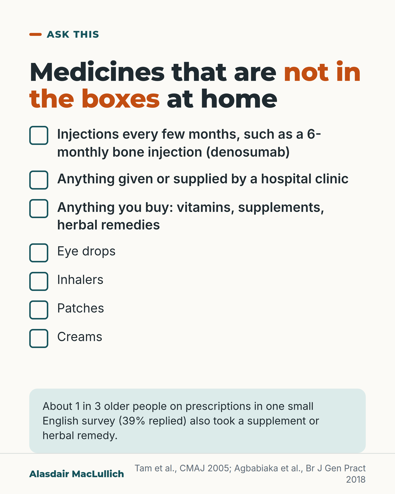

# G055: The medicines that are not in the bag

- Category: C06 Medicines and prescribing burden
- Audience: public
- Series: Ask this
- Post type: public_explanation
- Visual format: checklist
- Status: text text_final, visual final
- Working id: C06-P07 (candidate C06-15)

## Insight

A medicines list built from the boxes at home misses what is not in the boxes: the six-monthly bone injection, medicines from a hospital clinic, and anything bought over the counter.

## Angle and position

Revised angle: name denosumab, hospital-clinic medicines and over-the-counter remedies as worked examples; eye drops, inhalers, patches and creams as checklist items only. No timolol point; no claim about GP records.

Basis: empirical finding (Tam 2005, Agbabiaka 2018) and guidance (NICE via Shah and Barnett); practical advice follows logically from the dosing

## X (1005 characters)

```text
When people are admitted to hospital, their list of medicines often has something missing. In an older review of 22 studies, between 1 in 10 and 6 in 10 patients had at least one regular medicine left off.

A list built from the boxes at home will miss the six-monthly bone injection. Some bone treatments, such as denosumab, are an injection given once every 6 months, so there is usually no box of it at home. Tell the hospital team about it.

Also tell them about anything given or supplied by a hospital clinic, and anything you buy yourself, including vitamins and herbal remedies. In one small English survey (155 people replied, about 4 in 10 of those asked), about 1 in 3 older people on prescribed medicines also took a supplement or herbal remedy. Some combinations could interact. A review of studies found the one most often reported was a possible raised bleeding risk. That was with ginkgo, garlic or ginseng taken with aspirin or warfarin.

Then add eye drops, inhalers, patches and creams.
```

## LinkedIn (1541 characters)

```text
When people are admitted to hospital, their list of medicines often has something missing.

In an older review of 22 studies, between 1 in 10 and 6 in 10 patients had at least one regular medicine left off the list made on admission. This review is older (studies up to 2005) and covered prescription medicines only, so current rates may differ.

A list built from the boxes at home will miss the six-monthly bone injection, because there is usually no box of it on the shelf. NICE guidance says the hospital should list all of a person's medicines. That includes those bought over the counter and herbal or complementary remedies. It also says to involve the family where appropriate.

Three things to name out loud:

1. Injections given every few months. Some bone treatments, such as denosumab, are an injection once every 6 months.

2. Anything given or supplied by a hospital clinic.

3. Anything you buy yourself, including vitamins, supplements and herbal remedies. In a survey in two English general practices, about 1 in 3 older people who took prescribed medicines also took a supplement or herbal remedy. Some combinations can interact: the one most often reported is a raised bleeding risk when ginkgo, garlic or ginseng is taken with aspirin or warfarin. (Small survey with a low response rate; these were possible interactions, not observed harm.)

Then run down the rest of the checklist: eye drops, inhalers, patches and creams.

If you are helping someone, write these on the same page as their tablets and take it with you.
```

## Bluesky (285 characters)

```text
Hospital medicine lists often miss something. A list from the boxes at home misses the 6-monthly bone injection (denosumab). It also misses hospital clinic medicines and what you buy: vitamins, herbal remedies.

Tell staff about these too, and add eye drops, inhalers, patches, creams.
```

## Threads (499 characters)

```text
When people are admitted to hospital, their medicine list often has something missing. A list built from the boxes at home will miss the six-monthly bone injection (denosumab). It also misses anything from a hospital clinic and anything you buy, including vitamins and herbal remedies.

In one small English survey (39% replied), about 1 in 3 older people on prescriptions also took a supplement or herbal remedy.

Tell the hospital team about these, and add eye drops, inhalers, patches and creams.
```

## Source reply

Sources: Tam 2005 https://doi.org/10.1503/cmaj.045311 ; Agbabiaka 2018 https://doi.org/10.3399/bjgp18X699101 ; Agbabiaka 2017 (review) https://doi.org/10.1007/s40266-017-0501-7 ; Cummings 2009 https://doi.org/10.1056/NEJMoa0809493 ; Shah and Barnett 2015 https://doi.org/10.1002/psb.1415

## Visual



Alt text: Checklist titled medicines that are not in the boxes at home: injections every few months such as 6-monthly denosumab, anything supplied by a hospital clinic, anything you buy such as vitamins and herbal remedies, then eye drops, inhalers, patches and creams. About 1 in 3 older people in one small English survey also took a supplement or herbal remedy.

Editable source: `visuals/src/G055.html`

Design instructions: Single card. Checklist with ticks: first three items larger; mint panel with survey fact. No drawing.

## Sources and verification

- C06-15-a (supported_with_qualification): Errors in the medicines history taken at hospital admission are common, most often a medicine left off.
  - Source: Tam VC, Knowles SR, Cornish PL, Fine N, Marchesano R, Etchells EE. Frequency, type and clinical importance of medication history errors at admission to hospital: a systematic review. CMAJ. 2005;173(5):510-5.
  - Passage: ""We identified 22 studies involving a total of 3755 patients (range 33-1053, median 104). Errors in prescription medication histories occurred in up to 67% of cases: 10%- 61% had at least 1 omission error (deletion of a drug used before admission), and 13%- 22% had at least 1 commission error (addition of a drug not used before admission); 60%- 67% had at least 1 omission or commission error." "In 6 of the studies (n = 588 patients), the investigators estimated that 11%-59% of the medication history errors were clinically important." "Improved physician training, accessible community pharmacy databases and closer teamwork between patients, physicians and pharmacists could reduce the frequency of these errors."" (Abstract (Results, Interpretation))
- C06-15-b (supported_with_qualification): NICE recommends that on admission to hospital the list should include all medicines, including over-the-counter and complementary medicines, with reconciliation within 24 hours, and that patients and families should be involved.
  - Source: Shah C, Barnett N. Medicines reconciliation: a patient safety priority. Prescriber. 2015;26(22):23-6.
  - Passage: ""Recommendation 1.3.1. In an acute setting, accurately list all of the person's medicines (including prescribed, over-the-counter and complementary medicines) and carry out medicines reconciliation within 24 hours or sooner if clinically necessary, when the person moves from one care setting to another; for example, if they are admitted to hospital" "Recommendation 1.3.6. Involve patients and their family members or carers, where appropriate, in the medicines reconciliation process"" (Shah and Barnett 2015, abstract text reproducing NICE NG5 recommendations)
- C06-15-c (supported): Denosumab for osteoporosis is given as an injection under the skin every 6 months, so it will not be among the boxes of tablets at home.
  - Source: Cummings SR, San Martin J, McClung MR, Siris ES, Eastell R, Reid IR, et al. Denosumab for prevention of fractures in postmenopausal women with osteoporosis. N Engl J Med. 2009;361(8):756-65.
  - Passage: ""Subjects were randomly assigned to receive either 60 mg of denosumab or placebo subcutaneously every 6 months for 36 months." "Denosumab given subcutaneously twice yearly for 36 months was associated with a reduction in the risk of vertebral, nonvertebral, and hip fractures in women with osteoporosis."" (Abstract (Methods, Conclusions))
- C06-15-d (supported_with_qualification): About a third of older people taking prescribed medicines also take herbal remedies or supplements, and some of these combinations carry a potential for interactions.
  - Source: Agbabiaka TB, Spencer NH, Khanom S, Goodman C. Prevalence of drug-herb and drug-supplement interactions in older adults: a cross-sectional survey. Br J Gen Pract. 2018;68(675):e711-7.; Agbabiaka TB, Wider B, Watson LK, Goodman C. Concurrent use of prescription drugs and herbal medicinal products in older adults: a systematic review. Drugs Aging. 2017;34(12):891-905.
  - Passage: "Agbabiaka 2018: "A questionnaire asking about prescription medications, HMPs, and sociodemographic information was posted to 400 older adults aged ≥65 years, identified as taking ≥1 prescription drug." "In total 155 questionnaires were returned (response rate = 38.8%) and the prevalence of concurrent HMPs and dietary supplements with prescriptions was 33.6%." "The most commonly used dietary supplements were cod liver oil, glucosamine, multivitamins, and vitamin D." "Sixteen participants (32.6%) were at risk of potential adverse drug interactions." "GPs should routinely ask questions regarding herbal and supplement use, to identify and manage older adults at potential risk of adverse drug interactions." Agbabiaka 2017: "Prevalence of concurrent use by older adults varied widely between 5.3 and 88.3%." "Potential risks of bleeding due to the use of Ginkgo biloba, garlic or ginseng with aspirin or warfarin was the most reported herb-drug interaction."" (Agbabiaka 2018 Abstract (Method, Results, Conclusion); Agbabiaka 2017 Abstract (Results))

Verification notes: Tam 2005 abstract: 22 studies, 10% to 61% omissions (given as range, flagged as older). NICE via Shah and Barnett 2015 (secondary). Cummings 2009 abstract: denosumab every 6 months; 'not in the bag' is logical consequence. Agbabiaka 2018 and 2017 SR abstracts: about 1 in 3, ginkgo/garlic/ginseng with aspirin or warfarin, potential interactions, low response rate stated in LinkedIn. No claim about GP records (C06-15-e not found). Editor: timolol excluded; schedule two weeks from C14-19. Opening reworded to the admission-list finding (Tam 2005) so it reads without the earlier 'bag of boxes' post.

## Attention and follow potential

Pause: An obvious gap nobody thinks about: an injection twice a year leaves no box behind.

Gain: A checklist to take to any appointment or admission.

Follow: Practical questions older people and families can use straight away.

## Open issues

- Schedule at least two weeks from C14-19 (editor's instruction).
