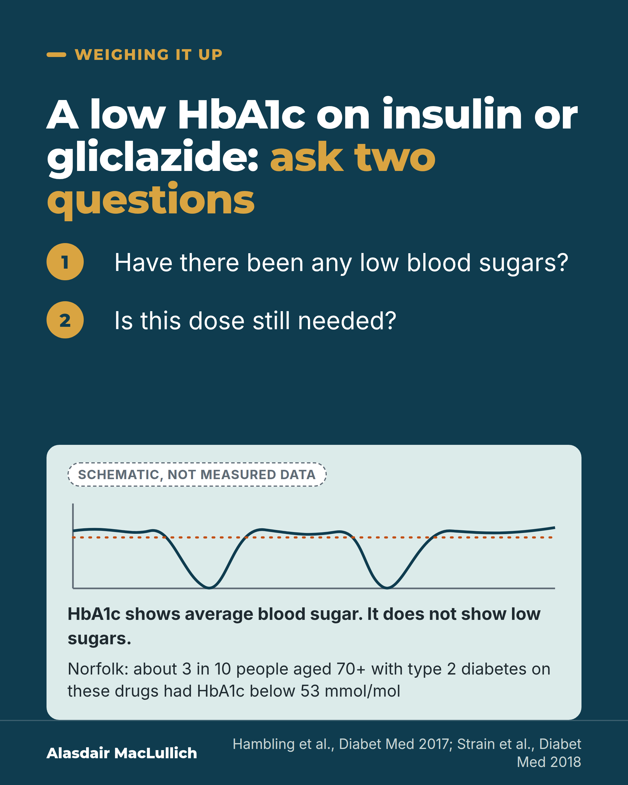

# G056: When a low HbA1c needs a second look

- Category: C06 Medicines and prescribing burden
- Audience: both
- Series: Weighing it up
- Post type: decision_support
- Visual format: question card
- Status: text text_final, visual final
- Working id: C06-P08 (candidate C06-25)

## Insight

For a frail older person on insulin or a gliclazide-type tablet, a low HbA1c can mean more treatment than they need; HbA1c does not show low sugars, which are linked with falls and fractures.

## Angle and position

Revised angle: frame as possible overtreatment, not measured hypoglycaemia; acknowledge the benefit of tight control; end with a question for families.

Basis: mixed: empirical finding (Hambling 2017, Lipska 2015, Munshi 2011, Mattishent 2021 association); guidance (Strain 2018, Farrell 2017); the question to ask is clinical interpretation

## X (994 characters)

```text
For a frail older person taking insulin or a diabetes tablet such as gliclazide, a low HbA1c can be a sign of more treatment than they need.

HbA1c is a blood test of average blood sugar over recent months. It does not show whether low blood sugars are happening.

A study in 16 Norfolk GP practices found that about 3 in 10 people aged 70 or over with type 2 diabetes on these drugs had an HbA1c below 53 mmol/mol, a low result. It was just as common in people with kidney disease or dementia, who are more prone to low blood sugars. The study did not record frailty.

Low blood sugars are linked with falls and fractures in older people, though the link does not show cause.

UK specialists say the usual targets are too tight in frailty. Tighter control is linked with fewer blood vessel complications, so this is a balance.

A question to ask: have there been any low blood sugars, and is this dose still needed? Doses are for the diabetes team or GP to change, not for you to change alone.
```

## LinkedIn (2196 characters)

```text
For a frail older person taking insulin or a diabetes tablet such as gliclazide, a low HbA1c can be a sign of more treatment than they need.

HbA1c is a blood test that reflects average blood sugar over recent months. A low result looks like success. What it doesn't show is whether low blood sugars are happening.

A small US study followed 40 older people, 37 of them on insulin, whose HbA1c was 8% or more (64 mmol/mol or more). Over 3 days of continuous monitoring, 26 had low glucose readings (below 70 mg/dL, the level counted as low). Of the 102 low episodes, 95 (93 in 100) were missed by finger-prick tests and symptoms.

In 16 Norfolk GP practices, about 3 in 10 people aged 70 or over with type 2 diabetes taking insulin or a sulfonylurea (a diabetes tablet that can cause low blood sugar, such as gliclazide) had an HbA1c below 53 mmol/mol, and about 1 in 8 were below 48. It was just as common in people with kidney disease or dementia, who are more prone to low blood sugars.

In US national data from 2001 to 2010, 56 in 100 older people with diabetes and very poor health had an HbA1c below 53 mmol/mol (7%). In relatively healthy older people it was 63 in 100. Very poor health meant difficulty with two or more everyday activities, or being on dialysis. Neither the Norfolk study nor the national data measured low blood sugars directly.

Why it counts: in studies of older people treated for diabetes, those with episodes of low blood sugar were more likely to have falls and fractures. That is a link, not proof of cause.

The other side: across 15 trials and observational studies in people aged 60 or over or frail, tight control was linked with fewer blood vessel complications, but more than twice the rate of severe low blood sugars, and no clear difference in deaths.

A UK consensus statement says the usual targets of 53 to 59 mmol/mol are too tight for people living with frailty. A deprescribing guideline recommends reducing drugs that cause low blood sugars in older people at risk.

The question for the next review: have there been any low blood sugars, and is this dose still needed? Doses are for the diabetes team or GP to change, not for you to change alone.
```

## Bluesky (293 characters)

```text
A low HbA1c in a frail older person on insulin or a diabetes tablet like gliclazide can mean too much treatment.

HbA1c, a blood test of average blood sugar, doesn't show low blood sugars (linked with falls).

Ask: any low blood sugars, and is this dose still needed? Don't change doses alone.
```

## Threads (490 characters)

```text
For a frail older person on insulin or a diabetes tablet like gliclazide, a low HbA1c (average blood sugar test) can mean over-treatment.

In Norfolk, about 3 in 10 people aged 70+ with diabetes on these drugs had an HbA1c below 53 mmol/mol (low), as often with kidney disease or dementia. HbA1c does not show low blood sugars, linked with falls.

UK specialists say usual targets are too tight in frailty. Ask: any low blood sugars, and is this dose still needed? Don't change doses alone.
```

## Source reply

Sources: Hambling 2017 https://doi.org/10.1111/dme.13380 ; Lipska 2015 https://doi.org/10.1001/jamainternmed.2014.7345 ; Strain 2018 https://doi.org/10.1111/dme.13644 ; Farrell 2017 https://pubmed.ncbi.nlm.nih.gov/29138153/ ; Mattishent 2021 https://doi.org/10.3389/fendo.2021.571568 ; Munshi 2011 https://doi.org/10.1001/archinternmed.2010.539 ; Crabtree 2022 https://doi.org/10.1080/17446651.2022.2079495

## Visual



Alt text: Dark question card: a low HbA1c on insulin or gliclazide, ask two questions. Have there been any low blood sugars? Is this dose still needed? A schematic line graph, not measured data, shows blood sugar dipping below a dotted average line. HbA1c shows the average, not low sugars. In Norfolk about 3 in 10 people aged 70+ on these drugs had HbA1c below 53.

Editable source: `visuals/src/G056.html`

Design instructions: Single dark teal card. Gold numbered steps for two questions; mint panel with schematic SVG line (blood sugar with two dips below a dotted average line), Schematic badge, HbA1c note and Norfolk figure. No evidence chart.

## Sources and verification

- C06-25-a (supported): In US adults aged 65 or over with diabetes (NHANES 2001 to 2010), tight control (HbA1c below 7%) was as common in those in very complex or poor health (56.4%) as in the relatively healthy (62.8%).
  - Source: Lipska KJ, Ross JS, Miao Y, Shah ND, Lee SJ, Steinman MA. Potential overtreatment of diabetes mellitus in older adults with tight glycemic control. JAMA Intern Med. 2015;175(3):356-62.
  - Passage: ""Overall, 61.5% (95% CI, 57.5%-65.3%), representing 3.8 million (95% CI, 3.4-4.2), had an HbA1c level of less than 7%; this proportion did not differ across health status categories (62.8% [95% CI, 56.9%-68.3%]) were relatively healthy, 63.0% (95% CI, 57.0%-68.6%) had complex/intermediate health, and 56.4% (95% CI, 49.7%-62.9%) had very complex/poor health (P = .26)." Health status definition: "very complex/poor, based on difficulty with 2 or more activities of daily living or dialysis dependence"." (Abstract, Results and Exposures)
- C06-25-b (supported): Of older adults with HbA1c below 7%, 54.9% were treated with insulin or a sulfonylurea (60.0% of those in very complex or poor health).
  - Source: Lipska KJ, Ross JS, Miao Y, Shah ND, Lee SJ, Steinman MA. Potential overtreatment of diabetes mellitus in older adults with tight glycemic control. JAMA Intern Med. 2015;175(3):356-62.
  - Passage: ""Of the older adults with an HbA1c level of less than 7%, 54.9% (95% CI, 50.4%-59.3%) were treated with either insulin or sulfonylureas; this proportion was similar across health status categories (50.8% [95% CI, 45.1%-56.5%] were relatively healthy, 58.7% [95% CI, 49.4%-67.5%] had complex/intermediate health, and 60.0% [95% CI, 51.4%-68.1%] had very complex/poor health; P = .14)."" (Abstract, Results)
- C06-25-c (supported_with_qualification): In 16 Norfolk general practices, about 3 in 10 people aged 70 or over with type 2 diabetes on a sulfonylurea or insulin had an HbA1c below 53 mmol/mol, and this was as common in those with kidney disease or dementia.
  - Source: Hambling CE, Seidu SI, Davies MJ, Khunti K. Older people with type 2 diabetes, including those with chronic kidney disease or dementia, are commonly overtreated with sulfonylurea or insulin therapies. Diabet Med. 2017;34(9):1219-1227.
  - Passage: ""Sixteen Norfolk general practices participated ... Of these, 1379 (35.7%) people were prescribed sulfonylurea or insulin therapies." "The median age of the study cohort was 78 years." "In total, 400 older people (29.9%) had an HbAconcentration < 53 mmol/mol (7%), of whom 162 (12.1%) had HbA< 48 mmol/mol (6.5%)." "Treatment to an HbAtarget of < 53 mmol/mol (7.0%) was as prevalent in those with chronic kidney disease or dementia as in those without." [The subscript '1c' is lost in the PubMed text rendering.]" (Abstract, Methods and Results)
- C06-25-d (supported): UK consensus says the usual HbA1c targets (53 to 59 mmol/mol, 7 to 7.5%) are too tight for frail older people.
  - Source: Strain WD, Hope SV, Green A, Kar P, Valabhji J, Sinclair AJ. Type 2 diabetes mellitus in older people: a brief statement of key principles of modern day management including the assessment of frailty. A national collaborative stakeholder initiative. Diabet Med. 2018;35(7):838-845.
  - Passage: ""Guidelines from organizations such as the National Institute for Health and Care Excellence (NICE), the European Association for the Study of Diabetes, and the American Diabetes Association acknowledge the need for individualized care, but the glycaemic targets that are suggested to constitute good control [HbA 53-59 mmol/mol (7-7.5%)] are too tight for frail older individuals. We present a framework for the assessment of older adults and guidelines for the management of this population according to their frailty status..."" (Abstract)
- C06-25-e (supported): A deprescribing guideline recommends reducing or stopping glucose-lowering drugs that cause hypoglycaemia in older adults at risk, and individualising targets for people who are frail, have dementia or limited life expectancy.
  - Source: Farrell B, Black C, Thompson W, McCarthy L, Rojas-Fernandez C, Lochnan H, et al. Deprescribing antihyperglycemic agents in older persons: evidence-based clinical practice guideline. Can Fam Physician. 2017;63(11):832-843.
  - Passage: ""We recommend deprescribing antihyperglycemic medications known to contribute to hypoglycemia in older adults at risk or in situations where antihyperglycemic medications might be causing other adverse effects, and individualizing targets and deprescribing accordingly for those who are frail, have dementia, or have a limited life expectancy."" (Abstract, Recommendations)
- C06-25-f (supported_with_qualification): Low blood sugar episodes in older people treated for diabetes are linked with falls and fractures.
  - Source: Mattishent K, Loke YK. Meta-analysis: association between hypoglycemia and serious adverse events in older patients treated with glucose-lowering agents. Front Endocrinol (Lausanne). 2021;12:571568.
  - Passage: ""Similarly, our meta-analysis of six studies demonstrated an association between hypoglycemia and falls and fractures, pooled OR 1.78 (95% CI 1.44-2.21) and 1.68 (95% CI 1.37-2.07) respectively." and "Studies assessing mortality signal a time-response relationship with a higher risk of adverse events occurring within the first 90 days after hypoglycemia."" (Abstract, Results)
- C06-25-g (supported_with_qualification): HbA1c does not reveal low blood sugars: in older adults with high HbA1c (8% or more), most on insulin, two thirds had low glucose on 3 days of monitoring, and almost all episodes went unnoticed.
  - Source: Munshi MN, Segal AR, Suhl E, Staum E, Desrochers L, Sternthal A, et al. Frequent hypoglycemia among elderly patients with poor glycemic control. Arch Intern Med. 2011;171(4):362-4.
  - Passage: ""Forty adults (mean [SD] age, 75 [5] years; HbA(1C) value, 9.3% [1.3%]; diabetes duration, 22 [14] years; 28 patients [70%] with type 2 diabetes mellitus; and 37 [93%] using insulin) were evaluated. Twenty-six patients (65%) experienced 1 or more episodes of hypoglycemia (glucose level <70 mg/dL). ... Of the total of 102 hypoglycemic episodes, 95 (93%) were unrecognized by finger-stick glucose measurements performed 4 times a day or by symptoms." Conclusion: "Raising HbA(1C) goals may not be adequate to prevent hypoglycemia in this population."" (Abstract, Results and Conclusions)
- C06-25-i (supported_with_qualification): Tight glucose control in older adults reduces some complications but more than doubles severe hypoglycaemia, without a clear difference in deaths.
  - Source: Crabtree T, Ogendo JJ, Vinogradova Y, Gordon J, Idris I. Intensive glycemic control and macrovascular, microvascular, hypoglycemia complications and mortality in older (age >=60years) or frail adults with type 2 diabetes: a systematic review and meta-analysis from randomized controlled trial and observation studies. Expert Rev Endocrinol Metab. 2022;17(3):255-267.
  - Passage: ""No difference was noted in all-cause mortality with intensive control (pooled hazard ratio 0.96, 95% confidence interval 0.90-1.03), but risk of severe hypoglycemia increased (2.45, 2.22-2.72). Intensive control was associated reductions in microvascular (0.73, 0.68-0.79) and macrovascular complications (0.84, 0.79-0.89). Outcome data for risk of hospitalization, cognition, and falls/fractures were limited."" (Abstract, Results)

Verification notes: Hambling 2017 abstract (3 in 10, 1 in 8, CKD and dementia; low sugars not measured). Lipska 2015 abstract (US 2001 to 2010, potential overtreatment; low sugars not measured). Munshi 2011 abstract (small, high-HbA1c group; used only to show HbA1c cannot reveal low sugars). Mattishent 2021 association, no cause. Crabtree 2022 benefit of tight control stated (relative only). Strain 2018 consensus: targets too tight, no frailty target numbers quoted. Farrell 2017 guideline. ADA not cited (not found). HbA1c definition is a plain-language gloss. 'Do not change doses alone' is safety advice (judgement), not a research claim. Crabtree 2022 benefit wording kept as 'linked with'.

## Attention and follow potential

Pause: A result that looks like good control may be a reason to reduce treatment.

Gain: Two questions for the next diabetes review and the reason behind them.

Follow: Treatment decisions weighed with benefits and burdens both stated.

## Open issues

None.
