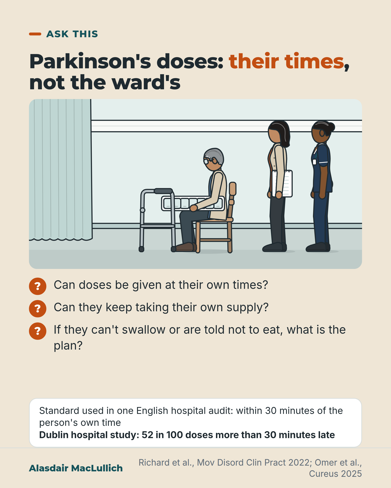

# G057: Parkinson's doses on the person's own times

- Category: C06 Medicines and prescribing burden
- Audience: public
- Series: Ask this
- Post type: decision_support
- Visual format: drawn illustration
- Status: text text_final, visual final
- Working id: C06-P09 (candidate C06-20)

## Insight

Parkinson's medicine times are set for each person and doses are often late in hospital; ask for doses at the person's own times, whether they can use their own supply, and for a plan if they can't swallow.

## Angle and position

Editor's guidance: own-times dosing and own supply; 'ask for a plan' for nil by mouth; no patches, conversions or drug-avoid list.

Basis: mixed: empirical finding (late and missed doses; observational link with longer stays); guidance (30-minute audit standard); the asks are judgement grounded in that evidence

## X (866 characters)

```text
Parkinson's medicine times are set for each person, and hospital drug rounds often miss them.

One recent English hospital audit (a check of its own practice), citing NICE standards, used this standard: each dose given within 30 minutes of the person's own prescribed time.

In a Dublin hospital study, 52 in 100 Parkinson's doses were given more than 30 minutes late. In a US hospital system, a dose of levodopa, a Parkinson's medicine, was missed on about 1 hospital day in 5 (days where the home timing was known).

Missed doses have been linked with longer hospital stays. That link does not show that the missed doses caused them.

If someone you care for is admitted, ask three things. Can doses be given at their own times? Can they keep taking their own supply? If they can't swallow, or are told not to eat, what is the plan for their Parkinson's medicines?
```

## LinkedIn (1724 characters)

```text
Parkinson's medicine times are set for each person, and hospital drug rounds often miss them.

A ward drug round runs to the ward's times. One recent English hospital audit (a check of its own practice), citing NICE standards, used this standard: each dose given within 30 minutes of the person's own prescribed time.

Studies in other hospitals show doses often fall outside that window:
1. In a Dublin hospital study, 52 in 100 Parkinson's doses were given more than 30 minutes late, and about 3 in 10 more than an hour late.
2. In a large US hospital system, on nearly half of hospital days with a known home schedule the timing was more than 30 minutes away from it, and on about 1 day in 5 a dose of levodopa, a Parkinson's medicine, was missed.

Missed doses are linked with worse outcomes. In 11 Spanish hospitals, some admissions had Parkinson's doses wrongly left out. These were linked with a stay about 4 days longer and with higher death rates in hospital. A US study linked each extra day with missed or badly timed doses to a longer stay. These are observational studies; sicker people may both miss doses and stay longer, so they show a link, not proof.

People with Parkinson's say that getting doses on time and keeping control of their own medicines are among their top priorities in hospital. A 2026 review of four studies suggests hospitals should enable people to take their own medicines where appropriate.

If someone you care for is admitted, bring a written list of their medicines and times, and ask:
Can doses be given at their own times?
Can they keep taking their own supply?
If they can't swallow, or are told not to eat or drink before a test, what is the plan for their Parkinson's medicines?
```

## Bluesky (262 characters)

```text
Parkinson's doses are timed for each person. In a Dublin hospital, 52 in 100 were given over 30 minutes late.

If someone is admitted, ask three things. Can doses be given at their own times? Can they use their own supply? What is the plan if they can't swallow?
```

## Threads (497 characters)

```text
Parkinson's medicine times are set for each person. One recent English hospital audit (a check of its own practice), citing NICE standards, set a target of giving each dose within 30 minutes of that time.

In a Dublin study, 52 in 100 doses were more than 30 minutes late. Missed doses are linked with longer stays, though that does not show cause.

If someone you care for is admitted, ask for doses at their own times, whether they can use their own supply, and for a plan if they can't swallow.
```

## Source reply

Sources: Richard 2022 https://doi.org/10.1002/mdc3.13408 ; Yu 2023 https://doi.org/10.1016/j.parkreldis.2023.105491 ; Lertxundi 2017 https://doi.org/10.1016/j.parkreldis.2016.12.028 ; Omer 2025 https://doi.org/10.7759/cureus.97619 ; Delf and Wright 2026 https://doi.org/10.1155/padi/8428752

## Visual



Alt text: Drawn hospital bay: an older man sits in a chair with his own pill organiser and walking frame in front of him, while his daughter holding a folder and a nurse stand by. Three questions: can doses be given at their own times, can they keep their own supply, and what is the plan if they can't swallow. A Dublin study found 52 in 100 doses over 30 minutes late.

Editable source: `visuals/src/G057.html`

Design instructions: Single card, sand ground. Kit hospital bay: older man seated with pill organiser and standard walking frame, daughter with folder, nurse; question ticks below and audit panel. Wall clock and trolley omitted.

## Sources and verification

- C06-20-a (supported_with_qualification): In hospital, Parkinson's medicines are often given late: in one study half of doses were more than 30 minutes late.
  - Source: Richard G, Redmond A, Penugonda M, Bradley D. Parkinson's disease medication prescribing and administration during unplanned hospital admissions. Mov Disord Clin Pract. 2022;9(3):334-9.; Yu JRT, Sonneborn C, Hogue O, Ghosh D, Brooks A, Liao J, et al. Establishing a framework for quality of inpatient care for Parkinson's disease: a study on inpatient medication administration. Parkinsonism Relat Disord. 2023;113:105491.
  - Passage: "Richard 2022: "A total of 102 admissions of 70 patients (67% men) were included for analysis." "Time-critical medications were prescribed correctly on admission in 50% of admissions, with errors in medication timing most common (31.6%). Of all doses, 51.7% were administered >30 minutes late, and 29.7% of doses were administered >1 hour late." Yu 2023: "The study included 492 patients with 725 admissions." "Of the admission days with known outpatient timing regimens, 47% had an average deviation of more than 30 min and 22% had at least one missed levodopa dose."" (Richard 2022 Abstract (Results); Yu 2023 Abstract (Results))
- C06-20-b (supported_with_qualification): Missed and mistimed Parkinson's doses in hospital are linked with longer stays and, for omitted doses, higher in-hospital death rates; the studies are observational.
  - Source: Lertxundi U, Isla A, Solinís MÁ, Domingo-Echaburu S, Hernandez R, Peral-Aguirregoitia J, et al. Medication errors in Parkinson's disease inpatients in the Basque Country. Parkinsonism Relat Disord. 2017;36:57-62.; Yu JRT, Sonneborn C, Hogue O, Ghosh D, Brooks A, Liao J, et al. Establishing a framework for quality of inpatient care for Parkinson's disease: a study on inpatient medication administration. Parkinsonism Relat Disord. 2023;113:105491.
  - Passage: "Lertxundi 2017: "All PD patients admitted to any of the 11 public acute-care hospitals in the Basque Country in 2011-2012 were included." "The study included 1628 patients admitted 2546 times. Medication errors, affecting almost one third of admissions and half of patients, were associated with higher mortality: inappropriately omitted dopaminergic drug doses OR = 1.92 CI 95% (1.34-2.76)" "Inappropriately omitted doses and both inappropriate antipsychotic and antiemetic administration were associated with a significant 4-day increase in median hospital stay." Yu 2023: "LOS was longer with each additional day of over-dose (4%), under-dose (14%), missed dose (21%), timing deviation (15%) and substitution (19%), (all p < 0.0001)." "Deviations between outpatient and hospital regimens, and administration of antidopaminergic medications, were associated with poor outcomes."" (Lertxundi 2017 Abstract (Methods, Results); Yu 2023 Abstract (Results, Conclusion))
- C06-20-c (supported_with_qualification): Parkinson's medicine schedules are highly individual and time-critical; the NICE standard, as applied in a UK audit, is administration within 30 minutes of the prescribed time.
  - Source: Cox CM. How to optimise medicines management for people with Parkinson's disease in hospital. Nurs Older People. 2024;37(1):16-20.; Omer YZ, Chakraborty M, Phillips K, Ponniah G, Strens L. Impact of electronic prescribing on Parkinson's disease medication management: a retrospective before-and-after audit at a UK teaching hospital. Cureus. 2025;17(11):e97619.
  - Passage: "Cox 2024: "People with Parkinson's disease require careful administration, titration, adjustment and monitoring of their antiparkinsonian medicines regimen, which is highly individualised." "It is crucial that people with Parkinson's disease take their antiparkinsonian medicines at exactly the right time, since the inaccurate timing of these medicines can have significant adverse health implications." Omer 2025: "The audit was assessed against the National Institute for Health and Care Excellence (NICE) QS164, NG71, and QS120 standards, which expect 100% accurate prescribing and administration of time-critical PD medicines within ±30 minutes." "Correct administration times fell from 39/50 (78%) to 33/50 (66%)."" (Cox 2024 Abstract (key points); Omer 2025 Abstract (Methods, Results))
- C06-20-d (supported_with_qualification): People with Parkinson's prioritise timely doses and autonomy in hospital, and a recent review recommends enabling self-administration where appropriate.
  - Source: Delf A, Wright D. Identification of the medicine-related priorities for people with Parkinson's during hospitalisation: a systematic review using meta-ethnography. Parkinsons Dis. 2026;2026:8428752.
  - Passage: ""Four studies met the inclusion criteria. Four overarching themes reflected the core medication-related priorities of PwP during hospitalisation: timely and accurate medication administration, autonomy, access to skilled and knowledgeable staff, and advocacy to support patient needs." "Findings suggest the need to strengthen systems supporting timely medication administration, enable self-administration where appropriate, promote flexibility and person-centred care, and implement Parkinson's clinical champions to advocate for and support PwP throughout hospitalisation."" (Abstract (Results, Conclusion))
- C06-20-e (supported_with_qualification): If a person with Parkinson's cannot swallow or is told not to eat or drink, the family should ask for a plan for their Parkinson's medicines rather than accept missed doses.
  - Source: Lertxundi U, Isla A, Solinís MÁ, Domingo-Echaburu S, Hernandez R, Peral-Aguirregoitia J, et al. Medication errors in Parkinson's disease inpatients in the Basque Country. Parkinsonism Relat Disord. 2017;36:57-62.; Yu JRT, Sonneborn C, Hogue O, Ghosh D, Brooks A, Liao J, et al. Establishing a framework for quality of inpatient care for Parkinson's disease: a study on inpatient medication administration. Parkinsonism Relat Disord. 2023;113:105491.
  - Passage: "Lertxundi 2017: "Inappropriately omitted doses and both inappropriate antipsychotic and antiemetic administration were associated with a significant 4-day increase in median hospital stay." Yu 2023: "22% had at least one missed levodopa dose. LOS was longer with each additional day of ... missed dose (21%)"" (Abstracts (Results))

Verification notes: Richard 2022 abstract (52%, about 3 in 10 over an hour); Yu 2023 abstract (per hospital day denominators). Lertxundi 2017 omitted-dose results, observational, no odds ratio conversion. 30-minute standard as stated by UK audit authors (Cox 2024, Omer 2025); NICE not opened. Delf and Wright 2026 recommendation based on patient views. Editor's guidance followed: no patches, conversions or drug-avoid list; nil by mouth reduced to 'ask for a plan'. Removed unsourced 'worked out over years'; 'other hospitals' studies' attributes the late-dose figures to Dublin and Cleveland.

## Attention and follow potential

Pause: Families often assume ward times are fine; for Parkinson's they often are not.

Gain: Three specific asks to make on the day of admission.

Follow: Specific questions to ask in hospital.

## Open issues

None.
