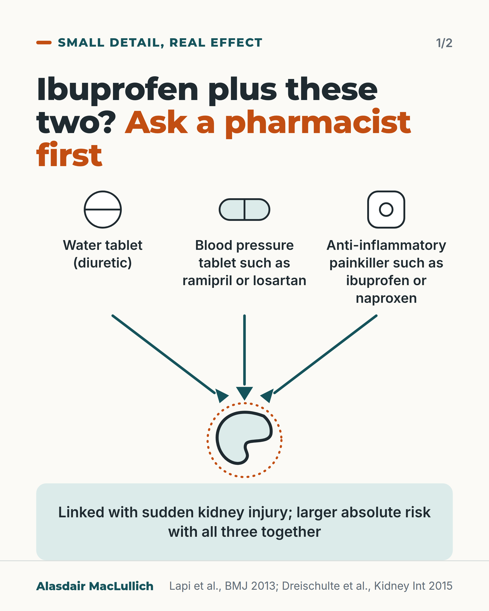
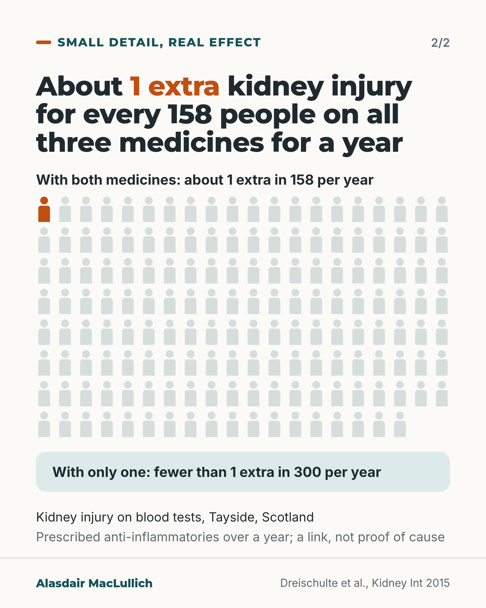

# G058: Ibuprofen with a water tablet and a blood pressure tablet

- Category: C06 Medicines and prescribing burden
- Audience: public
- Series: Small detail, real effect
- Post type: public_explanation
- Visual format: carousel (2 slides)
- Status: text text_final, visual final
- Working id: C06-P10 (candidate C06-32)

## Insight

Anti-inflammatory painkillers taken with a water tablet and an ACE inhibitor or ARB are linked with sudden kidney injury, with larger absolute risk on all three, in the first month in one study and in people over 75 in another; the absolute risk is small.

## Angle and position

Revised angle: ask a pharmacist before buying ibuprofen if you take either medicine, especially both; give absolute context; do not imply one medicine alone makes it safe; no named alternative.

Basis: empirical finding (Lapi 2013, Dreischulte 2015, observational); practical advice (ask a pharmacist) is clinical interpretation

## X (1176 characters)

```text
Before you buy ibuprofen or naproxen, ask a pharmacist if you take a water tablet, or a blood pressure tablet such as ramipril or losartan. Take extra care if you take both.

Two UK studies looked at this, one of them in Scotland. Both link an anti-inflammatory painkiller taken with both a water tablet and a blood pressure tablet such as ramipril or losartan to sudden kidney injury. Only the Scottish study also found extra risk when just one of the two was taken. In that study, more people were affected when all three were taken together. One study found the risk greatest in the first month; the other, in people over 75 and in people with weaker kidneys.

In the Scottish study, for every 158 people taking an anti-inflammatory for a year (regular use, not a few days) alongside both medicines, about 1 extra had a kidney injury on blood tests. With only one of the two, the extra risk was lower, but still there.

Hospital admission for kidney injury was uncommon. Both studies looked at prescribed painkillers, and they show a link, not proof of cause.

If you take either kind of tablet, tell the pharmacist before you buy a painkiller, and ask which one suits you.
```

## LinkedIn (2097 characters)

```text
Before you buy ibuprofen or naproxen, ask a pharmacist if you take a water tablet, or a blood pressure tablet such as ramipril or losartan. Take extra care if you take both.

Anti-inflammatory painkillers are sold off the shelf and feel minor. Taken with these medicines, they are linked with sudden kidney injury. The water tablet lowers the fluid reaching the kidneys. The anti-inflammatory narrows the blood vessel into the kidney's filters. The blood pressure tablet (an ACE inhibitor or ARB, such as ramipril or losartan) stops the kidney from adjusting to this. That is the researchers' explanation rather than something the studies measured.

What the studies found:
1. In UK GP records, people taking an anti-inflammatory on top of both a water tablet and an ACE inhibitor or ARB had about a third more hospital admissions with sudden kidney injury than people on the two blood pressure medicines alone. The extra risk was greatest in the first month and had gone by 90 days of use. This study found no extra risk with only one of the two blood pressure medicines.
2. In a Scottish study that counted kidney injury on blood tests, about 1 extra person in every 158 had a kidney injury for each year of taking an anti-inflammatory alongside both medicines. With only one of the two, the extra risk was lower (fewer than 1 in 300), but it was still there.
3. In the Scottish study, people over 75 and people with weaker kidneys were at highest risk.

To keep this in proportion: hospital admission for kidney injury was uncommon, about 7 per 10,000 people a year across everyone on blood pressure medicines in the first study. Counting blood-test rises, as the Scottish study did, the yearly rate across everyone on these medicines was higher, about 68 per 10,000. The 1 in 158 figure is for a year of regular use of an anti-inflammatory, not a few days of ibuprofen. Both studies looked at prescribed anti-inflammatories over longer periods, not shop-bought packs, and they show a link rather than proof of cause.

Tell the pharmacist what else you take, and ask which painkiller suits you.
```

## Bluesky (297 characters)

```text
UK studies link painkillers like ibuprofen, taken with a water tablet and a blood pressure tablet like ramipril, to sudden kidney injury. Risk was higher with all three. In one, about 1 extra case per 158 people a year of regular use.

If you take either, ask a pharmacist before buying ibuprofen.
```

## Threads (487 characters)

```text
If you take a water tablet or a blood pressure tablet such as ramipril or losartan, ask a pharmacist before buying ibuprofen or naproxen. Take extra care if you take both.

Two UK studies, one Scottish, link that mix with sudden kidney injury. Only the Scottish study also found a risk when just one of the two was taken. In that study, more people were affected with all three: about 1 extra kidney injury per 158 people taking an anti-inflammatory for a year with both, not a few days.
```

## Source reply

Sources: Lapi 2013 https://doi.org/10.1136/bmj.e8525 ; Dreischulte 2015 https://doi.org/10.1038/ki.2015.101

## Visual



Alt text: Three tablets, a water tablet, a blood pressure tablet such as ramipril or losartan, and an anti-inflammatory painkiller such as ibuprofen, point by arrows to a drawn kidney. Ask a pharmacist first. The combination is linked with sudden kidney injury, with larger absolute risk when all three are taken together.



Alt text: Icon array of 158 people with 1 highlighted: about 1 extra kidney injury per 158 people on all three medicines for a year. With only one of the two other medicines: fewer than 1 extra in 300 per year. Blood-test kidney injury in Tayside; a link, not proof of cause.

Editable source: `visuals/src/G058.html`

Design instructions: Carousel 2 cards, light ground. Card 1: three drawn tablets with labels and converging arrows to kidney with dotted orange ring; mint note. Card 2: iconArray 158 persons (20 columns) 1 filled orange, mint panel for fewer than 1 in 300. Claim C06-32-e.

## Sources and verification

- C06-32-a (supported): In a UK primary care study of 487,372 people on blood pressure drugs, taking an NSAID together with a diuretic and an ACE inhibitor or ARB was linked with a higher rate of acute kidney injury (rate ratio 1.31).
  - Source: Lapi F, Azoulay L, Yin H, Nessim SJ, Suissa S. Concurrent use of diuretics, angiotensin converting enzyme inhibitors, and angiotensin receptor blockers with non-steroidal anti-inflammatory drugs and risk of acute kidney injury: nested case-control study. BMJ. 2013;346:e8525.
  - Passage: ""A cohort of 487 372 patients using antihypertensive drugs met the study inclusion criteria (fig 1); they were followed for a mean of 5.9 (SD 3.4) years ... current use of a triple therapy combination was associated with a 31% higher rate of acute kidney injury (rate ratio 1.31, 95% confidence interval 1.12 to 1.53)." Table 1: cases mean (SD) age "76.9 (10.9)"; controls "76.9 (10.7)"." (Full text, Results and Table 1; Table 2)
- C06-32-b (supported): The risk with the triple combination was highest in the first 30 days of use.
  - Source: Lapi F, Azoulay L, Yin H, Nessim SJ, Suissa S. Concurrent use of diuretics, angiotensin converting enzyme inhibitors, and angiotensin receptor blockers with non-steroidal anti-inflammatory drugs and risk of acute kidney injury: nested case-control study. BMJ. 2013;346:e8525.
  - Passage: ""With respect to duration of use, an 82% (rate ratio 1.82, 1.35 to 2.46) increased risk of acute kidney injury was observed in the first 30 days of use, whereas the adjusted rate ratio progressively decreased with longer periods of use and was no longer significant after more than 90 days of use (1.01, 0.84 to 1.23; P for interaction<0.001)."" (Full text, Results (secondary analyses); Table 3)
- C06-32-c (supported_with_qualification): Hospital admission with acute kidney injury was uncommon overall (about 7 per 10,000 person-years among users of blood pressure drugs).
  - Source: Lapi F, Azoulay L, Yin H, Nessim SJ, Suissa S. Concurrent use of diuretics, angiotensin converting enzyme inhibitors, and angiotensin receptor blockers with non-steroidal anti-inflammatory drugs and risk of acute kidney injury: nested case-control study. BMJ. 2013;346:e8525.
  - Passage: ""We identified 2215 cases of acute kidney injury during follow-up, yielding an overall incidence rate of 7/10 000 (95% confidence interval 7/10 000 to 8/10 000) person years."" (Full text, Results)
- C06-32-d (supported): An NSAID with only one of these drugs (a diuretic alone, or an ACE inhibitor or ARB alone) was not linked with extra kidney injury in the UK hospital-admission study, but a Scottish study counting blood-test rises found a similar relative increase with these double combinations.
  - Source: Lapi F, Azoulay L, Yin H, Nessim SJ, Suissa S. Concurrent use of diuretics, angiotensin converting enzyme inhibitors, and angiotensin receptor blockers with non-steroidal anti-inflammatory drugs and risk of acute kidney injury: nested case-control study. BMJ. 2013;346:e8525.; Dreischulte T, Morales DR, Bell S, Guthrie B. Combined use of nonsteroidal anti-inflammatory drugs with diuretics and/or renin-angiotensin system inhibitors in the community increases the risk of acute kidney injury. Kidney Int. 2015;88(2):396-403.
  - Passage: "Lapi 2013: "Overall, current use of a double therapy combination of a diuretic or an angiotensin converting enzyme inhibitor or angiotensin receptor blocker with NSAIDs was not associated with an increased rate of acute kidney injury." Dreischulte 2015: "The relative increase in AKI risk was similar for NSAID use in both triple (adjusted rate ratio 1.64 (95% CI 1.25-2.14)) and dual combinations with either renin-angiotensin system inhibitors (1.60 (1.18-2.17)) or diuretics (1.64 (1.17-2.29))."" (Lapi 2013 Full text, Results; Dreischulte 2015 Abstract)
- C06-32-e (supported_with_qualification): In absolute terms, about 1 extra kidney injury occurs for every 158 people who take an NSAID for a year alongside both a diuretic and an ACE inhibitor or ARB, compared with 1 in over 300 for the double combinations; risk was highest in people over 75 and those with reduced kidney function.
  - Source: Dreischulte T, Morales DR, Bell S, Guthrie B. Combined use of nonsteroidal anti-inflammatory drugs with diuretics and/or renin-angiotensin system inhibitors in the community increases the risk of acute kidney injury. Kidney Int. 2015;88(2):396-403.
  - Passage: ""This nested case-control study characterized the risk of community-acquired AKI associated with NSAID use among 78,379 users of renin-angiotensin system inhibitors and/or diuretics, where AKI was defined as a 50% or greater increase in creatinine from baseline. The AKI incidence was 68/10,000 person-years. ... However, the absolute increase in AKI risk was higher for NSAIDs used in triple versus dual combinations with renin-angiotensin system inhibitors or diuretics alone (numbers needed to harm for 1 year treatment with NSAID of 158 vs. over 300). AKI risk was highest among users of loop diuretic/aldosterone antagonist combinations, in those over 75 years of age, and in those with renal impairment."" (Abstract)
- C06-32-f (supported_with_qualification): Each of the three drugs affects the kidney differently, so together they reduce the kidney's ability to keep filtering.
  - Source: Lapi F, Azoulay L, Yin H, Nessim SJ, Suissa S. Concurrent use of diuretics, angiotensin converting enzyme inhibitors, and angiotensin receptor blockers with non-steroidal anti-inflammatory drugs and risk of acute kidney injury: nested case-control study. BMJ. 2013;346:e8525.
  - Passage: ""Use of diuretics can lead to hypovolaemia, angiotensin converting enzyme inhibitors/angiotensin receptor blockers cause a haemodynamic reduction in glomerular filtration rate due to efferent arteriolar vasodilation, and NSAIDs cause inhibition of prostacyclin synthesis (leading to renal afferent arteriolar vasoconstriction)." and "among users of the triple therapy combination, the decreased inflow to the glomerulus resulting from the diuretic and NSAID cannot be compensated owing to blockade of the renin-angiotensin system"" (Full text, Introduction and Discussion (Biological mechanisms))

Verification notes: Lapi 2013 full text: about a third more admissions (triple), first month peak, 7 per 10,000 cohort rate, mechanism as authors' explanation, prescribed NSAIDs only, observational. Dreischulte 2015 abstract: NNH 158 per year triple, fewer than 1 in 300 double, over 75 and weaker kidneys highest risk, blood-test definition. Doubles not described as safe. No paracetamol, BNF or NICE (C06-32-g not found). Added 68 per 10,000 (Tayside, blood-test definition) beside 7 per 10,000 (hospital-coded) to reconcile the two baselines in plain words; first-month finding attributed to Lapi, over 75 and weaker kidneys to Dreischulte; 1 in 158 stated as a year of regular use.

## Attention and follow potential

Pause: A shop-shelf painkiller meets two of the commonest prescriptions.

Gain: A one-minute check with a pharmacist and a sense of the actual size of the risk.

Follow: Everyday medicine combinations explained with absolute numbers.

## Open issues

None.
