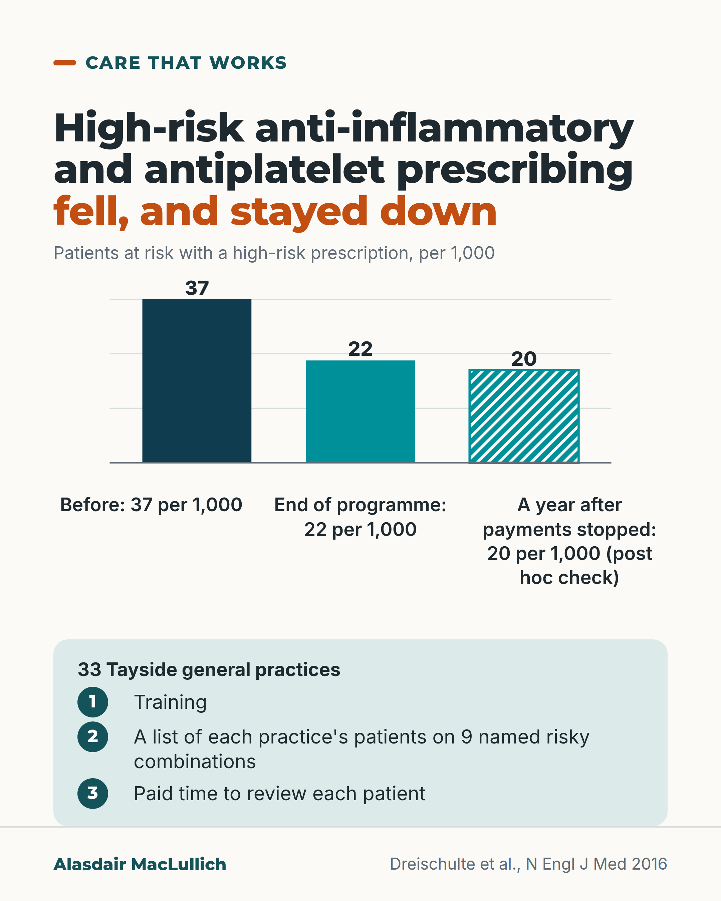

# G059: Tayside's targeted prescribing review

- Category: C06 Medicines and prescribing burden
- Audience: practitioners
- Series: Care that works
- Post type: good_care
- Visual format: chart (bars)
- Status: text text_final, visual final
- Working id: C06-P11 (candidate C06-31)

## Insight

A programme of training, patient lists and paid review time aimed at nine named high-risk combinations reduced that prescribing across 33 Tayside practices, and the reduction held a year after payments stopped.

## Angle and position

Focused, supported review of a few named risks worked; kidney injury admissions showed no clear difference; the contrast with broad review is judgement.

Basis: mixed: empirical finding (DQIP stepped-wedge trial; admission results secondary); judgement (a short named list is a better target) marked as 'we think'

## X (1138 characters)

```text
Targeted high-risk prescribing of anti-inflammatory painkillers and antiplatelet drugs fell from about 37 to 22 per 1,000 patients at risk across 33 Tayside general practices. A year after the payments stopped it was about 20 (a post hoc check).

The programme had three parts: training, a computer search listing each practice's patients on 9 specific risky combinations, and payment to review each one. Examples: an anti-inflammatory in someone with kidney disease or heart failure; aspirin with a blood thinner and no stomach protection.

A review meant a decision, which could be to continue, with the reason recorded.

Admissions for stomach bleeding fell from about 56 to 37 per 10,000 a year, and heart failure admissions fell too. Kidney injury admissions showed no clear difference. These were secondary, before-and-during comparisons.

A 2025 UK trial of broad reviews for people on five or more medicines found no difference in potentially inappropriate prescribing at 6 months. Its aims differed.

We think a short list of named risks, with the patients listed, may be a better target than a general call to review everything.
```

## LinkedIn (1983 characters)

```text
Targeted high-risk prescribing of anti-inflammatory painkillers and antiplatelet drugs fell from about 37 to 22 per 1,000 patients at risk across 33 Tayside general practices. A year after the payments stopped, it was about 20 (a post hoc check).

The DQIP trial tested a programme with three parts:
1. Training for prescribers.
2. A computer search that listed each practice's own patients on specific risky prescriptions.
3. Payment for the practice to review each of those patients.

It focused on nine combinations, for example an anti-inflammatory painkiller in someone with kidney disease or heart failure, or aspirin with a blood thinner and no stomach protection. For each flagged patient the doctor could stop the drug, add stomach protection, or record why the prescription was right for that person. Review meant a decision, not automatic stopping.

Every practice got the programme, at randomly assigned start dates (a stepped-wedge design).

Clinical outcomes were secondary and compared before and during the programme. Admissions for stomach ulcers or bleeding fell from about 56 to 37 per 10,000 patients at risk per year, and heart failure admissions also fell. Kidney injury admissions did not show a clear difference (102 and 86 per 10,000 per year, a gap that could be chance). The authors say the programme may have improved clinical outcomes.

Results varied a great deal between practices. Staff said the payment mainly got practices to sign up, the training got the work started, and the patient lists kept it going; the authors could not say which part did most.

A 2025 UK trial of broad reviews for people on five or more medicines, also with computer support, training and payment, found no difference in potentially inappropriate prescribing at 6 months. Its aims differed. Our judgement, not a tested finding: a short list of named risks, with the patients listed and time to review them, may be a better target than a general call to review everything.
```

## Bluesky (285 characters)

```text
In 33 Tayside practices, high-risk painkiller and antiplatelet prescribing fell from 37 to 22 per 1,000 patients at risk after training, patient lists and paid review time (about 20 a year after payments stopped, post hoc).

We think a short named list may beat a broad call to review.
```

## Threads (494 characters)

```text
In 33 Tayside practices, high-risk anti-inflammatory and antiplatelet prescribing fell from about 37 to 22 per 1,000 patients at risk, and was about 20 a year after payments stopped (post hoc).

The programme: training, a list of each practice's patients on 9 named risky combinations, and paid time to review each one.

Stomach bleeding admissions fell; kidney injury admissions showed no clear difference.

We think a short named list may work better than a general call to review everything.
```

## Source reply

Sources: Dreischulte 2016 https://doi.org/10.1056/NEJMsa1508955 ; process evaluation https://doi.org/10.1186/s13012-016-0531-2 ; IMPPP 2025 https://doi.org/10.1016/j.lanhl.2025.100774

## Visual



Alt text: Bar chart of high-risk anti-inflammatory and antiplatelet prescribing in 33 Tayside practices, per 1,000 patients at risk: 37 before, 22 at the end of the programme, 20 a year after payments stopped (hatched, post hoc check). The programme gave training, a patient list and paid review time.

Editable source: `visuals/src/G059.html`

Design instructions: Single card. Custom SVG vertical bars 37 (deep teal), 22 (teal), 20 (hatched teal) per 1,000 with labels beneath; mint panel with 33 practices and three numbered steps. Claims C06-31-c, C06-31-e. Icon strip omitted.

## Sources and verification

- C06-31-a (supported): DQIP was a cluster-randomised stepped-wedge trial in Tayside general practices (34 randomised, 33 completed) of a 48-week intervention combining professional education, informatics to find patients, and financial incentives for practices to review them.
  - Source: Dreischulte T, Donnan P, Grant A, Hapca A, McCowan C, Guthrie B. Safer prescribing--a trial of education, informatics, and financial incentives. N Engl J Med. 2016;374(11):1053-64.
  - Passage: ""In this cluster-randomized, stepped-wedge trial conducted in Tayside, Scotland, we randomly assigned participating primary care practices to various start dates for a 48-week intervention comprising professional education, informatics to facilitate review, and financial incentives for practices to review patients' charts to assess appropriateness. ... A total of 34 practices underwent randomization, 33 of which completed the study."" (Abstract, Methods and Results)
- C06-31-b (supported): The programme targeted nine named high-risk prescribing measures involving NSAIDs and antiplatelet drugs (six for stomach bleeding, two for kidney harm, one for heart failure), and flags could be cleared by recording that the prescription was appropriate, stopping it, or adding stomach protection.
  - Source: Dreischulte T, Donnan P, Grant A, Hapca A, McCowan C, Guthrie B. Safer prescribing--a trial of education, informatics, and financial incentives. N Engl J Med. 2016;374(11):1053-64.
  - Passage: ""The individual measures were related to three types of adverse drug events: gastrointestinal events (six measures; e.g., aspirin or clopidogrel prescription for a patient taking an oral anticoagulant without coprescription of a gastroprotective drug), renal events (two measures; e.g., NSAID prescription for a patient with chronic kidney disease), and heart failure (NSAID prescription for a patient with heart failure)." and "Physicians could clear the flag by recording an explicit decision that the prescribing was appropriate, by stopping prescription of the offending drugs, or by adding a gastroprotective drug (proton-pump inhibitor or histamine 2 -receptor antagonist) for measures targeting the risk of gastrointestinal bleeding."" (Full text (via Scite excerpts), Methods)
- C06-31-c (supported): Targeted high-risk prescribing fell from 3.7% to 2.2% of patients at risk (adjusted odds ratio 0.63).
  - Source: Dreischulte T, Donnan P, Grant A, Hapca A, McCowan C, Guthrie B. Safer prescribing--a trial of education, informatics, and financial incentives. N Engl J Med. 2016;374(11):1053-64.; Dreischulte T, Grant A, Hapca A, Guthrie B. Process evaluation of the Data-driven Quality Improvement in Primary Care (DQIP) trial: quantitative examination of variation between practices in recruitment, implementation and effectiveness. BMJ Open. 2018;8(1):e017133.
  - Passage: "Dreischulte 2016: "Targeted high-risk prescribing was significantly reduced, from a rate of 3.7% (1102 of 29,537 patients at risk) immediately before the intervention to 2.2% (674 of 30,187) at the end of the intervention (adjusted odds ratio, 0.63; 95% confidence interval [CI], 0.57 to 0.68; P<0.001)." Dreischulte 2018: "...reduced the primary end point of high-risk prescribing by 37%, where both ongoing and new high-risk prescribing were significantly reduced."" (Dreischulte 2016 Abstract, Results; Dreischulte 2018 Abstract)
- C06-31-d (supported_with_qualification): Admissions for stomach ulcer or bleeding fell from 55.7 to 37.0 and heart failure admissions from 707.7 to 513.5 per 10,000 person-years; admissions for acute kidney injury did not show a clear difference.
  - Source: Dreischulte T, Donnan P, Grant A, Hapca A, McCowan C, Guthrie B. Safer prescribing--a trial of education, informatics, and financial incentives. N Engl J Med. 2016;374(11):1053-64.
  - Passage: ""The rate of hospital admissions for gastrointestinal ulcer or bleeding was significantly reduced from the preintervention period to the intervention period (from 55.7 to 37.0 admissions per 10,000 person-years; rate ratio, 0.66; 95% CI, 0.51 to 0.86; P=0.002), as was the rate of admissions for heart failure (from 707.7 to 513.5 admissions per 10,000 person-years; rate ratio, 0.73; 95% CI, 0.56 to 0.95; P=0.02), but admissions for acute kidney injury were not (101.9 and 86.0 admissions per 10,000 person-years, respectively; rate ratio, 0.84; 95% CI, 0.68 to 1.09; P=0.19)." Methods excerpt: "The incidence in the intervention period versus the preintervention period was compared with the use of the conditional maximum-likelihood estimate of the rate ratio."" (Abstract, Results; full text Methods (via Scite excerpt))
- C06-31-e (supported_with_qualification): The fall in high-risk prescribing was sustained in the year after the financial incentives ended.
  - Source: Dreischulte T, Donnan P, Grant A, Hapca A, McCowan C, Guthrie B. Safer prescribing--a trial of education, informatics, and financial incentives. N Engl J Med. 2016;374(11):1053-64.
  - Passage: ""Reductions in the rates of high-risk prescribing were sustained after financial incentives ceased." and "In an analysis of the primary outcome, 674 of 30,187 patients (2.2%) with risk factors for related adverse drug events had prescriptions for NSAIDs, antiplatelet agents, or both at the end of the intervention, and 560 of 28,616 (2.0%) had such prescriptions at 48 weeks after incentives ceased (adjusted odds ratio, 1.14; 95% CI, 0.85 to 1.53; P = 0.38)." Methods: "Finally, in a post hoc analysis, we examined whether the effect of the DQIP intervention was sustained after the end of the intervention."" (Full text (via Scite excerpts), Methods and Results)
- C06-31-f (supported_with_qualification): Effectiveness varied widely between practices, and practice staff saw each component as doing a different job: payments helped practices sign up, education started the work, and the informatics tool kept it going.
  - Source: Dreischulte T, Grant A, Hapca A, Guthrie B. Process evaluation of the Data-driven Quality Improvement in Primary Care (DQIP) trial: quantitative examination of variation between practices in recruitment, implementation and effectiveness. BMJ Open. 2018;8(1):e017133.; Grant A, Dreischulte T, Guthrie B. Process evaluation of the data-driven quality improvement in primary care (DQIP) trial: active and less active ingredients of a multi-component complex intervention to reduce high-risk primary care prescribing. Implement Sci. 2017;12(1):4.
  - Passage: "Dreischulte 2018: "(3) Effectiveness ranged from a relative increase in high-risk prescribing of 24.1% to a relative reduction of 77.2%." and "(1) Recruited practices had lower performance in the quality and outcomes framework than those declining participation." Grant 2017: "All the primary components of the intervention were perceived as active, but at different stages of implementation: financial incentives primarily supported recruitment; education motivated the GPs to initiate implementation; the informatics tool facilitated sustained implementation."" (Dreischulte 2018 Abstract, Results; Grant 2017 Abstract, Results)
- C06-31-g (supported): A later UK trial of a broader approach (structured polypharmacy review with informatics, training, feedback and financial incentives) did not reduce potentially inappropriate prescribing.
  - Source: Payne RA, Blair PS, Caddick B, Chew-Graham CA, Dreischulte T, Duncan LJ, et al. Optimising polypharmacy management in primary care through general practitioner-pharmacist collaboration, informatics, and enhancing clinician engagement: the IMPPP cluster-randomised trial. Lancet Healthy Longev. 2025;6(10):100774.
  - Passage: ""There was no evidence of a difference in the primary outcome of number of potentially inappropriate prescribing indicators at the 26-week follow-up between the intervention and control groups after adjustment for pre-randomisation baseline (mean 2·3 in each group; difference in means -0·007 [95% CI -0·21 to 0·20]; p=0·95)." and "The complex intervention comprised a structured, collaborative, and patient-centred approach to medication review, supported by informatics, clinician training, performance feedback, and financial incentivisation."" (Abstract, Methods and Findings)

Verification notes: DQIP NEJM 2016 full text: design, nine measures, 3.7% to 2.2% (given as per 1,000), secondary admissions (GI bleed 55.7 to 37.0, HF fell, AKI 101.9 and 86.0 not significant), post hoc 2.0% at 48 weeks after incentives. Process evaluations: variation and staff perceptions. IMPPP 2025 abstract: null; contrast marked as judgement. 20 per 1,000 flagged as post hoc in X and Threads.

## Attention and follow potential

Pause: A rare prescribing intervention that worked and lasted, from a UK primary care setting.

Gain: A specific design to copy: named risks, patient lists, protected review time.

Follow: Examples of care that works, with their limits stated.

## Open issues

None.
