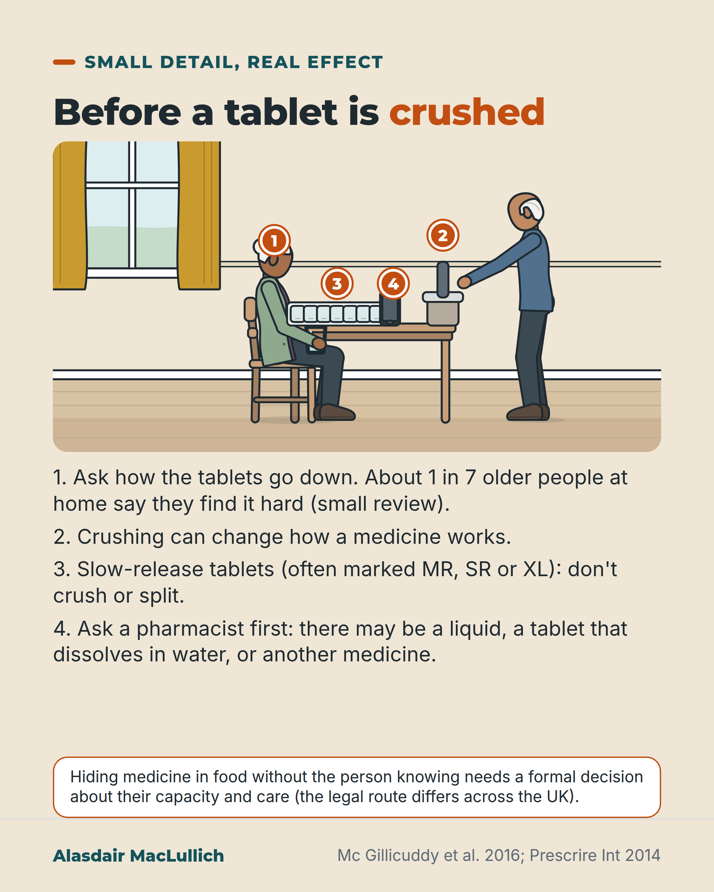

# G060: How the tablets go down

- Category: C06 Medicines and prescribing burden
- Audience: both
- Series: Small detail, real effect
- Post type: teaching
- Visual format: annotated scene
- Status: text text_final, visual final
- Working id: C06-P12 (candidate C06-01)

## Insight

Difficulty swallowing tablets is common and often unrecognised; crushing slow-release or acid-coated tablets changes how they work, so ask how tablets go down and check with a pharmacist before crushing.

## Angle and position

Medicine reviews ask what is taken, rarely how it is swallowed; the kind workaround of crushing is unsafe for some products.

Basis: empirical finding (Mc Gillicuddy 2016, Schiele 2013, Serrano Santos 2016); pharmacology (Prescrire); clinical interpretation (ask a pharmacist first)

## X (888 characters)

```text
About 1 in 7 older people living at home say they have difficulty swallowing their medicines, according to a small review of five studies. In a German GP survey of adults of all ages, doctors had not recognised 7 in 10 of those with any difficulty. More than half of those affected had already altered their tablets themselves.

Crushing can change how a medicine works. A slow-release tablet (often marked MR, SR or XL) releases its dose gradually; crushed, it can release the whole dose at once. A tablet coated against stomach acid can stop working properly if crushed.

Many tablets can be halved safely; slow-release ones should not be split.

Before crushing anything, ask a pharmacist. There may be a liquid, a dispersible tablet (one that dissolves in water) or a different medicine. Hiding medicine in food without the person's knowledge is different and needs a formal decision.
```

## LinkedIn (2010 characters)

```text
A medicines review usually asks what someone takes. It rarely asks how they swallow it.

About 1 in 7 older people living at home say they have difficulty swallowing their medicines, according to a small systematic review of five studies. In a survey of 1,051 patients in German general practices (all adult ages; difficulty was in fact commoner in younger patients), GPs had not recognised 7 in 10 of those with any difficulty. More than half of those affected had already altered their tablets themselves. Older people and carers interviewed in Ireland described coping without raising the problem with health professionals.

Crushing is a workaround some people use, and for some products an unsafe one:
1. Crushing a slow-release tablet (often marked MR, SR or XL) destroys the slow release, so the dose is absorbed at once and can cause an overdose.
2. Crushing a tablet coated to protect it from stomach acid can stop it working properly.
3. Some medicines should never be crushed or opened.

Splitting is different: many tablets can be halved safely, but slow-release tablets should not be split.

In a small study in English nursing homes, a pharmacist watched drug rounds. Some doses were given in a way that departed from national guidance, for any reason and not only crushing. This was seen at 57 in 100 observed doses for residents with swallowing difficulty, against about 31 in 100 for other residents. That counts departures from guidance, not harm.

One more distinction. Crushing a tablet into food with the person's agreement is different from hiding medicine in food without their knowledge. Hiding it is called covert medication, and it needs a formal decision about whether the person can decide for themselves and what is best for them (the legal route differs across the UK), plus the same pharmacist check.

Ask how the tablets go down. Then ask a pharmacist before anything is crushed: there may be a liquid, a dispersible tablet (one that dissolves in water) or a different medicine.
```

## Bluesky (256 characters)

```text
About 1 in 7 older people at home say their tablets are hard to swallow (small review). Crushing a slow-release tablet can release the whole dose at once.

Ask a pharmacist before crushing anything: there may be a liquid or a dissolving (dispersible) form.
```

## Threads (459 characters)

```text
About 1 in 7 older people at home report trouble swallowing pills (small review). In one German survey of adults, more than half of those with difficulty had altered their tablets themselves.

Crushing a slow-release tablet (often marked MR, SR or XL) can release the whole dose at once. Crushing a tablet coated against stomach acid can stop it working.

Before crushing anything, ask a pharmacist. There may be a liquid or a dissolving (dispersible) tablet.
```

## Source reply

Sources: Mc Gillicuddy 2016 https://doi.org/10.1007/s00228-015-1979-8 ; Schiele 2013 https://doi.org/10.1007/s00228-012-1417-0 ; Mc Gillicuddy 2019 https://doi.org/10.1016/j.sapharm.2019.01.004 ; Serrano Santos 2016 https://doi.org/10.1016/j.ijpharm.2016.02.036 ; Prescrire 2014 https://pubmed.ncbi.nlm.nih.gov/25325120/ ; Saran 2022 https://doi.org/10.3399/BJGPO.2022.0001 ; Majkic 2025 https://doi.org/10.1192/bjb.2025.28

## Visual



Alt text: Drawn kitchen table: an older woman holds a glass of water by a pill organiser and phone while an older man holds a tablet crusher. Numbered markers point to the glass, crusher, tablets and phone. Before crushing: ask how tablets go down, crushing can change a medicine, don't crush slow-release tablets, ask a pharmacist first. Hiding medicine in food needs a formal decision.

Editable source: `visuals/src/G060.html`

Design instructions: Single card, sand ground. Kit kitchen scene: older woman with glass, pill organiser, phone, custom crusher prop, older man; pins 1 to 4; numbered text and caution panel. Slow-release inset omitted; MR, SR, XL in text.

## Sources and verification

- C06-01-a (supported_with_qualification): About 1 in 7 older people living at home report difficulty swallowing their medicines, and modifying medicines is common when older people are given them, though the evidence base is small.
  - Source: Mc Gillicuddy A, Crean AM, Sahm LJ. Older adults with difficulty swallowing oral medicines: a systematic review of the literature. Eur J Clin Pharmacol. 2016;72(2):141-51.
  - Passage: ""Five studies met the inclusion criteria. The results suggest that approximately 14 % of community-dwelling older patients experience difficulty swallowing medicines. Between one quarter and one third of occasions of medicine administration to older patients involve the modification of oral medicines." "Difficulty swallowing oral medicines and the modification of medicines are reported as being common issues in the older cohort. However, evidence to support such contentions is limited."" (Abstract (Results, Conclusion))
- C06-01-b (supported_with_qualification): Difficulty swallowing tablets is often not known to the doctor, and many affected people alter their medicines themselves.
  - Source: Schiele JT, Quinzler R, Klimm HD, Pruszydlo MG, Haefeli WE. Difficulties swallowing solid oral dosage forms in a general practice population: prevalence, causes, and relationship to dosage forms. Eur J Clin Pharmacol. 2013;69(4):937-48.; Mc Gillicuddy A, Kelly M, Crean AM, Sahm LJ. Understanding the knowledge, attitudes and beliefs of community-dwelling older adults and their carers about the modification of oral medicines: a qualitative interview study to inform healthcare professional practice. Res Social Adm Pharm. 2019;15(12):1425-35.
  - Passage: "Schiele 2013: "Of all participants (N = 1,051), 37.4 % reported having had difficulties in swallowing tablets and capsules. The majority (70.4 %) of these patients was not identified by their GP. The occurrence of swallowing difficulties was related to gender (f>m), age (young>old), dysphagia [adjusted odds ratio (adOR): 7.9; p < 0.0001] and mental illness (adOR: 1.8; p < 0.05)." "Because of these difficulties, 58.8 % of the affected patients had already modified their drugs in a way that may alter safety and efficacy and 9.4 % indicated to be non-adherent." "One in 11 primary care patients had frequent difficulties in swallowing tablets and capsules while GPs grossly underestimated these problems." Mc Gillicuddy 2019: "However, when challenges arise, they tend to feel resigned to coping within the constraints of the current medication regimen, resulting in a lack of focused communication with healthcare professionals. Thus, healthcare professionals were unaware of their difficulties and unable to offer advice or solutions."" (Schiele 2013 Abstract (Results, Conclusions); Mc Gillicuddy 2019 Abstract (Results))
- C06-01-c (supported): Crushing a slow-release (modified-release) tablet can release the dose all at once and cause overdose; crushing a tablet with a stomach-acid-resistant coating is likely to make it underdose.
  - Source: Crushing tablets or opening capsules: many uncertainties, some established dangers. Prescrire Int. 2014;23(152):209-11, 213-4.
  - Passage: ""The clinical consequences for the patient of crushing tablets or opening capsules can be serious: alteration of the drug's absorption can result in sometimes fatal overdose, or conversely underdosing, rendering the treatment ineffective. When it disrupts a drug's sustained-release properties, the active ingredient is no longer released and absorbed gradually, resulting in overdose. When a gastro-resistant layer is destroyed by crushing, underdosing is likely." "In practice, there are many drugs that should never be crushed or opened."" (Abstract)
- C06-01-d (supported_with_qualification): Another form of the medicine, or another medicine, is sometimes a better solution than crushing; pharmacists are well placed to advise.
  - Source: Crushing tablets or opening capsules: many uncertainties, some established dangers. Prescrire Int. 2014;23(152):209-11, 213-4.; Mc Gillicuddy A, Kelly M, Crean AM, Sahm LJ. Understanding the knowledge, attitudes and beliefs of community-dwelling older adults and their carers about the modification of oral medicines: a qualitative interview study to inform healthcare professional practice. Res Social Adm Pharm. 2019;15(12):1425-35.
  - Passage: "Prescrire 2014: "Before crushing a tablet or opening a capsule, it is better to consider and research the impact it will have on the drug's effects. It is sometimes preferable to use a different dosage form, or a different active ingredient." Mc Gillicuddy 2019: "Whilst the input and expertise of all healthcare professionals will be required, as medication experts, the pharmacy profession should take ownership and become the champion of, and for, the patient."" (Prescrire 2014 Abstract; Mc Gillicuddy 2019 Abstract (Conclusion))
- C06-01-e (supported): Slow-release tablets should not be split, but for most other tablets the evidence gives little support to concerns about splitting (apart from physical difficulty splitting them).
  - Source: Saran AK, Holden NA, Garrison SR. Concerns regarding tablet splitting: a systematic review. BJGP Open. 2022;6(3):BJGPO.2022.0001.
  - Passage: ""No substantive evidence was found to support concerns regarding loss of mass, weight variability, chemical instability, or non-compliance. Evidence does support some older adults struggling to split tablets without tablet splitters, and the inappropriateness of splitting sustained-release preparations, given the potential for alteration of the rate of drug release for some products." "With the exception of sustained-release tablets, which should not be split, and excepting those older people who may struggle to split tablets based on physical limitations, there is little evidence to support tablet-splitting concerns."" (Abstract (Results, Conclusion))
- C06-01-f (supported_with_qualification): In an observational study in English care homes with nursing, medicine administration errors were observed in 57.3% of administrations for residents with swallowing difficulty and 30.8% for residents without.
  - Source: Serrano Santos JM, Poland F, Wright D, Longmore T. Medicines administration for residents with dysphagia in care homes: a small scale observational study to improve practice. Int J Pharm. 2016;512(2):416-21.
  - Passage: ""A pharmacist specialised in dysphagia observed nurses during drug rounds and compared these practices with national guidelines. Deviations were classified as types of medication administration errors (MAEs)." "Overall, 738 administrations were observed from 166 patients of which 38 patients (22.9%) had dysphagia. MAE rates were 57.3% and 30.8% for PWD and those without respectively (p<0.001)."" (Abstract (Methods, Results))
- C06-01-g (supported_with_qualification): Giving medicine hidden in food or drink without the person's knowledge (covert administration) is a different act from crushing with the person's agreement, and raises legal and ethical issues; in UK practice it is preceded by a capacity assessment and best-interests decision.
  - Source: Cleary M, Cadogan C, Doyle C. Mapping the use of covert medication administration: a scoping review protocol. JBI Evid Synth. 2026;24(6):1220-7.; Majkic N, Sanyal J, Stewart R, Funnell N, Bishara D. Natural language processing application to identify covert administration of medicines: development and pilot audit. BJPsych Bull. 2026;50(2):1-5. Epub 2025 May 23.
  - Passage: "Cleary 2026: "Covert medication administration refers to administrating medication in a disguised way without the knowledge of the person receiving it. This practice occurs among vulnerable groups, including children, people with intellectual disabilities, people experiencing mental ill-health, and older people, particularly those living with dementia." Majkic 2025: "The covert administration of medicines is associated with multiple legal and ethical issues." "Pilot audit results showed that 95% of patients receiving covert administration (= 41/43) had evidence of a completed mental capacity assessment and best interests meeting."" (Cleary 2026 Abstract (Introduction); Majkic 2025 Abstract)

Verification notes: Mc Gillicuddy 2016 SR abstract (1 in 7; five studies, limited). Schiele 2013 abstract (7 in 10 unrecognised, more than half altered; all ages, commoner in younger). Mc Gillicuddy 2019 interviews. Prescrire 2014 mechanisms. Saran 2022: splitting distinction. Serrano Santos 2016 abstract: 57 vs 31 in 100 observed doses, small, deviations not harm. Covert medication (C06-01-g) phrased as needing a formal decision, no law cited. Alternatives phrased as 'may be'. Plain meanings added for slow-release and dispersible; covert-administration distinction now in X and LinkedIn.

## Attention and follow potential

Pause: Crushing tablets is a common, kind act that can change the dose.

Gain: A question to ask and a check before crushing, plus the splitting distinction.

Follow: Small practical details that change what a medicine does.

## Open issues

- Close to C16-P01 (hidden medicines in food) on crushing; this post is about swallowing difficulty and the pharmacist check. Do not schedule the two adjacent.
