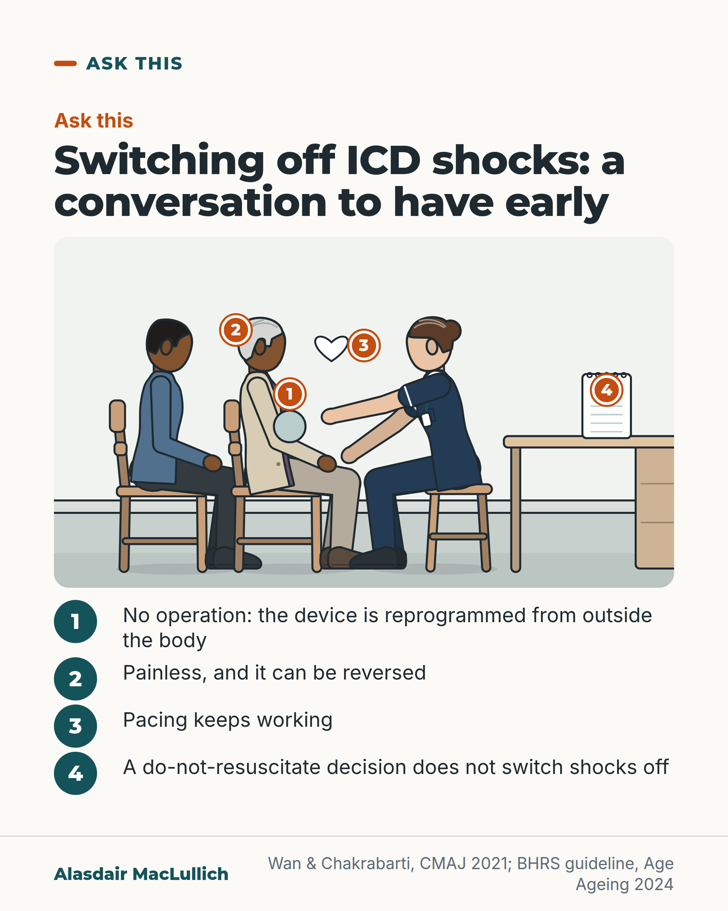

# G061: Switching off ICD shocks: ask early

- Category: C07 Treatment decisions and proportional care
- Audience: public
- Series: Ask this
- Post type: decision_support
- Visual format: annotated scene
- Status: text text_final, visual final
- Working id: C07-P01 (candidate C07-32)

## Insight

Near the end of life an ICD can keep giving shocks that no longer help. The shock function can be switched off painlessly, without an operation, and a do-not-resuscitate decision does not do this on its own.

## Angle and position

People with an ICD should know, well before the last days, that they can ask for a conversation about switching off the shocks; the Dutch and Swedish data show it often happens late or not at all.

Basis: mixed: empirical (Swedish and Dutch device and record studies; CMAJ practice summary; UK guidance 2024) and ethical judgement (that the conversation should happen early, marked as advice)

## X (935 characters)

```text
Near the end of life, an implanted defibrillator (ICD) can keep giving shocks. You can ask for the shocks to be switched off.

A Swedish hospital read the devices of 125 people after they died. 31 in 100 had been shocked in their last 24 hours. This was one hospital, so the figure may not apply to everyone with an ICD.

A do-not-resuscitate decision does not switch the shocks off. That needs a separate step by the heart rhythm team.

Switching off the shocks needs no operation. It is painless and can be reversed, and pacing (the part that stops the heart going too slowly) keeps working. It does not cause death by itself. It means a dangerous rhythm near the end of life will not be shocked.

UK heart rhythm guidance (2024) says people with an ICD should have the chance to talk about switching off the shocks as the end of life gets closer. You can raise it with your cardiology or device clinic team long before it is needed.
```

## LinkedIn (1864 characters)

```text
Near the end of life, an implanted defibrillator (ICD) can keep giving shocks. Studies keep finding that many people with an ICD, and their families, do not know the shocks can be switched off.

A Swedish hospital read the devices of 125 people after they had died. 31 in 100 had received a shock in their last 24 hours of life. This was one hospital, and its figure may not apply to everyone with an ICD.

A do-not-resuscitate decision does not switch the shocks off. That needs a separate conversation and a reprogramming of the device by the heart rhythm team. In the same Swedish study, about 2 in 3 people with a do-not-resuscitate order still had their shocks switched on the day before they died.

The conversation also tends to come late. A Dutch hospital recorded 1,606 people with an ICD who died between 2006 and 2022. The shocks had been switched off beforehand for 42 in 100. A third of those switch-offs happened on the last day of life.

The 42 in 100 is an average across 2006 to 2022. The share was 7 in 100 in 2006 and 59 in 100 in 2022. It has stopped rising since 2015.

What switching off the shocks involves:
1. No operation. The device is reprogrammed from outside the body.
2. It is painless and can be reversed.
3. Pacing, the part that stops the heart going too slowly, keeps working.
4. It does not cause death by itself. It means a dangerous rhythm near the end of life will not be shocked.

UK heart rhythm guidance (2024) says people with an ICD should have the chance to talk about this towards the end of life. Earlier UK guidance (2016) says it should usually be explained before the device is fitted.

We should offer this conversation early, while there is time to think it through. If you have an ICD, you can raise it yourself with the cardiology, heart failure or device clinic team. A GP can also help start the conversation.
```

## Bluesky (279 characters)

```text
With an implanted defibrillator (ICD), the shocks can be switched off near the end of life. No operation, painless, reversible. The part that stops the heart going too slowly keeps working.

A do-not-resuscitate decision does not do this by itself.

Ask your device clinic early.
```

## Threads (499 characters)

```text
Near the end of life, an implanted defibrillator (ICD) can keep giving shocks. In one Swedish hospital, 31 in 100 people whose devices were read after death had been shocked in their last 24 hours.

A do-not-resuscitate decision does not switch the shocks off. That needs a separate step by the heart rhythm team.

Switching them off needs no operation, is painless and can be reversed. The part that stops the heart going too slowly keeps working.

If you have an ICD, ask your device clinic early.
```

## Source reply

Sources: https://doi.org/10.1161/CIRCULATIONAHA.113.002648 https://doi.org/10.1093/ehjqcco/qcag038 https://doi.org/10.1503/cmaj.210327 https://doi.org/10.1093/ageing/afae246

## Visual



Alt text: Drawn clinic room: an older woman in a cardigan sits calmly beside her adult son while a cardiac physiologist, seated facing her, holds a small round programming wand near her chest, over her clothes. Numbered pins 1 to 4 mark the wand, her face, a heart outline and a paper on the desk. The four numbered points below say what switching off shocks involves.

Editable source: `visuals/src/G061.html`

Design instructions: Single 4:5 annotated scene, light ground. Kicker Ask this, h1.s headline, Kit scene 1000x520 (gp_room, woman brown skin silver hair cardigan on chair, son in denim, nurse-role physiologist on stool with wand circle, desk with notepad, heart outline), pins 1-4, numbered steps list below. No chart data; claims per post claims_used.

## Sources and verification

- C07-32-a (supported_with_qualification): If an ICD's shock function is left on, shocks in the last hours or days of life are common. In one study that read the devices after death, about 3 in 10 people had been shocked in their last 24 hours.
  - Source: Kinch Westerdahl A, Sjöblom J, Mattiasson AC, Rosenqvist M, Frykman V. Implantable cardioverter-defibrillator therapy before death: high risk for painful shocks at end of life. Circulation. 2014;129(4):422-9.; Thomas H, Dutton A, Johnson MJ, Herbert H, Wallace J, Foley P. The discontinuation of implantable cardioverter defibrillator shock therapies towards the end of life: consensus guideline from the British Heart Rhythm Society. Age Ageing. 2024;53(11):afae246.; Pitcher D, Soar J, Hogg K, Linker N, Chapman S, Beattie JM, et al. Cardiovascular implanted electronic devices in people towards the end of life, during cardiopulmonary resuscitation and after death: guidance from the Resuscitation Council (UK), British Cardiovascular Society and National Council for Palliative Care. Heart. 2016;102 Suppl 7:A1-17.; Goldstein NE, Lampert R, Bradley E, Lynn J, Krumholz HM. Management of implantable cardioverter defibrillators in end-of-life care. Ann Intern Med. 2004;141(11):835-8.
  - Passage: "Kinch Westerdahl 2014, Abstract: "We prospectively analyzed intracardiac electrograms in 125 explanted ICDs." ... "Ventricular tachyarrhythmia occurred in 35% of the patients in the last hour of their lives; 24% had an arrhythmic storm, and 31% received shock treatment during the last 24 hours." | BHRS 2024, Abstract: "If the ICD shock therapy is not discontinued, there is an increased risk that, as a person reaches the last days of life, the ICD may deliver multiple, painful shocks that are distressing." | Pitcher 2016, body text (Scite citation statement): "One important reason (but not the only reason) for considering deactivation of ICDs and CRT-D devices is to try to spare these people from receiving multiple shocks from their device as they are dying. Such shocks are relatively common during the last few hours or days of life 9." | Goldstein 2004, Abstract: "Family members reported that 8 patients received a shock from their ICD in the minutes before death."" (Kinch Westerdahl: Abstract, Methods and Results. BHRS: Abstract. Pitcher: section 'consideration of deactivation of devices during life'. Goldstein: Abstract, Results.)
- C07-32-b (supported_with_qualification): A do-not-resuscitate decision does not switch off an ICD's shocks; in practice many people with such a decision still have the shocks active near death.
  - Source: Kinch Westerdahl A, Sjöblom J, Mattiasson AC, Rosenqvist M, Frykman V. Implantable cardioverter-defibrillator therapy before death: high risk for painful shocks at end of life. Circulation. 2014;129(4):422-9.; Wan D, Chakrabarti S. Deactivation of implantable cardioverter-defibrillators. CMAJ. 2021;193(23):E852.; Nakazawa M, Suzuki T, Shiga T, Suzuki A, Hagiwara N. Deactivation of implantable cardioverter defibrillator in Japanese patients with end-stage heart failure. J Arrhythm. 2021;37(1):196-202.
  - Passage: "Kinch Westerdahl 2014, Abstract: "More than half of the patients (52%) had a do-not-resuscitate order, and 65% of them still had the ICD shock therapies activated 24 hours before death." ... "Devices remained active in more than half of the patients with a do-not-resuscitate order; almost one fourth of these patients received at least 1 shock in the last 24 hours of life." | Wan & Chakrabarti 2021, full text: "Deactivation is performed at the bedside by a qualified member of the pacemaker or arrhythmia team after discussion with the treating health care providers, and with the consent of the patient or designated decision maker." | Nakazawa 2020, Abstract: "Of 39 patients with DNAR orders, 27 (69%) did not undergo deactivation."" (Kinch Westerdahl: Abstract, Results and Conclusions. Nakazawa: Abstract, Results. CMAJ: section 'Deactivation of an implantable cardioverter-defibrillator is painless, noninvasive and reversible'.)
- C07-32-c (supported_with_qualification): Conversations about switching off the shocks often happen late (in the last days) or not at all.
  - Source: Al Jaff AAM, Egorova AD, Yilmaz D, Schalij MJ, van Erven L. Shifting paradigms in ICD tachytherapy deactivation in the final phase of life: eighteen years of perspective. Eur Heart J Qual Care Clin Outcomes. 2026;12(5):706-14.; Goldstein NE, Lampert R, Bradley E, Lynn J, Krumholz HM. Management of implantable cardioverter defibrillators in end-of-life care. Ann Intern Med. 2004;141(11):835-8.; van Lier R, Stuyck N, Poels P, Vandenberk B, Willems R. Attitudes of patients, relatives and professionals regarding deactivation of implantable cardioverter-defibrillators: a scoping review. Acta Cardiol. 2026;81(2):211-33.; Höijer CJ, Johnson MJ. Deactivation of implantable defibrillators at the end of life - a register-based study of ICD-deactivation at home and the impact of palliative care. Int J Cardiol. 2023;386:91-4.
  - Passage: "Al Jaff 2026, Abstract: "Records of 1606 ICD or cardiac resynchronization therapy-defibrillator (CRT-D) patients (79% male; mean age 67 ± 10 years at implantation, 73 ± 10 at death) who died between 2006 and 2022 were reviewed." ... "Anticipatory tachytherapy deactivation occurred in 42% of patients. Deactivation rates increased 5.2% annually from 2006 to 2014 (P < 0.001), but plateaued from 2015 to 2022 (P = 0.403). Among deactivations, 33% occurred on the final day of life, mainly during hospitalization." Full text, Results: "Of the 671 patients with anticipatory tachytherapy deactivation, 176 (26%) were deactivated more than one month before death, primarily at an outpatient clinic (= 74, 11%). In 274 patients (41%), deactivation occurred within the last month of life" ... "In the year 2006, the deactivation rates were 7%, while in 2022, this was 59%." | Goldstein 2004, Abstract: "Next of kin reported that clinicians discussed deactivating the ICD in only 27 of the 100 cases. Most discussions occurred in the last few days of life." | van Lier 2026, Abstract: "While guidelines recommend initiating discussions on ICD deactivation early, in practice these conversations often take place too late or not at all." | Höijer 2023, Abstract: "86/164 (52%) ICDs were deactivated prior to death in people dying outside of hospital; higher in those accessing SPC (36/46, (78%) SPC access versus 151/360, (42%) no SPC access; p < 0.05)."" (Al Jaff: Abstract; Results (Timing and location; Temporal changes). Goldstein: Abstract. van Lier: Abstract, Background.)
- C07-32-d (supported): Many people with an ICD and their relatives do not know the shocks can be switched off.
  - Source: van Lier R, Stuyck N, Poels P, Vandenberk B, Willems R. Attitudes of patients, relatives and professionals regarding deactivation of implantable cardioverter-defibrillators: a scoping review. Acta Cardiol. 2026;81(2):211-33.; McEvedy SM, Cameron J, Lugg E, Miller J, Haedtke C, Hammash M, et al. Implantable cardioverter defibrillator knowledge and end-of-life device deactivation: a cross-sectional survey. Palliat Med. 2018;32(1):156-63.
  - Passage: "van Lier 2026, Abstract: "Findings revealed significant knowledge gaps. Many patients and relatives were unaware that ICD deactivation was an option." | McEvedy 2018, Abstract: "Implantable cardioverter defibrillator recipients, especially those who are older or have mild cognitive impairment, often have limited knowledge about implantable cardioverter defibrillator deactivation."" (van Lier: Abstract, Results. McEvedy: Abstract, Conclusion.)
- C07-32-e (supported): Switching off the shocks needs no operation, is painless and reversible, leaves pacing working, and does not in itself cause death.
  - Source: Wan D, Chakrabarti S. Deactivation of implantable cardioverter-defibrillators. CMAJ. 2021;193(23):E852.; McEvedy SM, Cameron J, Lugg E, Miller J, Haedtke C, Hammash M, et al. Implantable cardioverter defibrillator knowledge and end-of-life device deactivation: a cross-sectional survey. Palliat Med. 2018;32(1):156-63.
  - Passage: "Wan & Chakrabarti 2021, full text: "Deactivation of an implantable cardioverter-defibrillator is painless, noninvasive and reversible" ... "Deactivation does not interfere with ongoing pacing function or cause immediate death, does not immediately affect symptoms, and can be reversed if goals of care change." | McEvedy 2018, Introduction (Scite full-text excerpt): "Deactivation of an ICD does not lead to immediate death but does prevent the delivery of defibrillation shocks which have the potential to resuscitate the patient if they experience a fatal heart rhythm at end of life.5,6 Planned deactivation of an ICD is a simple, non-invasive procedure that can be carried out by a technician.7 In an emergency situation, placing a strong magnet on the skin will suspend shock delivery without interfering with the device’s ability to function as a pacemaker.7"" (CMAJ: headings and paragraph 3 to 4. McEvedy: Introduction (background citing UK 2016 guidance).)
- C07-32-f (supported): UK guidance says people with an ICD should have the chance to discuss switching off the shocks, and the possibility should usually be explained before the device is fitted.
  - Source: Thomas H, Dutton A, Johnson MJ, Herbert H, Wallace J, Foley P. The discontinuation of implantable cardioverter defibrillator shock therapies towards the end of life: consensus guideline from the British Heart Rhythm Society. Age Ageing. 2024;53(11):afae246.; Pitcher D, Soar J, Hogg K, Linker N, Chapman S, Beattie JM, et al. Cardiovascular implanted electronic devices in people towards the end of life, during cardiopulmonary resuscitation and after death: guidance from the Resuscitation Council (UK), British Cardiovascular Society and National Council for Palliative Care. Heart. 2016;102 Suppl 7:A1-17.
  - Passage: "BHRS 2024, Abstract: "Therefore, to ensure the person receives high-quality end-of-life care, they should have the opportunity to consider and discuss the option to deactivate the shock function of their ICD." ... "There is also a risk that the device may delay the person's natural death, which the person would not have chosen if they had been given the opportunity to discuss discontinuation." | Pitcher 2016, body text (Scite citation statement): "The possibility of a later need to deactivate an ICD and the reasons for doing so should usually be explained as part of informed consent prior to implantation in anyone considering an ICD or CRT-D device 29 30."" (BHRS: Abstract. Pitcher: section 'legal and ethical considerations regarding device deactivation'.)
- C07-32-g (supported_with_qualification): The people to ask are the team who look after the device (cardiology, heart failure or device/pacemaker clinic).
  - Source: Wan D, Chakrabarti S. Deactivation of implantable cardioverter-defibrillators. CMAJ. 2021;193(23):E852.; Thomas H, Dutton A, Johnson MJ, Herbert H, Wallace J, Foley P. The discontinuation of implantable cardioverter defibrillator shock therapies towards the end of life: consensus guideline from the British Heart Rhythm Society. Age Ageing. 2024;53(11):afae246.
  - Passage: "Wan & Chakrabarti 2021, full text: "Deactivation is performed at the bedside by a qualified member of the pacemaker or arrhythmia team after discussion with the treating health care providers, and with the consent of the patient or designated decision maker." | BHRS 2024, Abstract: "Frequently, they will be cared for by non-cardiac teams who may be less familiar with ICDs."" (CMAJ: paragraph under 'painless, noninvasive and reversible'. BHRS: Abstract.)

Verification notes: 31 in 100: Kinch Westerdahl 2014 (abstract/full text per batch), population stated with figure and a single-hospital caveat (the abstract gives no device indication data, so no secondary-prevention statement is made for the Swedish cohort). 2 in 3 with DNR still active: same study. 42 in 100 and one third on last day: Al Jaff 2026, single Dutch centre, average over 2006 to 2022. Mechanism: CMAJ 2021 practice summary (Canadian). UK guidance: BHRS 2024 (Age Ageing) and 2016 UK guidance. 'Early' and 'should offer' marked as judgement. Awareness: Studies keep finding that many people do not know (C07-32-d; scoping review, no percentage given). Dutch rate rose from 7 to 59 in 100 over 2006 to 2022 (Al Jaff 2026) is stated beside the 42 in 100 average.

## Attention and follow potential

Pause: Many people assume a DNR decision covers the defibrillator; it does not.

Gain: A specific question to raise early, and the facts that make it less frightening (painless, reversible, pacing continues).

Follow: Practical, careful information about decisions near the end of life that people are rarely told in advance.

## Open issues

None.
