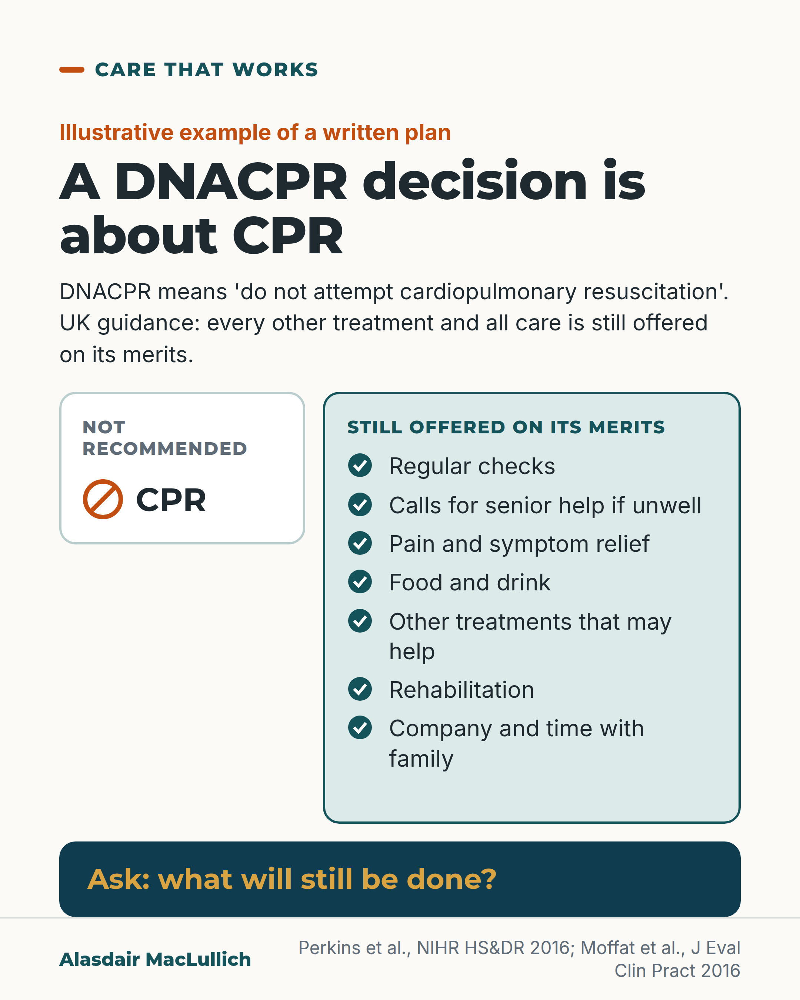

# G062: A DNACPR decision is about CPR

- Category: C07 Treatment decisions and proportional care
- Audience: both
- Series: Care that works
- Post type: good_care
- Visual format: comparison
- Status: text text_final, visual final
- Working id: C07-P02 (candidate C07-27)

## Insight

In UK guidance a DNACPR decision covers CPR only, yet it is often read as 'do less'. Writing the CPR decision inside a whole treatment plan that lists what continues is linked with fewer harms.

## Angle and position

Every treatment limit should be written alongside the care that continues; families can ask 'what will still be done?'

Basis: mixed: empirical (NIHR synthesis; UK nurse scenario RCT; one-hospital before-and-after; ReSPECT implementation data) and ethical judgement (that every limit should be written with the care that continues)

## X (879 characters)

```text
A DNACPR decision is about CPR only. DNACPR means 'do not attempt cardiopulmonary resuscitation': a decision not to try to restart the heart if it stops.

In UK guidance, every other treatment and all care should still be offered on its merits. A national review of NHS practice found the decision was often treated as if it meant 'do not provide active treatment'.

In a UK scenario study, 231 nurses were given the same written case of a patient who was getting worse. They were randomly given a DNACPR form, a form that made the CPR decision part of a wider treatment plan, or no form. With the DNACPR form, they planned fewer checks, calls for help and treatments. With the wider plan, they planned the same care as with no form. This tested what nurses said they would do, not real care.

If someone you care for has a DNACPR decision, ask the team: what will still be done?
```

## LinkedIn (1878 characters)

```text
A DNACPR decision is about CPR only. DNACPR means 'do not attempt cardiopulmonary resuscitation': a decision not to try to restart the heart if it stops.

In UK guidance, every other treatment and all care should still be offered on its merits.

That is not always how it is read. A national review of NHS practice found that DNACPR decisions were often treated as if they meant 'do not provide active treatment'. Staff in some studies expected fewer checks, fewer calls for senior help, and changes to pain relief and fluids.

A UK study tested this. 231 nurses were each given the same written case of a patient who was getting worse. They were randomly given a DNACPR form, a form that made the CPR decision part of a wider treatment plan, or no form. The DNACPR group planned fewer checks, fewer calls for help and fewer treatments. The wider-plan group planned the same care as the no-form group. The study measured what nurses said they would do, not real care.

Writing the decision inside a whole plan has also been tried in practice. In one English hospital, a one-page plan replaced the stand-alone DNACPR form. After that, there were fewer harmful events in patients not for CPR. This was a before-and-after study in one hospital. The people who developed the plan ran it. It shows the two went together, not that the plan caused the change.

The ReSPECT form (Recommended Summary Plan for Emergency Care and Treatment) is used across much of the UK. It records the CPR recommendation as one part of a wider emergency care plan. In English hospitals, about 8 in 10 forms also recorded another treatment recommendation. Most still focused on CPR.

We should write every CPR decision together with a list of what continues. A decision about one treatment says nothing about a person's worth.

If someone you care for has a DNACPR decision, ask: what will still be done?
```

## Bluesky (296 characters)

```text
A DNACPR decision covers CPR only: no attempt to restart a stopped heart. UK guidance says all other care should still be offered.

In a UK study, nurses planning care for a written case planned fewer checks and treatments with a DNACPR form.

If a loved one has one, ask what will still be done.
```

## Threads (489 characters)

```text
A DNACPR decision is about CPR only: not trying to restart the heart if it stops. UK guidance says every other treatment and all care should still be offered on its merits.

In a UK study, 231 nurses planned care for the same written case. Those given a DNACPR form planned fewer checks, calls for help and treatments. Those whose form put the CPR decision in a wider plan planned the same care as with no form.

If someone you care for has a DNACPR decision, ask: what will still be done?
```

## Source reply

Sources: https://doi.org/10.3310/hsdr04110 https://doi.org/10.1111/jep.12559 https://doi.org/10.1371/journal.pone.0070977 https://doi.org/10.1016/j.resuscitation.2022.06.020

## Visual



Alt text: Two-column card. A narrow left column headed Not recommended shows a crossed circle beside CPR. A wider right column headed Still offered on its merits lists seven items with tick icons: regular checks, calls for senior help if unwell, pain and symptom relief, food and drink, other treatments, rehabilitation, company. Banner: Ask what will still be done.

Editable source: `visuals/src/G062.html`

Design instructions: Single 4:5 comparison, light ground. Left narrow white column with pale border and crossed-circle icon; right wide mint column with seven tick-circle items; deep teal band with gold question. Illustrative list, labelled in kicker. No data.

## Sources and verification

- C07-27-a (supported_with_qualification): UK guidance is clear that a DNACPR decision applies only to CPR, not to other treatment or care.
  - Source: Perkins GD, Griffiths F, Slowther AM, et al. Do-not-attempt-cardiopulmonary-resuscitation decisions: an evidence synthesis. Health Serv Deliv Res. 2016;4(11):1-154.
  - Passage: "Perkins 2016, body text (Scite citation statement), section 'treatment and care': "An English study 40 found that doctors believed that a DNACPR order referred to reduced care (e.g. reduced out-of-hours medical escalation, contacting the outreach team, frequency of nursing observations, reduced pain relief and altered fluid intake), despite clear guidelines that DNACPR orders applied only to CPR."" (NIHR evidence synthesis, Results of literature review, 'Treatment and care'.)
- C07-27-b (supported): In practice, DNACPR decisions are often read as a signal to do less of everything else.
  - Source: Perkins GD, Griffiths F, Slowther AM, et al. Do-not-attempt-cardiopulmonary-resuscitation decisions: an evidence synthesis. Health Serv Deliv Res. 2016;4(11):1-154.; Fritz Z, Fuld JP. Development of the Universal Form Of Treatment Options (UFTO) as an alternative to Do Not Attempt Cardiopulmonary Resuscitation (DNACPR) orders: a cross-disciplinary approach. J Eval Clin Pract. 2015;21(1):109-17.
  - Passage: "Perkins 2016, Abstract: "A key theme across all focus groups, and reinforced by the literature review, was the negative impact on overall patient care of having a DNACPR decision and the conflation of ‘do not resuscitate’ with ‘do not provide active treatment’." | Body text: "Other examples of the misinterpretation of care for patients with DNACPR orders included where some doctors and nurses believed that nursing observations would be reduced 63,97 or remain unchanged, 100 that contact with outreach teams and other medical staff and out-of-hours medical escalation would be less frequent" ... "It was also suggested that pain relief and amounts of fluids would be altered 97 and one Finnish study 63 noted that basic care was reduced for patients with a DNACPR order." | Fritz & Fuld 2015, Abstract: "Problems exist with Do Not Attempt Cardiopulmonary Resuscitation (DNACPR) orders: they are often misinterpreted by clinicians to mean that other treatments should be withheld"" (Perkins: Abstract (Results) and body section 'treatment and care'. Fritz & Fuld: Abstract, Rationale.)
- C07-27-d (supported_with_qualification): In a UK scenario study, nurses given a DNACPR form planned less monitoring and escalation for a deteriorating patient; a form that placed the CPR decision inside a wider treatment plan removed the difference; comfort care was unchanged.
  - Source: Moffat S, Skinner J, Fritz Z. Does resuscitation status affect decision making in a deteriorating patient? Results from a randomised vignette study. J Eval Clin Pract. 2016;22(6):917-23.
  - Passage: "Moffat 2016, Abstract: "An online survey with a developing case scenario across three timeframes was used on 231 nurses from 10 National Health Service Trusts. Nurses were randomised into three groups: DNACPR, the UFTO and no-form." ... "Nurses in the DNACPR group agreed or strongly agreed to initiate fewer intense nursing interventions than the UFTO and no-form groups (P < 0.001) overall and across subcategories of Increase Monitoring, Escalate Concern and Initiate Treatments (all P < 0.001). There was no difference between the UFTO and no-form groups overall (P = 0.795) or in the subcategories. No difference in Comfort Measures were observed (P = 0.201) between the three groups."" (Abstract, Methods and Results.)
- C07-27-e (supported_with_qualification): Writing the CPR decision within a whole treatment plan was followed by fewer harms in one English hospital.
  - Source: Fritz Z, Malyon A, Frankau JM, Parker RA, Cohn S, Laroche CM, et al. The Universal Form of Treatment Options (UFTO) as an alternative to Do Not Attempt Cardiopulmonary Resuscitation (DNACPR) orders: a mixed methods evaluation of the effects on clinical practice and patient care. PLoS One. 2013;8(9):e70977.; Perkins GD, Griffiths F, Slowther AM, et al. Do-not-attempt-cardiopulmonary-resuscitation decisions: an evidence synthesis. Health Serv Deliv Res. 2016;4(11):1-154.
  - Passage: "Fritz 2013, Abstract: "A mixed-methods before-and-after study with contemporaneous case controls was conducted in an acute hospital." ... "Rate difference per 1000 patient-days was 12.9 (95% CI: 2.6-23.2, p-value=0.01). There was a difference in the proportion of harms contributing to patient death in the two periods (23/71 in the DNACPR period to 4/44 in the UFTO period (95% CI 7.8-36.1, p-value=0.006). Significant differences were maintained after adjustment for known confounders. No significant change was seen on contemporaneous case control wards." | Perkins 2016, Abstract: "Linking DNACPR to overall treatment plans improved clarity about goals of care, aided communication and reduced harms."" (Fritz: Abstract. Perkins: Abstract, Results.)
- C07-27-f (supported): ReSPECT records the CPR recommendation within a broader emergency care and treatment plan, and most forms include other treatment recommendations.
  - Source: Hawkes CA, Fritz Z, Deas G, Ahmedzai SH, Richardson A, Pitcher D, et al. Development of the Recommended Summary Plan for Emergency Care and Treatment (ReSPECT). Resuscitation. 2020;148:98-107.; Hawkes CA, Griffin J, Eli K, Griffiths F, Slowther AM, Fritz Z, et al. Implementation of ReSPECT in acute hospitals: a retrospective observational study. Resuscitation. 2022;178:26-35.; Slowther AM, Harlock J, Bernstein CJ, Bruce K, Eli K, Huxley CJ, et al. Using the Recommended Summary Plan for Emergency Care and Treatment in Primary Care: a mixed methods study. Health Soc Care Deliv Res. 2024;12(42):1-155.
  - Passage: "Hawkes 2020, Abstract: "ReSPECT is a process which encourages shared understanding of a patient's condition and what outcomes they value and fear, before recording clinical recommendations about cardiopulmonary-resuscitation (CPR) within a broader plan for emergency care and treatment." | Hawkes 2022, Abstract: "Most (653/706 (92%)) included a 'not for attempted resuscitation' recommendation 551/706 (78%) had at least one other treatment recommendation." ... "Whilst recommendations include other emergencies most still tend to focus on recommendations relating to CPR." | Slowther 2024, Abstract: "The ReSPECT form evaluation showed 87% (122/141) recorded free-text treatment recommendations other than cardiopulmonary resuscitation."" (Abstracts.)

Verification notes: UK guidance limit to CPR rests on the NIHR 2016 synthesis's description (BMA/RCUK/RCN text not opened); cited NIHR. Conflation: NIHR synthesis, no rate given. Nurse RCT: Moffat 2016, scenario intentions. One-hospital UFTO: Fritz 2013 before-and-after, association. ReSPECT 8 in 10: early implementation data. Beach & Morrison not used. Judgement sentences marked with 'We should'.

## Attention and follow potential

Pause: Families often fear a DNACPR form means care will be withdrawn; staff may read it that way too.

Gain: A single question that makes the rest of the plan explicit, and evidence that whole-plan forms change intentions.

Follow: Careful, humane explanations of end-of-life paperwork that people meet without warning.

## Open issues

None.
