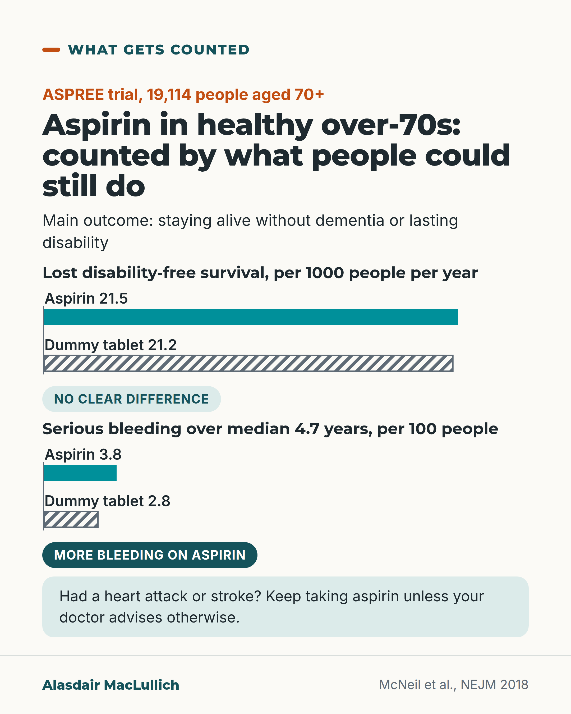

# G063: ASPREE counted years without disability

- Category: C07 Treatment decisions and proportional care
- Audience: both
- Series: What gets counted
- Post type: evidence_interpretation
- Visual format: chart
- Status: text text_final, visual final
- Working id: C07-P03 (candidate C07-05)

## Insight

ASPREE made staying alive without dementia or lasting disability its main outcome. Daily aspirin in healthy over-70s did not improve it and increased serious bleeding.

## Angle and position

Prevention trials in older people should count disability-free survival alongside disease events; ASPREE shows what that reveals. Carry the secondary prevention caveat prominently.

Basis: mixed: empirical (ASPREE results and extended follow-up; ATT secondary prevention meta-analysis) and ethical judgement (that trials should count this outcome)

## X (881 characters)

```text
Staying alive without dementia or lasting disability was the main outcome in a trial of daily aspirin. The trial, ASPREE, gave aspirin or a dummy tablet to 19,114 healthy people aged 70 and over in Australia and the USA.

Lasting disability meant being unable, or finding it very hard, to wash, dress, use the toilet or walk for at least 6 months.

Aspirin did not improve that outcome. Each year, about 21 in every 1000 people in each group died, developed dementia or developed lasting disability. Following people for almost 10 years in total showed the same.

Serious bleeding was more common on aspirin. Over the 5 years or so of the trial, it happened to about 4 in 100 people on aspirin and 3 in 100 on dummy tablets.

This trial was about people who had never had a heart attack or stroke. If you take aspirin after one, keep taking it unless your doctor advises otherwise.
```

## LinkedIn (1711 characters)

```text
Staying alive without dementia or lasting disability was the main outcome in a trial of daily aspirin. The trial, ASPREE, gave aspirin or a dummy tablet to 19,114 healthy people aged 70 and over in Australia and the USA. The age limit was 65 for US Black and Hispanic participants.

Lasting disability had a concrete meaning: being unable, or finding it very hard, to do a basic daily task for at least 6 months. Examples are washing, dressing, using the toilet and walking.

The results:
1. Aspirin did not improve the main outcome. Each year, about 21 in every 1000 people in each group died, developed dementia or developed lasting disability. Following people for almost 10 years in total, including after the trial ended, showed the same.
2. Heart attacks, strokes and hospital stays for heart failure were not clearly reduced.
3. Serious bleeding was more common on aspirin. Over about 5 years it happened to about 4 in 100 people on aspirin and about 3 in 100 on the dummy tablet.

The trial stopped early because continuing was unlikely to show a benefit. In the final year, only about 6 in 10 people in each group were still taking their tablets, which would make any effect harder to see.

Trials of preventive treatment in older people should report whether people stay able to wash, dress and walk, as well as counting heart attacks and strokes. That tells an older person something a list of heart events alone does not.

One caution applies to every retelling. ASPREE was about people who had never had a heart attack or stroke. For people who have, trials show aspirin prevents further ones. If you take aspirin after a heart attack or stroke, keep taking it unless your doctor advises otherwise.
```

## Bluesky (299 characters)

```text
ASPREE gave daily aspirin or a dummy tablet to 19,114 healthy over-70s and counted staying alive without dementia or lasting disability. Aspirin did not improve that result, and serious bleeding was more common.

After a heart attack or stroke, keep taking aspirin unless your doctor says otherwise.
```

## Threads (487 characters)

```text
A trial of daily aspirin (ASPREE) in 19,114 healthy people aged 70+ counted staying alive without dementia or lasting disability.

Aspirin did not improve it. About 21 in 1000 people a year in each group died, or developed dementia or lasting disability. Serious bleeding was more common on aspirin: about 4 in 100 against 3 in 100 over about 5 years.

This applies to people who had never had a heart attack or stroke. If you have, keep taking aspirin unless your doctor says otherwise.
```

## Source reply

Sources: https://doi.org/10.1056/NEJMoa1800722 https://doi.org/10.1056/NEJMoa1805819 https://doi.org/10.1016/j.lanhl.2025.100764 https://doi.org/10.1016/S0140-6736(09)60503-1

## Visual



Alt text: Two bar pairs from the ASPREE trial. Lost disability-free survival per 1000 people a year: aspirin 21.5, dummy tablet 21.2, no clear difference. Serious bleeding over a median 4.7 years per 100 people: aspirin 3.8, dummy tablet 2.8, more bleeding on aspirin. Note: keep taking aspirin after a heart attack or stroke unless your doctor advises otherwise.

Editable source: `visuals/src/G063.html`

Design instructions: Single 4:5 chart card. pairBars (c07_common.js) two groups, separate scales (max 25 each), aspirin solid teal, dummy tablet hatched grey. Badges for verdicts; mint panel with advice. Data: C07-05-b (21.5 vs 21.2 per 1000 person-years), C07-05-c (3.8% vs 2.8%).

## Sources and verification

- C07-05-a (supported): ASPREE randomised 19,114 healthy community-dwelling people aged 70 and over (65 and over for US Black and Hispanic participants), without cardiovascular disease, dementia or physical disability, to aspirin 100 mg daily or placebo; its main outcome was disability-free survival (staying alive without dementia or persistent physical disability).
  - Source: McNeil JJ, Woods RL, Nelson MR, Reid CM, Kirpach B, Wolfe R, et al; ASPREE Investigator Group. Effect of aspirin on disability-free survival in the healthy elderly. N Engl J Med. 2018;379(16):1499-1508.
  - Passage: "Abstract: "From 2010 through 2014, we enrolled community-dwelling persons in Australia and the United States who were 70 years of age or older (or ≥65 years of age among blacks and Hispanics in the United States) and did not have cardiovascular disease, dementia, or physical disability. Participants were randomly assigned to receive 100 mg per day of enteric-coated aspirin or placebo orally. The primary end point was a composite of death, dementia, or persistent physical disability." ... "A total of 19,114 persons with a median age of 74 years were enrolled, of whom 9525 were randomly assigned to receive aspirin and 9589 to receive placebo." Full text (Methods): "The primary end point was disability-free survival, which was defined as survival free from dementia or persistent physical disability." ... "persistent physical disability was considered to have occurred when a participant reported having an inability to perform or severe difficulty in performing at least one of the six basic activities of daily living that had persisted for at least 6 months." ... "the six basic activities of daily living (bathing, dressing, toileting, transferring, walking, and feeding)"" (Abstract (Methods, Results); full text Methods (Scite excerpts))
- C07-05-b (supported): Aspirin did not prolong disability-free survival: over a median 4.7 years the rates were almost identical, and extended follow-up to almost a decade showed no long-term effect.
  - Source: McNeil JJ, Woods RL, Nelson MR, Reid CM, Kirpach B, Wolfe R, et al; ASPREE Investigator Group. Effect of aspirin on disability-free survival in the healthy elderly. N Engl J Med. 2018;379(16):1499-1508.; Shah RC, Ryan J, Webb KL, Wolfe R, Chan A, Chong TT, et al. Aspirin and healthy lifespan in older people: main outcome of the ASPREE-XT observational study. Lancet Healthy Longev. 2025;6(9):100764.
  - Passage: "PMID 30221596 abstract: "The trial was terminated at a median of 4.7 years of follow-up after a determination was made that there would be no benefit with continued aspirin use with regard to the primary end point. The rate of the composite of death, dementia, or persistent physical disability was 21.5 events per 1000 person-years in the aspirin group and 21.2 per 1000 person-years in the placebo group (hazard ratio, 1.01; 95% confidence interval [CI], 0.92 to 1.11; P=0.79)." ... "Aspirin use in healthy elderly persons did not prolong disability-free survival over a period of 5 years but led to a higher rate of major hemorrhage than placebo." PMID 41043446 abstract: "Similarly, over the period of both ASPREE and ASPREE-XT, no long-term effect of aspirin versus placebo was observed on the composite outcome of death, dementia, or persistent physical disability over almost a decade of follow-up (HR 1·01; 95% CI 0·95-1·08; p=0·65)"" (Abstracts (Results, Conclusions))
- C07-05-c (supported): Major haemorrhage was more common with aspirin (3.8% vs 2.8%), and aspirin did not significantly reduce cardiovascular disease.
  - Source: McNeil JJ, Woods RL, Nelson MR, Reid CM, Kirpach B, Wolfe R, et al; ASPREE Investigator Group. Effect of aspirin on disability-free survival in the healthy elderly. N Engl J Med. 2018;379(16):1499-1508.; McNeil JJ, Wolfe R, Woods RL, Tonkin AM, Donnan GA, Nelson MR, et al; ASPREE Investigator Group. Effect of aspirin on cardiovascular events and bleeding in the healthy elderly. N Engl J Med. 2018;379(16):1509-1518.; Shah RC, Ryan J, Webb KL, Wolfe R, Chan A, Chong TT, et al. Aspirin and healthy lifespan in older people: main outcome of the ASPREE-XT observational study. Lancet Healthy Longev. 2025;6(9):100764.
  - Passage: "PMID 30221596 abstract: "The rate of major hemorrhage was higher in the aspirin group than in the placebo group (3.8% vs. 2.8%; hazard ratio, 1.38; 95% CI, 1.18 to 1.62; P<0.001)." PMID 30221597 abstract: "After a median of 4.7 years of follow-up, the rate of cardiovascular disease was 10.7 events per 1000 person-years in the aspirin group and 11.3 events per 1000 person-years in the placebo group (hazard ratio, 0.95; 95% confidence interval [CI], 0.83 to 1.08). The rate of major hemorrhage was 8.6 events per 1000 person-years and 6.2 events per 1000 person-years, respectively (hazard ratio, 1.38; 95% CI, 1.18 to 1.62; P<0.001)." PMID 41043446 abstract: "aspirin was associated with an increased hazard for incident major haemorrhagic events across both ASPREE and ASPREE-XT (1·24; 1·10-1·39)."" (Abstracts (Results))
- C07-05-e (supported_with_qualification): ASPREE's result applies to people without cardiovascular disease; in people who have already had a heart attack or stroke, aspirin reduces further serious vascular events, so they should not stop aspirin without medical advice.
  - Source: McNeil JJ, Woods RL, Nelson MR, Reid CM, Kirpach B, Wolfe R, et al; ASPREE Investigator Group. Effect of aspirin on disability-free survival in the healthy elderly. N Engl J Med. 2018;379(16):1499-1508.; Antithrombotic Trialists' (ATT) Collaboration; Baigent C, Blackwell L, Collins R, Emberson J, Godwin J, Peto R, et al. Aspirin in the primary and secondary prevention of vascular disease: collaborative meta-analysis of individual participant data from randomised trials. Lancet. 2009;373(9678):1849-60.
  - Passage: "PMID 30221596 abstract: "...and did not have cardiovascular disease, dementia, or physical disability." PMID 19482214 abstract: "Low-dose aspirin is of definite and substantial net benefit for many people who already have occlusive vascular disease." ... "In the secondary prevention trials, aspirin allocation yielded a greater absolute reduction in serious vascular events (6.7%vs 8.2% per year, p<0.0001), with a non-significant increase in haemorrhagic stroke but reductions of about a fifth in total stroke (2.08%vs 2.54% per year, p=0.002) and in coronary events (4.3%vs 5.3% per year, p<0.0001)."" (Abstracts (Methods; Background and Findings))

Verification notes: ASPREE design and outcome definition: McNeil 2018 abstract and full-text excerpts. 21.5 vs 21.2 per 1000 person-years and ASPREE-XT near-decade result: C07-05-b. Bleeding 3.8% vs 2.8% cumulative over median 4.7 y; CVD 'not clearly reduced': C07-05-c. Adherence and early stop: qualifications of C07-05-b. Secondary prevention: ATT 2009 (C07-05-e), advice line is derived, kept prominent on visual. Mortality not used. STAREE left to C07-P07.

## Attention and follow potential

Pause: The outcome is defined by washing, dressing and walking, which readers recognise at once.

Gain: A clear result on aspirin for healthy older people, and a way of judging any prevention trial by what it counts.

Follow: Readings of big trials that look at outcomes older people would choose.

## Open issues

None.
