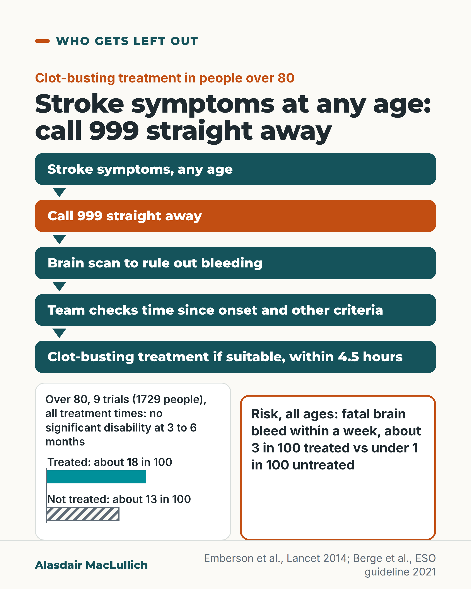

# G064: No upper age for the 999 call

- Category: C07 Treatment decisions and proportional care
- Audience: both
- Series: Who gets left out
- Post type: public_explanation
- Visual format: diagram
- Status: text text_final, visual final
- Working id: C07-P04 (candidate C07-30)

## Insight

Clot-busting stroke treatment was tested in many people over 80 and helped them, with a real bleeding risk; eligibility depends on time and a brain scan, not age. Call 999 at once at any age.

## Angle and position

Age alone should never be the reason an older person is not assessed for emergency stroke treatment; state the bleeding risk as plainly as the benefit.

Basis: mixed: empirical (IST-3 enrolment; 9-trial individual patient meta-analysis; ESO guideline) and clinical interpretation (the 999 instruction follows from time dependence) with ethical judgement on age

## X (817 characters)

```text
Stroke symptoms at 85 need the same immediate 999 call as stroke symptoms at 55.

The IST-3 authors reported that earlier trials of the clot-busting drug alteplase had included only 79 people over 80. IST-3 then enrolled 3035 people, and 1617 of them (53 in 100) were over 80.

When the results of 9 trials were pooled, 1729 people were over 80. About 18 in 100 given the drug were left with little or no disability 3 to 6 months later, against 13 in 100 without it.

The risk is real. Across all ages, about 3 in 100 treated people had a fatal brain bleed within a week, against fewer than 1 in 100 untreated.

Treatment depends on how long ago the stroke started, on a brain scan and on other checks, not on age alone. The sooner it is given, the more it helps. So call 999 straight away, whatever the person's age.
```

## LinkedIn (1634 characters)

```text
Stroke symptoms at 85 need the same immediate 999 call as stroke symptoms at 55.

For years, older people were largely missing from the evidence. The IST-3 authors reported that earlier trials of the clot-busting drug alteplase had included only 79 people over 80. The drug was first licensed in Europe only for people under 80.

IST-3 changed that. It enrolled 3035 people, and 1617 of them (53 in 100) were over 80. About half received the drug and half did not.

The clearest answer for older people comes from a combined analysis of 9 trials. It included 1729 people over 80. About 18 in 100 of those given the drug were left with little or no disability 3 to 6 months later. About 13 in 100 of those not given it were. Treated people over 80 gained about as much, in proportion, as younger people. On its own, IST-3 did not show a clear difference in its main result.

The drug also has a real risk. Across all ages, about 3 in 100 people given the drug had a fatal brain bleed within a week. Fewer than 1 in 100 without it did.

The sooner treatment starts, the more it helps. At all ages, when treatment started within 3 hours, 33 in 100 were left with little or no disability, against 23 in 100 untreated. Whether treatment is possible depends on how long ago the stroke started, on a brain scan to rule out bleeding, and on other criteria.

European stroke guidelines strongly recommend this treatment for people over 80 whose stroke started less than 4.5 hours ago. The whole guideline group agreed that age alone should not be a reason to withhold it.

Call 999 straight away for stroke symptoms, whatever the person's age.
```

## Bluesky (296 characters)

```text
Pooled trials, people over 80 with stroke: 18 in 100 given clot-busting treatment had little or no disability at 3 to 6 months, against 13 in 100 untreated. Fatal brain bleeds, all ages: 3 in 100 treated, under 1 in 100 not.

Call 999 at once at any age. Timing and a brain scan decide treatment.
```

## Threads (490 characters)

```text
Stroke symptoms at 85 need the same immediate 999 call as at 55.

In 9 pooled trials, 1729 people were over 80. About 18 in 100 given clot-busting treatment were left with little or no disability 3 to 6 months later, against 13 in 100 without it. Across all ages, about 3 in 100 treated people had a fatal brain bleed within a week, against fewer than 1 in 100 untreated.

Whether treatment is possible depends on time since onset and a brain scan. Call 999 straight away, whatever the age.
```

## Source reply

Sources: https://doi.org/10.1016/S0140-6736(14)60584-5 https://doi.org/10.1016/S0140-6736(12)60768-5 https://doi.org/10.1177/2396987321989865

## Visual



Alt text: Flow of five boxes: stroke symptoms at any age, call 999 straight away, brain scan to rule out bleeding, team checks time since onset and other criteria, clot-busting treatment if suitable within 4.5 hours. Below, two equal boxes: over 80, about 18 in 100 treated vs about 13 in 100 not treated had no significant disability; and the bleeding risk, about 3 in 100 vs under 1 in 100.

Editable source: `visuals/src/G064.html`

Design instructions: Single 4:5 diagram. Vertical flow of five teal boxes (step 2 orange) with arrows; two equal panels beneath, benefit bars (solid vs hatched, axis 0 to 30) and outlined risk box. Data: C07-30-c plus bleeding figures as given in post claims.

## Sources and verification

- C07-30-a (supported): IST-3 enrolled 3035 people with acute ischaemic stroke, of whom 1617 (53%) were older than 80.
  - Source: IST-3 collaborative group; Sandercock P, Wardlaw JM, Lindley RI, Dennis M, Cohen G, Murray G, et al. The benefits and harms of intravenous thrombolysis with recombinant tissue plasminogen activator within 6 h of acute ischaemic stroke (the third international stroke trial [IST-3]): a randomised controlled trial. Lancet. 2012;379(9834):2352-63.
  - Passage: "Abstract: "3035 patients were enrolled by 156 hospitals in 12 countries. All of these patients were included in the analyses (1515 in the rt-PA group vs 1520 in the control group), of whom 1617 (53%) were older than 80 years of age." Full text (Discussion, Scite excerpt): "For the types of patient recruited in IST-3 (about three quarters of whom were randomised after 3 h, and half of all patients were older than 80 years of age), by 6 months there was evidence that rt-PA improved functional outcome." Discussion (Scite citation snippet): "Nonetheless, the trial was the largest-ever trial of thrombolysis therapy for stroke (over three times larger than any previous trial)" " (Abstract (Findings); Discussion (Scite full-text excerpts; citation numerals omitted))
- C07-30-b (supported_with_qualification): Before IST-3, people over 80 had largely been excluded from trials of clot-busting treatment for stroke.
  - Source: IST-3 collaborative group; Sandercock P, Wardlaw JM, Lindley RI, Dennis M, Cohen G, Murray G, et al. The benefits and harms of intravenous thrombolysis with recombinant tissue plasminogen activator within 6 h of acute ischaemic stroke (the third international stroke trial [IST-3]): a randomised controlled trial. Lancet. 2012;379(9834):2352-63.; Berge E, Whiteley W, Audebert H, De Marchis GM, Fonseca AC, Padiglioni C, et al. European Stroke Organisation (ESO) guidelines on intravenous thrombolysis for acute ischaemic stroke. Eur Stroke J. 2021;6(1):I-LXII.
  - Passage: "IST-3 Introduction (Scite citation snippets): "Older people have been under-represented in stroke trials in general, and in stroke thrombolysis trials in particular (only 79 people aged older than 80 years had been included in trials of rt-PA)." ... "Thrombolytic therapy with intravenous recombinant tissue plasminogen activator (rt-PA), when approved in Europe, was restricted to the treatment of patients younger than 80 years of age with acute ischaemic stroke who could be treated within 3 h." ESO guideline (full-text excerpt): "Most trials of IVT for ischaemic stroke have excluded patients who were over 80 years old or who had multimorbidity/frailty or pre-stroke disability." " (IST-3 Introduction; ESO guideline text (Scite full-text excerpts; citation numerals omitted))
- C07-30-c (supported_with_qualification): Clot-busting treatment (alteplase) within the licensed time window helps people over 80 about as much, in relative terms, as younger people.
  - Source: Emberson J, Lees KR, Lyden P, Blackwell L, Albers G, Bluhmki E, et al. Effect of treatment delay, age, and stroke severity on the effects of intravenous thrombolysis with alteplase for acute ischaemic stroke: a meta-analysis of individual patient data from randomised trials. Lancet. 2014;384(9958):1929-35.; IST-3 collaborative group; Sandercock P, Wardlaw JM, Lindley RI, Dennis M, Cohen G, Murray G, et al. The benefits and harms of intravenous thrombolysis with recombinant tissue plasminogen activator within 6 h of acute ischaemic stroke (the third international stroke trial [IST-3]): a randomised controlled trial. Lancet. 2012;379(9834):2352-63.
  - Passage: "Emberson abstract: "We did a pre-specified meta-analysis of individual patient data from 6756 patients in nine randomised trials comparing alteplase with placebo or open control." ... "We defined a good stroke outcome as no significant disability at 3-6 months, defined by a modified Rankin Score of 0 or 1." ... "Proportional treatment benefits were similar irrespective of age or stroke severity." Emberson full text (Results, Scite excerpt): "The effect of alteplase treatment was similar for patients aged 80 years or younger (mean treatment delay 4·1 h; 990 [39%] vs 853 [34%]; OR 1·25, 95% CI 1·10–1·42, p<0·0001) and for those older than 80 years (mean treatment delay 3·7 h; 155 [18%] vs 112 [13%]; OR 1·56, 95% CI 1·17–2·08, p=0·0023; figure 2 )." Discussion: "we found no evidence that age modified either the proportional benefits or the proportional hazards of alteplase, with clear evidence of overall benefit for mRS 0–1 among the 1729 patients aged older than 80 years at randomisation." IST-3 abstract: "Benefit did not seem to be diminished in elderly patients." IST-3 abstract (primary outcome): "At 6 months, 554 (37%) patients in the rt-PA group versus 534 (35%) in the control group were alive and independent (OHS 0-2; adjusted odds ratio [OR] 1·13, 95% CI 0·95-1·35, p=0·181; a non-significant absolute increase of 14/1000, 95% CI -20 to 48). An ordinal analysis showed a significant shift in OHS scores" " (Emberson 2014 abstract and Results/Discussion (full-text excerpts); IST-3 abstract)
- C07-30-d (supported): Clot-busting treatment raises the early risk of bleeding into the brain, including fatal bleeding; overall this risk is outweighed by more people surviving without disability when given within 4.5 h.
  - Source: Emberson J, Lees KR, Lyden P, Blackwell L, Albers G, Bluhmki E, et al. Effect of treatment delay, age, and stroke severity on the effects of intravenous thrombolysis with alteplase for acute ischaemic stroke: a meta-analysis of individual patient data from randomised trials. Lancet. 2014;384(9958):1929-35.; IST-3 collaborative group; Sandercock P, Wardlaw JM, Lindley RI, Dennis M, Cohen G, Murray G, et al. The benefits and harms of intravenous thrombolysis with recombinant tissue plasminogen activator within 6 h of acute ischaemic stroke (the third international stroke trial [IST-3]): a randomised controlled trial. Lancet. 2012;379(9834):2352-63.
  - Passage: "Emberson abstract: "Alteplase significantly increased the odds of symptomatic intracranial haemorrhage (type 2 parenchymal haemorrhage definition 231 [6·8%] of 3391 vs 44 [1·3%] of 3365 ...) and of fatal intracranial haemorrhage within 7 days (91 [2·7%] vs 13 [0·4%]; OR 7·14, 95% CI 3·98-12·79, p<0·0001). The relative increase in fatal intracranial haemorrhage from alteplase was similar irrespective of treatment delay, age, or stroke severity, but the absolute excess risk attributable to alteplase was bigger among patients who had more severe strokes." ... "Taken together, therefore, despite an average absolute increased risk of early death from intracranial haemorrhage of about 2%, by 3-6 months this risk was offset by an average absolute increase in disability-free survival of about 10% for patients treated within 3·0 h and about 5% for patients treated after 3·0 h, up to 4·5 h." IST-3 abstract: "More deaths occurred within 7 days in the rt-PA group (163 [11%]) than in the control group (107 [7%] ...), but between 7 days and 6 months there were fewer deaths in the rt-PA group than in the control group, so that by 6 months, similar numbers, in total, had died (408 [27%] in the rt-PA group vs 407 [27%] in the control group)." " (Emberson 2014 abstract (Findings); IST-3 abstract (Findings))
- C07-30-f (supported): European stroke guidelines recommend clot-busting treatment for people over 80 within 4.5 h, and state that age alone should not limit it.
  - Source: Berge E, Whiteley W, Audebert H, De Marchis GM, Fonseca AC, Padiglioni C, et al. European Stroke Organisation (ESO) guidelines on intravenous thrombolysis for acute ischaemic stroke. Eur Stroke J. 2021;6(1):I-LXII.
  - Passage: "ESO guideline (full-text excerpts via Scite): "The recommendation for patients who are over 80 years of age is based on an individual patient data meta-analysis of high quality. Recommendation For patients with acute ischaemic stroke of <4.5 h duration, who are over 80 years of age, we recommend intravenous thrombolysis with alteplase. Quality of evidence: High ⊕⊕⊕⊕ Strength of recommendation: Strong ↑↑ Expert consensus statement Nine of nine group members believe that age alone should not be a limiting factor for IVT, even in other situations covered in the present guidelines (e.g. wake-up stroke; ischaemic stroke of 4.5–9 h duration (known onset time) with CT or MRI core/perfusion mismatch; minor stroke with disabling symptoms)." ... "There was also no evidence in the pooled analysis that patients aged >80 years were at any greater risk of ICH than younger patients." " (ESO 2021 guideline, recommendation on age (full-text excerpts; citation numerals omitted))
- C07-30-h (supported): Whether someone can have emergency stroke treatment depends on time since onset and a brain scan, not age; earlier treatment gives more benefit, so call 999 at once.
  - Source: Emberson J, Lees KR, Lyden P, Blackwell L, Albers G, Bluhmki E, et al. Effect of treatment delay, age, and stroke severity on the effects of intravenous thrombolysis with alteplase for acute ischaemic stroke: a meta-analysis of individual patient data from randomised trials. Lancet. 2014;384(9958):1929-35.; IST-3 collaborative group; Sandercock P, Wardlaw JM, Lindley RI, Dennis M, Cohen G, Murray G, et al. The benefits and harms of intravenous thrombolysis with recombinant tissue plasminogen activator within 6 h of acute ischaemic stroke (the third international stroke trial [IST-3]): a randomised controlled trial. Lancet. 2012;379(9834):2352-63.; Berge E, Whiteley W, Audebert H, De Marchis GM, Fonseca AC, Padiglioni C, et al. European Stroke Organisation (ESO) guidelines on intravenous thrombolysis for acute ischaemic stroke. Eur Stroke J. 2021;6(1):I-LXII.; Bhalla A, Clark L, Fisher R, James M. The new national clinical guideline for stroke: an opportunity to transform stroke care. Clin Med (Lond). 2024;24(2):100025.
  - Passage: "Emberson abstract: "Alteplase increased the odds of a good stroke outcome, with earlier treatment associated with bigger proportional benefit. Treatment within 3·0 h resulted in a good outcome for 259 (32·9%) of 787 patients who received alteplase versus 176 (23·1%) of 762 who received control (OR 1·75, 95% CI 1·35-2·27); delay of greater than 3·0 h, up to 4·5 h, resulted in good outcome for 485 (35·3%) of 1375 versus 432 (30·1%) of 1437 (OR 1·26, 95% CI 1·05-1·51); and delay of more than 4·5 h resulted in good outcome for 401 (32·6%) of 1229 versus 357 (30·6%) of 1166 (OR 1·15, 95% CI 0·95-1·40)." Emberson full text: "We found no evidence that old age shortened the period during which alteplase could effectively be given". IST-3 Methods (Scite citation snippet): "patients were eligible according to the following criteria: they had symp-toms and signs of clinically definite acute stroke; the time of stroke onset was known; treatment could be started within 6 h of onset; and CT or MRI had reliably excluded both intracranial haemorrhage and structural brain lesions, which could mimic stroke (eg, cerebral tumour)." ESO abstract: "Appropriate patient selection and timely treatment are crucial." Bhalla 2024 (full text): "clinicians in high-risk clinical areas ... should have a high level of awareness of acute stroke and time-critical nature of interventions." ... "To maximise the population benefit from thrombolysis, a renewed focus needs to be directed towards improving thrombolysis rates (currently between 10–11%) as well as door to needle times." " (Emberson abstract and Results excerpt; IST-3 Methods; ESO abstract; Bhalla 2024 full text)

Verification notes: IST-3 enrolment (enrolled, not treated) and historical exclusion attributed to IST-3 authors: C07-30-a, b. Over-80 benefit from Emberson 2014 meta-analysis, not IST-3 alone; IST-3 primary outcome not significant stated in LinkedIn: C07-30-c. Bleeding across ages: C07-30-d. ESO 2021 over-80 recommendation and consensus: C07-30-f. Time dependence and 999 advice: C07-30-h (advice, not trial finding). UK guideline wording not used (search extract only). Not called 'the largest trial'.

## Attention and follow potential

Pause: Families sometimes hesitate to call for a very old relative, assuming treatment is not for them.

Gain: Permission and a reason to call 999 at once, with an honest statement of the risk.

Follow: Evidence-based corrections of age-based assumptions in emergency care.

## Open issues

None.
