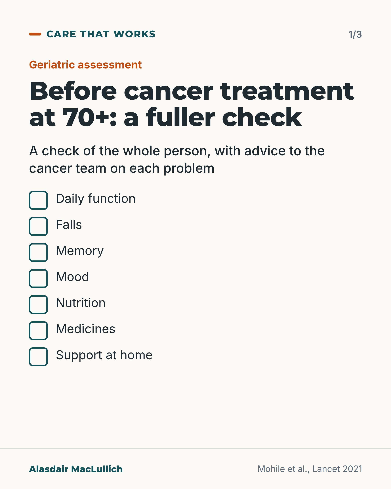
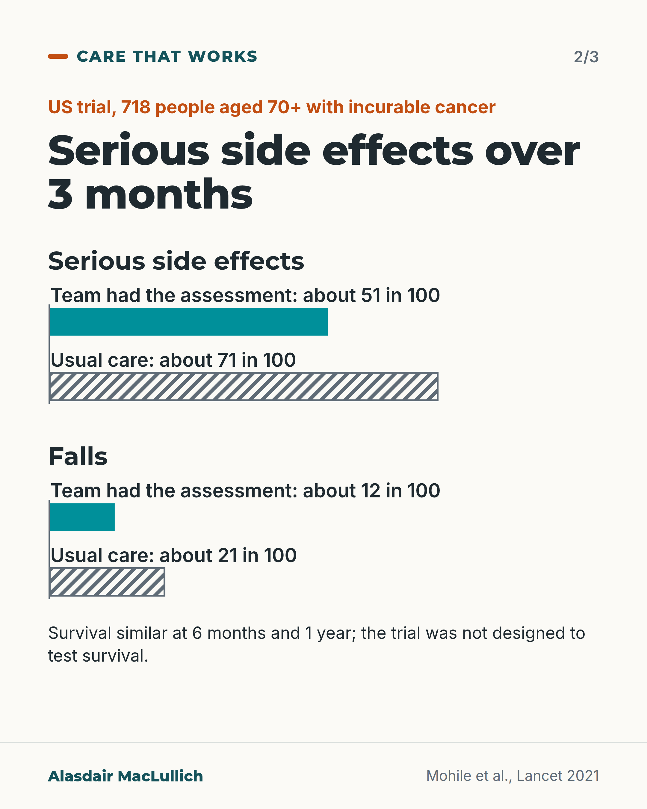
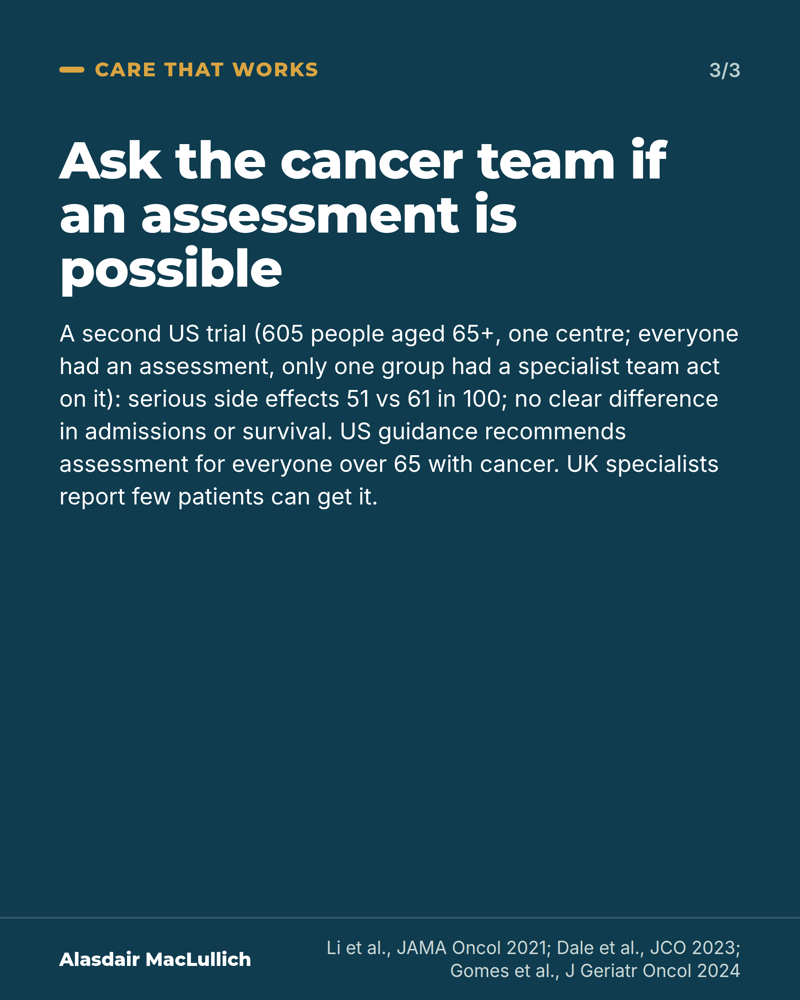

# G065: A geriatric assessment before cancer treatment

- Category: C07 Treatment decisions and proportional care
- Audience: both
- Series: Care that works
- Post type: good_care
- Visual format: carousel
- Status: text text_final, visual final
- Working id: C07-P05 (candidate C07-23)

## Insight

In a US trial of people aged 70 and over starting cancer treatment, giving the oncology team a geriatric assessment with recommendations cut serious side effects from 71 to 51 in 100, with similar survival.

## Angle and position

Older people starting chemotherapy should have a geriatric assessment, as ASCO recommends; in the UK it is often unavailable, so families can ask.

Basis: mixed: empirical (GAP70+ and GAIN trials; ASCO guideline; UK SIOG review) and clinical/ethical judgement (that people should have it and can ask)

## X (1062 characters)

```text
Before cancer treatment at 70 or over, a check of daily function, falls, memory, mood, nutrition, medicines and support at home can change the plan. It is called a geriatric assessment.

A US trial included 718 people aged 70 and over. They had cancer that could not be cured and were starting a new treatment with a high risk of side effects. Each had at least one problem found on the assessment. Some cancer teams were given each person's assessment, with advice on each problem found. Over 3 months, serious side effects happened to about 51 in 100 of their patients, against 71 in 100 with usual care.

Those teams more often started at a lower dose, and fewer people fell over the 3 months (12 in 100 against 21 in 100). Survival was similar at 6 months and 1 year, though the trial was not designed to test that.

US cancer guidance recommends this assessment for everyone over 65 with cancer. UK specialists reported in 2024 that only a small proportion of patients can get this from a specialist team. You can ask the cancer team whether it is possible.
```

## LinkedIn (2179 characters)

```text
Before cancer treatment at 70 or over, a check of daily function, falls, memory, mood, nutrition, medicines and support at home can change the plan.

That check is called a geriatric assessment. The GAP70+ trial in US community cancer practices included 718 people aged 70 and over (average age 77). They had cancer that could not be cured. They were starting a new treatment with a high risk of side effects. Each had at least one problem found on the assessment. Some cancer teams were given each person's assessment, with advice on what to do about each problem. The others gave usual care.

Over the next 3 months, serious side effects happened to about 51 in 100 people whose team had the assessment. For people whose team did not, it was 71 in 100. 'Serious' here means grade 3 to 5 on the standard cancer side-effect scale, which includes hospital-level problems.

The assessment changed what teams did. They more often started with a lower dose (about 49 in 100 against 35 in 100). Fewer people fell over 3 months (about 12 in 100 against 21 in 100), and slightly more medicines were stopped (about 1 extra medicine for every 7 people).

Survival was similar: about 72 in 100 people whose team had the assessment were alive at 6 months, against 75 in 100 whose team did not. That difference could be chance. It was also similar at 1 year. The trial was not designed to show that survival was unaffected.

A second US trial, at one cancer centre, involved 605 people aged 65 and over starting chemotherapy. Everyone had an assessment. Serious side effects happened to about 51 in 100 when a specialist team acted on it, against 61 in 100 when the results were only sent to the cancer doctor. It did not show clear differences in hospital admissions or survival.

The American Society of Clinical Oncology recommends a geriatric assessment for everyone over 65 with cancer. UK specialists reported in 2024 that only a small proportion of patients can get this from a specialist team.

If you or a relative are starting cancer treatment, you can ask the cancer team whether an assessment is possible. You can also ask about a referral to a specialist in older people's care.
```

## Bluesky (296 characters)

```text
In a US trial of 718 people aged 70+ starting cancer treatment, serious side effects over 3 months happened to 51 in 100 when the team had a geriatric assessment (function, falls, memory, medicines, support), and 71 in 100 with usual care. Survival was similar.

Ask if an assessment is possible.
```

## Threads (476 characters)

```text
A US trial included 718 people aged 70 and over starting cancer treatment. Some cancer teams got a geriatric assessment of each person: daily function, falls, memory, mood, nutrition, medicines and support at home.

Serious side effects over 3 months: about 51 in 100 with the assessment, 71 in 100 without it. Fewer falls too. Survival was similar, though the trial was not built to test it.

Starting cancer treatment? You can ask the team whether an assessment is possible.
```

## Source reply

Sources: https://doi.org/10.1016/S0140-6736(21)01789-X https://doi.org/10.1001/jamaoncol.2021.4158 https://doi.org/10.1200/JCO.23.00933 https://doi.org/10.1016/j.jgo.2024.102133

## Visual



Alt text: Checklist of seven things a geriatric assessment covers before cancer treatment at 70+: daily function, falls, memory, mood, nutrition, medicines, support at home.



Alt text: Bars from a US trial of 718 people aged 70+ with incurable cancer. Serious side effects over 3 months: about 51 in 100 with assessment vs 71 in 100 usual care. Falls: about 12 vs 21 in 100. Survival was similar; the trial was not designed to test it.



Alt text: Text card on dark teal: ask the cancer team if an assessment is possible. A second US trial of 605 people found serious side effects 51 vs 61 in 100, with no clear difference in admissions or survival. UK specialists report few patients can get it.

Editable source: `visuals/src/G065.html`

Design instructions: Three 4:5 cards. 1 light ticks checklist; 2 light, two pairBars groups (axis 0 to 100, solid vs hatched); 3 dark text card. Data: C07-23-b (51 vs 71), C07-23-d (12 vs 21), C07-23-e (51 vs 61).

## Sources and verification

- C07-23-a (supported): GAP70+ was a cluster-randomised trial in 718 people aged 70 and over with incurable cancer and at least one ageing-related problem, starting a high-risk treatment; oncologists in the intervention practices received a geriatric assessment summary with management recommendations.
  - Source: Mohile SG, Mohamed MR, Xu H, Culakova E, Loh KP, Magnuson A, et al. Evaluation of geriatric assessment and management on the toxic effects of cancer treatment (GAP70+): a cluster-randomised study. Lancet. 2021;398(10314):1894-1904.
  - Passage: "Abstract: "In this cluster-randomised trial, we enrolled patients aged 70 years and older with incurable solid tumours or lymphoma and at least one impaired geriatric assessment domain who were starting a new treatment regimen. 40 community oncology practice clusters across the USA were randomly assigned (1:1) to the intervention (oncologists received a tailored geriatric assessment summary and management recommendations) or usual care (no geriatric assessment summary or management recommendations were provided to oncologists)" ... "we enrolled 718 patients. Patients had a mean age of 77·2 years (SD 5·4)" ... "The mean number of geriatric assessment domain impairments was 4·5 (SD 1·6)". Full text (Methods): "Patients in both arms underwent a GA that evaluated eight domains using patient-reported and objective measures prior to starting the new treatment regimen." " (Abstract (Methods, Findings); full text Methods)
- C07-23-b (supported): In GAP70+, serious side effects (grade 3 to 5) over 3 months occurred in about 51 in 100 people in the intervention group vs 71 in 100 with usual care.
  - Source: Mohile SG, Mohamed MR, Xu H, Culakova E, Loh KP, Magnuson A, et al. Evaluation of geriatric assessment and management on the toxic effects of cancer treatment (GAP70+): a cluster-randomised study. Lancet. 2021;398(10314):1894-1904.
  - Passage: "Abstract: "A lower proportion of patients in the intervention group had grade 3-5 toxic effects (177 [51%] of 349 patients) compared with the usual care group (263 [71%] of 369 patients; relative risk [RR] 0·74 (95% CI 0·64-0·86; p=0·0001)." Full text: "In 718 evaluable patients, the prevalence of patients experiencing any grade 3–5 toxicity was 61·3% (440/718) within three months of starting a new treatment regimen" " (Abstract (Findings); full text Results)
- C07-23-c (supported_with_qualification): In GAP70+, survival was similar in the two groups at 6 months and 1 year.
  - Source: Mohile SG, Mohamed MR, Xu H, Culakova E, Loh KP, Magnuson A, et al. Evaluation of geriatric assessment and management on the toxic effects of cancer treatment (GAP70+): a cluster-randomised study. Lancet. 2021;398(10314):1894-1904.
  - Passage: "Full text (Results): "The proportion of patients alive at six months was similar for the intervention arm compared to usual care (250/349, 71·6% vs 275/369, 74·5%; p=0·38). There were no survival differences between arms at six months (adjusted hazard ratio [aHR] 1·13; 95% CI: 0·85–1·50; p=0·39; CE p=0·04) or one year (aHR 1·05; 95% CI 0·85–1·29; p=0·68; CE p=0·05)". Discussion: "Because survival was a secondary aim and only captured for one year, the study was not designed to examine non-inferiority between the arms; further research is required to evaluate the effects of GA interventions on survival as a primary aim and for tumor control." " (Full text Results (Overall Survival) and Discussion (limitations))
- C07-23-d (supported): The assessment changed care: more people started on a reduced dose, fewer fell, and more medicines were stopped; a geriatric assessment covers function, memory, mood, other illnesses, medicines, nutrition and social support.
  - Source: Mohile SG, Mohamed MR, Xu H, Culakova E, Loh KP, Magnuson A, et al. Evaluation of geriatric assessment and management on the toxic effects of cancer treatment (GAP70+): a cluster-randomised study. Lancet. 2021;398(10314):1894-1904.; Dale W, Klepin HD, Williams GR, Alibhai SMH, Bergerot C, Brintzenhofeszoc K, et al. Practical assessment and management of vulnerabilities in older patients receiving systemic cancer therapy: ASCO guideline update. J Clin Oncol. 2023;41(26):4293-4312.
  - Passage: "GAP70+ full text: "A higher proportion of patients in intervention received treatment at a reduced dose intensity than standard at cycle one (170/349; 48·7%) compared to usual care (129/369; 35·0%)." Abstract: "Patients in the intervention group had fewer falls over 3 months (35 [12%] of 298 patients vs 68 [21%] of 329 patients; adjusted RR 0·58, 95% CI 0·40-0·84; p=0·0035) and had more medications discontinued (mean adjusted difference 0·14, 95% CI 0·03-0·25; p=0·015)." Full text: "Frequent toxicity checks, adjusting cancer treatment schedule or dosing, reviewing medications for duplications or interactions, providing education materials on aging-related conditions, and referrals to relevant disciplines (i.e., social worker, nutritionist) were among the most common recommendations selected by oncologists." ASCO 2023 abstract: "A GA should include high priority aging-related domains known to be associated with outcomes in older adults with cancer: physical and cognitive function, emotional health, comorbid conditions, polypharmacy, nutrition, and social support." " (GAP70+ abstract and full text Results; ASCO 2023 guideline abstract)
- C07-23-e (supported_with_qualification): A second randomised trial (GAIN) also found fewer serious chemotherapy side effects with geriatric assessment-driven interventions.
  - Source: Li D, Sun CL, Kim H, Soto-Perez-de-Celis E, Chung V, Koczywas M, et al. Geriatric Assessment-Driven Intervention (GAIN) on chemotherapy-related toxic effects in older adults with cancer: a randomized clinical trial. JAMA Oncol. 2021;7(11):e214158.
  - Passage: "Abstract: "Among the 605 eligible participants for analysis, median (range) age was 71 (65-91) years" ... "Incidence of grade 3 or higher chemotherapy-related toxic effects was 50.5% (95% CI, 45.6% to 55.4%) in the GAIN arm and 60.6% (95% CI, 53.9% to 67.3%) in the SOC arm, resulting in a significant 10.1% reduction (95% CI, -1.5 to -18.2%; P = .02). A significant absolute increase in advance directive completion of 28.4% with GAIN vs 13.3% with SOC (P < .001) was observed. No significant differences were observed in emergency department visits, unplanned hospitalizations, average length of stay, unplanned readmissions, chemotherapy dose modifications or discontinuations, or overall survival." " (Abstract (Results))
- C07-23-f (supported): ASCO (US) guidance recommends geriatric assessment for people aged 65 and over with cancer, and assessment-guided management for those receiving systemic therapy who have problems identified.
  - Source: Dale W, Klepin HD, Williams GR, Alibhai SMH, Bergerot C, Brintzenhofeszoc K, et al. Practical assessment and management of vulnerabilities in older patients receiving systemic cancer therapy: ASCO guideline update. J Clin Oncol. 2023;41(26):4293-4312.
  - Passage: "Abstract: "The Expert Panel reiterates its overarching recommendation from the prior guideline that geriatric assessment (GA), including all essential domains, should be used to identify vulnerabilities or impairments that are not routinely captured in oncology assessments for all patients over 65 years old with cancer. Based on recently published RCTs demonstrating significantly improved clinical outcomes, all older adults with cancer (65+ years old) receiving systemic therapy with GA-identified deficits should have GA-guided management (GAM) included in their care plan." " (Guideline abstract (Recommendations))
- C07-23-g (supported_with_qualification): In the UK, only a small proportion of older people with cancer can get a comprehensive geriatric assessment from a specialist team.
  - Source: Gomes F, Farrington N, Pearce J, Swinson D, Welford J, Greystoke A, et al. The care of older patients with cancer across the United Kingdom in 2024: a narrative review by the International Society of Geriatric Oncology UK Country Group. J Geriatr Oncol. 2025;16(1):102133.
  - Passage: "Abstract: "Whilst it is widely accepted that comprehensive geriatric assessments are of benefit to patients, only a small proportion of patients can access these through specialised teams during their cancer care. In the past few years there has been significant progress in this field throughout the United Kingdom (UK)." " (Abstract)

Verification notes: GAP70+ full text: C07-23-a,b,c,d (absolute first; survival 'similar', not 'unchanged'). GAIN: C07-23-e with null results named; single centre; every participant had an assessment and the standard care arm's results were sent to the oncologist (comparator corrected after fact-check). ASCO 2023 abstract wording: C07-23-f (US guidance; erratum not reviewed). UK access: SIOG UK review 2024, C07-23-g; 'ask' is advice.

## Attention and follow potential

Pause: A 20-point absolute drop in serious side effects from an assessment, not a drug.

Gain: A concrete request families can make before chemotherapy starts.

Follow: Examples of care for older people that has been tested and works.

## Open issues

None.
