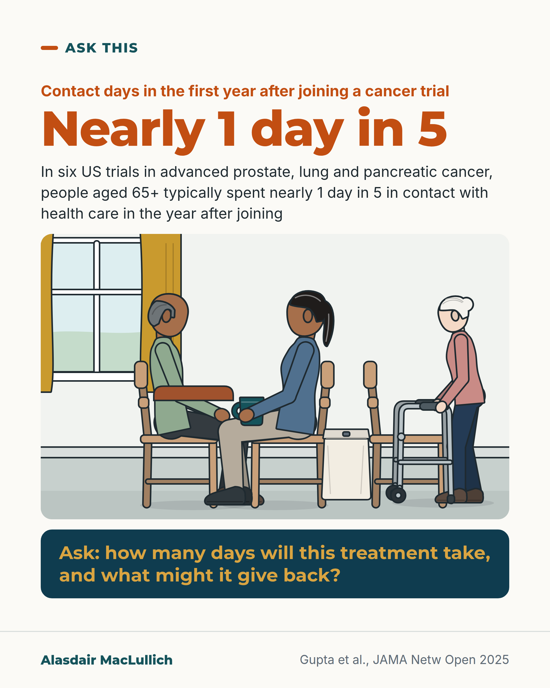

# G066: How many days will this treatment take?

- Category: C07 Treatment decisions and proportional care
- Audience: public
- Series: Ask this
- Post type: decision_support
- Visual format: drawn illustration
- Status: text text_final, visual final
- Working id: C07-P06 (candidate C07-07)

## Insight

Cancer researchers now count 'contact days', days spent going somewhere for health care. In six US trials in advanced prostate, lung and pancreatic cancer, people aged 65 and over spent nearly 1 day in 5 this way in the year after joining; treatment can also give days back for some.

## Angle and position

Older people are entitled to know how many days a treatment is likely to take, and what it may give back, before agreeing.

Basis: mixed: empirical (CO.17 secondary analysis; Gupta 2025 SWOG analysis; Mexican cohort) and ethical judgement (entitlement to this information)

## X (1208 characters)

```text
Some cancer researchers count a one-hour blood test as a whole day. They call these contact days: any day you have to go somewhere for health care.

In six US trials in advanced prostate, lung and pancreatic cancer, people aged 65 and over had health care contact on nearly 1 day in 5 of the time they were followed. That was about the first year after joining.

The count leaves out the family member who drives, waits and sits with you.

Time spent in treatment is only part of the decision. One trial tested a drug for advanced bowel cancer (median age 63). The middle person given the drug had 28 contact days, against 10 given supportive care alone (care to control symptoms, without the drug). Days at home, counted over the rest of their lives, did not differ clearly overall (140 against 121).

One group did differ. People whose tumours had no KRAS mutation (a gene change in the tumour) had more contact days on the drug: the middle person had 41, against 10. They also had more days at home: 186 against 132. This group is the one the drug helps most, and it was picked out after the trial.

Before agreeing to a treatment, you can ask: how many days will this take, and what might I gain from it?
```

## LinkedIn (1873 characters)

```text
Some cancer researchers count a one-hour blood test as a whole day. They call these contact days: any day a person has to go somewhere for health care. That can be a blood test, a scan, a drip, an emergency visit or a night in hospital.

The numbers are large for older people. In six US trials in advanced prostate, lung and pancreatic cancer, people aged 65 and over had health care contact on nearly 1 day in 5 of the time they were followed. The middle person was followed for 350 days and had 48 contact days. A study in Mexico of older people having cancer treatment to control, not cure, their disease found a similar share.

The count leaves out the time family members spend driving, waiting and sitting with the person, and the travel and waiting time itself.

Time spent in treatment is only part of the decision. In the CO.17 trial, people with advanced bowel cancer (median age 63) were randomly given either weekly drip treatment with a drug called cetuximab, or supportive care alone, which means care to control symptoms without the drug. The middle person given the drug had 28 contact days, against 10. Days at home, counted over the rest of their lives, did not differ clearly overall (140 against 121).

One group did differ. People whose tumours had no KRAS mutation (a gene change in the tumour) had more contact days on the drug: the middle person had 41, against 10. They also had more days at home: 186 against 132. This group is the one the drug helps most, and it was picked out after the trial.

Questions you can ask before agreeing to a treatment:
1. How many days a month is this likely to take, counting tests and check-ups?
2. How far will I travel, and who needs to come with me?
3. What might I gain from it, in time at home or in how I feel?

Clinicians should offer this information when discussing options. Older people can ask for it.
```

## Bluesky (296 characters)

```text
Cancer researchers count 'contact days': any day you go somewhere for health care.

In six US trials of advanced prostate, lung and pancreatic cancer, people 65+ typically had contact on nearly 1 day in 5 in the year after joining.

Ask how many days a treatment will take, and what you may gain.
```

## Threads (485 characters)

```text
Researchers count a one-hour blood test as a whole day of health care contact.

In six US trials in advanced prostate, lung and pancreatic cancer, people 65+ had contact on nearly 1 day in 5 in the year after joining.

In a bowel cancer drug trial, days at home did not differ clearly overall, but were higher on the drug in people with no KRAS mutation (a gene change in the tumour), a group picked out after the trial.

Ask how many days a treatment will take, and what you may gain.
```

## Source reply

Sources: https://doi.org/10.1001/jamanetworkopen.2025.0778 https://doi.org/10.1200/OP.22.00737 https://doi.org/10.1007/s00520-024-08844-1

## Visual



Alt text: Drawn waiting area: an older man in a jumper sits with a coat folded on his lap beside his adult daughter, who holds a cup; a paper bag rests at her feet and an older woman with a wheeled frame waits beyond. Headline: nearly 1 day in 5 in contact with health care in the first year after joining a cancer trial. Question below about days and what treatment might give back.

Editable source: `visuals/src/G066.html`

Design instructions: Single 4:5. Orange h1 Nearly 1 day in 5, body text, Kit scene 1000x560 (gp_room, window, man tan skin balding, daughter, bag, woman with wheeled frame), deep teal question panel with gold text. Source: Gupta et al. 2025 claims in post.

## Sources and verification

- C07-07-a (supported): Cancer researchers have proposed counting 'contact days' (days with any in-person health-care contact) as a measure of the time a treatment takes, which they call time toxicity.
  - Source: Gupta A, O'Callaghan CJ, Zhu L, Jonker DJ, Wong RPW, Colwell B, et al. Evaluating the time toxicity of cancer treatment in the CCTG CO.17 trial. JCO Oncol Pract. 2023;19(6):e859-e866.
  - Passage: "Abstract: "We have previously proposed a pragmatic and patient-centered metric of these time costs—which we term time toxicity—as any day with physical health care system contact. This includes outpatient visits (eg, bloodwork, scans, etc), emergency department visits, and overnight stays in a health care facility." Full text (Methods): "In this pragmatic approach, a 1-hour visit for bloodwork, a 3-hour visit for chemotherapy, a 6-hour urgent care visit for dehydration, an emergency department visit, a day admitted in the hospital, or a day in a rehabilitation facility are all coded as a time toxic day." Introduction: "Increasingly, oncology as a discipline is recognizing the need to describe where and how patients spend their time, not just how much added time (survival) is associated with pursuing a treatment." " (Abstract (Purpose); full text Introduction and Methods)
- C07-07-b (supported_with_qualification): In a secondary analysis of the CO.17 trial, weekly cetuximab infusions for advanced bowel cancer took a median of 28 contact days vs 10 with supportive care alone, about 18% vs 6% of days alive; days at home did not differ clearly.
  - Source: Gupta A, O'Callaghan CJ, Zhu L, Jonker DJ, Wong RPW, Colwell B, et al. Evaluating the time toxicity of cancer treatment in the CCTG CO.17 trial. JCO Oncol Pract. 2023;19(6):e859-e866.
  - Passage: "Full text (Results; the PMC extraction drops 'vs' and 'P'): "For the overall study population, median time toxic days were higher in the cetuximab arm (28,10,< .001) and median home days were not statistically different between arms (140,121,= .09; Table). The proportion of time toxic days (time toxic days/OS) was significantly more in the cetuximab arm (median 18%,6%,< .001). For patients receiving cetuximab, of the 28 time toxic days, 14 (50%) were planned" ... "The median age was 63 years, 64% of participants were men". Discussion: "patients receiving cetuximab spent three times as many days alive with health care contact compared with patients treated with supportive care alone." Methods: "Initial results published in 2007 reported a 6-week improvement in median OS with cetuximab" " (Full text Methods, Results and Discussion)
- C07-07-c (supported): In the group whose tumours respond to cetuximab (KRAS wild-type), treatment gave more days at home despite more contact days.
  - Source: Gupta A, O'Callaghan CJ, Zhu L, Jonker DJ, Wong RPW, Colwell B, et al. Evaluating the time toxicity of cancer treatment in the CCTG CO.17 trial. JCO Oncol Pract. 2023;19(6):e859-e866.
  - Passage: "Full text (Results): "For patients withwild-type tumors, median home days were significantly higher in the cetuximab arm (186,132,< .001), and so were time toxic days (41,10,< .001)." Discussion: "In thewild-type group, which we now know derives the greatest benefit from cetuximab, cetuximab led to a significant increase in home days." ... "Patients value different things, and even after informed discussions, patients may elect to proceed with time toxic treatments, which is perfectly acceptable." " (Full text Results and Discussion)
- C07-07-d (supported_with_qualification): Older adults with advanced cancer in trials spent nearly 1 in 5 days with health-care contact in the first year.
  - Source: Gupta A, Till C, Vaidya R, Hershman DL, Unger JM. Health care contact days for older adults enrolled in cancer clinical trials. JAMA Netw Open. 2025;8(3):e250778.; Baltussen JC, Cárdenas-Reyes P, Chavarri-Guerra Y, Ramirez-Fontes A, Morales-Alfaro A, Portielje JEA, et al. Time toxicity among older patients with cancer treated with palliative systemic therapy. Support Care Cancer. 2024;32(9):621.
  - Passage: "Gupta 2025 abstract: "The study included 1429 patients (median age, 71 years [range, 65-91 years]; 1123 men [78.6%]; and 332 patients [23.5%] with rural residence). The median number of contact days was 48 (IQR, 26-71), of a median of 350 days (IQR, 178-365 days) of observation; the median percentage of contact days was 19% (IQR, 13%-29%)." ... "In this cohort study of older adults with advanced stage cancer participating in phase 3 randomized clinical trials, patients spent nearly 1 in 5 days with health care contact." Baltussen 2024 abstract: "We identified 158 older patients (median age 71 years)" ... "Within the first 6 months, patients spent a mean of 21% (95% confidence interval (CI) 19-23%) of days with healthcare contact." ... "These findings underscore the importance of informing patients about their expected healthcare contact days within the context of a limited life expectancy." " (Abstracts (Results, Conclusions))
- C07-07-e (supported_with_qualification): Families and friends also spend time accompanying people to treatment, and contact-day counts do not measure it.
  - Source: Gupta A, O'Callaghan CJ, Zhu L, Jonker DJ, Wong RPW, Colwell B, et al. Evaluating the time toxicity of cancer treatment in the CCTG CO.17 trial. JCO Oncol Pract. 2023;19(6):e859-e866.
  - Passage: "Introduction: "Patients spend time in frequent outpatient visits to meet with a clinician, for bloodwork, imaging, infusions and procedures, seeking acute care and follow-up, and rehabilitation care. They also spend time in travel, in waiting rooms, and on logistics such as coordinating care (eg, on the phone with insurance companies, etc) and filling prescriptions. Patients' loved ones—friends, family, and community members—spend additional time in accompanying and supporting patients." Limitations: "It does not capture time toxicity when the patient is home (eg, telemedicine and home-based infusions), associated with care logistics (eg, time spent on the phone with insurance company), and for care partners." " (Full text Introduction and Discussion (limitations))

Verification notes: Contact day definition: CO.17 analysis (Gupta 2023), C07-07-a (2022 JCO commentary not opened). Older adult figure anchored to Gupta 2025 (US trial participants, three cancer types), Mexican cohort: C07-07-d. CO.17 28 vs 10, median age 63: C07-07-b. Home days balance 41 vs 10 contact, 186 vs 132 home (KRAS wild-type subgroup, post hoc, not 'responders'): C07-07-c; whole trial home days 140 vs 121 (P=.09) now stated beside it. Population for the 1 in 5 figure: six SWOG phase 3 trials in prostate, lung and pancreatic cancer linked to Medicare claims, 1429 people, 12 months from enrolment. Carer time omission is the authors' statement: C07-07-e. No dialysis content. 'Days a month' used only as a question, not a figure. The median count (48 days) and median share (nearly 1 day in 5) are both reported by Gupta 2025; the LinkedIn version gives both with a note that follow-up lengths differ, other versions give the share only.

## Attention and follow potential

Pause: Counting a blood test as a lost day reframes treatment in terms people live by.

Gain: A question to ask that brings time into the decision without implying treatment is not worth it.

Follow: Practical questions older people and families can take into appointments.

## Open issues

None.
