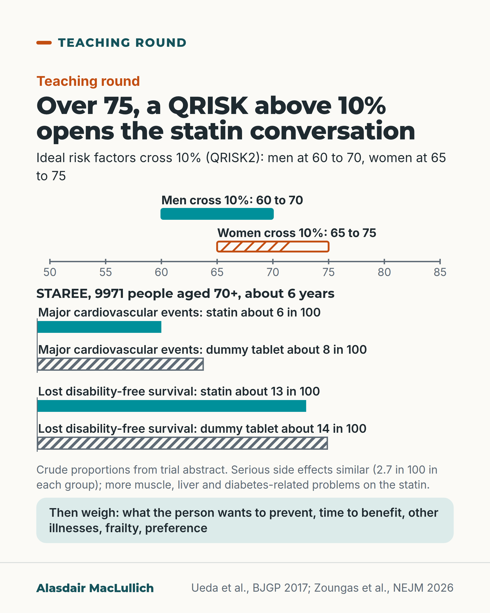

# G067: QRISK above 10% after 75 settles nothing

- Category: C07 Treatment decisions and proportional care
- Audience: practitioners
- Series: Teaching round
- Post type: teaching
- Visual format: chart
- Status: text text_final, visual final
- Working id: C07-P07 (candidate C07-12)

## Insight

By about 75 even ideal risk factors push QRISK past 10%, and QRISK3 separates older people's risks poorly. STAREE now shows statins in healthy over-70s cut cardiovascular events without clearly improving disability-free survival.

## Angle and position

After 75, a QRISK result above 10% should open the statin conversation; the decision rests on what the person wants to prevent, time to benefit, other illnesses, frailty and preference.

Basis: mixed: empirical (Ueda 2017 QRISK2 analysis; Livingstone 2021 QRISK3 performance; STAREE 2026; Yourman 2021 time to benefit) and clinical interpretation (what the conversation should cover)

## X (1127 characters)

```text
By about 75, the QRISK2 calculator puts almost everyone above the 10% statin line, even people with ideal numbers.

In a 2017 analysis with QRISK2, a never-smoker of healthy weight with systolic 110 and a good cholesterol ratio crossed 10% between 60 and 70 (men) or 65 and 75 (women). In an English survey sample aged 75 to 84 without heart disease, every one was above it.

In 2.9 million UK records, QRISK3 was poor at separating who would have an event at 65 and over, and it overestimated risk.

STAREE (NEJM, August 2026) studied 9971 Australians aged 70+ with no heart disease, diabetes or dementia. Over 6 years a statin cut major cardiovascular events from about 8 to 6 in 100, but did not clearly change staying alive without dementia or disability. Serious side effects were similar (2.7 in 100 in each group). Muscle, liver and diabetes-related problems were more common on the statin; the abstract does not say how many.

So after 75, treat a result above 10% as a reason to discuss statins with the person. The decision rests on what they want to prevent, time to benefit, other illnesses, frailty and preference.
```

## LinkedIn (2097 characters)

```text
By about 75, the QRISK2 calculator puts almost everyone above the 10% statin line, even people with ideal numbers.

The calculator gives great weight to age. A 2017 analysis used QRISK2, the version in use when the 10% threshold was set. A never-smoker of healthy weight with a systolic of 110 and a good cholesterol ratio went above 10%. That happened between 60 and 70 for men and between 65 and 75 for women. In a survey sample of English adults aged 75 to 84 without heart disease, every one was above it.

QRISK3, the newer version, works less well at older ages. In UK GP records of 2.9 million people, it worked well in younger adults. At 65 and over it was poor at telling apart who would and would not have a heart attack or stroke. It also overestimated risk, more so once deaths from other causes were counted. About 1 in 5 people aged 75 to 84 died of something else during follow-up.

We now have direct trial evidence. STAREE (NEJM, August 2026) gave 9971 Australians aged 70 and over (average 75), without heart disease, stroke, diabetes or dementia, a statin or a dummy tablet. Over about 6 years:
1. About 6 in 100 on the statin and 8 in 100 on the dummy tablet had a heart attack, stroke, cardiovascular death or a procedure to open a heart artery.
2. Staying alive without dementia or lasting disability did not clearly change (about 13 in 100 on the statin against 14 in 100 on the dummy tablet lost it).
These are crude proportions from the published abstract, which does not give results for the over-75s. Serious side effects were similar (2.7 in 100 in each group), but muscle, liver and diabetes-related problems were more common on the statin, and the abstract does not give their size.

Time to benefit also counts. In trials of people aged 50 to 75, treating 100 people for about 2.5 years prevented one event. Those people were younger than most over-75s.

So after 75, treat a QRISK result above 10% as a reason to discuss statins with the person. The decision rests on what they want to prevent, how long benefit takes, other illnesses, frailty and their preference.
```

## Bluesky (299 characters)

```text
By 75, even ideal numbers put people above the 10% QRISK2 statin threshold.

STAREE (2026, age 70+): a statin cut heart events from about 8 to 6 in 100 over 6 years, but did not clearly improve life free of dementia or disability. More muscle, liver and diabetes problems.

Above 10%, discuss goals.
```

## Threads (483 characters)

```text
By about 75, QRISK2 puts almost everyone above the 10% statin threshold, even with ideal numbers.

STAREE (2026) studied 9971 Australians aged 70+. Over 6 years a statin cut major cardiovascular events from about 8 to 6 in 100, but did not clearly change staying alive without dementia or disability. More muscle, liver and diabetes-related problems on the statin.

After 75, treat a score above 10% as a reason to discuss the person's goals, time to benefit, frailty and preference.
```

## Source reply

Sources: https://doi.org/10.3399/bjgp17X692141 https://doi.org/10.1016/S2666-7568(21)00088-X https://doi.org/10.1056/NEJMoa2607314 https://doi.org/10.1001/jamainternmed.2020.6084

## Visual



Alt text: Age ruler from 50 to 85 (QRISK2, ideal risk factors): men cross 10% between 60 and 70, women between 65 and 75. Below, STAREE trial bars, 9971 people aged 70+, about 6 years: major cardiovascular events statin 6 vs dummy tablet 8 in 100; lost disability-free survival 13 vs 14 in 100. Crude figures; then weigh preferences, time to benefit and frailty.

Editable source: `visuals/src/G067.html`

Design instructions: Single 4:5 chart. SVG age ruler 50 to 85 with solid teal bracket (men 60-70) and hatched orange bracket (women 65-75); two pairBars groups (axis 0 to 20, statin solid, dummy hatched); note and mint panel. Data: C07-12-e.

## Sources and verification

- C07-12-b (supported_with_qualification): At older ages, age alone puts people above the 10% threshold: with QRISK2, even people with optimal risk factors crossed 10% between 60 and 70 (men) and 65 and 75 (women), and every man and woman aged 75 to 84 without CVD in an English survey sample exceeded it.
  - Source: Ueda P, Lung TW, Clarke P, Danaei G. Application of the 2014 NICE cholesterol guidelines in the English population: a cross-sectional analysis. Br J Gen Pract. 2017;67(662):e598-e608.; Livingstone S, Morales DR, Donnan PT, Payne K, Thompson AJ, Youn JH, Guthrie B. Effect of competing mortality risks on predictive performance of the QRISK3 cardiovascular risk prediction tool in older people and those with comorbidity: external validation population cohort study. Lancet Healthy Longev. 2021;2(6):e352-e361.
  - Passage: "PMID 28760741 abstract: "Even with optimal risk factor levels, males of different ethnicities would exceed the 10% risk threshold between the ages of 60 and 70 years, and females would exceed the threshold between 65 and 75 years." ... "When analysed by age, 95% of males and 66% of females without CVD in ages 60-74 years, including all males and females in ages 75-84 years, would require statin therapy." Full text (Results, Scite excerpt): "The QRISK2 algorithm gives a large weight to age as a predictor of CVD risk." Figure 2 legend: "Optimal/high BMI = 22.5/30.1 kg/ m 2 . Optimal/high total-to-HDL cholesterol ratio = 4.0/5.2. Optimal systolic BP = 110 mmHg (untreated)." ... "Optimal smoking status = never smoker." PMID 34100008 full text (Introduction, background): "However, age is the most important predictor of CVD risk, and thus most people will exceed current thresholds at some point in early older age w years) irrespective of other risk factors." [text garbled in PMC extraction at the age range]" (PMID 28760741 abstract and full-text Results/Figure 2 legend (Scite excerpts); PMID 34100008 full-text Introduction)
- C07-12-c (supported): QRISK3 separates higher-risk from lower-risk people poorly in older age groups and over-predicts risk in older people, especially once deaths from other causes are taken into account.
  - Source: Livingstone S, Morales DR, Donnan PT, Payne K, Thompson AJ, Youn JH, Guthrie B. Effect of competing mortality risks on predictive performance of the QRISK3 cardiovascular risk prediction tool in older people and those with comorbidity: external validation population cohort study. Lancet Healthy Longev. 2021;2(6):e352-e361.
  - Passage: "Abstract: "Non-CVD death rose markedly with age (0·4% of women and 0·5% of men aged 25-44 years had a non-CVD death20·1% of women and 19·6% of men aged 75-84 years). QRISK3 discrimination in the whole population was excellent (Harrell's C-statistic 0·865 in women and 0·834 in men) but was poor in older age groups (<0·65 in all subgroups aged 65 years or older). Ignoring competing risks, QRISK3 calibration in the whole population and in younger people was excellent, but there was significant over-prediction in older people. Accounting for competing risks, QRISK3 systematically over-predicted CVD risk, particularly in older people and in those with high multimorbidity." Full text (Discussion): "Clinicians should consider broader effects on life expectancy when discussing statin initiation for primary prevention in older people and people with high multimorbidity, in whom CVD risk is likely to be over-predicted."" (Abstract (Findings); full text Discussion/Conclusion)
- C07-12-e (supported): STAREE (2026): in 9971 Australians aged 70 and over without CVD, diabetes or dementia, atorvastatin 40 mg reduced major cardiovascular events but did not clearly lengthen disability-free survival over a median 5.9 years; serious adverse events were similar.
  - Source: Zoungas S, Wolfe R, Moran C, Nicholls SJ, Cloud GC, Reid CM, et al; STAREE Investigator Group. Atorvastatin, cardiovascular events, and disability-free survival in older adults. N Engl J Med. 2026 Aug 29. doi:10.1056/NEJMoa2607314.
  - Passage: "Abstract: "Community-dwelling adults at least 70 years of age with no history of cardiovascular disease, diabetes, or dementia were randomly assigned in a 1:1 ratio to receive atorvastatin at a dose of 40 mg once daily or identical placebo." ... "A total of 9971 participants were enrolled: 4984 were assigned to receive atorvastatin and 4987 to receive placebo. The mean (±SD) age of the participants was 74.7±4.5 years, and 51.9% were women. After a median of 5.9 years, a primary cardiovascular event had occurred in 297 participants (10.9 events per 1000 person-years) in the atorvastatin group and in 412 participants (15.5 events per 1000 person-years) in the placebo group (hazard ratio, 0.70; 95% confidence interval [CI], 0.61 to 0.82; P<0.001). Death from any cause, dementia, or persistent physical disability occurred in 637 participants (21.6 events per 1000 person-years) in the atorvastatin group and in 676 participants (23.0 events per 1000 person-years) in the placebo group (hazard ratio, 0.94; 95% CI, 0.84 to 1.05; P = 0.25). Serious adverse events occurred in 131 participants (2.7%) in the atorvastatin group and in 129 (2.7%) in the placebo group, with musculoskeletal, hepatobiliary, and diabetes-related adverse events occurring more commonly in the atorvastatin group."" (Abstract (Methods, Results, Conclusions))
- C07-12-f (supported_with_qualification): Time to benefit: in primary prevention trials of adults aged 50 to 75, about 2.5 years of statin treatment in 100 people prevented one major cardiovascular event, with no evidence of a mortality benefit.
  - Source: Yourman LC, Cenzer IS, Boscardin WJ, Nguyen BT, Smith AK, Schonberg MA, et al. Evaluation of time to benefit of statins for the primary prevention of cardiovascular events in adults aged 50 to 75 years: a meta-analysis. JAMA Intern Med. 2021;181(2):179-185.
  - Passage: "Abstract: "The meta-analysis results suggested that 2.5 (95% CI, 1.7-3.4) years were needed to avoid 1 MACE for 100 patients treated with a statin." ... "These findings suggest that treating 100 adults (aged 50-75 years) without known cardiovascular disease with a statin for 2.5 years prevented 1 MACE in 1 adult. Statins may help to prevent a first MACE in adults aged 50 to 75 years old if they have a life expectancy of at least 2.5 years. There is no evidence of a mortality benefit."" (Abstract (Results, Conclusions))

Verification notes: QRISK2 threshold crossing and survey sample: Ueda 2017 (C07-12-b), labelled QRISK2. QRISK3 performance and overestimation: Livingstone 2021 (C07-12-c). STAREE abstract only, crude proportions, diabetes excluded: C07-12-e. Time to benefit in 50 to 75 year olds: Yourman 2021 (C07-12-f). NICE NG238 specifics not used (search extract). STAREE led here only; C07-P03 does not use it.

## Attention and follow potential

Pause: Most clinicians have seen 10%+ on nearly every older patient; this explains why and what to do with it.

Gain: A reason to stop treating the threshold as the decision, and the first direct trial data on statins in healthy over-70s.

Follow: Teaching points that bring new trials into everyday prescribing decisions.

## Open issues

None.
