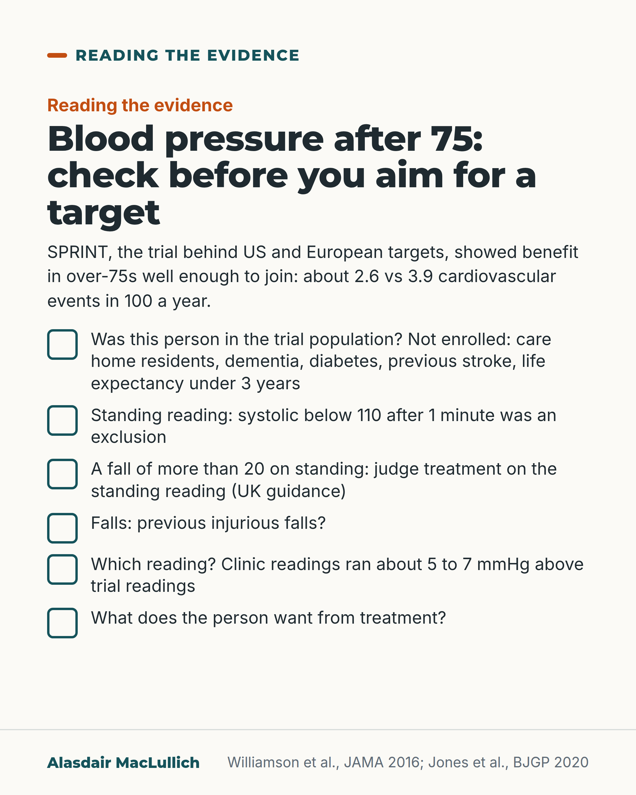

# G068: Blood pressure after 75: read who the trial left out

- Category: C07 Treatment decisions and proportional care
- Audience: practitioners
- Series: Reading the evidence
- Post type: evidence_interpretation
- Visual format: checklist
- Status: text text_final, visual final
- Working id: C07-P08 (candidate C07-03)

## Insight

SPRINT showed benefit from intensive blood pressure lowering in over-75s well enough to join, but excluded care home residents, people with dementia, diabetes, stroke or a big standing drop. For them the target is an extrapolation; standing pressure, falls and goals should guide treatment.

## Angle and position

Guide blood pressure treatment in older people by standing blood pressure, falls, symptoms and goals as well as targets; do not withhold treatment from fit older people, in whom benefit was shown.

Basis: mixed: empirical (SPRINT over-75 analysis; Drawz 2020; Juraschek 2023; Tinetti 2014, association only; NG136 summary) and clinical interpretation (how to apply this to people outside the trial)

## X (1382 characters)

```text
In an older person, blood pressure treatment should take account of the standing reading, falls, symptoms and the person's goals, alongside the target number.

SPRINT, the trial behind US and European targets, included 2636 participants aged 75 and over. They were aiming for a systolic below 120 rather than 140 (average reached 123 against 135). Cardiovascular events were fewer on the lower target (about 2.6 vs 3.9 in 100 a year). Serious adverse events were similar (about 48 in 100 in each group). Kidney function fell more often on the lower target in people whose kidneys were working normally at the start. About 3 in 10 were classed as frail, and benefit looked similar in them in an exploratory analysis.

It did not enrol people in care homes, with dementia, diabetes or previous stroke, expected to live under 3 years, or whose systolic fell below 110 after a minute standing. Its readings were unattended automated averages; routine clinic readings ran about 5 to 7 mmHg higher.

UK guidance: measure standing pressure at 80 and over, in type 2 diabetes and with postural dizziness, and judge treatment on the standing reading if systolic falls by more than 20.

Over-75s well enough to join the trial gained from treatment. For people it left out, the trial does not show the right target, so the standing reading, falls and the person's goals should guide treatment.
```

## LinkedIn (2385 characters)

```text
In an older person, blood pressure treatment should take account of the standing reading, falls, symptoms and the person's goals, alongside the target number.

SPRINT, the trial behind the lower targets in the 2017 US and 2018 European guidelines, included 2636 people aged 75 and over. Aiming for a systolic below 120 rather than below 140 meant fewer heart attacks, strokes, heart failure admissions and cardiovascular deaths: about 2.6 in 100 each year on the lower target against 3.9 in 100 on the higher. Serious adverse events were equally common (about 48 in 100 in each group), and injurious falls did not differ clearly. Low blood pressure, fainting, salt imbalance and kidney injury were a little more common on the lower target, though not clearly so. Kidney function fell clearly more often in people whose kidneys were normal at the start. About 3 in 10 counted as frail on a frailty index, and benefit looked similar in them, in an exploratory analysis.

SPRINT did not enrol people living in care homes, people with dementia, diabetes or a previous stroke, people expected to live less than 3 years, or people whose systolic fell below 110 after a minute of standing. Its authors wrote that the results do not give the right target for people in care homes or with diabetes, stroke or heart failure.

Two measurement points:
1. SPRINT averaged 3 automated readings after 5 minutes' rest with no staff in the room. Routine clinic readings in the same people averaged about 5 to 7 mmHg higher.
2. UK guidance (NG136) asks for a standing reading at 80 and over, in type 2 diabetes and with postural dizziness, and to judge treatment on the standing reading if systolic falls by more than 20. NICE did not adopt the SPRINT targets.

On a drop in pressure on standing, two findings differ. Across 9 trials (average age 69; about 1 in 10 had a drop on standing at the start), lowering pressure helped people with a drop on standing about as much as those without. In older people outside trials, taking blood pressure tablets was linked with more serious fall injuries, especially after a previous injurious fall; that study does not show the tablets caused the falls.

For over-75s who resemble the trial population, the trial shows benefit from the lower target, though NICE has not adopted it. For people it left out, use the standing reading, falls and the person's goals.
```

## Bluesky (297 characters)

```text
SPRINT, the trial behind US and European blood pressure targets, found fewer cardiovascular events with a lower target in over-75s well enough to join. It excluded care home residents and people with dementia, diabetes, stroke or a big standing drop.

For them, weigh standing BP, falls and goals.
```

## Threads (496 characters)

```text
SPRINT, the trial behind US and European blood pressure targets, found fewer cardiovascular events with a lower target in over-75s well enough to join: about 2.6 in 100 a year against 3.9 in 100 on the higher target. Kidney function fell more often on the lower target in people with normal kidneys.

It did not enrol people in care homes, with dementia, diabetes or previous stroke, or whose systolic fell below 110 on standing.

For them, use the standing reading, falls and the person's goals.
```

## Source reply

Sources: https://doi.org/10.1001/jama.2016.7050 https://doi.org/10.1001/jamainternmed.2020.5028 https://doi.org/10.3399/bjgp20X708053 https://doi.org/10.1001/jama.2023.18497

## Visual



Alt text: Checklist card on blood pressure after 75 with six tick boxes: was the person in the trial population, standing reading, a fall on standing, previous injurious falls, which reading was used, and what the person wants. Intro: SPRINT showed about 2.6 vs 3.9 cardiovascular events in 100 a year in over-75s well enough to join.

Editable source: `visuals/src/G068.html`

Design instructions: Single 4:5 checklist, light ground, Kit-free. h1.s, body, six .ticks items at 29px. No chart; figures from post claims (SPRINT).

## Sources and verification

- C07-03-a (supported): SPRINT excluded people with type 2 diabetes, previous stroke, symptomatic heart failure, a diagnosis of or treatment for dementia, expected survival under 3 years, recent unintentional weight loss, standing systolic below 110 mmHg after 1 minute, or residence in a nursing home.
  - Source: Williamson JD, Supiano MA, Applegate WB, Berlowitz DR, Campbell RC, Chertow GM, et al; SPRINT Research Group. Intensive vs standard blood pressure control and cardiovascular disease outcomes in adults aged >=75 years: a randomized clinical trial. JAMA. 2016;315(24):2673-82.
  - Passage: "Full text (Methods, Population): "A person was excluded if he or she had type 2 diabetes, a history of stroke, symptomatic heart failure within the past 6 months or reduced left ventricular ejection fraction (<35%), a clinical diagnosis of or treatment for dementia, an expected survival of less than 3 years, unintentional weight loss (>10% of body weight) during the preceding 6 months, an SBP of less than 110 mm Hg following 1 minute of standing, or resided in a nursing home."" (Full text, Methods (Population))
- C07-03-b (supported): The SPRINT investigators state that their over-75 results do not provide evidence on targets for nursing home residents or people with diabetes, stroke or symptomatic heart failure, groups at higher falls risk.
  - Source: Williamson JD, Supiano MA, Applegate WB, Berlowitz DR, Campbell RC, Chertow GM, et al; SPRINT Research Group. Intensive vs standard blood pressure control and cardiovascular disease outcomes in adults aged >=75 years: a randomized clinical trial. JAMA. 2016;315(24):2673-82.
  - Passage: "Full text (Discussion): "In addition, the trial did not enroll older adults residing in nursing homes, persons with type 2 diabetes or prevalent stroke (because of concurrent BP lowering trials),and individuals with symptomatic heart failure due to protocol differences required to maintain BP control in this condition. Therefore, the results reported in this study among persons aged 75 years or older do not provide evidence regarding treatment targets in these populations. Individuals with these conditions also represent a subset of older persons at increased risk for falls."" (Full text, Discussion (limitations))
- C07-03-c (supported): In SPRINT participants aged 75 and over, a systolic target below 120 (vs below 140) reduced major cardiovascular events and deaths: 2.59% vs 3.85% per year; NNT 27 for the primary outcome and 41 for death over 3.14 years.
  - Source: Williamson JD, Supiano MA, Applegate WB, Berlowitz DR, Campbell RC, Chertow GM, et al; SPRINT Research Group. Intensive vs standard blood pressure control and cardiovascular disease outcomes in adults aged >=75 years: a randomized clinical trial. JAMA. 2016;315(24):2673-82.
  - Passage: "Full text (Results): "A primary composite outcome event was observed for 102 participants (2.59% per year) in the intensive treatment group and for 148 participants (3.85% per year) in the standard treatment group (HR, 0.66 [95% CI, 0.51–0.85];). Results were similar for all-cause mortality (there were 73 deaths in the intensive treatment group and 107 deaths in the standard treatment group; HR, 0.67 [95% CI, 0.49–0.91])." ... "At 3.14 years, the number needed to treat (NNT) estimate for the primary outcome was 27 (95% CI, 19–61) and for all-cause mortality it was 41 (95% CI, 27–145)." ... "Throughout follow-up, the mean SBP in the intensive treatment group was 123.4 mm Hg, and it was 134.8 mm Hg in the standard treatment group." Discussion: "total mortality by 32%(from 2.63% to 1.78% per year)."" (Full text, Results (Blood Pressure Levels; Clinical Outcomes) and Discussion)
- C07-03-d (supported): In SPRINT's over-75s, serious adverse events and injurious falls did not differ significantly between groups; hypotension, syncope, electrolyte problems and acute kidney injury were numerically more common with intensive treatment, and a decline in kidney function was significantly more common in those without baseline CKD.
  - Source: Williamson JD, Supiano MA, Applegate WB, Berlowitz DR, Campbell RC, Chertow GM, et al; SPRINT Research Group. Intensive vs standard blood pressure control and cardiovascular disease outcomes in adults aged >=75 years: a randomized clinical trial. JAMA. 2016;315(24):2673-82.; SPRINT Research Group; Wright JT Jr, Williamson JD, Whelton PK, Snyder JK, Sink KM, Rocco MV, et al. A randomized trial of intensive versus standard blood-pressure control. N Engl J Med. 2015;373(22):2103-16.
  - Passage: "Full text (Results): "In the intensive treatment group, SAEs occurred in 637 participants (48.4%) compared with 637 participants (48.3%) in the standard treatment group (HR, 0.99 [95% CI, 0.89–1.11];= .90). The absolute rate of SAEs was higher but was not statistically significantly different in the intensive treatment group for hypotension (2.4% vs 1.4% in the standard treatment group; HR, 1.71 [95% CI, 0.97–3.09]), syncope (3.0% vs 2.4%, respectively; HR, 1.23 [95% CI, 0.76–2.00]), electrolyte abnormalities (4.0% vs 2.7%; HR, 1.51 [95% CI, 0.99–2.33]), and acute kidney injury or renal failure (5.5% vs 4.0%; HR, 1.41 [95% CI, 0.98–2.04]). However, the absolute rate of injurious falls was lower but was not statistically significantly different in the intensive treatment group (4.9% vs 5.5% in the standard treatment group; HR, 0.91 [95% CI, 0.65–1.29])." ... "(a 30% decrease in eGFR from baseline to an eGFR <60 mL/min/1.73 m[1.70% vs 0.58% per year, respectively]; HR, 3.14 [95% CI, 1.66–6.37])." PMID 26551272 abstract (whole trial, 9361 participants): "Rates of serious adverse events of hypotension, syncope, electrolyte abnormalities, and acute kidney injury or failure, but not of injurious falls, were higher in the intensive-treatment group than in the standard-treatment group."" (Full text, Results (Serious Adverse Events; Clinical Outcomes); PMID 26551272 abstract (Results))
- C07-03-e (supported_with_qualification): About 31% of SPRINT's over-75s were classed as frail on a 37-item frailty index, and in exploratory analyses the benefit of intensive treatment was consistent across frailty and gait-speed groups.
  - Source: Williamson JD, Supiano MA, Applegate WB, Berlowitz DR, Campbell RC, Chertow GM, et al; SPRINT Research Group. Intensive vs standard blood pressure control and cardiovascular disease outcomes in adults aged >=75 years: a randomized clinical trial. JAMA. 2016;315(24):2673-82.
  - Passage: "Full text: "Frailty status at randomization was quantified using a previously reported 37-item frailty index." ... "Overall, 815 participants (30.9%) were classified as frail and 1456 (55.2%) as less fit" ... "However, within each frailty stratum, absolute event rates were lower for the intensive treatment group (= .84 for interaction)." ... "However, these analyses should be interpreted cautiously. The analyses were not prespecified in the trial protocol and were possibly under powered"" (Full text, Methods; Results (Exploratory Subgroup Analyses); Discussion)
- C07-03-f (supported): SPRINT measured blood pressure with an automated, unattended protocol; in the same participants, routine clinic readings were on average higher than trial readings (7.3 mmHg in the intensive group, 4.6 mmHg in the standard group), with wide variation.
  - Source: Williamson JD, Supiano MA, Applegate WB, Berlowitz DR, Campbell RC, Chertow GM, et al; SPRINT Research Group. Intensive vs standard blood pressure control and cardiovascular disease outcomes in adults aged >=75 years: a randomized clinical trial. JAMA. 2016;315(24):2673-82.; Drawz PE, Agarwal A, Dwyer JP, Horwitz E, Lash J, Lenoir K, et al. Concordance between blood pressure in the Systolic Blood Pressure Intervention Trial and in routine clinical practice. JAMA Intern Med. 2020;180(12):1655-1663.
  - Passage: "PMID 27195814 full text (Methods): "Blood pressure was determined using the mean of 3 properly sized automated cuff readings, taken 1 minute apart after 5 minutes of quiet rest without staff in the room." PMID 33044494 abstract: "In the period from the 6-month study visit to the end of the study intervention, the mean systolic BP (SBP) in the intensive treatment group from outpatient BP recorded in the EHR was 7.3 mm Hg higher (95% CI, 7.0-7.6 mm Hg) than BP measured at trial visits; the mean difference between BP recorded in the outpatient EHR and trial SBP was smaller for participants in the standard treatment group (4.6 mm Hg [95% CI, 4.4-4.9 mm Hg]). Bland-Altman analyses demonstrated low agreement between outpatient BP recorded in the EHR and trial BP, with wide agreement intervals ranging from approximately -30 mm Hg to 45 mm Hg in both treatment groups." ... "an inability to apply 1 common correction factor (ie, approximately 10 mm Hg) to approximate research-quality BP estimates when BP is not measured appropriately in routine clinical practice."" (PMID 27195814 full text Methods; PMID 33044494 abstract)
- C07-03-g (supported_with_qualification): SPRINT is the trial behind the lower targets in US (2017 ACC/AHA) and European (2018 ESC/ESH) guidelines; NICE's 2019 guideline did not adopt lower targets, keeping clinic BP below 140/90 for under-80s and asking for judgement about frailty and comorbidity in over-80s.
  - Source: Fernandes M, Olde Rikkert MGM. The new US and European guidelines in hypertension: a multi-dimensional analysis. Contemp Clin Trials. 2019;81:44-54.; Jones NR, McCormack T, Constanti M, McManus RJ. Diagnosis and management of hypertension in adults: NICE guideline update 2019. Br J Gen Pract. 2020;70(691):90-91.
  - Passage: "PMID 31002956 abstract: "Both,the 2017 ACC/AHA and the 2018 ESC/ESH guidelines in hypertension are derived from the SPRINT trial and advise initiation and/or intensification of treatment at lower blood pressure thresholds." PMID 32001477 full text: "For patients aged <80 years, treatment should aim to reduce clinic BP below 140/90 mmHg or 135/85 mmHg if using HBPM. Unlike recent US and European guidance, NICE does not suggest aiming for lower BP targets, because of a lack of evidence in primary prevention as well as the increased risk associated with this strategy, including falls and electrolyte imbalance." ... "Other than the landmark HyVET trial, which used a treatment threshold of 150 mmHg systolic BP, there is a lack of evidence regarding treatment targets for patients aged >80 years and the potential risks of treatment are greater in this group. NICE therefore advocates clinicians judging whether to recommend treatment based on individual case merit but taking into account factors such as frailty and other comorbidities, particularly where treatment below 150 mmHg is being considered."" (PMID 31002956 abstract; PMID 32001477 full text (Diagnosing hypertension; treatment targets))
- C07-03-h (supported): NICE (2019) advises measuring standing blood pressure in people aged 80 or over, people with type 2 diabetes and people with symptoms of postural hypotension, and targeting treatment at the standing reading when the systolic drop exceeds 20 mmHg.
  - Source: Jones NR, McCormack T, Constanti M, McManus RJ. Diagnosis and management of hypertension in adults: NICE guideline update 2019. Br J Gen Pract. 2020;70(691):90-91.
  - Passage: "Full text: "Standing BP should be measured in those with type 2 diabetes, aged ≥80 years, and patients with symptoms of postural hypotension. The standing BP should be measured after the person has been standing for at least 1 minute. Where there is a significant postural drop in systolic BP (>20 mmHg), treatment should be targeted at the standing BP."" (Full text (Diagnosing hypertension))
- C07-03-i (supported_with_qualification): Conflicting or qualifying evidence: in an individual participant meta-analysis of 9 trials, intensive treatment reduced CVD or death similarly with or without baseline orthostatic hypotension; in a US observational cohort of adults over 70, antihypertensive use was linked with serious fall injuries, especially after a previous fall injury.
  - Source: Juraschek SP, Hu JR, Cluett JL, Ishak AM, Mita C, Lipsitz LA, et al. Orthostatic hypotension, hypertension treatment, and cardiovascular disease: an individual participant meta-analysis. JAMA. 2023;330(15):1459-1471.; Tinetti ME, Han L, Lee DS, McAvay GJ, Peduzzi P, Gross CP, et al. Antihypertensive medications and serious fall injuries in a nationally representative sample of older adults. JAMA Intern Med. 2014;174(4):588-95.
  - Passage: "PMID 37847274 abstract: "The 9 trials included 29 235 participants followed up for a median of 4 years (mean age, 69.0 [SD, 10.9] years; 48% women). There were 9% with orthostatic hypotension and 5% with standing hypotension at baseline. More intensive BP treatment or active therapy lowered risk of CVD or all-cause mortality among those without baseline orthostatic hypotension (hazard ratio [HR], 0.81; 95% CI, 0.76-0.86) similarly to those with baseline orthostatic hypotension (HR, 0.83; 95% CI, 0.70-1.00; P = .68 for interaction of treatment with baseline orthostatic hypotension)." PMID 24567036 abstract: "The adjusted hazard ratios for serious fall injury were 1.40 (95% CI, 1.03-1.90) in the moderate-intensity and 1.28 (95% CI, 0.91-1.80) in the high-intensity antihypertensive groups compared with nonusers." ... "Among 503 participants with a previous fall injury, the adjusted hazard ratios were 2.17 (95% CI, 0.98-4.80) for the moderate-intensity and 2.31 (95% CI, 1.01-5.29) for the high-intensity antihypertensive groups."" (Abstracts (Results))

Verification notes: Exclusions verbatim Williamson 2016 full text (C07-03-a,b). Over-75 benefit, NNT 27, SAEs, falls, frailty (exploratory): C07-03-c,d,e. Measurement: Drawz 2020 (C07-03-f). 'Trial behind US and European targets' and NICE not adopting: Fernandes 2019, Jones 2020 BJGP summary (C07-03-g). Standing BP guidance: C07-03-h (secondary summary of NG136). Juraschek and Tinetti (association only): C07-03-i. HYVET not used. 'A practical reading' marks interpretation. Schedule apart from C08-29 and C20-03 (editor).

## Attention and follow potential

Pause: Most readers know SPRINT's target; fewer know its exclusion list or measurement protocol.

Gain: A usable set of checks that neither withholds treatment from fit older people nor imports a target where it was never tested.

Follow: Evidence reading that shows which patients a famous trial actually studied.

## Open issues

- Scheduling (editor): publish apart from C08-29 and C20-03.
