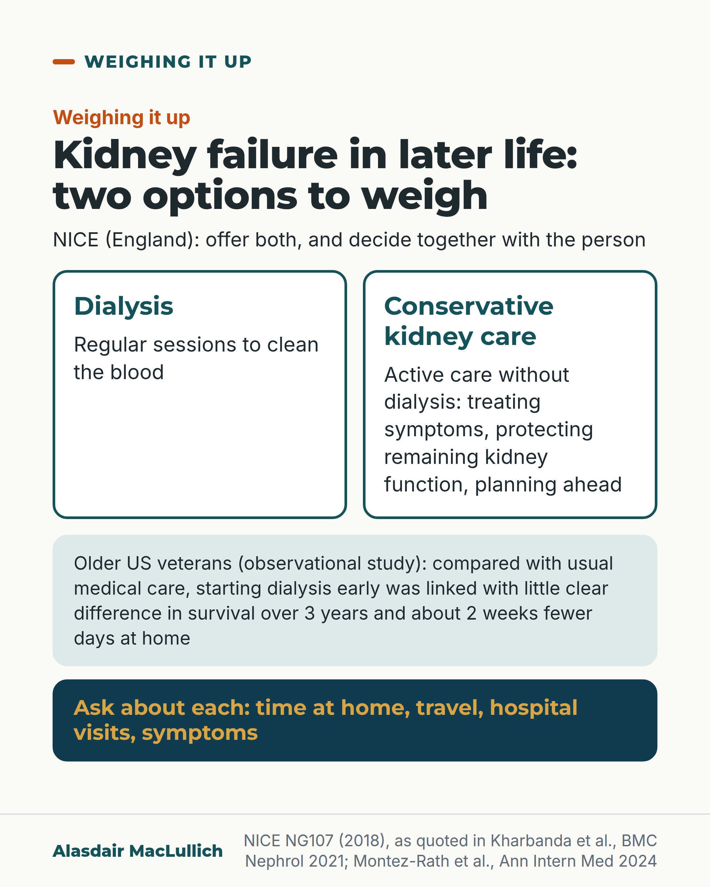

# G069: Dialysis or conservative kidney care

- Category: C07 Treatment decisions and proportional care
- Audience: public
- Series: Weighing it up
- Post type: decision_support
- Visual format: comparison
- Status: text text_final, visual final
- Working id: C07-P09 (candidate C07-24)

## Insight

NICE says people whose kidneys are failing should be offered dialysis or conservative kidney care and decide jointly, yet UK leaflets often present dialysis as the default. In an observational study of older US veterans, starting dialysis early was linked with little clear difference in survival and about 2 weeks fewer days at home, compared with usual medical care.

## Angle and position

A real choice with trade-offs in both directions: take questions about time at home, travel, hospital and symptoms to the kidney team.

Basis: mixed: empirical (NICE NG107 via Renal Association commentary; Sowden 2025; Montez-Rath 2024; Kurella Tamura 2009) and ethical judgement (that both options should be discussed fully)

## X (1353 characters)

```text
NICE, the body that advises the NHS in England, says people whose kidneys are likely to fail should be offered a choice: dialysis (a treatment that cleans the blood), a transplant, or conservative kidney care. The decision should be made together with them.

Conservative kidney care is planned, active care without dialysis. The kidney team treats symptoms, tries to protect the kidney function that is left, and helps with planning ahead.

No trial has compared the two by choosing at random who gets which. One US study looked at what happened to about 20,000 veterans aged 65 and over, nearly all men. It was set up to copy a trial as closely as it could.

Against carrying on with usual medical care, starting dialysis as soon as kidney function fell very low was linked with little clear difference in survival over 3 years. It was also linked with about 2 weeks fewer days at home over those 3 years. Days at home means days not spent in hospital or a care home.

Against people who never had dialysis, starting it was linked with about 11 weeks longer survival, still with about 2 weeks fewer days at home. Usual medical care in this study was not a planned conservative care programme.

Questions for the kidney team: what would each option mean for time at home, travel, hospital visits and symptoms? What would conservative care involve here?
```

## LinkedIn (1884 characters)

```text
NICE, the body that advises the NHS in England, says people whose kidneys are likely to fail should be offered a choice: dialysis (a treatment that cleans the blood), a transplant, or conservative kidney care. The decision should be made together with them.

Conservative kidney care is planned, active care without dialysis. The kidney team treats symptoms, tries to protect the kidney function that is left, and helps with planning ahead. People choosing it should be offered the same full assessment by a kidney dietitian as people starting dialysis.

What the evidence shows, and its limits:
1. No trial has compared dialysis with conservative care by choosing at random who gets which. Comparing people who chose each is weak evidence, because people who choose dialysis tend to be younger and fitter.
2. One US study looked at what happened to about 20,000 veterans aged 65 and over (average age 78), nearly all men. It was set up to copy a trial as closely as it could, but differences between the groups that were not measured may remain.
3. Against carrying on with usual medical care, starting dialysis as soon as kidney function fell very low was linked with little clear difference in survival over 3 years (about 9 days longer on average, from 17 days shorter to 30 days longer).
4. It was also linked with about 2 weeks fewer days at home over those 3 years. Days at home means days not spent in hospital or a care home.
5. Against people who never had dialysis, starting it was linked with about 11 weeks longer survival, still with about 2 weeks fewer days at home.
6. Usual medical care in this study was not a planned conservative care programme.

Questions to take to the kidney team: What would each option mean for time at home, travel, hospital visits and symptoms? How many sessions a week, and how far would I travel? What would conservative care involve here?
```

## Bluesky (295 characters)

```text
NICE (England) says people with failing kidneys should be offered dialysis or conservative care (care without dialysis).

In a US veterans study, early dialysis, against usual care, was linked with little clear difference in survival over 3 years and 2 weeks fewer days at home.

Ask about both.
```

## Threads (476 characters)

```text
NICE, the body that advises the NHS in England, says people with failing kidneys should be offered dialysis or conservative kidney care (active care without dialysis).

A US study of 20,000 older veterans, set up to copy a trial, found early dialysis was linked with little clear difference in survival over 3 years, against usual medical care. It was also linked with 2 weeks fewer days at home over those 3 years.

Ask what each option would mean for your time and symptoms.
```

## Source reply

Sources: https://doi.org/10.1186/s12882-021-02461-4 https://doi.org/10.7326/M23-3028

## Visual



Alt text: Two equal boxes side by side: Dialysis, regular sessions to clean the blood; and Conservative kidney care, active care without dialysis. Below, an observational finding in older US veterans about survival and days at home, and a closing prompt to ask about time at home, travel, hospital visits and symptoms.

Editable source: `visuals/src/G069.html`

Design instructions: Single 4:5 comparison. Two identical white boxes with teal borders and equal width, mint evidence panel, deep teal question panel with gold text. Icons omitted for equal weight. Claims per post claims_used.

## Sources and verification

- C07-24-a (supported): NICE NG107 says people likely to need kidney replacement therapy should be offered a choice of dialysis/transplant or conservative management, decided jointly with them.
  - Source: Kharbanda K, Iyasere O, Caskey F, Marlais M, Mitra S. Commentary on the NICE guideline on renal replacement therapy and conservative management. BMC Nephrol. 2021;22(1):282.; National Institute for Health and Care Excellence. Renal replacement therapy and conservative management. NICE guideline NG107. London: NICE; 2018 (updated 2021) [web page not opened; search-engine extract only].
  - Passage: "Kharbanda 2021 (reproducing NG107 recommendations; Scite full-text excerpts): "1.3 (A) Choosing modalities of renal replacement therapy or conservative management 1.3.1 Offer a choice of RRT or conservative management to people who are likely to need RRT 1.3.2 Ensure that decisions about RRT modalities or conservative management are made jointly with the person (or with their family members or carers for children or adults" | "Preparing for renal replacement therapy or conservative management 1.2.1 Start assessment for renal replacement therapy (RRT) or conservative management 1 year before therapy is likely to be needed, including for those with a failing transplant 1.2.2 Involve the person and their family members or carers (as appropriate) in shared decision-making over the course of assessment"" (Kharbanda 2021, main text (NG107 recommendations 1.2.1, 1.2.2, 1.3.1, 1.3.2 quoted).)
- C07-24-b (supported): Conservative kidney management is active care: it manages symptoms, protects remaining kidney function, and includes planning ahead, without dialysis.
  - Source: Bergen K, Bouwmans P, van Oevelen M, Avesani CM, Jacobson SH, Wallin JM, et al. Deciding between conservative kidney management and dialysis in older people with kidney failure: a narrative review. Clin Kidney J. 2026;19(7):sfag183.; Kharbanda K, Iyasere O, Caskey F, Marlais M, Mitra S. Commentary on the NICE guideline on renal replacement therapy and conservative management. BMC Nephrol. 2021;22(1):282.
  - Passage: "Bergen 2026, full text: "(CKM) is defined as care for people with kidney failure that focuses primarily on trying to optimize quality of life by proactively managing symptoms and preserving residual kidney function, without incorporating kidney failure replacement therapy []." ... [Kidney supportive care] "is a holistic and palliative care approach that includes symptom management, spiritual care, and advance care planning to optimize the HR-QoL of people living with kidney failure, irrespective of the treatment pathway chosen []." | Kharbanda 2021 (NG107 quoted): "1.7.1 Offer a full dietary assessment by a specialist renal dietitian to people starting dialysis or conservative management."" (Bergen: section 'Conservative Kidney Management within Kidney Supportive Care'. Kharbanda: NG107 1.7.1.)
- C07-24-d (supported_with_qualification): Observational studies generally link dialysis with longer survival than conservative care, but the evidence is very low certainty and the gap appears smaller in the very old and in people with several serious illnesses.
  - Source: Yang JW, Natale P, Kim S, Kim M, Jeon MS, Yi D, et al. Conservative kidney management versus dialysis for stage 5 chronic kidney disease in older people. Cochrane Database Syst Rev. 2025;12(12):CD015151.; Bergen K, Bouwmans P, van Oevelen M, Avesani CM, Jacobson SH, Wallin JM, et al. Deciding between conservative kidney management and dialysis in older people with kidney failure: a narrative review. Clin Kidney J. 2026;19(7):sfag183.; Verberne WR, Geers AB, Jellema WT, Vincent HH, van Delden JJ, Bos WJ. Comparative survival among older adults with advanced kidney disease managed conservatively versus with dialysis. Clin J Am Soc Nephrol. 2016;11(4):633-40.; Foote C, Kotwal S, Gallagher M, Cass A, Brown M, Jardine M. Survival outcomes of supportive care versus dialysis therapies for elderly patients with end-stage kidney disease: a systematic review and meta-analysis. Nephrology (Carlton). 2016;21(3):241-53.
  - Passage: "Yang 2025 (Cochrane), Abstract: "We included 24 non-randomised studies that involved 26,127 people with kidney failure." ... "Compared to dialysis, CKM had uncertain effects on death (any cause) (23 studies, 24,628 participants: 813 per 1000 with CKM versus 630 per 1000 with dialysis) (RR 1.28, 95% CI 1.17 to 1.41; I² = 89%; very low-certainty evidence)" ... "We found no randomised controlled trials. The certainty of evidence from non-randomised studies was very low due to a high risk of bias, because of significant imbalances in prognostic factors that could not be fully addressed." | Bergen 2026, full text: "Taken together, the available observational evidence suggests that dialysis is generally associated with longer survival compared with CKM, but this advantage appears to diminish substantially with increasing age, frailty, and comorbidity." | Verberne 2016, Abstract: "Patients choosing CM were older (mean±SD: 83±4.5 versus 76±4.4 years; P<0.001)." ... "However, the survival advantage of patients choosing RRT was no longer observed in patients ages ≥80 years old (median; 75th to 25th percentiles: 2.1, 1.5-3.4 versus 1.4, 0.7-3.0 years; log-rank test: P=0.08)." | Foote 2016, Abstract: "While the available literature demonstrates a broadly similar 1-year survival in elderly ESKD patients, it does not allow a confident estimate of the relative survival benefits of dialysis or supportive care."" (Cochrane: Abstract. Bergen: 'Survival and hospitalisation'. Verberne: Abstract. Foote: Abstract.)
- C07-24-e (supported_with_qualification): In older US veterans, starting dialysis when kidney function fell very low made little clear difference to survival over 3 years compared with continuing medical care, and meant about 2 weeks fewer days at home; compared with never having dialysis, it added about 11 weeks of life and still meant fewer days at home.
  - Source: Montez-Rath ME, Thomas IC, Charu V, Odden MC, Seib CD, Arya S, et al. Effect of starting dialysis versus continuing medical management on survival and home time in older adults with kidney failure: a target trial emulation study. Ann Intern Med. 2024;177(9):1233-43.
  - Passage: "Montez-Rath 2024, Abstract: "Among 20 440 adults (mean age, 77.9 years [SD, 8.8]), the median time to dialysis start was 8.0 days in the group starting dialysis and 3.0 years in the group continuing medical management. Over a 3-year horizon, the group starting dialysis survived 770 days and the group continuing medical management survived 761 days (difference, 9.3 days [95% CI, -17.4 to 30.1 days]). Compared with the group continuing medical management, the group starting dialysis had 13.6 fewer days at home (CI, 7.7 to 20.5 fewer days at home). Compared with the group continuing medical management and forgoing dialysis completely, the group starting dialysis had longer survival by 77.6 days (CI, 62.8 to 91.1 days) and 14.7 fewer days at home (CI, 11.2 to 16.5 fewer days at home)." | Full text, Methods: "We defined home time as the number of days the patient was alive and not receiving inpatient care in a hospital, skilled nursing facility, nursing home, or rehabilitation facility." | Results: "In age-stratified analyses, compared to continuing medical management, starting dialysis was associated with longer survival by 60.0 days among adults ≥80 years (95% CI 3.5, 108.8) but 12.9 fewer days at home (95% CI −28.7, −0.2)." | Discussion: "we did not impose requirements on the frequency of medical visits or type of care provided in the medical management arm; therefore this treatment arm should not be considered equivalent to structured clinical programs for patients who proactively choose to forgo dialysis." ... "Finally, the results may not be generalizable to women, non-Veterans, or patients who start peritoneal dialysis."" (Abstract; full text Methods (Outcomes), Results, Discussion (Limitations).)

Verification notes: NICE NG107 via Renal Association commentary quoting verbatim (C07-24-a), England guidance. Conservative care definition and dietitian: Bergen 2026, NG107 commentary (C07-24-b). Leaflets: Sowden 2025, four units, documents only (C07-24-g). Montez-Rath 2024 target-trial emulation, mostly men, days at home definition (C07-24-e). Kurella Tamura population stated, no comparator (C07-24-c). No RCTs, conflicting evidence on who gains (C07-24-d; 'dialysis helps oldest least' avoided). 'Dialysis: regular sessions to clean the blood' is a lay description of the treatment; weekly schedule left as a question (C07-24-h not used as fact). 'Adds little time' not used. Fix 2: leaflet study (C07-24-g) and nursing-home study (C07-24-c) removed from the captions (cold read: one lead point; leaflet study suited to its own post); veterans study described as linked, not causal, with the 3-year period stated for days at home.

## Attention and follow potential

Pause: Many families do not know there is a recognised option without dialysis.

Gain: The two options set side by side, honest numbers with their populations, and questions to take to the kidney team.

Follow: Weighing it up posts that set out one treatment decision at a time.

## Open issues

None.
