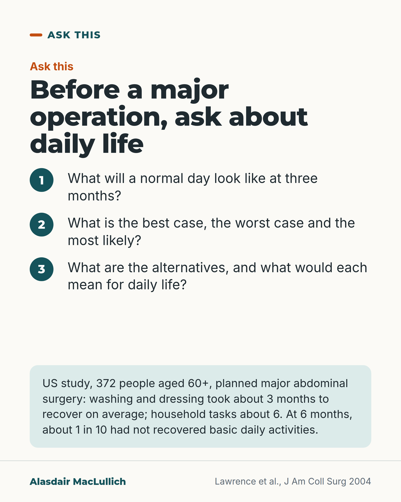

# G070: Ask what a normal day looks like at three months

- Category: C07 Treatment decisions and proportional care
- Audience: public
- Series: Ask this
- Post type: decision_support
- Visual format: question card
- Status: text text_final, visual final
- Working id: C07-P10 (candidate C07-01)

## Insight

After planned major abdominal surgery in people over 60, basic self-care took about 3 months to recover on average and household tasks about 6, and some never fully recovered. It is a fair question to ask before agreeing.

## Angle and position

Before a major operation, ask what a normal day is likely to look like at three months; many older people weigh loss of independence heavily, and UK consent law covers risks significant to you.

Basis: mixed: empirical (Lawrence 2004 cohort; Fried 2002 preferences study) and legal/ethical judgement (Montgomery test; the argument that loss of daily function is such a risk is marked as the author's view)

## X (974 characters)

```text
What will a normal day look like three months after a major operation?

It is a fair question to put to a surgical team. A US study published in 2004 followed 372 people aged 60 and over (average age 69) after planned major abdominal operations. Getting back to usual washing and dressing took about 3 months on average. Household tasks and getting out took about 6. At 6 months, about 1 in 10 had not recovered their basic daily activities.

In another US study, 226 seriously ill people aged 60 and over were asked what they would choose if the alternative to a treatment was dying of their illness. About 3 in 4 said they would not choose one that left them with severe physical disability.

UK consent law asks doctors to tell you about risks a reasonable person in your position would think significant. We should treat not getting back to washing, dressing or living at home as such a risk.

You can also ask: what is the best case, the worst case and the most likely?
```

## LinkedIn (1779 characters)

```text
What will a normal day look like three months after a major operation?

It is a fair question to put to a surgical team. The answer may shape the decision as much as the list of complications.

Recovery of everyday life can take months. A US study followed 372 people aged 60 and over (average age 69) after planned major abdominal operations. It took on average about 3 months to get back to their usual washing and dressing. Household tasks and getting out, such as shopping, cooking and managing money, took about 6 months. At 6 months, about 1 in 10 had not recovered their basic daily activities and about 1 in 5 their household activities. That study is from 2004, before faster recovery pathways became widespread. Averages hide wide variation.

In another US study, 226 seriously ill people aged 60 and over were asked what they would choose if the alternative to a treatment was dying of their illness. Almost all would accept a simple treatment that kept them as they were. About 3 in 4 said they would not choose it if it left them alive with severe physical disability. About 9 in 10 said the same if it left them with severe problems with thinking and memory.

Since a 2015 UK Supreme Court ruling known as Montgomery, doctors must tell you about any risk a reasonable person in your position would think significant. They must also tell you about any risk they know is significant to you, and about reasonable alternatives. We should treat not getting back to washing, dressing or living at home as that kind of risk for many older people.

Questions you can ask:
1. What is a normal day likely to look like at three months?
2. What is the best case, the worst case and the most likely outcome?
3. What are the alternatives, and what would each mean for daily life?
```

## Bluesky (257 characters)

```text
Before a major operation, ask: what will a normal day look like at three months?

In a US study from 2004 of people over 60 after planned abdominal surgery, washing and dressing took about 3 months on average to recover. Household tasks took about 6 months.
```

## Threads (438 characters)

```text
What will a normal day look like three months after a major operation? You can ask your surgical team.

A US study from 2004 followed 372 people aged 60 and over (average age 69) after planned abdominal surgery. Getting back to usual washing and dressing took about 3 months on average, and household tasks about 6 months. At 6 months, about 1 in 10 had not recovered basic daily activities.

Also ask: best case, worst case, most likely?
```

## Source reply

Sources: https://doi.org/10.1016/j.jamcollsurg.2004.05.280 https://doi.org/10.1056/NEJMsa012528 (quoting the Montgomery judgment, Montgomery v Lanarkshire Health Board [2015] UKSC 11) https://doi.org/10.1186/s12884-021-03574-2

## Visual



Alt text: Question card with three numbered questions to ask before a major operation: what a normal day looks like at three months; best, worst and most likely case; alternatives and what each means for daily life. Evidence panel: US study of 372 people aged 60+, washing and dressing recovered in about 3 months, household tasks about 6.

Editable source: `visuals/src/G070.html`

Design instructions: Single 4:5 question card, light ground. h1.m, three numbered steps at 36px, mint evidence panel at the foot. No chart.

## Sources and verification

- C07-01-a (supported_with_qualification): After elective major abdominal surgery in people aged 60 and over, recovery of basic daily activities took on average about 3 months and of household and community activities about 6 months; some had not recovered by 6 months.
  - Source: Lawrence VA, Hazuda HP, Cornell JE, Pederson T, Bradshaw PT, Mulrow CD, et al. Functional independence after major abdominal surgery in the elderly. J Am Coll Surg. 2004;199(5):762-72.
  - Passage: "Abstract: "This was a prospective cohort of 372 consecutive patients, 60 years old or more, enrolled from surgeons in private practice and two university-affiliated hospitals, assessed preoperatively and postoperatively at 1, 3, and 6 weeks, 3 and 6 months" ... "Mean age was 69 +/- 6 years" ... "Maximum functional declines (95% CI) occurred 1 week postoperatively" ... "Mean recovery times were: Mini-Mental State Exam, 3 weeks; timed walk, 6 weeks; ADL, SF-36 PCS, and functional reach, 3 months; and IADL, 6 months. Mean grip strength did not return to preoperative status by 6 months. The incidence of persistent disability at 6 months, compared with preoperative status, was: ADL, 9%; IADL, 19%" ... "Potentially modifiable independent predictors of ADL and IADL recovery were preoperative physical conditioning and depression plus serious postoperative complications." " (Abstract (Methods, Results))
- C07-01-b (supported_with_qualification): Most seriously ill older people who would accept a treatment that restored their current health said they would not choose it if the outcome was survival with severe functional or cognitive impairment.
  - Source: Fried TR, Bradley EH, Towle VR, Allore H. Understanding the treatment preferences of seriously ill patients. N Engl J Med. 2002;346(14):1061-6.
  - Passage: "Abstract: "We administered a questionnaire about treatment preferences to 226 persons who were 60 years of age or older and who had a limited life expectancy due to cancer, congestive heart failure, or chronic obstructive pulmonary disease." ... "For a low-burden treatment with the restoration of current health, 98.7 percent of participants said they would choose to receive the treatment (rather than not receive it and die), but 11.2 percent of these participants would not choose the treatment if it had a high burden. If the outcome was survival but with severe functional impairment or cognitive impairment, 74.4 percent and 88.8 percent of these participants, respectively, would not choose treatment." ... "The likelihood of adverse functional and cognitive outcomes of treatment requires explicit consideration." " (Abstract (Methods, Results, Conclusions))
- C07-01-c (supported_with_qualification): UK law (Montgomery v Lanarkshire Health Board, 2015) requires doctors to tell patients about material risks, judged by what a reasonable person in the patient's position, or this particular patient, would consider significant, and about reasonable alternatives.
  - Source: Nicholls JA, David AL, Iskaros J, Siassakos D, Lanceley A. Consent in pregnancy - an observational study of ante-natal care in the context of Montgomery: all about risk? BMC Pregnancy Childbirth. 2021;21(1):102.
  - Passage: "Background: "In the UK these rights are affirmed by professional guidance [] and, since 2015, by the UK Supreme Court following the landmark decision of Montgomery v Lanarkshire Health Board [] clarifying the nature of the relationship between healthcare professional (HCP) and patient on information disclosure." ... "By requiring a HCP to advise patients about alternatives and risks which may beto theirindividual circumstances it endorsed a patient's central role in decision-making." ... "The test of materiality is 'whether, in the circumstances of the particular case, a reasonable person in the patient's position would be likely to attach significance to the risk, or the doctor is or should reasonably be aware that the particular patient would be likely to attach significance to it [] (para 87). Whether a risk is regarded as material depends on the patient's perspective rather than the HCPs." Discussion: "Many legal cases have endorsed the duty to advise of 'reasonable' alternative care options". " (Background and Discussion (full text))

Verification notes: Recovery times: Lawrence 2004 (C07-01-a), elective abdominal surgery, US, 2004, population stated. Preferences: Fried 2002 (C07-01-b), hypothetical, seriously ill. Montgomery test: secondary source quoting para 87 (C07-01-c); link to daily function marked as an argument ('It is fair to argue'), not a legal ruling. Fried scenarios described as hypothetical. No claim that consent usually omits recovery; GMC wording not used. Best/worst/most likely offered as suggested questions only.

## Attention and follow potential

Pause: A concrete question most people have never thought to ask.

Gain: Three questions and a realistic sense of recovery time after major surgery.

Follow: Specific questions for appointments that older people and families can use the same week.

## Open issues

None.
