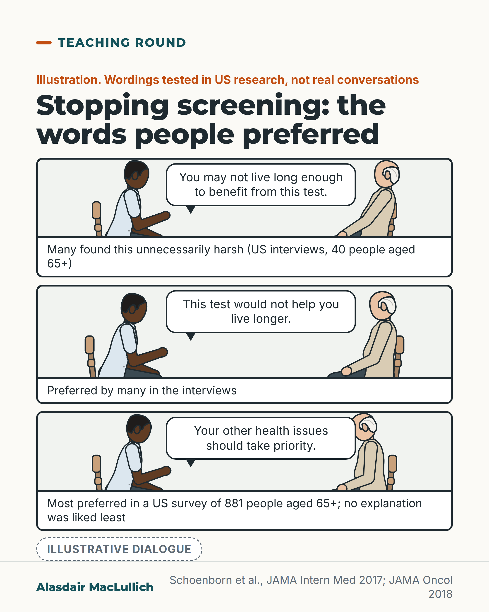

# G071: How to talk about stopping screening

- Category: C07 Treatment decisions and proportional care
- Audience: practitioners
- Series: Teaching round
- Post type: teaching
- Visual format: comic strip
- Status: text text_final, visual final
- Working id: C07-P11 (candidate C07-18)

## Insight

In US interviews, older adults were generally open to stopping cancer screening, but disliked being told they might not live long enough to benefit; they preferred explanations about their other health priorities, and liked no explanation least.

## Angle and position

When advising an older person to stop screening, explain it by benefit, harm and their other priorities, and offer prognosis to those who want it.

Basis: mixed: empirical (Schoenborn 2017 interviews; Schoenborn 2018 survey) and clinical/ethical judgement (how to phrase the advice, marked as such)

## X (869 characters)

```text
In US interviews, older people were generally open to stopping cancer screening. Many disliked one way of explaining it and preferred another.

In interviews with 40 adults aged 65 and over, people were generally open to stopping, especially if they trusted their clinician. Many found 'you may not live long enough to benefit from this test' unnecessarily harsh. They preferred 'this test would not help you live longer'.

In a US survey of 881 people aged 65 and over, ranking explanations in a hypothetical scenario, the explanation liked most was 'your other health issues should take priority'. Least liked: no explanation at all. Explanations mentioning life expectancy ranked low.

People were divided on whether life expectancy should come up at all. We should lead with benefit, harm and the person's other priorities, and offer prognosis to those who want it.
```

## LinkedIn (1402 characters)

```text
In US interviews, older people were generally open to stopping cancer screening. Many disliked one way of explaining it and preferred another.

In interviews with 40 adults aged 65 and over at one US centre, people were generally open to stopping screening, especially if they trusted their clinician. Many found 'you may not live long enough to benefit from this test' unnecessarily harsh. They preferred 'this test would not help you live longer'.

A national US survey of 881 people aged 65 and over then asked people to rank explanations in a hypothetical scenario:
1. Most preferred: 'your other health issues should take priority'.
2. Least preferred: the doctor gives no explanation at all.
3. Explanations that mentioned life expectancy ranked low.
A second survey found the same top and bottom choices in older adults with low health literacy.

Two points for practice. Giving no reason was the worst option, so saying nothing is not the kind choice. And people were divided on whether life expectancy should come up at all, so leading with benefit and priorities does not mean hiding prognosis.

These findings are from US populations and record what people said they would prefer. Screening programmes and ages differ in the UK.

We should explain stopping screening in terms of benefit, harm and the person's other health priorities, and offer to talk about prognosis for those who want it.
```

## Bluesky (299 characters)

```text
In interviews, US adults 65+ were open to stopping cancer screening, but many found 'you may not live long enough to benefit' harsh.

In a survey scenario, top pick: 'your other health issues should take priority'. Least: no explanation.

Lead with benefit and priorities; offer prognosis if wanted.
```

## Threads (487 characters)

```text
In US interviews, older people were generally open to stopping cancer screening. Many found 'you may not live long enough to benefit from this test' harsh, and preferred 'this test would not help you live longer'.

In a US survey of 881 people aged 65+, ranking explanations in a hypothetical scenario, the favourite explanation was 'your other health issues should take priority'. Least liked: no explanation.

Lead with benefit and priorities, and offer prognosis to those who want it.
```

## Source reply

Sources: https://doi.org/10.1001/jamainternmed.2017.1778 https://doi.org/10.1001/jamaoncol.2018.2100 https://doi.org/10.1007/s11606-019-05258-2

## Visual



Alt text: Three-panel illustration of a doctor facing an older man in a consulting room, each with a speech bubble of wording tested in US research: you may not live long enough to benefit (many found harsh); this test would not help you live longer (preferred by many); your other health issues should take priority (most preferred in a survey of 881).

Editable source: `visuals/src/G071.html`

Design instructions: Single 4:5 comic, strip.p3. Three Kit panels (same gp_room; Black woman doctor in doctor role, older white man with white hair in oat top, posture varies: leaning back, neutral, leaning in), HTML bubbles and captions, Illustrative dialogue badge. Claims per post claims_used.

## Sources and verification

- C07-18-a (supported_with_qualification): In interviews with 40 US older adults, most were open to stopping cancer screening, especially with a trusted clinician; many felt 'you may not live long enough to benefit from this test' was unnecessarily harsh compared with 'this test would not help you live longer'.
  - Source: Schoenborn NL, Lee K, Pollack CE, Armacost K, Dy SM, Bridges JFP, et al. Older adults' views and communication preferences about cancer screening cessation. JAMA Intern Med. 2017;177(8):1121-8.
  - Passage: "Abstract: "In this semistructured interview study, we interviewed 40 community-dwelling older adults (≥ 65 years) recruited at 4 clinical programs affiliated with an urban academic medical center." ... "The participants' average age was 75.7 years." ... "First, participants were amenable to stopping cancer screening, especially in the context of a trusting relationship with their clinician. Second, although many participants supported using age and health status to individualize the screening decision, they did not often understand the role of life expectancy." ... "Third, participants preferred that clinicians explain a recommendation to stop screening by incorporating individual health status but were divided on whether life expectancy should be mentioned. Specific wording of life expectancy was important; many felt the language of "you may not live long enough to benefit from this test" was unnecessarily harsh compared with the more positive messaging of "this test would not help you live longer."" " (Abstract (Results))
- C07-18-b (supported_with_qualification): In a US national survey of 881 adults aged 65 and over, the most preferred explanation for stopping screening was 'your other health issues should take priority'; the least preferred was the doctor giving no explanation; explanations mentioning life expectancy ranked low.
  - Source: Schoenborn NL, Janssen EM, Boyd CM, Bridges JFP, Wolff AC, Pollack CE. Preferred clinician communication about stopping cancer screening among older US adults: results from a national survey. JAMA Oncol. 2018;4(8):1126-8.; Schoenborn NL, Crossnohere NL, Janssen EM, Pollack CE, Boyd CM, Wolff AC, et al. Examining generalizability of older adults' preferences for discussing cessation of screening colonoscopies in older adults with low health literacy. J Gen Intern Med. 2019;34(11):2512-9.
  - Passage: "Schoenborn 2018 (full-text excerpts via Scite): "Among 1272 eligible panel members (aged ≥65 years, English-speaking) invited to participate, 881 (69.3%) completed the survey in November 2016. We used the best-worst scaling method to test the participants' preferences for 13 different phrases that a clinician may use to explain why a patient should not undergo a routine cancer screening test." ... "The mean (SD) age of the 881 participants was 73.4 (6.1) years" ... "The most preferred phrase to explain stopping cancer screening was "your other health issues should take priority" (mean score, 0.41; 95% CI, 0.39-0.43), and the least preferred option was "the doctor does not give an explanation" (score, −0.42; 95% CI, −0.44 to −0.40) (Figure). Other more preferred phrases included references to guidelines, older age, the lack of benefit, and the high risk for harm from the screening test." Discussion: "Although the study relied on a hypothetical scenario, this approach allowed us to elicit perspectives from a large national sample. Consistent with results from an earlier qualitative study, we found that the most preferred explanation centered on a priority shift to focus on other health issues. Explanations that mentioned guidelines and that mentioned older age were also highly rated, whereas mentioning life expectancy ranked low." ... "In particular, framing the discussion around lack of benefit, without necessarily mentioning life expectancy, may be a more appealing communication strategy." Schoenborn 2019 abstract: "The most preferred phrase to explain stopping screening colonoscopy was "Your other health issues should take priority" in both groups. The three least preferred options were also the same for both groups, with the least preferred being "The doctor does not give an explanation."" " (Schoenborn 2018 Methods, Results, Discussion (Scite full-text excerpts); Schoenborn 2019 abstract)
- C07-18-d (supported_with_qualification): Older adults were divided on whether life expectancy should be mentioned, so clinicians should still offer prognosis to people who want it.
  - Source: Schoenborn NL, Lee K, Pollack CE, Armacost K, Dy SM, Bridges JFP, et al. Older adults' views and communication preferences about cancer screening cessation. JAMA Intern Med. 2017;177(8):1121-8.
  - Passage: "Abstract: "Third, participants preferred that clinicians explain a recommendation to stop screening by incorporating individual health status but were divided on whether life expectancy should be mentioned." Conclusions: "older adults may not consider life expectancy important in screening and may not prefer to hear about life expectancy when discussing screening." " (Abstract (Results, Conclusions))

Verification notes: Interview themes (no percentages), phrase pair: Schoenborn 2017 (C07-18-a). Survey most and least preferred quoted exactly; life-expectancy phrases 'ranked low', not labelled least preferred (C07-18-b). Divided views and offering prognosis marked as advice (C07-18-d). US data; no UK screening ages stated. Royce 2014 not used.

## Attention and follow potential

Pause: Clinicians recognise the harsh phrase; many have used it.

Gain: Tested wording for a common, awkward conversation, and the reminder that saying nothing was liked least.

Follow: Teaching points on the exact words used in clinical conversations.

## Open issues

None.
