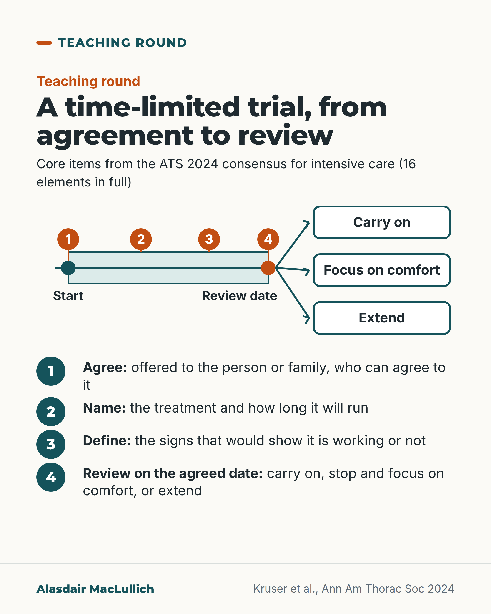

# G072: Setting up a time-limited trial

- Category: C07 Treatment decisions and proportional care
- Audience: practitioners
- Series: Teaching round
- Post type: teaching
- Visual format: diagram
- Status: text text_final, visual final
- Working id: C07-P12 (candidate C07-26)

## Insight

A time-limited trial is an agreed plan to give a treatment for a set time, with named signs of response and a review with options to continue, stop and focus on comfort, or extend. The plan is often incomplete in practice.

## Angle and position

When benefit is uncertain, offer a time-limited trial with written signs, a duration and a review, agreed with the person or family.

Basis: mixed: empirical (ATS 2024 consensus definition; Chang 2021 before-and-after; Kruser 2024; Piscitello 2025) and clinical judgement (applying it beyond critical care is extrapolation, and the rationale is not a measured effect)

## X (885 characters)

```text
When nobody knows whether a treatment will help, a time-limited trial sets a fixed time for the treatment and an agreed review at the end.

Expert consensus for intensive care (ATS 2024) lists four core items. The plan is offered to the person or family, who can agree to it. It names the treatment, how long it runs, the signs that would show it is working or not, and what happens at review: carry on, stop and focus on comfort, or extend.

A US before-and-after study in three intensive care units (mean age 64, so not just older people) trained doctors in this approach. Family meetings then named signs of improvement in almost 9 in 10 of the meetings held, up from about 1 in 5. Median ICU stay fell from 8.7 to 7.4 days. Hospital deaths were unchanged (58 in 100).

Reviews find parts of the plan are often missing. Write down the signs, the date and the plan for either result.
```

## LinkedIn (1841 characters)

```text
When nobody knows whether a treatment will help, a time-limited trial sets a fixed time for the treatment and an agreed review at the end.

The definition comes from expert consensus (American Thoracic Society, 2024): an agreed plan to give a treatment for a set time, after which the person's response guides the next step. That step can be to carry on, to stop and focus on comfort, or to extend the trial.

A time-limited trial differs from 'let's see how it goes' in four ways:
1. The plan is offered to the person or family, who can agree to it.
2. It names the treatment and how long it will run.
3. It names the signs that would show it is working or not.
4. It says what happens at the review.
These are core items from a fuller consensus of 16 elements, and the plan can be extended rather than binding.

The stated aim is to avoid both open-ended treatment and stopping at once: full-quality care for a fair period, judged by criteria agreed in advance. That is the rationale of the approach.

What has been measured is modest. A US before-and-after study in three intensive care units (not specific to older people, mean age 64) trained doctors to use time-limited trials. The share of family meetings that named signs of improvement rose from about 1 in 5 to almost 9 in 10. Median ICU stay fell from 8.7 to 7.4 days, and fewer people were ventilated (86 in 100 before the training, 73 in 100 after). Hospital deaths did not change (58 in 100 in both periods).

In practice the approach is often done partly. Reviews find parts of the plan missing. In one US health system, only about 1 in 100 goals-of-care notes recorded a time-limited trial.

The consensus was written for critical care. Using it for other decisions in older people is a reasonable extrapolation. Write down the signs, the date and the plan for either result.
```

## Bluesky (275 characters)

```text
A time-limited trial, as defined for intensive care, means giving a treatment for an agreed time. It has named signs that it is working, a review date, and a plan to continue, to stop and focus on comfort, or to extend.

Agree it with the person or family, and write it down.
```

## Threads (497 characters)

```text
A time-limited trial in intensive care: consensus is to agree with the person or family the treatment, how long it runs, the signs it is working, and what happens at review (carry on, focus on comfort, or extend).

A before-and-after study in three US intensive care units (not only older people), almost 9 in 10 family meetings named signs of improvement after training, against about 1 in 5 before. Hospital deaths did not change.

Write down the signs, the date, and the plan for either result.
```

## Source reply

Sources: https://doi.org/10.1513/AnnalsATS.202310-925ST https://doi.org/10.1001/jamainternmed.2021.1000 https://doi.org/10.1016/j.chest.2023.12.014

## Visual



Alt text: Timeline from Start to Review date with a shaded treatment period and numbered markers 1 to 4, then three arrows to Carry on, Focus on comfort and Extend. Numbered list: agree, name, define the signs of working or not, and review on the agreed date.

Editable source: `visuals/src/G072.html`

Design instructions: Single 4:5 diagram. SVG timeline 920x330: start dot, pale teal period, orange review dot, numbered markers 1-4, three arrows to outlined end boxes; numbered steps list below. No data.

## Sources and verification

- C07-26-a (supported): A time-limited trial is an agreed plan to use a treatment for a defined period, after which the person's response decides whether to continue, stop and focus on comfort, or extend.
  - Source: Kruser JM, Ashana DC, Courtright KR, Kross EK, Neville TH, Rubin E, et al. Defining the time-limited trial for patients with critical illness: an official American Thoracic Society workshop report. Ann Am Thorac Soc. 2024;21(2):187-99.; Vink EE, Azoulay E, Caplan A, Kompanje EJO, Bakker J. Time-limited trial of intensive care treatment: an overview of current literature. Intensive Care Med. 2018;44(9):1369-77.
  - Passage: "ATS 2024, Key Conclusions: "The time-limited trial in critical care is operationally defined as a collaborative plan among clinicians and a patient and/or their surrogate decision maker(s) to use life-sustaining therapy for a defined duration, after which the patient’s response to therapy informs the decision to continue care directed toward recovery, transition to care focused exclusively on comfort, or extend the trial’s duration." | Vink 2018, Abstract: "A TLT is an agreement to initiate all necessary treatments or treatments with clearly delineated limitations for a certain period of time to gain a more realistic understanding of the patient's chances of a meaningful recovery or to ascertain the patient's wishes and values."" (ATS: Overview, Key Conclusions; Section 1. Vink: Abstract.)
- C07-26-b (supported_with_qualification): The plan should state the treatment, how long it will run, the clinical signs that will show improvement or deterioration, and what will happen at review; it is proposed to and agreed with the person or family.
  - Source: Kruser JM, Ashana DC, Courtright KR, Kross EK, Neville TH, Rubin E, et al. Defining the time-limited trial for patients with critical illness: an official American Thoracic Society workshop report. Ann Am Thorac Soc. 2024;21(2):187-99.
  - Passage: "ATS 2024, Introduction: "This approach has been described as an attempt or “trial” of life-sustaining therapy, with specific, agreed-on guidelines designed to help clinicians, patients, and surrogates evaluate whether the therapy is providing benefit to the patient. These guidelines typically include a boundary on how long the trial lasts and clinical criteria that help determine the patient’s response to the therapy. After the trial is over, patients (if able), surrogates, and clinicians use these criteria to consider whether to continue life-sustaining therapies or, instead, focus exclusively on comfort ()." | Section 1: "Our committee concluded that the time-limited trial approach is distinct from current “usual care” for patients with critical illness, largely because of strong consensus that the trial is explicitly proposed to the patient and/or surrogate(s) who can then endorse the structured plan." | Section 2: "we measured participants’ views on these respective roles for three major elements of a time-limited trial:) the clinical criteria of improvement and deterioration,) the duration, and) the acceptable degree of recovery or the clinical outcome after the time-limited trial." | Key Conclusions: "A time-limited trial is composed of 16 essential elements that follow four sequential phases: consider, plan, support, and reassess."" (ATS 2024 full text: Introduction; Section 1; Section 2; Key Conclusions.)
- C07-26-c (supported_with_qualification): In a US ICU quality-improvement study, training clinicians to use time-limited trials was associated with better family meetings, shorter ICU stays and fewer invasive procedures, without a change in hospital mortality.
  - Source: Chang DW, Neville TH, Parrish J, Ewing L, Rico C, Jara L, et al. Evaluation of time-limited trials among critically ill patients with advanced medical illnesses and reduction of nonbeneficial ICU treatments. JAMA Intern Med. 2021;181(6):786-94.; Kruser JM, Ashana DC, Courtright KR, Kross EK, Neville TH, Rubin E, et al. Defining the time-limited trial for patients with critical illness: an official American Thoracic Society workshop report. Ann Am Thorac Soc. 2024;21(2):187-99.
  - Passage: "Chang 2021, Abstract: "This prospective quality improvement study was conducted from June 1, 2017, to December 31, 2019, at the medical ICUs of 3 academic public hospitals in California." ... "A total of 209 patients were included (mean [SD] age, 63.6 [16.3] years" ... "identifying clinical markers of improvement (9 [20.9%] vs 52 [88.1%]; P < .01), were discussed more frequently after intervention. Median ICU length of stay was significantly reduced between preintervention and postintervention periods (8.7 [interquartile range (IQR), 5.7-18.3] days vs 7.4 [IQR, 5.2-11.5] days; P = .02). Hospital mortality was similar between the preintervention and postintervention periods (66 of 113 [58.4%] vs 56 of 96 [58.3%], respectively; P = .99). Invasive ICU procedures were used less frequently in the postintervention period (eg, mechanical ventilation preintervention, 97 [85.8%] vs postintervention, 70 [72.9%]; P = .02)." | ATS 2024, Section 4: "To our knowledge, the time-limited trial approach has been tested in only one pre-post study of a quality improvement program focused on implementation. In that study, surrogates experienced earlier and more frequent family meetings, though there was no change in their satisfaction with medical care or amount of decision making conflict ()."" (Chang: Abstract. ATS: Section 4 (Potential challenges).)
- C07-26-d (supported_with_qualification): Time-limited trials are often carried out incompletely and are rarely documented.
  - Source: Kruser JM, Nadig NR, Viglianti EM, Clapp JT, Secunda KE, Halpern SD. Time-limited trials for patients with critical illness: a review of the literature. Chest. 2024;165(4):881-91.; Piscitello GM, Arnold RM, Schell JO, Kruser JM. Characterizing the documentation of time-limited trials in goals of care notes. J Pain Symptom Manage. 2025;70(2):e129-36.
  - Passage: "Kruser 2024 (Chest), Abstract: "When time-limited trials are used, they are often implemented incompletely and challenged by systematic barriers (eg, continually rotating ICU staff)." ... "some older adults appear to favor time-limited trial strategies over indefinite life-sustaining therapy or care immediately focused on comfort." | Piscitello 2025, Abstract: "Of 5475 GOC-template notes, we found reference to a TLT in 1% (n = 69/5475)."" (Abstracts.)
- C07-26-e (supported_with_qualification): The purpose of a time-limited trial is to avoid both open-ended treatment without benefit and giving up too early.
  - Source: Kruser JM, Ashana DC, Courtright KR, Kross EK, Neville TH, Rubin E, et al. Defining the time-limited trial for patients with critical illness: an official American Thoracic Society workshop report. Ann Am Thorac Soc. 2024;21(2):187-99.
  - Passage: "ATS 2024, Key Conclusions: "This specific approach to patient care aims to uphold a set of goals held by many patients: to extend life when possible and to avoid prolonged life-sustaining therapy if the chance of survival is low or the impact on quality of life is unacceptable." | Introduction: "In critical care, the time-limited trial approach aims to provide greater nuance to a clinical decision that is often oversimplified as a dichotomous choice between either open-ended life-sustaining therapy or an immediate transition to comfort-focused, end-of-life care." | Table 3: "Trials of high-quality, standard-of-care therapies" (should be) vs "Lower quality care" (should not be)." (ATS 2024: Key Conclusions; Introduction; Table 3.)

Verification notes: Definition and outcomes of review: ATS 2024 full text (C07-26-a). Four core items simplify 16 elements, labelled as such (C07-26-b). Chang 2021 labelled US ICU before-and-after, mean age 64, deaths unchanged (C07-26-c). Incomplete use and 1 in 100 notes (C07-26-d, US). Middle-path aim marked as rationale (C07-26-e). Extrapolation beyond critical care stated. Quill & Holloway not cited.

## Attention and follow potential

Pause: 'Let's see how it goes' is familiar; the four written items are not.

Gain: A structure that can be written into the notes today, with honest limits of the evidence.

Follow: Teaching points on handling uncertainty in treatment decisions for older people.

## Open issues

None.
