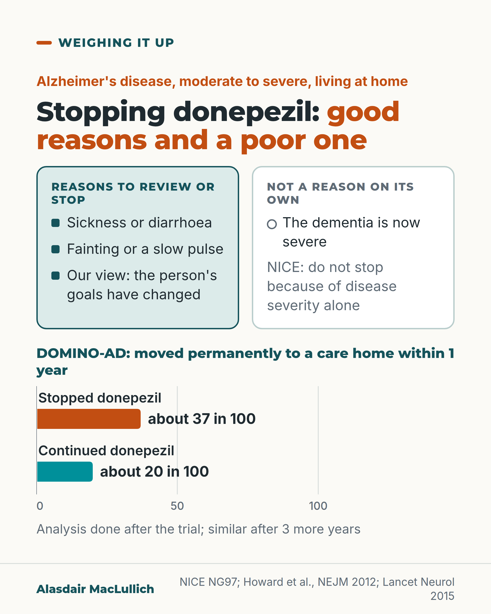

# G073: Severity alone is not a reason to stop donepezil

- Category: C08 Dementia: living with it and caring well
- Audience: practitioners
- Series: Weighing it up
- Post type: decision_support
- Visual format: comparison with bar strip
- Status: text text_final, visual final
- Working id: C08-P01 (candidate C08-03)

## Insight

NICE advises against stopping donepezil and similar medicines in Alzheimer's disease because of severity alone. In DOMINO-AD, people who stopped had slightly worse cognition and function over a year, and more moved into a care home in the first year, though not over the next three.

## Angle and position

The habit of stopping once dementia is 'severe' assumes the drug no longer does anything. The trial evidence shows small continued benefits, so the decision should rest on side effects, the person's goals and the stage of illness.

Basis: mixed: NICE wording and DOMINO-AD results are empirical; that a care home move alone is no reason to stop, and that stopping near the end of life is often sensible, are clinical and ethical judgement

## X (1006 characters)

```text
Severe dementia on its own is not a reason to stop donepezil. NICE says: do not stop acetylcholinesterase inhibitors in people with Alzheimer's disease because of disease severity alone.

The DOMINO-AD trial is the main evidence. In 295 people living at home with moderate to severe Alzheimer's, those who kept taking donepezil for a year did better on cognition and daily function than those who stopped. The difference in cognition (1.9 points on a 30-point scale) was larger than the trial's own threshold for clinical importance of 1.4 points. The difference in daily function (3.0 points on a 60-point scale) was smaller than its threshold of 3.5 points.

In an analysis done after the trial, about 37 in 100 who stopped had moved into a care home within a year, against about 20 in 100 who continued. Over the next 3 years the two groups had similar numbers who had moved into a care home.

In our view, stop for side effects or when the person's goals change. Do not stop for a severity score alone.
```

## LinkedIn (1845 characters)

```text
Severe dementia on its own is not a reason to stop donepezil.

NICE's dementia guideline says: do not stop acetylcholinesterase inhibitors in people with Alzheimer's disease because of disease severity alone. It does not say never stop.

The main evidence is DOMINO-AD, a UK trial of 295 people living at home with moderate to severe Alzheimer's disease.

Those who kept taking donepezil for a year scored better on memory and thinking tests and on everyday activities than those who stopped. The difference in memory and thinking scores (1.9 points on a 30-point scale) was larger than the 1.4 points the researchers had set as clinically important. The difference in everyday activities (3.0 points on a 60-point scale) was smaller than their 3.5-point threshold.

In an extra analysis done after the trial, about 37 in 100 people who stopped donepezil had moved permanently into a care home within a year, compared with about 20 in 100 who kept taking it. Over the next 3 years the two groups ended up with similar numbers of moves. This was not the trial's main question.

A Cochrane review of stopping these medicines found that stopping may worsen thinking, function and behaviour, but most of that evidence is of low certainty.

Side effects remain good reasons to review or stop: sickness and diarrhoea, and fainting or a slow pulse, which are more common in people taking these medicines.

In our judgement, a change in what the person wants from treatment is also a reason to review. A move into a care home is not a reason to stop on its own. In the last weeks of life, stopping is often sensible.

When you next review a person on donepezil, write down why you are stopping or continuing. Severity alone should not be the reason.

Sources: NICE NG97; Howard et al., NEJM 2012 and Lancet Neurology 2015; Parsons et al., Cochrane 2021.
```

## Bluesky (296 characters)

```text
NICE: do not stop donepezil in Alzheimer's for severity alone.

In DOMINO-AD, people who kept taking it did better on thinking and daily activities. In an extra analysis, 37 in 100 who stopped moved to a care home within a year, vs 20 in 100.

In our view, stop for side effects or changed goals.
```

## Threads (498 characters)

```text
Severe dementia on its own is not a reason to stop donepezil. NICE says not to stop these medicines in Alzheimer's disease because of severity alone.

In the DOMINO-AD trial of 295 people at home, those who kept taking it did better over a year on thinking and daily activities. In an extra analysis, about 37 in 100 who stopped moved to a care home within a year, vs about 20 in 100. Over the next 3 years, similar numbers in each group moved.

In our view, stop for side effects or changed goals.
```

## Source reply

Sources: NICE NG97 https://www.nice.org.uk/guidance/ng97 | DOMINO-AD https://doi.org/10.1056/NEJMoa1106668 | care home analysis https://doi.org/10.1016/S1474-4422(15)00258-6 | Cochrane https://doi.org/10.1002/14651858.CD009081.pub2

## Visual



Alt text: Comparison card. Left: sickness or diarrhoea, fainting or slow pulse, our view that goals changed are reasons to review or stop. Right: severe dementia alone is not a reason (NICE). Below, bars: about 37 in 100 who stopped donepezil moved permanently to a care home within a year, against about 20 in 100 who continued; analysis done after the trial.

Editable source: `visuals/src/G073.html`

Design instructions: Single 4:5 light card. Kicker, h1.s with orange em. Compare columns (mint filled-square column for reasons, white hollow-circle column for the poor reason). Bar chart on a 0 to 100 axis, stopped in orange, continued in teal, direct labels. Claims C08-03-a, c, e. No drawing.

## Sources and verification

- C08-03-a (supported): NICE advises not stopping acetylcholinesterase inhibitors (donepezil, galantamine, rivastigmine) in people with Alzheimer's disease because of disease severity alone.
  - Source: National Institute for Health and Care Excellence. Dementia: assessment, management and support for people living with dementia and their carers. NICE guideline NG97. London: NICE; 2018.
  - Passage: "• Do not stop AChE inhibitors in people with Alzheimer's disease because of disease severity alone." (NICE NG97 PDF, recommendations on pharmacological management (Scite full-text excerpt); same sentence in WebSearch extract of nice.org.uk/guidance/ng97/chapter/recommendations)
- C08-03-b (supported_with_qualification): In DOMINO-AD, people with moderate to severe Alzheimer's disease who continued donepezil had small benefits in cognition and daily function over 12 months compared with those who stopped.
  - Source: Howard R, McShane R, Lindesay J, Ritchie C, Baldwin A, Barber R, et al. Donepezil and memantine for moderate-to-severe Alzheimer's disease. N Engl J Med. 2012;366(10):893-903.
  - Passage: "We assigned 295 community-dwelling patients who had been treated with donepezil for at least 3 months and who had moderate or severe Alzheimer's disease (a score of 5 to 13 on the Standardized Mini-Mental State Examination [SMMSE, on which scores range from 0 to 30, with higher scores indicating better cognitive function]) ... The minimum clinically important differences were 1.4 points on the SMMSE and 3.5 points on the BADLS. Patients assigned to continue donepezil, as compared with those assigned to discontinue donepezil, had a score on the SMMSE that was higher by an average of 1.9 points (95% confidence interval [CI], 1.3 to 2.5) and a score on the BADLS that was lower (indicating less impairment) by 3.0 points (95% CI, 1.8 to 4.3) (P<0.001 for both comparisons)." (Abstract (Methods, Results))
- C08-03-c (supported_with_qualification): In DOMINO-AD, about 37 in 100 people who stopped donepezil moved permanently into a care home within the first year, compared with about 20 in 100 who continued; there was no difference over the following 3 years.
  - Source: Howard R, McShane R, Lindesay J, Ritchie C, Baldwin A, Barber R, et al. Nursing home placement in the Donepezil and Memantine in Moderate to Severe Alzheimer's Disease (DOMINO-AD) trial: secondary and post-hoc analyses. Lancet Neurol. 2015;14(12):1171-81.
  - Passage: "Discontinuing donepezil treatment increased the probability of NHP over the first 6 months from 0.06 to 0.19 (difference 0.13, 95% CI, 0.04 to 0.21) and over the first 12 months from 0.20 to 0.37 (difference 0.17, 95% CI, 0.06 to 0.28), see Table 3. [Published abstract:] 162 (55%) patients underwent nursing home placement within 4 years of randomisation, with similar numbers for all groups ... We noted significant (p=0·010) heterogeneity of treatment effect over time, with significantly more nursing home placements in the combined donepezil discontinuation groups during the first year (hazard ratio 2·09 [95% CI 1·29-3·39]) than in the combined donepezil continuation groups, and no difference during the next 3 years (0·89 [0·58-1·35]). ... Analyses restricted to risk of placement in the first year of follow-up after the patients had completed the double-blind phase of the trial were post-hoc." (Results, piecewise modelling and Table 3 (accepted manuscript via Scite); Abstract (PubMed))
- C08-03-d (supported): Pooled trials suggest stopping cholinesterase inhibitors may worsen cognition, function and behaviour, but the evidence is mostly low certainty and it is unknown whether this differs with dementia severity.
  - Source: Parsons C, Lim WY, Loy C, McGuinness B, Passmore P, Ward SA, et al. Withdrawal or continuation of cholinesterase inhibitors or memantine or both, in people with dementia. Cochrane Database Syst Rev. 2021;2(2):CD009081.
  - Passage: "This review suggests that discontinuing cholinesterase inhibitors may result in worse cognitive, neuropsychiatric and functional status than continuing treatment, although this is supported by limited evidence, almost all of low or very low certainty. As all participants had dementia due to Alzheimer's disease, our findings are not transferable to other dementia types. We were unable to determine whether the effects of discontinuing cholinesterase inhibitors differed with baseline dementia severity. ... We found no clear evidence of an effect of discontinuation on ... number of adverse events (OR 0.85, 95% CI 0.57 to 1.27; 4 studies; low certainty) or serious adverse events (OR 0.80, 95% CI 0.46 to 1.39; 4 studies; low certainty), and on mortality (OR 0.75, 95% CI 0.36 to 1.55; 5 studies; low certainty)." (Abstract (Main results, Authors' conclusions))
- C08-03-e (supported): Side effects that can justify stopping include nausea, vomiting and diarrhoea, and fainting linked with a slow heart rate.
  - Source: Birks JS, Harvey RJ. Donepezil for dementia due to Alzheimer's disease. Cochrane Database Syst Rev. 2018;6(6):CD001190.; Kim DH, Brown RT, Ding EL, Kiel DP, Berry SD. Dementia medications and risk of falls, syncope, and related adverse events: meta-analysis of randomized controlled trials. J Am Geriatr Soc. 2011;59(6):1019-31.; Park-Wyllie LY, Mamdani MM, Li P, Gill SS, Laupacis A, Juurlink DN. Cholinesterase inhibitors and hospitalization for bradycardia: a population-based study. PLoS Med. 2009;6(9):e1000157.
  - Passage: "Birks 2018: "People taking donepezil were more likely than those taking placebo to report side effects and to drop out of the studies. Most side effects were described as mild. Nausea, vomiting and diarrhoea were most common." Kim 2011: "ChEI use was associated with greater risk of syncope (odds ratio (OR)=1.53, 95% confidence interval (CI)=1.02-2.30) than placebo". Park-Wyllie 2009: "Among older patients, initiation of cholinesterase inhibitor therapy was associated with a more than doubling of the risk of hospitalization for bradycardia."" (Birks 2018 plain language summary (Scite full-text excerpt); Kim 2011 abstract Results; Park-Wyllie 2009 abstract Conclusions)

Verification notes: NICE NG97 wording read in the NICE PDF (official_document), quoted closely (C08-03-a). DOMINO-AD main results from abstract (C08-03-b), with qualification that function difference was below the MCID and participants lived at home. Care home figures from full text (C08-03-c), stated as absolute, post hoc, no HR used. Cochrane low-certainty (C08-03-d). Side-effect reasons from Birks, Kim, Park-Wyllie (C08-03-e); weight loss omitted. Care home move and end of life points are judgement (C08-03-f not_found), marked as judgement ('In our view') in all four captions and on the visual, together with the changed-goals reason.

## Attention and follow potential

Pause: Prescribers who stop donepezil at a care home move or when a score falls.

Gain: The NICE wording, the size of the benefit, and a clear list of good reasons to stop.

Follow: Treatment decisions set out with benefits, harms and the person's goals together.

## Open issues

None.
