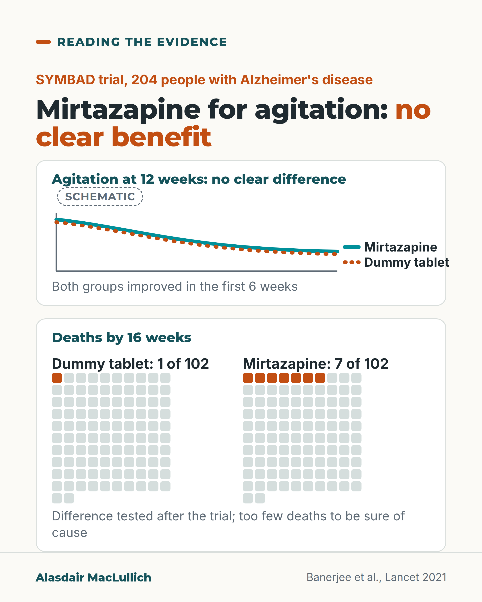

# G074: Mirtazapine as the replacement for antipsychotics

- Category: C08 Dementia: living with it and caring well
- Audience: practitioners
- Series: Reading the evidence
- Post type: evidence_interpretation
- Visual format: chart (schematic panel and icon arrays)
- Status: text text_final, visual final
- Working id: C08-P02 (candidate C08-15)

## Insight

In the SYMBAD trial, mirtazapine did no better than a dummy tablet for agitation in Alzheimer's disease at 12 weeks, and 7 of 102 people on it died by 16 weeks against 1 of 102, a result too small to be sure about.

## Angle and position

Moving away from antipsychotics can move prescribing to other sedating drugs that feel safer but have not shown benefit. With no benefit shown, the possible harm has nothing to offset it.

Basis: mixed: trial results are empirical; the position that mirtazapine should not be used for agitation follows the authors' conclusion and is clinical judgement

## X (789 characters)

```text
Mirtazapine for agitation in Alzheimer's disease: a UK trial found no clear benefit over a dummy tablet.

SYMBAD randomised 204 people whose agitation had not improved with non-drug care, mostly through old-age psychiatry services and care homes. At 12 weeks agitation was no better with mirtazapine. Both groups improved by a similar amount in the first 6 weeks.

By 16 weeks, 7 of 102 people on mirtazapine had died, against 1 of 102 on the dummy tablet. Deaths were counted as a safety check. The comparison of deaths was run after the trial ended. The numbers are too small to be sure the drug caused them.

The authors concluded the results do not support mirtazapine for agitation. In our view, a drug that seems safer than an antipsychotic still needs a shown benefit to justify it.
```

## LinkedIn (1838 characters)

```text
Mirtazapine for agitation in Alzheimer's disease: a UK trial found no clear benefit over a dummy tablet.

Mirtazapine is prescribed for agitation in dementia, partly because it seems a safer choice than an antipsychotic. In US care homes between 2009 and 2014, antipsychotic use fell while use of mood stabilisers, such as valproate and carbamazepine, rose, possibly as a substitute.

SYMBAD tested mirtazapine directly. It gave 204 people with Alzheimer's disease and agitation that had not improved with non-drug care either mirtazapine or a dummy tablet for 12 weeks. Most were recruited through old-age psychiatry services and care homes, in 26 UK centres.

At 12 weeks, agitation was no better with mirtazapine than with the dummy tablet. Agitation eased in both groups, by a similar amount, in the first 6 weeks. The authors say that could reflect usual care, the natural course of the problem, regression to the mean or placebo effects.

By 16 weeks, 7 of 102 people on mirtazapine had died, compared with 1 of 102 on the dummy tablet.

Treat the deaths finding with care. The comparison of deaths was run after the trial ended. The numbers are small. Causes of death varied. An earlier trial of mirtazapine for depression in dementia did not show more deaths. With no benefit to set against it, the possible harm still counts.

The researchers concluded that their results do not support using mirtazapine to treat agitation in dementia. This applies to agitation in Alzheimer's or mixed dementia, not to mirtazapine for depression.

In our judgement, a drug that seems safer than an antipsychotic still needs a shown benefit. Where agitation persists, look for the cause of the distress, and review any sedating drug against a named goal.

Source: Banerjee et al., Lancet 2021 (SYMBAD); Maust et al., JAMA Internal Medicine 2018.
```

## Bluesky (277 characters)

```text
Mirtazapine did no better than a dummy tablet for agitation in Alzheimer's disease in the UK SYMBAD trial of 204 people.

By 16 weeks, 7 of 102 on mirtazapine had died vs 1 of 102 on the dummy tablet: too few to be sure of cause.

No benefit shown, so the possible harm counts.
```

## Threads (443 characters)

```text
Mirtazapine is sometimes used for agitation in dementia, partly because it seems safer than an antipsychotic.

In the UK SYMBAD trial of 204 people with Alzheimer's disease, it did no better than a dummy tablet at 12 weeks. Agitation eased in both groups.

By 16 weeks, 7 of 102 people on mirtazapine had died, against 1 of 102 on the dummy tablet. Too few to be sure the drug caused it. With no benefit shown, that possible harm still counts.
```

## Source reply

Sources: SYMBAD https://doi.org/10.1016/S0140-6736(21)01210-1 | US care home prescribing https://doi.org/10.1001/jamainternmed.2018.0379

## Visual



Alt text: Two panels. Schematic sketch: agitation lines for mirtazapine and dummy tablet fall together over 12 weeks, no clear difference. Icon arrays of 102 squares each: 1 filled for the dummy tablet, 7 filled for mirtazapine, deaths by 16 weeks. Note: tested after the trial, too few deaths to be sure of cause.

Editable source: `visuals/src/G074.html`

Design instructions: Single 4:5 light card. Panel 1 schematic (labelled Schematic, no numeric axis): solid teal and dotted orange near-identical falling lines with keys. Panel 2 two 10-wide arrays of 102 squares, dummy tablet first (1 filled), mirtazapine (7 filled), orange fill vs pale grey. Claims C08-15-b, c.

## Sources and verification

- C08-15-a (supported): SYMBAD randomised 204 people with probable or possible Alzheimer's disease and agitation not helped by non-drug care to mirtazapine (target 45 mg) or placebo in 26 UK centres; most came from old-age psychiatry services and care homes.
  - Source: Banerjee S, High J, Stirling S, Shepstone L, Swart AM, Telling T, et al. Study of mirtazapine for agitated behaviours in dementia (SYMBAD): a randomised, double-blind, placebo-controlled trial. Lancet. 2021;398(10310):1487-97.
  - Passage: "This parallel-group, double-blind, placebo-controlled trial-the Study of Mirtazapine for Agitated Behaviours in Dementia trial (SYMBAD)-was done in 26 UK centres. Participants had probable or possible Alzheimer's disease, agitation unresponsive to non-drug treatment, and a Cohen-Mansfield Agitation Inventory (CMAI) score of 45 or more. They were randomly assigned (1:1) to receive either mirtazapine (titrated to 45 mg) or placebo. ... 204 participants were recruited and randomised. [Full text:] Finally, there are potential limitations in generalisability because we recruited most participants from old-age psychiatry services and care homes" (Abstract (Methods, Findings); Discussion (limitations))
- C08-15-b (supported): Agitation at 12 weeks did not differ between mirtazapine and placebo; agitation fell by about 10 points in both groups.
  - Source: Banerjee S, High J, Stirling S, Shepstone L, Swart AM, Telling T, et al. Study of mirtazapine for agitated behaviours in dementia (SYMBAD): a randomised, double-blind, placebo-controlled trial. Lancet. 2021;398(10310):1487-97.
  - Passage: "Mean CMAI scores at 12 weeks were not significantly different between participants receiving mirtazapine and participants receiving placebo (adjusted mean difference –1·74, 95% CI –7·17 to 3·69; p=0·53). [Full text:] Severity of agitation decreased in both groups at 6 weeks by around 10 CMAI points and continued to be lower than baseline scores at 12 weeks ... the closeness of the findings in both groups makes it highly unlikely that the results we found would have been different had there been another 18 participants" (Abstract (Findings); Results; Discussion)
- C08-15-c (supported_with_qualification): There were 7 deaths with mirtazapine and 1 with placebo by week 16; a post hoc test gave p = 0.065, and the trial was not powered for deaths.
  - Source: Banerjee S, High J, Stirling S, Shepstone L, Swart AM, Telling T, et al. Study of mirtazapine for agitated behaviours in dementia (SYMBAD): a randomised, double-blind, placebo-controlled trial. Lancet. 2021;398(10310):1487-97.
  - Passage: "Mortality differed between groups with a potentially higher rate in the mirtazapine group (seven deaths in the mirtazapine and one in the placebo group by 16-week safety follow-up). Post-hoc statistical analyses suggested weak evidence of a mortality difference between groups (Fisher's exact test p=0·065). ... Second, the difference in mortality observed might have been by chance. This study was not powered to investigate a mortality difference between the groups. The analysis was post-hoc and its statistical significance marginal; in our previous study of depression in dementia, there were no more deaths in 108 participants randomly allocated to mirtazapine than in 111 participants randomly allocated to placebo." (Results (adverse events); Discussion (limitations))
- C08-15-d (supported): The authors concluded the data do not support mirtazapine for agitation in dementia.
  - Source: Banerjee S, High J, Stirling S, Shepstone L, Swart AM, Telling T, et al. Study of mirtazapine for agitated behaviours in dementia (SYMBAD): a randomised, double-blind, placebo-controlled trial. Lancet. 2021;398(10310):1487-97.
  - Passage: "This trial found no benefit of mirtazapine compared with placebo, and we observed a potentially higher mortality with use of mirtazapine. The data from this study do not support using mirtazapine as a treatment for agitation in dementia." (Abstract (Interpretation))
- C08-15-e (supported_with_qualification): Mirtazapine is prescribed for agitation in dementia, partly to avoid antipsychotics; and when antipsychotic use has fallen, use of other sedating drugs has risen.
  - Source: Banerjee S, High J, Stirling S, Shepstone L, Swart AM, Telling T, et al. Study of mirtazapine for agitated behaviours in dementia (SYMBAD): a randomised, double-blind, placebo-controlled trial. Lancet. 2021;398(10310):1487-97.; Maust DT, Kim HM, Chiang C, Kales HC. Association of the Centers for Medicare & Medicaid Services' National Partnership to Improve Dementia Care with the use of antipsychotics and other psychotropics in long-term care in the United States from 2009 to 2014. JAMA Intern Med. 2018;178(5):640-7.
  - Passage: "SYMBAD: "We assessed the efficacy and safety of mirtazapine, an antidepressant prescribed for agitation in dementia." "One reason for high rates of prescription of mirtazapine in later life is to avoid the use of antipsychotics." Maust 2018: "The use of mood stabilizers was growing before initiation of the partnership and then accelerated after initiation of the partnership ... However, the use of mood stabilizers, possibly as a substitute for antipsychotics, increased and accelerated after initiation of the partnership in both long-term care residents overall and in those with dementia. Measuring use of antipsychotics alone may be an inadequate proxy for quality of care and may have contributed to a shift in prescribing to alternative medications with a poorer risk-benefit balance."" (SYMBAD Abstract (Background) and Discussion; Maust 2018 Abstract (Results, Conclusions))

Verification notes: SYMBAD full text: design and setting (C08-15-a), null primary and parallel improvement (C08-15-b), deaths 7 vs 1 post hoc with caveats (C08-15-c), authors' conclusion (C08-15-d). Substitution point worded as 'possibly as a substitute', US care homes, mood stabilisers (C08-15-e). No p-values or CMAI numbers for lay reading. Improvement in both groups explained with the authors' own list of possible reasons (C08-15-b conflicting note); no claim that agitation 'often eases with time'.

## Attention and follow potential

Pause: Prescribers who moved from antipsychotics to mirtazapine because it felt safer.

Gain: A clear reading of a null trial and why the deaths signal still counts without being overstated.

Follow: Careful readings of trials that change everyday prescribing.

## Open issues

None.
