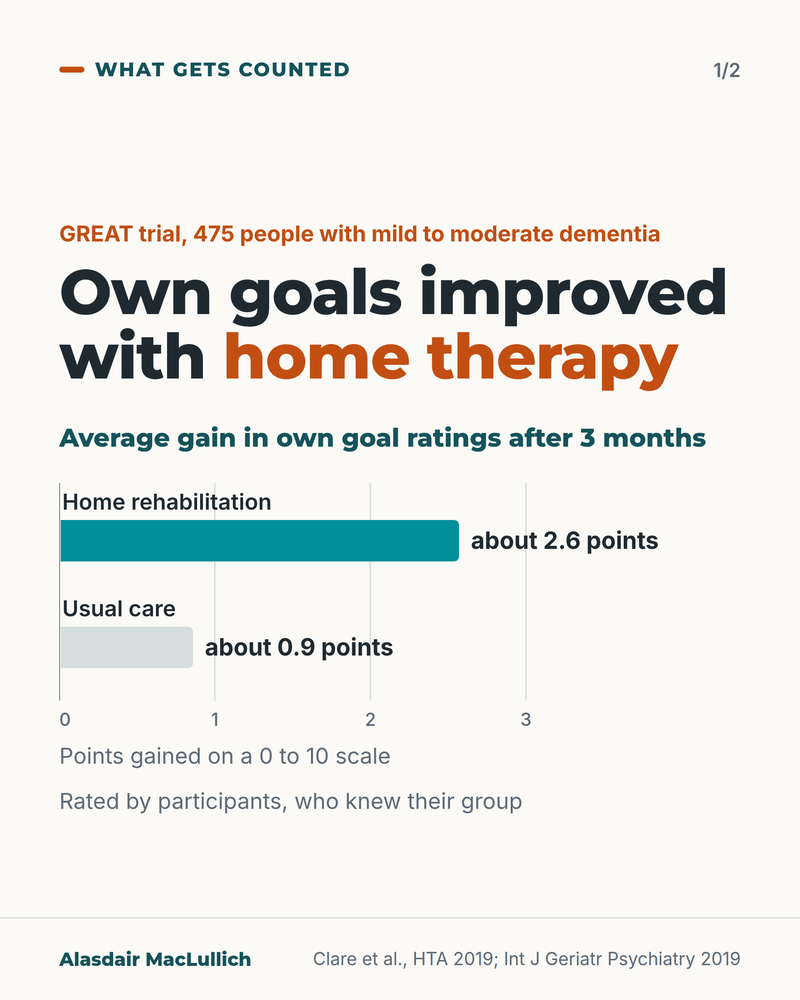
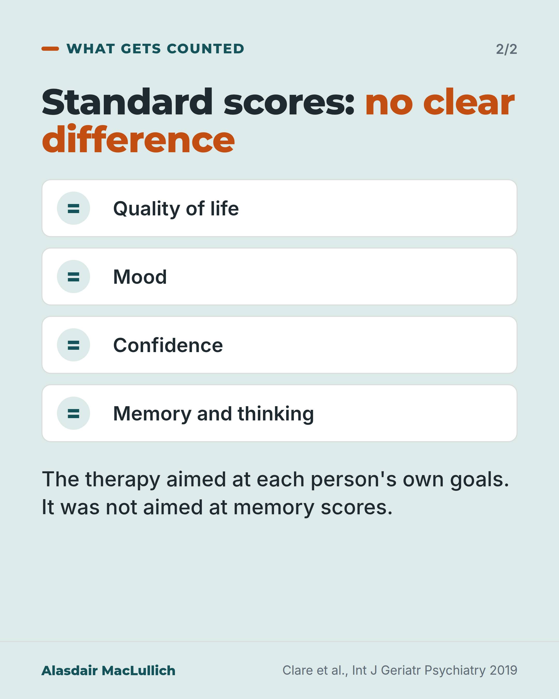

# G075: The goals improved; the standard scores did not

- Category: C08 Dementia: living with it and caring well
- Audience: both
- Series: What gets counted
- Post type: evidence_interpretation
- Visual format: carousel, 2 cards (bar chart, list)
- Status: text text_final, visual final
- Working id: C08-P03 (candidate C08-06)

## Insight

In the GREAT trial, home-based goal-focused rehabilitation helped people with early dementia manage their own chosen everyday goals much better, while standard questionnaires on quality of life, mood and memory showed no clear difference.

## Angle and position

The therapy aimed at each person's goals, and the goal ratings measured that. The general scales measured things the therapy did not target. Services and trials should count progress on the person's own goals alongside standard scales.

Basis: mixed: trial results are empirical; the position that services should measure people's own goals is judgement

## X (910 characters)

```text
In the GREAT trial, people with early dementia each chose up to three everyday activities they wanted to manage better.

475 people living at home, each with a family member involved, were randomly assigned to home-based rehabilitation, mostly with occupational therapists, or usual care. Therapy could use prompts, memory aids and practising the skill, over 10 weekly visits then 4 more.

On a 0 to 10 scale, ratings of their own goals rose about 2.6 points after 3 months with therapy, against about 0.9 with usual care. The gain held at 9 months, and family ratings agreed.

Standard questionnaires on quality of life, mood and memory showed no clear difference. The therapy aimed at the goals, not at memory scores.

Two cautions: the people giving the ratings knew they had had therapy, and an attentive visitor may explain some of the gain.

In our view, services should count the person's own goals too.
```

## LinkedIn (1810 characters)

```text
In the GREAT trial, people with early dementia each chose up to three everyday activities they wanted to manage better.

The trial randomly assigned 475 people living at home, each with a family member involved, to goal-focused rehabilitation or usual care. Nine in 10 completed it.

Therapy was 10 weekly home visits of an hour, then 4 more visits over 6 months, mostly from occupational therapists. They worked on the person's goals using prompts, memory aids and practising the skill.

People rated how well they managed each goal on a 0 to 10 scale. After 3 months, ratings rose by about 2.6 points on average with therapy, compared with about 0.9 points with usual care. The researchers called this a large effect. It was still there at 9 months, and family members' ratings agreed.

On standard questionnaires for quality of life, mood, confidence and memory, the trial did not show a clear difference.

The therapy aimed at each person's goals. The goal ratings measured what it set out to change. Memory scores measured something else.

The costings showed the same split. Judged by a standard measure of years of good health gained, the therapy showed no evidence of value for money. Judged by the goals people chose, it may be good value, if a service is willing to pay for each point of goal improvement.

Two cautions. The people rating the goals knew they had had therapy. And the trial could not rule out that some benefit came from having an attentive visitor.

In our judgement, dementia services and trials should record progress on the goals people set for themselves, alongside the standard scales. Otherwise a therapy that helps with what people asked for can look as if it did nothing.

Sources: Clare et al., Health Technology Assessment 2019; Clare et al., Int J Geriatr Psychiatry 2019.
```

## Bluesky (297 characters)

```text
GREAT trial: 475 people with early dementia got home therapy on chosen goals, or usual care.

Goal ratings (0 to 10) rose 2.6 with therapy, 0.9 without, rated by people who knew their group. Quality of life, mood and memory: no clear difference.

In our view, services should record goal progress.
```

## Threads (493 characters)

```text
In the GREAT trial, people with early dementia each chose up to three everyday activities to manage better. About half were randomly assigned to work on them at home with a therapist; the rest had usual care.

On a 0 to 10 scale, goal ratings rose about 2.6 points with therapy, against about 0.9 with usual care. Quality of life, mood and memory scores showed no clear difference.

The people giving the ratings knew their group. In our view, services should count the person's own goals too.
```

## Source reply

Sources: GREAT trial https://doi.org/10.3310/hta23100 | goal analysis https://doi.org/10.1002/gps.5076

## Visual



Alt text: Bars from 0 to 3 points on a 0 to 10 goal scale: average gain in own goal ratings at 3 months about 2.6 with home rehabilitation, about 0.9 with usual care. Rated by participants who knew their group. GREAT trial, 475 people with mild to moderate dementia.



Alt text: Standard scores showed no clear difference: quality of life, mood, confidence, memory and thinking, each marked with an equals sign. The therapy aimed at own goals, not memory scores.

Editable source: `visuals/src/G075.html`

Design instructions: Two 4:5 cards. Card 1 light: h1 with orange em, bar chart axis 0 to 3 (teal 2.57, pale grey 0.86), notes. Card 2 mint: four rows with equals icons, lead text. Claims C08-06-a, c, d, f. No drawing (omitted in simplified run).

## Sources and verification

- C08-06-a (supported): GREAT randomised 475 people with mild to moderate Alzheimer's, vascular or mixed dementia, living at home with a family carer, to home-based cognitive rehabilitation or usual treatment; 90% completed the trial.
  - Source: Clare L, Kudlicka A, Oyebode JR, Jones RW, Bayer A, Leroi I, et al. Goal-oriented cognitive rehabilitation for early-stage Alzheimer's and related dementias: the GREAT RCT. Health Technol Assess. 2019;23(10):1-242.
  - Passage: ""Participants had an International Classification of Diseases, Tenth Edition, diagnosis of Alzheimer's disease or vascular or mixed dementia, had mild to moderate cognitive impairment (Mini Mental State Examination score of ≥ 18 points), were stable on medication if prescribed, and had a family carer who was willing to contribute." ... "SETTING Community." ... "A total of 475 participants were randomised (CR arm, n = 239; TAU arm, n = 236), 427 participants (90%) completed the trial and 426 participants were analysed (CR arm, n = 208, TAU arm, n = 218)." Plain-language summary: "(GREAT) was run in eight centres to find out whether or not CR improves everyday functioning."" (HTA report: structured abstract (Participants, Setting, Results) and plain-language summary)
- C08-06-b (supported): The rehabilitation was 10 weekly one-hour sessions over 3 months and 4 maintenance sessions over the next 6 months, at home, working on up to three goals the person chose, delivered by nine occupational therapists and one nurse, using methods such as prompts, memory aids and practising skills.
  - Source: Clare L, Kudlicka A, Oyebode JR, Jones RW, Bayer A, Leroi I, et al. Individual goal-oriented cognitive rehabilitation to improve everyday functioning for people with early-stage dementia: a multicentre randomised controlled trial (the GREAT trial). Int J Geriatr Psychiatry. 2019;34(5):709-21.; Clare L, Kudlicka A, Oyebode JR, Jones RW, Bayer A, Leroi I, et al. Goal-oriented cognitive rehabilitation for early-stage Alzheimer's and related dementias: the GREAT RCT. Health Technol Assess. 2019;23(10):1-242.
  - Passage: "IJGP full text, Methods: "The intervention consisted of 10 weekly 1‐hour individual sessions of goal‐oriented CR over a 3‐month period followed by four 1‐hour maintenance sessions over the subsequent 6 months, conducted in the participant's home. CR involved working collaboratively on up to three rehabilitation goals chosen by the participant, using a problem‐solving approach." ... "CR could potentially be delivered by therapists from various professional backgrounds; in this trial, the therapists were nine occupational therapists and one nurse." Introduction: "These methods may include the use of environmental adaptations and prompts, introduction of compensatory strategies and memory aids, procedural learning of skills, and methods for learning or relearning relevant information."" (Int J Geriatr Psychiatry 2019, Methods (Intervention) and Introduction)
- C08-06-c (supported_with_qualification): Participant-rated goal attainment improved with a large effect at 3 months (d 0.97) and was maintained at 9 months (d 0.94); carer ratings agreed (d 1.11 and 0.96). On the 0 to 10 goal scale, average ratings rose by 2.57 points with therapy and 0.86 points with usual treatment at 3 months.
  - Source: Clare L, Kudlicka A, Oyebode JR, Jones RW, Bayer A, Leroi I, et al. Individual goal-oriented cognitive rehabilitation to improve everyday functioning for people with early-stage dementia: a multicentre randomised controlled trial (the GREAT trial). Int J Geriatr Psychiatry. 2019;34(5):709-21.; Clare L, Kudlicka A, Oyebode JR, Jones RW, Bayer A, Leroi I, et al. Goal-oriented cognitive rehabilitation for early-stage Alzheimer's and related dementias: the GREAT RCT. Health Technol Assess. 2019;23(10):1-242.
  - Passage: "IJGP abstract: "At 3 months, there were statistically significant large positive effects for participant-rated goal attainment (d = 0.97; 95% CI, 0.75-1.19), corroborated by informant ratings (d = 1.11; 95% CI, 0.89-1.34). These effects were maintained at 9 months for both participant (d = 0.94; 95% CI, 0.71-1.17) and informant (d = 0.96; 95% CI, 0.73-1.2) ratings." HTA abstract: "mean change in the CR arm: 2.57; mean change in the TAU arm: 0.86". IJGP full text, Methods: "The primary outcome was participant‐rated goal attainment at 3 months, recorded using a previously validated client‐centred attainment measure, a simple 0 to 10 scale that is accessible and feasible for people with cognitive impairment to complete; an improvement of 2 points in the goal attainment rating for any individual goal is considered to be clinically significant." ... "All participants chose up to three goals at baseline and rated current attainment; attainment ratings were then averaged across each participant's goals to give a single summary rating."" (IJGP abstract (Results) and Methods (Outcomes); HTA abstract (Results))
- C08-06-d (supported): There were no significant differences in quality of life, mood, self-efficacy or cognition (or in carer stress and quality of life).
  - Source: Clare L, Kudlicka A, Oyebode JR, Jones RW, Bayer A, Leroi I, et al. Individual goal-oriented cognitive rehabilitation to improve everyday functioning for people with early-stage dementia: a multicentre randomised controlled trial (the GREAT trial). Int J Geriatr Psychiatry. 2019;34(5):709-21.; Clare L, Kudlicka A, Oyebode JR, Jones RW, Bayer A, Leroi I, et al. Goal-oriented cognitive rehabilitation for early-stage Alzheimer's and related dementias: the GREAT RCT. Health Technol Assess. 2019;23(10):1-242.
  - Passage: "IJGP abstract: "Secondary outcomes at 3 and 9 months included informant-reported goal attainment, quality of life, mood, self-efficacy, and cognition and study partner stress and quality of life." ... "There were no significant differences in secondary outcomes." Full text, Results: "Following Bonferroni correction, there were no significant differences. Effect sizes were small to negligible, although in some cases with wide confidence intervals."" (IJGP abstract (Methods, Results); Results (secondary outcomes))
- C08-06-e (supported): The gains related to the goals directly targeted in therapy; for the goals actually worked on, the improvement was larger (2.84 points at 3 months).
  - Source: Clare L, Kudlicka A, Oyebode JR, Jones RW, Bayer A, Leroi I, et al. Individual goal-oriented cognitive rehabilitation to improve everyday functioning for people with early-stage dementia: a multicentre randomised controlled trial (the GREAT trial). Int J Geriatr Psychiatry. 2019;34(5):709-21.
  - Passage: "IJGP abstract: "The observed gains related to goals directly targeted in the therapy." Full text, Results: "The CR group participants identified 679 goals and worked on 481 (71%) of these with the therapists. Taking just the 481 goals that were addressed in therapy, the mean change in participants' goal attainment ratings was an improvement of 2.84 points (SD 2.84) at 3 months and 2.77 points (SD 3.18) at 9 months, while." Limitations: "While participants were invited to select up to three goals, on average, the therapists were able to address two goals per participant. The primary outcome was based on ratings of progress with all goals identified at baseline, rather than just those goals that were actually addressed; therefore, the overall estimate of improvement in goal attainment is a conservative one. Ratings for the goals that were directly addressed showed a clinically meaningful degree of change."" (IJGP abstract (Results); Results (goal attainment); Discussion (Strengths and limitations))
- C08-06-f (supported): Reading cautiously: the trial was single-blind (only researchers blinded) and the authors say it could not separate the specific effect of rehabilitation from non-specific effects of therapist contact; they also say the standard scales were not expected to change and may have missed wider benefits.
  - Source: Clare L, Kudlicka A, Oyebode JR, Jones RW, Bayer A, Leroi I, et al. Individual goal-oriented cognitive rehabilitation to improve everyday functioning for people with early-stage dementia: a multicentre randomised controlled trial (the GREAT trial). Int J Geriatr Psychiatry. 2019;34(5):709-21.
  - Passage: "Full text, Methods: "This was a multicentre, single‐blind pragmatic RCT comparing CR added to usual treatment (CR) with usual treatment alone (TAU). Outcomes were assessed 3 and 9 months post randomisation." ... "All assessments were conducted in participants' homes by trained researchers blind to group allocation." Limitations: "The trial design did not allow us to conclusively demonstrate that benefits were due to the specific effects of CR rather than nonspecific effects of contact with a therapist; however, the observed gains related specifically to improvements in functional ability for goals directly targeted in the therapy, and in the pilot trial, CR demonstrated benefits over an active control condition." Discussion: "The finding of no differences in cognitive test scores was unsurprising as the intervention does not directly seek to improve cognitive function. As only a small proportion of participants reported clinical levels of depression or anxiety at baseline, there was little scope for the intervention to demonstrate improvements in these domains." ... "However, the qualitative findings were at odds with the results from secondary outcome measures. The intervention may therefore have provided wider benefits that were not detected by available standardised measures."" (IJGP Methods (Design; Assessments); Discussion (Strengths and limitations; How the findings relate to other evidence))
- C08-06-g (supported): Measured by quality-adjusted life years, the standard economic yardstick, the trial found no evidence of cost-effectiveness; measured against the goals, rehabilitation was cost-effective at willingness-to-pay values of £2,500 or more per unit improvement.
  - Source: Clare L, Kudlicka A, Oyebode JR, Jones RW, Bayer A, Leroi I, et al. Goal-oriented cognitive rehabilitation for early-stage Alzheimer's and related dementias: the GREAT RCT. Health Technol Assess. 2019;23(10):1-242.
  - Passage: "HTA abstract: "In the cost-utility analyses, there was no evidence of cost-effectiveness in terms of gains in the quality-adjusted life-years (QALYs) of the person with dementia (measured using the DEMentia Quality Of Life questionnaire utility score) or the QALYs of the carer (measured using the EuroQol-5 Dimensions, three-level version) from either cost perspective. In the cost-effectiveness analyses, by reference to the primary outcome of participant-rated goal attainment, CR was cost-effective from both the health and social care perspective and the societal perspective at willingness-to-pay values of £2500 and above for improvement in the goal attainment measure."" (HTA report abstract (Results))

Verification notes: C08-06-a,b from HTA abstract and IJGP full text; C08-06-c 2.57 vs 0.86 on 0 to 10 scale, participant-rated with carer agreement; C08-06-d no clear difference, not proof of none; C08-06-e gains confined to targeted goals; C08-06-f unblinded raters and attention effect, carried in all versions except Bluesky, where length forced the core only (qualification carried by 'no clear difference' and the visual). C08-06-g QALY vs goal costing in LinkedIn. No goal types named (C08-06-h).

## Attention and follow potential

Pause: Anyone who has seen a therapy judged only on memory scores.

Gain: A way to read trials and services by what people asked for, plus the limits of self-rated outcomes.

Follow: Posts on what services count and what they miss.

## Open issues

None.
