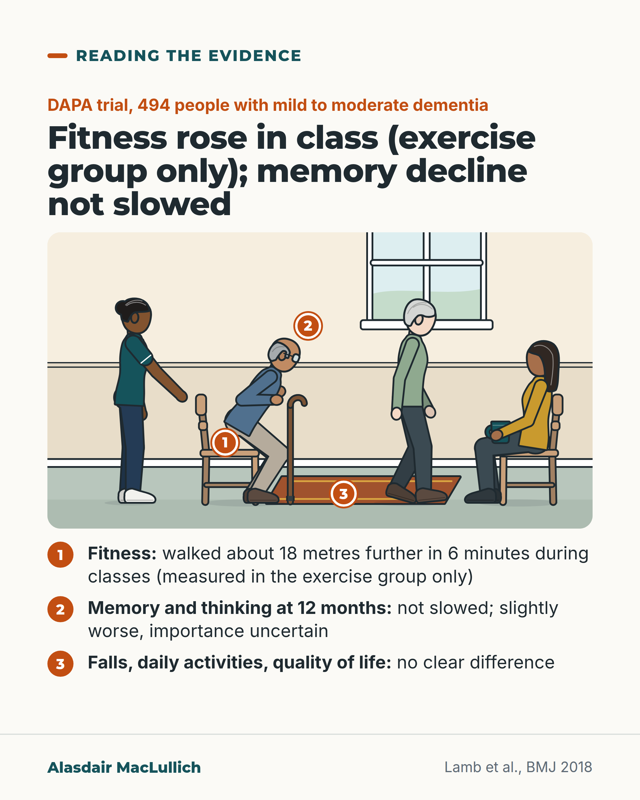

# G076: Exercise in dementia: stronger, not a memory treatment

- Category: C08 Dementia: living with it and caring well
- Audience: both
- Series: Reading the evidence
- Post type: evidence_interpretation
- Visual format: annotated scene
- Status: text text_final, visual final
- Working id: C08-P04 (candidate C08-24)

## Insight

In the DAPA trial of 494 people with mild to moderate dementia, four months of fairly hard gym exercise made people fitter, but a year later memory and thinking had not declined more slowly; scores were slightly worse, by an amount of uncertain importance.

## Angle and position

Offer exercise to people with dementia for strength, mobility and enjoyment, and be accurate that it has not been shown to slow memory loss.

Basis: mixed: trial findings are empirical; offering exercise for strength and enjoyment is clinical judgement supported by a strength-training trial

## X (881 characters)

```text
A large trial in England tested 4 months of fairly hard gym exercise for people with dementia. At 12 months from the start, their memory and thinking had not declined more slowly.

DAPA randomly assigned 494 people with mild to moderate dementia to twice-weekly aerobic and strength classes, or to usual care.

During the classes the exercise group walked further and lifted heavier weights, though this was measured only in that group. At 12 months, thinking scores were slightly worse in the exercise group, by about 1.4 points on a 70-point test. The researchers were unsure whether a difference that size is important. There was no clear difference in daily activities, quality of life or falls.

A German trial of frail older people with dementia found they could build strength. In our view, offer exercise for strength and enjoyment. Do not promise it will slow memory loss.
```

## LinkedIn (2088 characters)

```text
A large trial in England tested 4 months of fairly hard gym exercise for people with dementia. At 12 months from the start, their memory and thinking had not declined more slowly.

The DAPA trial randomly assigned 494 people with mild to moderate dementia to a supervised programme of fairly hard aerobic and strength exercise, twice a week for 4 months, or to usual care.

What it found:

1. While the classes ran, people in the exercise group walked about 18 metres further in six minutes after six weeks, and lifted heavier weights. This was measured only in the exercise group, so the authors could not be definite the programme caused it.
2. At 12 months, memory and thinking scores were slightly worse in the exercise group, by about 1.4 points on a 70-point test. The researchers were unsure whether a difference that size is important.
3. There was no clear difference in everyday activities, behaviour, quality of life, carers' strain or falls.

The thinking scores suggest possible slight harm; the trial did not establish harm. This programme, at this intensity, did not slow decline. Gentler exercise was not tested.

A German trial of 122 frail older people with mild to moderate dementia found that 3 months of strength and functional training made them stronger and quicker at standing up from a chair than a gentle comparison activity.

Exercise with balance training reduces falls in older people living at home generally. In DAPA, falls did not show a clear difference. The range of possible effects was wide. So this benefit should not be promised to people with dementia on this evidence.

In DAPA, 23 of 329 people in the exercise group (about 7 in 100) had a health problem linked to the exercise, and 4 had a serious one; this was recorded only in that group. In our judgement, offer exercise to people with dementia for strength and getting up from a chair, and for enjoyment if they like it. Be straight that it has not been shown to slow memory loss.

Sources: Lamb et al., BMJ 2018 (DAPA); Hauer et al., J Am Geriatr Soc 2012; Sherrington et al., Cochrane 2019.
```

## Bluesky (295 characters)

```text
In the DAPA trial, 494 people with mild to moderate dementia had 4 months of fairly hard gym exercise or usual care.

At 12 months from the start, memory and thinking scores were slightly worse in the exercise group, by an uncertain amount.

In our view, do not promise it will slow memory loss.
```

## Threads (487 characters)

```text
In the DAPA trial in England, 494 people with mild to moderate dementia did 4 months of fairly hard gym exercise or usual care. Fitness rose during the classes (measured only in their group).

At 12 months from the start, memory and thinking scores were slightly worse in the exercise group, by an amount of uncertain importance. Falls and daily activities did not show a clear difference.

In our view, offer exercise for strength and enjoyment. Do not promise it will slow memory loss.
```

## Source reply

Sources: DAPA https://doi.org/10.1136/bmj.k1675 | strength training in dementia https://doi.org/10.1111/j.1532-5415.2011.03778.x | exercise and falls https://doi.org/10.1002/14651858.CD012424.pub2

## Visual



Alt text: Drawn community exercise class: a man with a walking stick rises from a chair while a physiotherapist stands ready beside him, an older woman walks, a carer sits holding a cup. Three pins: 1 fitness rose about 18 metres in a 6 minute walk (exercise group only); 2 memory and thinking not slowed, slightly worse; 3 no clear difference in falls, daily activities or quality of life.

Editable source: `visuals/src/G076.html`

Design instructions: Single 4:5 light card. Scene on warm lounge ground: older man (olive skin, glasses, crook stick) sit-to-stand from chair, physio (brown skin, bun) beside him hand ready, older woman walking, seated carer with cup, mat on floor. Pins 1-3 in orange with key list below. Claims C08-24-a to d.

## Sources and verification

- C08-24-a (supported): DAPA randomised 494 people with mild to moderate dementia in 15 English regions to usual care plus 4 months of supervised moderate to high intensity aerobic and strength exercise (twice-weekly gym groups of 60 to 90 minutes, plus home exercise and support to stay active) or usual care alone.
  - Source: Lamb SE, Sheehan B, Atherton N, Nichols V, Collins H, Mistry D, et al. Dementia And Physical Activity (DAPA) trial of moderate to high intensity exercise training for people with dementia: randomised controlled trial. BMJ. 2018;361:k1675.
  - Passage: "Abstract: "494 people with dementia: 329 were assigned to an aerobic and strength exercise programme and 165 were assigned to usual care. Random allocation was 2:1 in favour of the exercise arm." ... "Usual care plus four months of supervised exercise and support for ongoing physical activity, or usual care only. Interventions were delivered in community gym facilities and NHS premises." Full text, Study treatments: "Thereafter, people with dementia attended group sessions in a gym twice a week for four months; each session lasted 60 to 90 minutes. We also asked the participants to do home exercises for one additional hour each week during this period." Setting: "National Health Service primary care, community and memory services, dementia research registers, and voluntary sector providers in 15 English regions."" (Abstract (Setting, Participants, Interventions); Methods (Study treatments))
- C08-24-b (supported_with_qualification): At 12 months, ADAS-cog scores were slightly worse in the exercise group (adjusted difference 1.4 points, 95% CI 0.2 to 2.6, on a 0 to 70 scale where higher is worse); the programme did not slow cognitive decline, and the authors judged the difference small with uncertain clinical relevance.
  - Source: Lamb SE, Sheehan B, Atherton N, Nichols V, Collins H, Mistry D, et al. Dementia And Physical Activity (DAPA) trial of moderate to high intensity exercise training for people with dementia: randomised controlled trial. BMJ. 2018;361:k1675.
  - Passage: "Abstract: "By 12 months the mean ADAS-cog score had increased to 25.2 (SD 12.3) in the exercise arm and 23.8 (SD 10.4) in the usual care arm (adjusted between group difference -1.4, 95% confidence interval -2.6 to -0.2, P=0.03). This indicates greater cognitive impairment in the exercise group, although the average difference is small and clinical relevance uncertain." ... "A moderate to high intensity aerobic and strength exercise training programme does not slow cognitive impairment in people with mild to moderate dementia." Full text, Outcomes: "(ADAS-cog 11 item scale, scored 0 to 70; higher scores indicate worse cognitive impairment)". Interpretation: "We did not prespecify a value for a negative effect, but the average effect observed was smaller than our prespecified superiority target of 2.45 ADAS-cog points. An influential international consensus group suggests that a between group difference of 2 points (or 25%) might be worthwhile depending on the cost and safety profile of the intervention." ... "the treatment difference was at least half as much as the annual rate of decline." Conclusion: "does not slow cognitive decline and might worsen cognitive impairment in people with mild to moderate dementia."" (Abstract (Results, Conclusion); Methods (Outcomes); Discussion (Interpretation); Conclusion)
- C08-24-c (supported_with_qualification): Physical fitness improved in the short term with exercise: six-minute walk distance improved by 18.1 m over six weeks, and weights lifted increased.
  - Source: Lamb SE, Sheehan B, Atherton N, Nichols V, Collins H, Mistry D, et al. Dementia And Physical Activity (DAPA) trial of moderate to high intensity exercise training for people with dementia: randomised controlled trial. BMJ. 2018;361:k1675.
  - Passage: "Abstract: "Physical fitness (including the six minute walk test) was measured in the exercise arm during the intervention." ... "Six minute walking distance improved over six weeks (mean change 18.1 m, 95% confidence interval 11.6 m to 24.6 m)." Full text, Intervention: "Weight lifted improved in all strengthening exercises across the sessions, as did the duration of higher intensity aerobic activity." Limitations: "Physical fitness improved, but we are limited to data in the exercise arm and during the structured exercise intervention period only. Hence we cannot conclude definitively that the intervention improves physical fitness. It is unlikely that fitness would have improved in the usual care arm as there was no evidence of engagement in exercise or physiotherapy."" (Abstract (Main outcome measures, Results); Results (Intervention); Discussion (Strengths and limitations))
- C08-24-d (supported): There were no differences in secondary outcomes: activities of daily living, behavioural symptoms, health-related quality of life, carer burden or quality of life, or falls.
  - Source: Lamb SE, Sheehan B, Atherton N, Nichols V, Collins H, Mistry D, et al. Dementia And Physical Activity (DAPA) trial of moderate to high intensity exercise training for people with dementia: randomised controlled trial. BMJ. 2018;361:k1675.
  - Passage: "Abstract: "No differences were found in secondary outcomes or preplanned subgroup analyses by dementia type (Alzheimer's disease or other), severity of cognitive impairment, sex, and mobility." Full text, Outcomes: "No evidence was found of differences in other secondary outcomes, including the rate of falls over 12 months (incident rate ratio 1.1, 95% confidence interval 0.8 to 1.6; P=0.69)." Discussion: "The exercise improved physical fitness in the short term, but this did not translate into improvements in activities of daily living, behavioural outcomes, or health related quality of life."" (Abstract (Results); Results (Outcomes); Discussion)
- C08-24-e (supported_with_qualification): Strength and function training adapted for people with dementia improves strength and physical performance.
  - Source: Hauer K, Schwenk M, Zieschang T, Essig M, Becker C, Oster P. Physical training improves motor performance in people with dementia: a randomized controlled trial. J Am Geriatr Soc. 2012;60(1):8-15.; Lamb SE, Sheehan B, Atherton N, Nichols V, Collins H, Mistry D, et al. Dementia And Physical Activity (DAPA) trial of moderate to high intensity exercise training for people with dementia: randomised controlled trial. BMJ. 2018;361:k1675.
  - Passage: "Hauer 2012, Abstract: "Supervised, progressive resistance and functional group training for 3 months specifically developed for people with dementia (intervention, n = 62) compared with a low-intensity motor placebo activity (control, n = 60)." ... "Training significantly improved both primary outcomes" ... "Training gains were partly sustained during follow-up. Low baseline performance on motor tasks but not cognitive impairment predicted positive training response." ... "The intensive, dementia-adjusted training was feasible and substantially improved motor performance in frail, older people with dementia"" (Hauer 2012, Abstract)
- C08-24-f (partly_supported): Exercise reduces falls in older people living in the community; evidence specific to people with dementia is less certain.
  - Source: Sherrington C, Fairhall NJ, Wallbank GK, Tiedemann A, Michaleff ZA, Howard K, Clemson L, Hopewell S, Lamb SE. Exercise for preventing falls in older people living in the community. Cochrane Database Syst Rev. 2019;1(1):CD012424.; Lamb SE, Sheehan B, Atherton N, Nichols V, Collins H, Mistry D, et al. Dementia And Physical Activity (DAPA) trial of moderate to high intensity exercise training for people with dementia: randomised controlled trial. BMJ. 2018;361:k1675.
  - Passage: "Sherrington 2019, Abstract: "We included randomised controlled trials (RCTs) evaluating the effects of any form of exercise as a single intervention on falls in people aged 60+ years living in the community. We excluded trials focused on particular conditions, such as stroke." ... "Exercise reduces the rate of falls by 23% (rate ratio (RaR) 0.77, 95% confidence interval (CI) 0.71 to 0.83; 12,981 participants, 59 studies; high-certainty evidence)." | DAPA full text: "No evidence was found of differences in other secondary outcomes, including the rate of falls over 12 months (incident rate ratio 1.1, 95% confidence interval 0.8 to 1.6; P=0.69)."" (Sherrington 2019 Abstract (Selection criteria, Main results); DAPA Results)

Verification notes: DAPA full text: design (C08-24-a, 'large trial in England', not 'largest'), ADAS-cog 1.4 worse, importance uncertain, not 'too small to notice' (C08-24-b), fitness exercise-arm only (C08-24-c), no differences in secondary outcomes (C08-24-d). Hauer 2012 abstract for strength (C08-24-e). Falls wording follows C08-24-f exactly in LinkedIn; no claim that exercise prevents falls in dementia.

## Attention and follow potential

Pause: Families told that exercise will protect memory.

Gain: An accurate expectation: exercise for strength and enjoyment, not for memory.

Follow: Evidence read carefully, including results that go against a popular message.

## Open issues

None.
