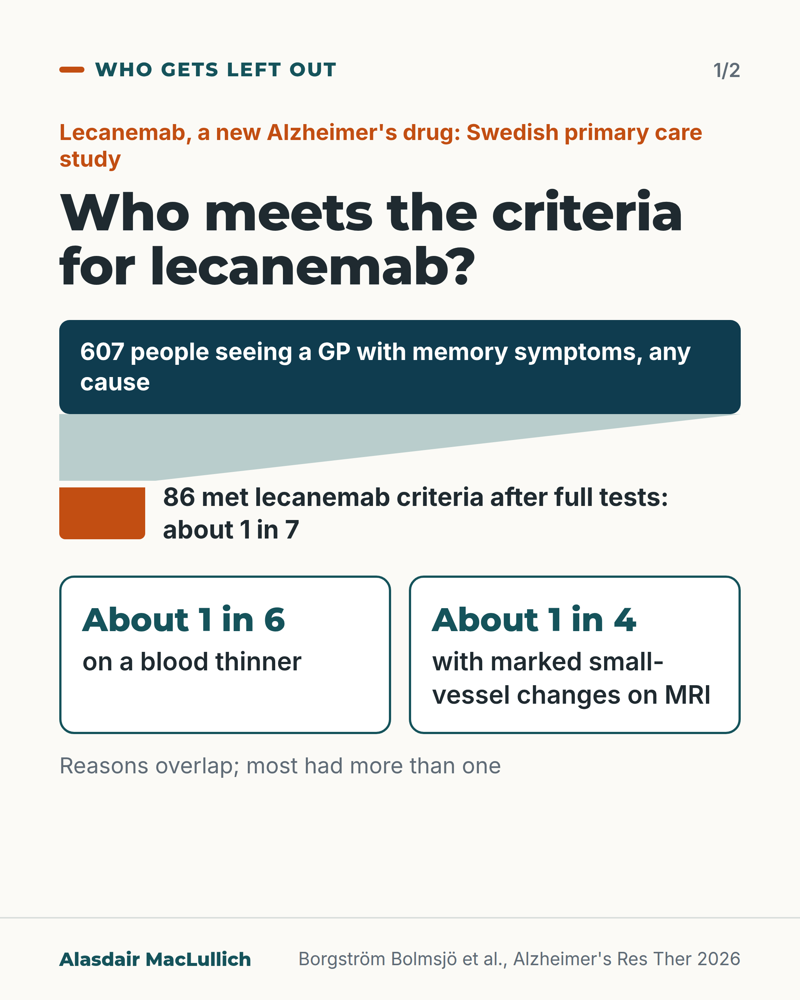
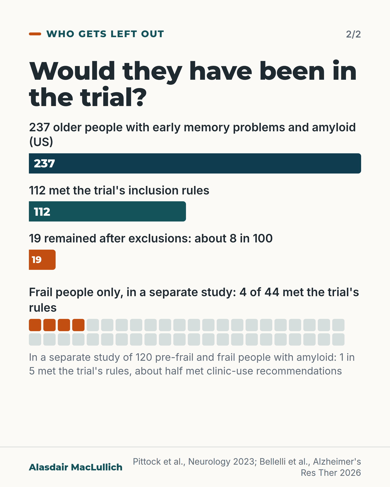

# G077: Why most people with memory problems do not qualify for lecanemab

- Category: C08 Dementia: living with it and caring well
- Audience: both
- Series: Who gets left out
- Post type: evidence_interpretation
- Visual format: carousel, 2 cards (funnel, bars)
- Status: text text_final, visual final
- Working id: C08-P05 (candidate C08-29)

## Insight

In a Swedish primary care study, about 1 in 7 people who saw their GP with memory symptoms met the criteria for lecanemab after full tests; common reasons for exclusion were blood thinners and small-vessel changes on brain scans. In a US population study, only 8 in 100 older people with early Alzheimer's changes would have met the trial's rules.

## Angle and position

Coverage of the new drugs speaks as if they apply to most people with Alzheimer's disease. Access is limited by other conditions and scan findings common in older age, and trial evidence says little about frail older people.

Basis: mixed: eligibility figures are empirical; that conversations should start from whether the person resembles the trial group is clinical judgement

## X (934 characters)

```text
About 1 in 7 people who saw a Swedish GP with memory symptoms of any cause met the criteria for lecanemab after full tests. Lecanemab is a new Alzheimer's drug.

Of 607 people, about 1 in 6 were on a blood thinner, which rules the drug out under those criteria. About 1 in 4 had marked changes in the brain's small blood vessels on MRI. Most who were ruled out had more than one reason.

The trial's own rules are stricter than the criteria used in clinics. A separate US study looked at 237 older people, average age 81. All had early memory problems and amyloid (a protein linked with Alzheimer's) on a brain scan. About 8 in 100 of them (19) would have qualified for the trial. In another study of 120 older people with amyloid, 4 of the 44 who were frail would have. These are different groups, so the figures should not be compared with each other.

Before weighing the results, ask: would someone like me have been in the trial?
```

## LinkedIn (1949 characters)

```text
About 1 in 7 people who saw a Swedish GP with memory symptoms, whatever the cause, met the criteria for lecanemab after full tests.

Lecanemab is one of the new antibody drugs for early Alzheimer's disease. It was licensed in the UK in August 2024.

In the Swedish study of 607 people with memory symptoms in primary care, about a third were ruled out early by other illnesses, medicines, age or weight. About 1 in 6 were taking a blood thinner (anticoagulant), which rules out lecanemab under the use recommendations applied. About 1 in 4 had marked changes in the brain's small blood vessels on MRI. Most people who were ruled out had more than one reason. That group included people whose memory problems were not due to Alzheimer's disease.

The trial itself used stricter rules than clinics now use. In a US population study, 237 older people (average age 81) had early memory problems and amyloid, a protein linked with Alzheimer's disease, on a brain scan. When the lecanemab trial's entry rules were applied, 19 of them, about 8 in 100, would have qualified. Almost all were White, which limits how far that applies.

Frailty is a separate question. A third study looked at 120 older people with amyloid on testing (half were older than 82). All were pre-frail or frail. About 1 in 5 of them (24) would have qualified for the trial. Among the 44 who were frail, only 4 would have. These are different groups, so the 8 in 100 and the 1 in 5 should not be compared with each other. Under the looser rules recommended for clinic use, about half of the 120 could be considered.

The trial evidence says little about frail people; that alone does not rule them out of treatment.

If you or your relative are thinking about these drugs, a good first question is: would someone like me have been in the trial?

Sources: Borgström Bolmsjö et al., Alzheimer's Res Ther 2026; Pittock et al., Neurology 2023; Bellelli et al., Alzheimer's Res Ther 2026.
```

## Bluesky (297 characters)

```text
About 1 in 7 people seeing a Swedish GP for memory symptoms met criteria for lecanemab (an Alzheimer's drug). In a separate US study of people with early memory problems and amyloid (a protein linked with Alzheimer's), 8 in 100 met the trial's rules.

Would someone like me have been in the trial?
```

## Threads (488 characters)

```text
About 1 in 7 people who saw a Swedish GP with memory symptoms, of any cause, met the criteria for lecanemab, a new Alzheimer's drug, after full tests.

About 1 in 6 were on a blood thinner, which rules it out. About 1 in 4 had marked small-vessel changes on MRI.

In a separate US study of 237 older people with early memory problems and amyloid (a protein linked with Alzheimer's) on a brain scan, about 8 in 100 met the trial's rules.

Ask: would someone like me have been in the trial?
```

## Source reply

Sources: Swedish primary care https://doi.org/10.1186/s13195-026-02019-2 | US population study https://doi.org/10.1212/WNL.0000000000207770 | frailty https://doi.org/10.1186/s13195-026-01966-0 | UK licence https://doi.org/10.1002/bcp.70021

## Visual



Alt text: Funnel: 607 people seeing a GP in Sweden with memory symptoms narrowing to 86 who met lecanemab criteria after full tests, about 1 in 7. Two separate boxes: about 1 in 6 on a blood thinner, about 1 in 4 with marked small-vessel changes on MRI. Reasons overlap.



Alt text: Three bars scaled to count: 237 older people with early memory problems and amyloid, 112 meeting inclusion rules, 19 remaining after exclusions, about 8 in 100. Below, 44 squares with 4 filled: frail people meeting trial rules, from a separate study of 120.

Editable source: `visuals/src/G077.html`

Design instructions: Two 4:5 cards. Card 1: deep teal bar full width, pale funnel polygon to a 14 percent orange bar (130 of 920 px), two outlined boxes. Card 2: bars scaled 920/435/74 px for 237/112/19, 44-square array with 4 filled. Claims C08-29-a to d, f. No drawing.

## Sources and verification

- C08-29-a (supported): When the lecanemab trial's entry rules were applied to 237 older people with early memory problems and amyloid on a brain scan in a US population study, 112 (47.3%) met the inclusion criteria and 19 (8%) remained after the exclusion criteria.
  - Source: Pittock RR, Aakre JA, Castillo AM, Ramanan VK, Kremers WK, Jack CR, et al. Eligibility for anti-amyloid treatment in a population-based study of cognitive aging. Neurology. 2023;101(19):e1837-e1849.
  - Passage: "Two hundred thirty-seven MCSA participants (mean age [SD] 80.9 [6.3] years, 54.9% male, and 97.5% White) with mild cognitive impairment (MCI) or mild dementia and increased brain amyloid burden by PiB PET comprised the study sample. Lecanemab trial's inclusion criteria reduced the study sample to 112 (47.3% of 237) participants. The trial's exclusion criteria further narrowed the number of potentially eligible participants to 19 (overall 8% of 237)." (Abstract, Results)
- C08-29-b (supported): The most common reasons people fell outside the trial rules were other long-term health conditions and brain scan findings.
  - Source: Pittock RR, Aakre JA, Castillo AM, Ramanan VK, Kremers WK, Jack CR, et al. Eligibility for anti-amyloid treatment in a population-based study of cognitive aging. Neurology. 2023;101(19):e1837-e1849.; Borgström Bolmsjö B, Barbosa Djärf J, van Westen D, Schindler SE, Fawad A, Collij L, et al. Eligibility for amyloid targeting therapies among primary care patients with cognitive symptoms. Alzheimers Res Ther. 2026;18(1).
  - Passage: "Pittock 2023: "Common exclusions were related to other chronic conditions and neuroimaging findings." Borgström Bolmsjö 2026: "In total, 180 participants had any comorbidity or ongoing treatments incompatible with ATT, of whom 98 were receiving anticoagulant therapy. Most participants met multiple exclusion criteria (Fig.), with 102 patients (16.8%) fulfilling five or more criteria simultaneously." and "At the same time, MRI abnormalities were common overall, affecting nearly 200 (32.3%) participants, most often in combination with other exclusion criteria. Severe white matter disease (Fazekas score 3) was the most frequent imaging-based exclusion (= 156; 25.7%)."" (Pittock 2023 Abstract, Results; Borgström Bolmsjö 2026 full text, Results, 'Specific exclusion criteria' and Table 2)
- C08-29-c (supported_with_qualification): In a primary care population (the typical route for older people with memory concerns), about 1 in 7 people presenting with cognitive symptoms met real-world eligibility criteria for lecanemab after a full work-up.
  - Source: Borgström Bolmsjö B, Barbosa Djärf J, van Westen D, Schindler SE, Fawad A, Collij L, et al. Eligibility for amyloid targeting therapies among primary care patients with cognitive symptoms. Alzheimers Res Ther. 2026;18(1).
  - Passage: "In a full diagnostic work-up of 607 patients with sequential exclusions, 86 patients (14.2%) and 78 patients (12.8%) ultimately met the eligibility criteria for lecanemab and donanemab, respectively. Due to comorbidities, medication use, and age/BMI, around 1/3 of the original population was excluded. Most ineligible patients met more than one exclusion criterion. The eligible population was 63% female, mean age 77 years. ... Importantly, clinical eligibility does not equate to treatment initiation." (Abstract, Results; Discussion (limitations))
- C08-29-d (supported_with_qualification): Frail older people were much less likely to meet the Clarity AD trial criteria than pre-frail older people, although about half of frail people met real-world use recommendations.
  - Source: Bellelli F, Delrieu J, van Kan GA, Peluso A, Soriano G, Vellas B, et al. Are pre-frail and frail amyloid positive individuals eligible to Lecanemab? A cross-sectional analysis from the Cogfrail real-world cohort. Alzheimers Res Ther. 2026;18(1).
  - Passage: "The median age of the sample was 82.0 years (IQR: 79-85); 65% (n = 78) were women, and 36.7% (n = 44) were frail. Overall, 20.0% (n = 24) met the Clarity-AD eligibility criteria, while 50.8% (n = 61) and 47.5% (n = 57) were potentially eligible according to the American and French AURs, respectively. Only 9.1% (n = 4) of frail individuals met the Clarity-AD criteria, compared to 26.3% (n = 20) of pre-frail participants (p = 0.042). In contrast, 50.0% (n = 22) and 45.5% (n = 20) of frail individuals were potentially eligible according to the American and French AURs, respectively." (Abstract, Results)
- C08-29-f (supported_with_qualification): The UK medicines regulator (MHRA) approved lecanemab in August 2024.
  - Source: Bobbins A, Davies M, Lynn E, Roy D, Yeomans A, Shakir SAW. Safety and effectiveness of the anti-amyloid monoclonal antibody (mAb) drug lecanemab for early Alzheimer's disease: the pharmacovigilance perspective. Br J Clin Pharmacol. 2025;91(5):1352-60.
  - Passage: "The decision by the UK's Medicines and Healthcare products Regulatory Agency (MHRA) to approve lecanemab in August 2024 followed similar regulatory decisions in the US and Japan. ... The UK's National Institute for Health and Care Excellence (NICE) has not recommended lecanemab for use in early AD amid concerns, including treatment cost and the translation of efficacy outcomes into clinically meaningful improvement." (Abstract)

Verification notes: Access led per editor. Borgström Bolmsjö 2026 full text for 1 in 7, first-step exclusions, anticoagulants and MRI (C08-29-b,c), with note that denominator includes non-Alzheimer's causes. Pittock 2023 abstract for 237/112/19 and 97.5% White (C08-29-a), worded 'would have qualified for the trial'. Bellelli 2026 abstract for 4 of 44 frail and about half under clinic rules (C08-29-d). UK licence August 2024 as dated fact only (C08-29-f); no NICE position; no ARIA figures. Trial rules and use criteria kept separate. The Bellelli cohort's country is not stated in the opened abstract, so the post says 'a study of frail older people' and not 'French'. Amyloid and lecanemab are defined in plain words.

## Attention and follow potential

Pause: Families and clinicians who assume the new drugs apply to most people with Alzheimer's disease.

Gain: The common reasons for exclusion and one question to ask about any trial.

Follow: Clear accounts of who trials include and who they leave out.

## Open issues

None.
