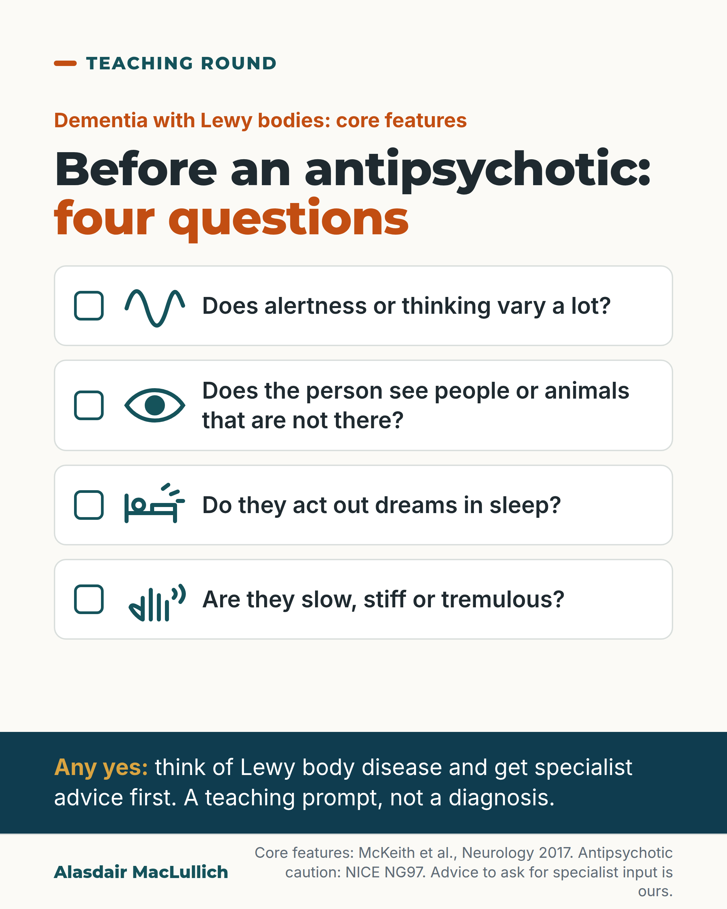

# G078: Four questions before an antipsychotic

- Category: C08 Dementia: living with it and caring well
- Audience: practitioners
- Series: Teaching round
- Post type: teaching
- Visual format: checklist card
- Status: text text_final, visual final
- Working id: C08-P06 (candidate C08-17)

## Insight

People with dementia with Lewy bodies can react severely to antipsychotics, so before prescribing one for a person with dementia, ask about the four core features: fluctuating alertness, visual hallucinations, acting out dreams and parkinsonism.

## Angle and position

The diagnosis is often absent from the notes when an antipsychotic is first considered. A one-minute history for the core features comes before the prescription.

Basis: mixed: core features, consensus advice and NICE caution are empirical or guideline statements; the checklist as a routine prompt is clinical judgement

## X (707 characters)

```text
Some people with dementia react severely to antipsychotic medicines. The risk is particularly high in people with Lewy body disease, which is often missed or labelled as Alzheimer's disease.

In an early UK study of people whose Lewy body dementia was confirmed after death, 7 of 16 given an antipsychotic had a severe reaction, against 1 of 14 with Alzheimer's disease. Small and old, but NICE and the international consensus both warn about it.

Before prescribing, ask four questions. Does alertness vary a lot? Does the person see people or animals that are not there? Do they act out dreams in sleep? Are they slow, stiff or tremulous?

A yes is a reason to pause and get advice. It is not a diagnosis.
```

## LinkedIn (1489 characters)

```text
Some people with dementia react severely to antipsychotic medicines. The risk is particularly high in people with Lewy body disease, which is often missed or labelled as Alzheimer's disease.

NICE says: be aware that for people with dementia with Lewy bodies or Parkinson's disease dementia, antipsychotics can worsen the motor features of the condition, and in some cases cause severe antipsychotic sensitivity reactions.

The international consensus on dementia with Lewy bodies advises avoiding antipsychotics whenever possible for the same reason.

The figures are old. In a 1992 UK study of people whose Lewy body dementia was confirmed after death, 7 of the 16 who had been given an antipsychotic had a severe reaction, compared with 1 of 14 people with Alzheimer's disease. Small, retrospective and mostly older drugs, but consistent with the later consensus.

So check the four core features before you prescribe:

1. Alertness and thinking that vary a lot.
2. Seeing things that are not there, often people or animals.
3. Acting out dreams in sleep.
4. Slowness, stiffness or tremor.

None of these confirms Lewy body disease on its own. Changing alertness can happen late in other dementias, and other sleep problems can look like acting out dreams. The list is a teaching prompt, not a validated screening tool. A yes is a reason to think again and ask for specialist advice before an antipsychotic.

Sources: McKeith et al., Neurology 2017; McKeith et al., BMJ 1992; NICE NG97.
```

## Bluesky (280 characters)

```text
Before an antipsychotic in dementia, ask four questions: does alertness vary a lot, are there visual hallucinations, does the person act out dreams, are they slow or stiff?

People with Lewy body disease can react severely. A yes means pause and get advice; it is not a diagnosis.
```

## Threads (471 characters)

```text
Some people with dementia react severely to antipsychotics. The risk is particularly high in people with Lewy body disease, which is often missed or labelled as Alzheimer's disease.

Before prescribing, ask four questions. Does alertness vary a lot? Are there visual hallucinations, often people or animals? Does the person act out dreams in sleep? Is the person slow, stiff or tremulous?

Treat a yes as a reason to pause and ask for advice first. It is not a diagnosis.
```

## Source reply

Sources: Lewy body consensus https://doi.org/10.1212/WNL.0000000000004058 | neuroleptic sensitivity https://doi.org/10.1136/bmj.305.6855.673 | NICE NG97 https://www.nice.org.uk/guidance/ng97

## Visual



Alt text: Checklist of four questions before an antipsychotic, for dementia with Lewy bodies: does alertness vary a lot, does the person see people or animals not there, do they act out dreams, are they slow, stiff or tremulous. Each has an empty tick box and a line icon. Any yes: think of Lewy body disease and get specialist advice first. A teaching prompt, not a diagnosis.

Editable source: `visuals/src/G078.html`

Design instructions: Single 4:5 light card. Four white rows with empty teal tick boxes and inline SVG line icons (wave, eye, bed with motion marks, hand with tremor marks). Deep teal band with gold lead-in and white text. Claims C08-17-a to c; advice is house advice.

## Sources and verification

- C08-17-a (supported): The core clinical features of dementia with Lewy bodies are fluctuating cognition and alertness, recurrent visual hallucinations, REM sleep behaviour disorder (acting out dreams) and parkinsonism.
  - Source: McKeith IG, Boeve BF, Dickson DW, Halliday G, Taylor JP, Weintraub D, et al. Diagnosis and management of dementia with Lewy bodies: fourth consensus report of the DLB Consortium. Neurology. 2017;89(1):88-100.
  - Passage: "Core clinical features. Fluctuation. DLB fluctuations ... occurring as spontaneous alterations in cognition, attention, and arousal. ... Visual hallucinations. Recurrent, complex visual hallucinations occur in up to 80% of patients with DLB and are a frequent clinical signpost to diagnosis. They are typically well-formed, featuring people, children, or animals ... Parkinsonism. Spontaneous parkinsonian features, not due to antidopaminergic medications or stroke, are common in DLB, eventually occurring in over 85%. ... documentation of only one of these cardinal features is required. ... REM sleep behavior disorder. RBD is a parasomnia manifested by recurrent dream enactment behavior that includes movements mimicking dream content ... RBD is now included as a core clinical feature because it occurs frequently in autopsy-confirmed cases compared with non-DLB (76% vs 4%)." (Full text, section 'Core clinical features')
- C08-17-b (supported): These features are not specific: fluctuations occur in advanced other dementias and conditions that mimic dream enactment are common in dementia.
  - Source: McKeith IG, Boeve BF, Dickson DW, Halliday G, Taylor JP, Weintraub D, et al. Diagnosis and management of dementia with Lewy bodies: fourth consensus report of the DLB Consortium. Neurology. 2017;89(1):88-100.
  - Passage: "Fluctuations may also occur in advanced stages of other dementias, so they best predict DLB when they are present early. ... Conditions mimicking RBD are common in people with dementia, e.g., confusional awakenings, severe obstructive sleep apnea, and periodic limb movements, all of which must be excluded by careful supplementary questioning to avoid a false-positive diagnosis." (Full text, 'Core clinical features' (Fluctuation; REM sleep behavior disorder))
- C08-17-c (supported): In dementia with Lewy bodies, antipsychotics should be avoided whenever possible because of the risk of a serious sensitivity reaction.
  - Source: McKeith IG, Boeve BF, Dickson DW, Halliday G, Taylor JP, Weintraub D, et al. Diagnosis and management of dementia with Lewy bodies: fourth consensus report of the DLB Consortium. Neurology. 2017;89(1):88-100.
  - Passage: "The use of antipsychotics for the acute management of substantial behavioral disturbance, delusions, or visual hallucinations comes with attendant mortality risks in patients with dementia, and particularly in the case of DLB they should be avoided whenever possible, given the increased risk of a serious sensitivity reaction. Low-dose quetiapine may be relatively safer than other antipsychotics and is widely used, but a small placebo-controlled clinical trial in DLB was negative. ... Severe antipsychotic sensitivity is now listed as supportive, because reduced prescribing of D2 receptor blocking antipsychotics in DLB limits its diagnostic usefulness. Caution about their use remains unchanged." (Full text, 'Neuropsychiatric symptoms' and 'Supportive clinical features')
- C08-17-d (supported_with_qualification): In a small autopsy-confirmed series, most people with Lewy body dementia given neuroleptics reacted badly, many severely, compared with few people with Alzheimer's disease.
  - Source: McKeith I, Fairbairn A, Perry R, Thompson P, Perry E. Neuroleptic sensitivity in patients with senile dementia of Lewy body type. BMJ. 1992;305(6855):673-8.
  - Passage: "16 (80%) patients with Lewy body type dementia received neuroleptics, 13 (81%) of whom reacted adversely; in seven (54%) the reactions were severe. ... By contrast, only one (7%) of 14 patients with Alzheimer type dementia given neuroleptics showed severe neuroleptic sensitivity. ... Severe, and often fatal, neuroleptic sensitivity may occur in elderly patients with confusion, dementia, or behavioural disturbance." (Abstract (Results, Conclusions))
- C08-17-e (supported): NICE advises that in dementia with Lewy bodies or Parkinson's disease dementia, antipsychotics can worsen motor features and in some cases cause severe antipsychotic sensitivity reactions.
  - Source: National Institute for Health and Care Excellence. Dementia: assessment, management and support for people living with dementia and their carers. NICE guideline NG97. London: NICE; 2018.
  - Passage: "1.7.4 Be aware that for people with dementia with Lewy bodies or Parkinson's disease dementia, antipsychotics can worsen the motor features of the condition, and in some cases cause severe antipsychotic sensitivity reactions." (NICE NG97 recommendation 1.7.4 (Scite full-text excerpt of NICE PDF))
- C08-17-f (supported_with_qualification): Dementia with Lewy bodies is often missed or misdiagnosed, usually as Alzheimer's disease.
  - Source: McKeith IG, Boeve BF, Dickson DW, Halliday G, Taylor JP, Weintraub D, et al. Diagnosis and management of dementia with Lewy bodies: fourth consensus report of the DLB Consortium. Neurology. 2017;89(1):88-100.
  - Passage: "Changes made to the diagnostic criteria at that time increased diagnostic sensitivity for DLB, but detection rates in clinical practice remain suboptimal, with many cases missed or misdiagnosed, usually as Alzheimer disease (AD). ... up to half of carefully research-diagnosed patients with AD may have unsuspected Lewy-related pathology at autopsy." (Full text, introduction and 'Summary of changes')

Verification notes: McKeith 2017 full text: core features (C08-17-a), non-specificity (C08-17-b), avoid whenever possible (C08-17-c), often missed (C08-17-f, context only). McKeith 1992 abstract 7 of 16 vs 1 of 14 with small, retrospective caveat (C08-17-d). NICE 1.7.4 wording quoted in LinkedIn (C08-17-e). 'Specialist advice' is house advice, not NICE. No delirium, no haloperidol lead per editor. Schedule apart from C11-21 (acting out dreams).

## Attention and follow potential

Pause: Prescribers who start an antipsychotic in dementia without first taking a history for Lewy body features.

Gain: Four quick history questions to ask first, and the evidence for why they come before the prescription.

Follow: Teaching points that fit into a busy ward round; one post carries the follow line.

## Open issues

None.
