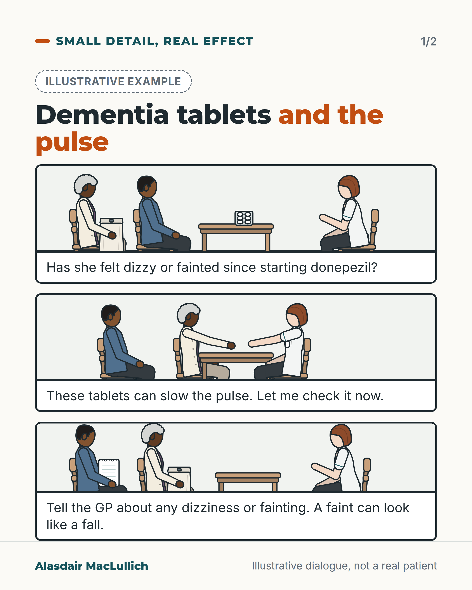
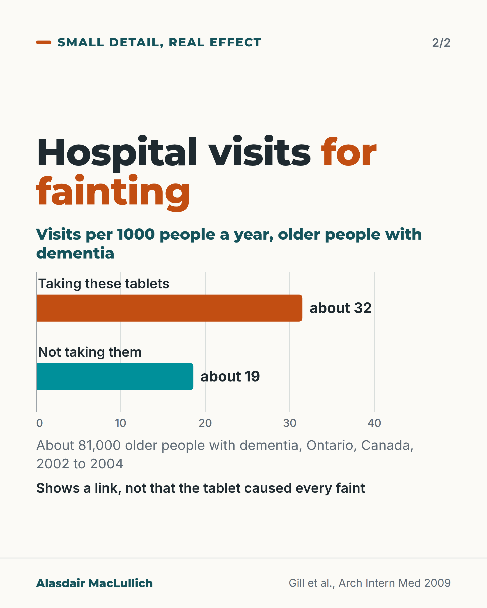

# G079: Dementia tablets and a slow pulse

- Category: C08 Dementia: living with it and caring well
- Audience: public
- Series: Small detail, real effect
- Post type: public_explanation
- Visual format: comic strip and chart, 2 cards
- Status: text text_final, visual final
- Working id: C08-P07 (candidate C08-08)

## Insight

Donepezil, rivastigmine and galantamine can slow the heart; people taking them faint more often, so dizziness or fainting after starting one should prompt a pulse check at review.

## Angle and position

The side effects people hear about are sickness and diarrhoea. The pulse effect shows up as dizziness or faints, which can look like a fall.

Basis: mixed: fainting and slow pulse links are empirical (trials and observational data); asking for a pulse check is practical advice

## X (629 characters)

```text
If you or your parent takes donepezil, rivastigmine or galantamine for dementia, ask at the next review whether anyone has checked the pulse.

These tablets can slow the heart. When the results of the trials are added together, people taking them fainted more often than people on a dummy tablet.

A Canadian study followed about 81,000 older people with dementia. Those taking them went to hospital with fainting about 32 times per 1000 people a year. Those not taking them, about 19. That shows a link, not that the tablet caused every faint.

A faint can look like a fall. Report dizziness or fainting to the GP or pharmacist.
```

## LinkedIn (1458 characters)

```text
If you or your parent takes donepezil, rivastigmine or galantamine for dementia, ask at the next review whether anyone has checked the pulse since the tablet started.

In donepezil trials, the commonest side effects were feeling sick, vomiting and diarrhoea.

These medicines can also slow the heart.

When the results of the randomised trials are added together, people taking these medicines fainted more often than people taking a dummy tablet. The trials did not show more falls or broken bones overall.

A Canadian study followed about 81,000 older people with dementia living at home. Those taking these medicines went to hospital with fainting about 32 times per 1000 people each year. Among those not taking them, it was about 19 per 1000. That shows a link. It does not show that the medicine caused every faint.

In another Canadian study, hospital admissions with a very slow pulse were linked with recently starting one of these medicines. After leaving hospital, more than half (78 of 138) went back on a medicine of the same type.

A faint can look like a fall.

What you can do:
1. Ask at the review: has anyone checked the pulse since the tablet started?
2. Report dizziness, light-headedness or fainting to the GP or pharmacist.
3. Mention the tablet to anyone assessing a fall.

Do not stop the tablet on your own; ask first.

Sources: Gill et al., Arch Intern Med 2009; Kim et al., J Am Geriatr Soc 2011; Park-Wyllie et al., PLoS Med 2009.
```

## Bluesky (273 characters)

```text
Donepezil, rivastigmine and galantamine, tablets for dementia, can slow the pulse. In trials, people taking them fainted more often than on a dummy tablet.

If you or your parent takes one, ask at review whether the pulse has been checked, and report dizziness or fainting.
```

## Threads (475 characters)

```text
If you or your parent takes donepezil, rivastigmine or galantamine, ask whether anyone has checked the pulse since it started.

These tablets can slow the heart. When the results of several trials are added together, people taking them fainted more often than on a dummy tablet. In Canadian data, hospital visits for fainting were about 32 per 1000 people a year in those taking them, against about 19 in those not (a link, not proof of cause).

Report dizziness or fainting.
```

## Source reply

Sources: Ontario cohort https://doi.org/10.1001/archinternmed.2009.43 | pooled trials https://doi.org/10.1111/j.1532-5415.2011.03450.x | slow pulse admissions https://doi.org/10.1371/journal.pmed.1000157

## Visual



Alt text: Illustrative comic in three panels at a pharmacy. A pharmacist asks an older woman and her son whether she has felt dizzy or fainted since starting donepezil, checks her pulse at the wrist, and tells them to report dizziness or fainting because a faint can look like a fall.



Alt text: Bars: hospital visits for fainting per 1000 people a year, about 32 for older people with dementia taking these tablets and about 19 for those not taking them. Ontario, Canada, 2002 to 2004. Shows a link, not that the tablet caused every faint.

Editable source: `visuals/src/G079.html`

Design instructions: Card 1 light with dashed Illustrative example badge and p3 comic strip: seated woman (dark skin, silver curls, plum top), adult son (brown skin, denim), pharmacist (light skin, auburn bob); table with blister pack; pulse check by hand to wrist; son with blank notepad. Captions as dialogue. Card 2 bar chart axis 0 to 40, orange users 31.5, teal non-users 18.6. Claim C08-08-a, e.

## Sources and verification

- C08-08-a (supported_with_qualification): In an Ontario cohort, older people with dementia taking cholinesterase inhibitors had more hospital visits for fainting (31.5 vs 18.6 per 1000 person-years), slow heart rate, pacemaker insertion and hip fracture than those not taking them.
  - Source: Gill SS, Anderson GM, Fischer HD, Bell CM, Li P, Normand SL, et al. Syncope and its consequences in patients with dementia receiving cholinesterase inhibitors: a population-based cohort study. Arch Intern Med. 2009;169(9):867-73.
  - Passage: "We identified 19 803 community-dwelling older adults with dementia who were prescribed cholinesterase inhibitors and 61 499 controls who were not. Hospital visits for syncope were more frequent in people receiving cholinesterase inhibitors than in controls (31.5 vs 18.6 events per 1000 person-years; adjusted hazard ratio [HR], 1.76; 95% confidence interval [CI], 1.57-1.98). Other syncope-related events were also more common among people receiving cholinesterase inhibitors compared with controls: hospital visits for bradycardia (6.9 vs 4.4 events per 1000 person-years; HR, 1.69; 95% CI, 1.32-2.15), permanent pacemaker insertion (4.7 vs 3.3 events per 1000 person-years; HR, 1.49; 95% CI, 1.12-2.00), and hip fracture (22.4 vs 19.8 events per 1000 person-years; HR, 1.18; 95% CI, 1.04-1.34)." (Abstract (Methods, Results))
- C08-08-b (supported_with_qualification): In randomised trials, people taking cholinesterase inhibitors fainted more often than people on placebo, but did not have clearly more falls, fractures or injuries.
  - Source: Kim DH, Brown RT, Ding EL, Kiel DP, Berry SD. Dementia medications and risk of falls, syncope, and related adverse events: meta-analysis of randomized controlled trials. J Am Geriatr Soc. 2011;59(6):1019-31.
  - Passage: "ChEI use was associated with greater risk of syncope (odds ratio (OR)=1.53, 95% confidence interval (CI)=1.02-2.30) than placebo but not with other events (falls: OR=0.88, 95% CI=0.74-1.04; fracture: OR=1.39, 95% CI=0.75-2.56; accidental injury: OR=1.13, 95% CI=0.87-1.45). ... ChEIs may increase the risk of syncope, with no effects on falls, fracture, or accidental injury in cognitively impaired older adults." (Abstract (Results, Conclusion))
- C08-08-c (supported_with_qualification): Starting a cholinesterase inhibitor is linked with more hospital admissions for slow heart rate, and more than half of people admitted went back on the drug afterwards.
  - Source: Park-Wyllie LY, Mamdani MM, Li P, Gill SS, Laupacis A, Juurlink DN. Cholinesterase inhibitors and hospitalization for bradycardia: a population-based study. PLoS Med. 2009;6(9):e1000157.
  - Passage: "After adjusting for temporal changes in drug utilization, hospitalization for bradycardia was associated with recent initiation of a cholinesterase inhibitor (adjusted odds ratio [OR] 2.13, 95% confidence interval [CI] 1.29-3.51). ... Of these, 17 (11%) required a pacemaker during hospitalization, and six (4%) died prior to discharge. ... Despite hospitalization for bradycardia, more than half of the patients (78 of 138 cases [57%]) who survived to discharge subsequently resumed cholinesterase inhibitor therapy." (Abstract (Methods and Findings, Conclusions))
- C08-08-d (supported): The commonest side effects of donepezil are nausea, vomiting and diarrhoea.
  - Source: Birks JS, Harvey RJ. Donepezil for dementia due to Alzheimer's disease. Cochrane Database Syst Rev. 2018;6(6):CD001190.
  - Passage: "People taking donepezil were more likely than those taking placebo to report side effects and to drop out of the studies. Most side effects were described as mild. Nausea, vomiting and diarrhoea were most common." (Plain language summary (Scite full-text excerpt))
- C08-08-e (not_found): People starting a cholinesterase inhibitor should be told to report dizziness or fainting, and the pulse should be checked at review.
  - Source: Park-Wyllie LY, Mamdani MM, Li P, Gill SS, Laupacis A, Juurlink DN. Cholinesterase inhibitors and hospitalization for bradycardia: a population-based study. PLoS Med. 2009;6(9):e1000157.; Kim DH, Brown RT, Ding EL, Kiel DP, Berry SD. Dementia medications and risk of falls, syncope, and related adverse events: meta-analysis of randomized controlled trials. J Am Geriatr Soc. 2011;59(6):1019-31.
  - Passage: "No guideline or SmPC passage recommending a pulse check was opened (SmPC and BNF pages could not be opened). Park-Wyllie 2009: "Resumption of therapy following discharge was common, suggesting that the cardiovascular toxicity of cholinesterase inhibitors is underappreciated by clinicians."" (Park-Wyllie abstract Conclusions)

Verification notes: Revised angle followed. Gill 2009 abstract, per 1000 person-years approximated as per 1000 people a year, observational (C08-08-a). Kim 2011 pooled trials: more syncope, no clear excess falls or fractures (C08-08-b). Park-Wyllie 2009: 78 of 138 restarted (C08-08-c). Common side effects from Birks (C08-08-d); vivid dreams and insomnia omitted. Pulse check framed as advice (C08-08-e). No claim that tablets cause falls. Threads uses 'not proof of cause' paraphrase; see open issue if the checker flags 'proof'.

## Attention and follow potential

Pause: Families of people taking donepezil who have noticed dizziness or unexplained falls.

Gain: One specific check to ask for and a symptom to report.

Follow: Small practical checks that families can use at the next appointment.

## Open issues

None.
