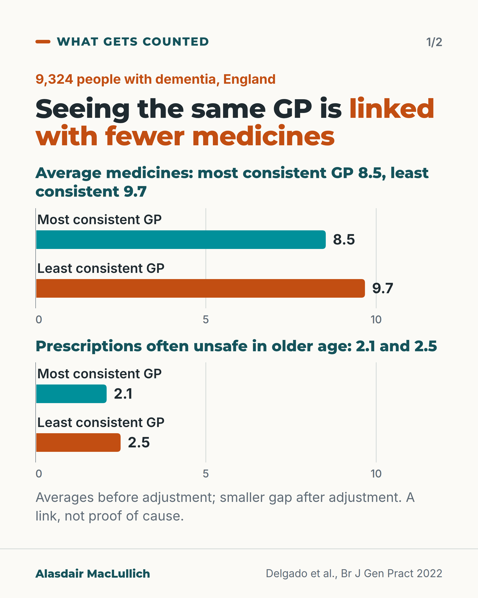
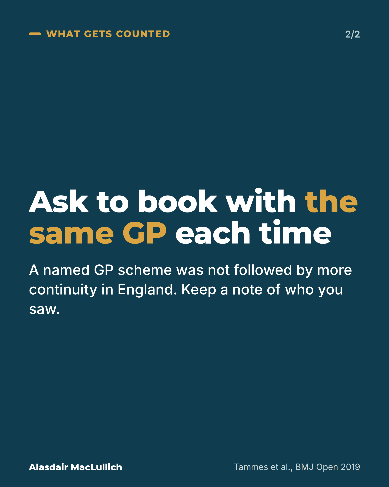

# G080: Count the GPs: continuity in dementia

- Category: C08 Dementia: living with it and caring well
- Audience: both
- Series: What gets counted
- Post type: evidence_interpretation
- Visual format: carousel, 2 cards (paired bars, text)
- Status: text text_final, visual final
- Working id: C08-P08 (candidate C08-10)

## Insight

In an English study of 9,324 people with dementia, those who saw the same GP most consistently were prescribed fewer medicines and fewer potentially unsafe ones, and had fewer new records of incontinence; the study shows a link, not cause.

## Angle and position

Continuity is simple to count and linked with safer prescribing in dementia. A named GP alone did not raise continuity, so families should ask to book with the same GP each time.

Basis: mixed: associations are empirical; the booking advice is judgement that follows from the evidence

## X (723 characters)

```text
How many of your relative's GP appointments last year were with the same GP?

An English study looked at 9,324 people with dementia. Those who saw the same GP most often were prescribed 8.5 medicines on average. Those who saw the same GP least often were prescribed 9.7. The first group also had fewer prescriptions that are often unsafe in older age, and fewer new records of incontinence. The gaps in medicines were smaller after allowing for age, illness and frailty. It shows a link, not cause.

A named GP scheme for people aged 75 and over, introduced in England in 2014, was not followed by more visits to the same GP.

In our view, a sensible step is to ask to book with the same GP each time, and note who you saw.
```

## LinkedIn (1702 characters)

```text
How many of your relative's GP appointments last year were with the same GP?

It is a simple count, and it is linked with safer prescribing in dementia.

A study of 9,324 people with dementia in England (average age about 85) compared those who saw the same GP most consistently with those who saw the same GP least often.

Those with the most consistency were prescribed fewer medicines on average: 8.5 compared with 9.7. They also had fewer prescriptions that are often unsafe in older age: 2.1 compared with 2.5. These are averages before adjustment. After allowing for age, other illnesses and frailty, the differences were smaller but remained.

Over the next year they were also less likely to have new incontinence recorded. They were slightly less likely to be admitted as an emergency, but that link was weak. A study of 22,060 people with dementia in Quebec found somewhat fewer hospital admissions with high continuity.

These studies show links. They do not show that seeing the same GP caused the differences. People who are more unwell may also see more different doctors.

One thing that did not seem to help: from 2014, people aged 75 and over in England were given a named GP. A study found this was not followed by an increase in how often they saw the same GP.

GP researchers wrote in 2025 that most UK practices did not measure continuity, even though simple measures exist: the share of a person's appointments that are with their own GP.

For families: ask to book with the same GP each time, and keep a note of who you saw. For practices: count it.

Sources: Delgado et al., BJGP 2022; Godard-Sebillotte et al., JAGS 2021; Tammes et al., BMJ Open 2019; Dineen et al., BJGP 2025.
```

## Bluesky (300 characters)

```text
In a study of 9,324 people with dementia in England, those who saw the same GP most often had fewer medicines prescribed: 8.5 vs 9.7 on average (smaller after allowing for age and illness). A link, not proof of cause.

A named GP scheme did not raise same-GP visits. In our view, ask for the same GP.
```

## Threads (447 characters)

```text
How many of your relative's GP appointments last year were with the same GP?

In an English study of 9,324 people with dementia, those with the most consistent GP had fewer medicines on average: 8.5 vs 9.7, before allowing for age, illness and frailty. They also had fewer that are often unsafe in older age. A link, not cause.

A named GP scheme was not followed by more visits to the same GP. In our view, ask to book with the same GP each time.
```

## Source reply

Sources: https://doi.org/10.3399/BJGP.2021.0413 | Quebec https://doi.org/10.1111/jgs.17049 | named GP https://doi.org/10.1136/bmjopen-2019-029103 | 2025 editorial https://doi.org/10.3399/BJGP.2025.0199 | simple measure https://doi.org/10.3399/bjgp19X701813

## Visual



Alt text: Paired bars on a zero axis. Average medicines: 8.5 for the most consistent GP, 9.7 for the least consistent. Prescriptions often unsafe in older age: 2.1 and 2.5. 9,324 people with dementia in England. Averages before adjustment; smaller gap after adjustment. A link, not proof of cause.



Alt text: Ask to book with the same GP each time. A named GP scheme was not followed by more continuity in England. Keep a note of who you saw.

Editable source: `visuals/src/G080.html`

Design instructions: Card 1 light: two barChart blocks sharing axis 0 to 10 (teal most consistent, orange least consistent). Card 2 dark teal statement card with gold em. Claims C08-10-a, b, d, g. Drawings omitted in simplified run.

## Sources and verification

- C08-10-a (supported): An English cohort study followed 9,324 people with dementia aged 65 or over for a year, comparing those who saw the same GP most consistently with those who saw the same GP least consistently.
  - Source: Delgado J, Evans PH, Gray DP, Sidaway-Lee K, Allan L, Clare L, et al. Continuity of GP care for patients with dementia: impact on prescribing and the health of patients. Br J Gen Pract. 2022;72(715):e91-e98.
  - Passage: "A retrospective cohort study with 1 year of follow-up anonymised medical records from 9324 patients with dementia, aged ≥65 years living in England in 2016. ... At the study start date, all patients were aged ≥65 years, registered with a practice, and had at least three consultations (required for calculating continuity) during a 1-year lead-in period (1 January 2015 until 31 December 2015). ... There were 9324 individuals who were diagnosed with dementia before the study start date (age mean 84.5 years, SD 7.4, 65.7% female) and met the inclusion criteria." (Abstract, Design and setting; full text, Method (Population) and Results)
- C08-10-b (supported_with_qualification): People in the highest continuity quarter had fewer prescribed medicines (mean 8.5 vs 9.7) and fewer potentially inappropriate prescriptions (mean 2.1 vs 2.5) than those in the lowest quarter.
  - Source: Delgado J, Evans PH, Gray DP, Sidaway-Lee K, Allan L, Clare L, et al. Continuity of GP care for patients with dementia: impact on prescribing and the health of patients. Br J Gen Pract. 2022;72(715):e91-e98.
  - Passage: "Patients in the HQ of the UPC had fewer prescriptions (mean 8.52, SD 4.75) than those in the LQ (mean 9.67, SD 5.31,<0.01). A fully adjusted negative binomial regression model confirmed a dose–response relationship with fewer medications by increasing quartiles of UPC (). ... Patients in the HQ of the UPC had significantly fewer instances of PIP (mean 2.09, SD 2.06) compared with the LQ (mean 2.50, SD 2.28,<0.01). Negative binomial regression models confirmed this reduction in PIP was statistically significant (). Higher levels of CGPC were not associated with the likelihood of having ≥1 PIP. Table 2 (Usual Provider of Care Index, High quartile): number of prescriptions IRR 0.96 (0.93 to 0.98); potentially inappropriate prescribing IRR 0.93 (0.88 to 0.97); footnote: IRRs estimated using negative binomial regression model, stratified by quartile of CGPC and adjusted for age, sex, 14 comorbidities, and frailty status." (Full text, Results ('Treatment of patients with dementia') and Table 2)
- C08-10-c (supported_with_qualification): Highest continuity was associated with lower odds of newly recorded incontinence (OR 0.42) and emergency hospital admission (OR 0.90) over a year, after adjustment for age, sex, deprivation, 14 conditions, frailty and number of consultations.
  - Source: Delgado J, Evans PH, Gray DP, Sidaway-Lee K, Allan L, Clare L, et al. Continuity of GP care for patients with dementia: impact on prescribing and the health of patients. Br J Gen Pract. 2022;72(715):e91-e98.
  - Passage: "Patients in the HQ of the UPC, compared with those in the quartile with least continuity (LQ), displayed reduction in risk of delirium by 34.8% (odds ratio [OR] 0.65, 95% confidence interval [CI] = 0.51 to 0.84,<0.01), reduction in risk of incontinence by 57.9% (OR 0.42, 95% CI = 0.31 to 0.58,<0.01), and reduction in risk of emergency admission to hospital by 9.7% (OR 0.90, 95% CI = 0.82 to 0.99,= 0.03). ... Censoring the first 6 months of follow-up did not significantly alter the association with delirium and incontinence, although emergency admission to hospital became non-significant (Supplementary Table S7). ... All models were adjusted for age (squared), sex, quintiles of multiple deprivation, diagnosis of 14 chronic conditions (listed in), frailty classification based on the Electronic Frailty Index, and the number of consultations during the lead-in period (a proxy of medical needs)." (Full text, Results ('CGPC and AHOs') and Method (Statistical analysis))
- C08-10-d (supported): The study is observational and cannot show that continuity causes these differences.
  - Source: Delgado J, Evans PH, Gray DP, Sidaway-Lee K, Allan L, Clare L, et al. Continuity of GP care for patients with dementia: impact on prescribing and the health of patients. Br J Gen Pract. 2022;72(715):e91-e98.
  - Passage: "The observational nature of this study provides data on statistical associations but cannot indicate causation. ... Study design and sensitivity analyses excluding the first 6 months of follow-up minimise the potential role of reverse-causation driving the findings." (Full text, Discussion (Strengths and limitations))
- C08-10-e (supported_with_qualification): A separate Canadian study of 22,060 community-dwelling people with dementia found that those who saw the same primary care doctor at every visit had fewer hospital admissions and emergency department visits over the following year.
  - Source: Godard-Sebillotte C, Strumpf E, Sourial N, Rochette L, Pelletier E, Vedel I. Primary care continuity and potentially avoidable hospitalization in persons with dementia. J Am Geriatr Soc. 2021;69(5):1208-20.
  - Passage: "Population-based sample of 22,060 community-dwelling 65 + persons with dementia on March 31st, 2015, with at least two primary care visits in the preceding year (mean age 81 years, 60% female). ... High primary care continuity on March 31st, 2015, i.e., having had every primary care visit with the same primary care physician, during the preceding year. ... Among the 22,060 persons, compared with the persons with low primary care continuity, the 14,515 (65.8%) persons with high primary care continuity had a lower risk of ACSC hospitalization (general population definition) (relative risk reduction 0.82, 95% CI 0.72-0.94), ACSC hospitalization (older population definition) (0.87, 0.79-0.95), 30-day hospital readmission (0.81, 0.72-0.92), hospitalization (0.90, 0.86-0.94), and emergency department visit (0.92, 0.90-0.95)." (Abstract)
- C08-10-f (supported_with_qualification): Most UK general practices do not routinely measure continuity of GP care, although validated measures exist.
  - Source: Dineen M, Engamba S, Khan NF, Sidaway-Lee K, Duncan P, Watson J, et al. Delivering relational continuity of care in light of recent GP contract changes. Br J Gen Pract. 2025;75(757):342-4.; Engamba S, Smith J, Khan N, Sidaway-Lee K, Burch P, Marshall T, et al. Enhancing understanding of interventions to increase relational continuity in general practice: a realist review protocol. BJGP Open. 2026;10(1).
  - Passage: "Dineen 2025: "The Welsh Government has recognised that an important drawback is that most practices in the UK do not currently measure their continuity, despite the existence of several validated measures (for example, the Usual Provider of Care Index [UPC] or the St Leonard's Index of Continuity of Care [SLICC])." and "What the contract does not yet offer is any guidance or incentive for practices to deliver relational continuity of care to the patients that have been identified, nor is there any requirement to measure or evaluate the continuity that is already being delivered." Engamba 2026: "With the new GP contract in England highlighting the need for primary care providers to monitor and deliver relational continuity, it is more crucial than ever to understand how best to achieve it."" (Dineen 2025 full text (editorial); Engamba 2026 abstract (Background))
- C08-10-g (supported): Having a named GP is not the same as seeing the same GP: England's named accountable GP policy for people over 74 (April 2014) was not followed by better continuity or fewer emergency admissions.
  - Source: Tammes P, Payne RA, Salisbury C, Chalder M, Purdy S, Morris RW. The impact of a named GP scheme on continuity of care and emergency hospital admission: a cohort study among older patients in England, 2012-2016. BMJ Open. 2019;9(9):e029103.
  - Passage: "National Health Service policy to introduce a named accountable GP for patients aged over 74 in April 2014. ... The intervention was associated with a decrease in continuity index-scores of -0.024 (95% CI -0.030 to -0.018, p<0.001) ... The introduction of the named GP scheme was not associated with improvements in either continuity of care or rates of unplanned hospitalisation." (Abstract)
- C08-10-h (supported): Continuity can be counted simply, for example as the percentage of appointments with the patient's own doctor.
  - Source: Sidaway-Lee K, Gray DP, Evans P. A method for measuring continuity of care in day-to-day general practice: a quantitative analysis of appointment data. Br J Gen Pract. 2019;69(682):e356-e362.
  - Passage: "The percentage of face-to-face appointments for patients on each doctor's list, with the patient's personal doctor (the SLICC), was calculated monthly. ... Overall, 51.7% (95% confidence interval = 51.2 to 52.2) of GP appointments were with the patients' personal doctor. Patients aged ≥65 years had a higher level of continuity with 64.9% of appointments being with their personal doctor. ... This method could provide working GPs with a simple way to track continuity of care and inform practice management and decision making." (Abstract, Method and Results)

Verification notes: Delgado 2022 full text: cohort (C08-10-a), unadjusted means labelled as such with smaller adjusted gap (C08-10-b), incontinence and weak admission link, relative only (C08-10-c), link not cause (C08-10-d). Quebec in words (C08-10-e). 2025 editorial attributed and dated (C08-10-f). Named GP policy (C08-10-g). Simple measure (C08-10-h). Delirium result not used.

## Attention and follow potential

Pause: Families whose relative sees a different GP each time; practice managers.

Gain: A simple count, what it is linked with, and a request that works better than a named GP.

Follow: Evidence about how care is organised, not only about treatments.

## Open issues

None.
