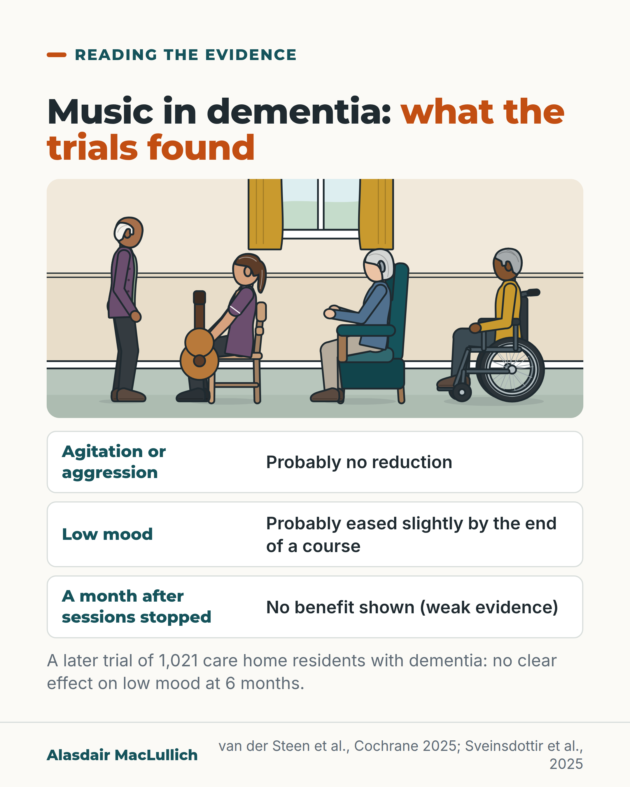

# G081: Music and dementia: enjoy it, do not rely on it for agitation

- Category: C08 Dementia: living with it and caring well
- Audience: public
- Series: Reading the evidence
- Post type: evidence_interpretation
- Visual format: drawn illustration with findings rows
- Status: text text_final, visual final
- Working id: C08-P09 (candidate C08-25)

## Insight

Planned music sessions probably do not reduce agitation or aggression in dementia, may ease low mood slightly while they last, and a large later trial found no effect on depressive symptoms at 6 months.

## Angle and position

Music is often promoted as a treatment for distress. The trials support a narrower claim. Offer music because the person enjoys it, and look for the cause of distress rather than treating it with a playlist.

Basis: mixed: review and trial results are empirical; offering music for enjoyment and shared time is ethical and practical judgement

## X (783 characters)

```text
Planned music sessions probably do not calm agitation or aggression in people with dementia. That is the finding of a 2025 Cochrane review, which pools many trials: 30 trials, mostly group sessions in care homes.

The same review found sessions probably ease low mood slightly by the end of a course. No benefit was shown a month after they stopped, though that evidence is weak.

Since then, a trial tested music therapy groups and choir singing against usual care. It included 1,021 care home residents with dementia and low mood, in six countries including the UK. At 6 months, neither music group had eased low mood more than usual care.

In our view, offer music because the person enjoys it and it is time shared with others. If someone is distressed, look for the cause first.
```

## LinkedIn (1605 characters)

```text
Planned music sessions probably do not calm agitation or aggression in people with dementia.

That is the finding of a 2025 Cochrane review, which pools the results of many trials: here 30 trials with 1,720 people. The trials tested planned sessions, at least five of them, mostly in groups and mostly in care homes. They were not tests of the radio or casual listening at home.

Compared with usual care, the review found that sessions probably do not reduce agitation or aggression. It also found they probably ease low mood slightly by the end of a course. Both findings rest on evidence of moderate certainty (fairly, though not fully, reliable). They may reduce behaviour problems overall, but that evidence is weak. A month or more after sessions stopped, no benefit was shown, though that evidence is also weak.

When music was compared with other organised activities, it did not clearly do better for mood or agitation.

Since the review, a large trial in 86 care home units in six countries, including the UK, gave 1,021 residents with low mood music therapy groups, choir singing or usual care. Neither music group eased low mood more than usual care after 6 months.

No serious harms were reported, though harms were recorded inconsistently.

In our judgement, music is worth offering because the person enjoys it and it gives shared time with others. Judge it by whether they enjoy it. Do not use it as the treatment for agitation or low mood, or in place of looking for the cause of distress.

Sources: van der Steen et al., Cochrane 2025; Sveinsdottir et al., Lancet Healthy Longevity 2025.
```

## Bluesky (299 characters)

```text
A 2025 Cochrane review (30 trials): music sessions probably don't calm agitation in dementia but probably ease low mood slightly.

A later trial of 1,021 care home residents with dementia found neither music therapy nor choir singing clearly eased low mood vs usual care.

Offer music for enjoyment.
```

## Threads (484 characters)

```text
Planned music sessions probably do not calm agitation or aggression in dementia, a 2025 Cochrane review of 30 trials found. Low mood probably eases slightly by the end of a course, with no benefit shown a month later.

A later trial of 1,021 care home residents with dementia and low mood tested music therapy groups and choir singing. At 6 months, neither had eased low mood more than usual care.

Offer music because the person enjoys it. If they are distressed, look for the cause.
```

## Source reply

Sources: Cochrane review https://doi.org/10.1002/14651858.CD003477.pub5 | care home trial https://doi.org/10.1016/j.lanhl.2025.100783

## Visual



Alt text: Care home lounge: an older man stands singing beside a care worker seated with a guitar, an older woman with a hearing aid sits and listens with hands raised, a man in a wheelchair listens. Below: music trials found probably no reduction in agitation or aggression, low mood probably eased slightly by the end of a course, and no benefit shown a month after sessions stopped (weak evidence).

Editable source: `visuals/src/G081.html`

Design instructions: Single 4:5 light card. Kit scene care_home_lounge: standing older man (tan skin, white hair), care worker (plum tunic, ponytail) seated with custom drawn guitar, older woman in armchair with hearing aid, man in wheelchair (brown skin). Three finding rows, note on the 1,021 resident trial. Claims C08-25-a to e.

## Sources and verification

- C08-25-a (supported): The 2025 Cochrane review included 30 randomised trials with 1,720 participants; interventions had at least five sessions, most were delivered to groups, and most participants lived in institutions such as care homes.
  - Source: van der Steen JT, van der Wouden JC, Methley AM, Smaling HJA, Vink AC, Bruinsma MS. Music-based therapeutic interventions for people with dementia. Cochrane Database Syst Rev. 2025;3(3):CD003477.
  - Passage: ""We included randomised controlled trials of music-based therapeutic interventions (of at least five sessions) for people with dementia that measured any of our outcomes of interest. Control groups either received usual care or other activities with or without music." ... "We included 30 studies with 1720 randomised participants that were conducted in 15 countries. Twenty-eight studies with 1366 participants contributed data to meta-analyses. Ten studies contributed data to long-term outcomes. Participants had dementia of varying degrees of severity and resided in institutions in most of the studies. Seven studies delivered an individual intervention; the other studies delivered the intervention to groups. Most interventions involved both active and receptive elements of musical experience. The studies were at high risk of performance bias and some were at high risk of detection or other bias."" (Abstract (Selection criteria, Main results))
- C08-25-b (supported_with_qualification): Compared with usual care, music-based interventions probably improve depressive symptoms slightly at the end of treatment (moderate certainty) and may improve overall behavioural problems (low certainty), but likely do not improve agitation or aggression (moderate certainty).
  - Source: van der Steen JT, van der Wouden JC, Methley AM, Smaling HJA, Vink AC, Bruinsma MS. Music-based therapeutic interventions for people with dementia. Cochrane Database Syst Rev. 2025;3(3):CD003477.
  - Passage: ""For music-based therapeutic interventions compared to usual care, we found moderate-certainty evidence that, at the end of treatment, music-based therapeutic interventions probably improved depressive symptoms slightly (standardised mean difference (SMD) -0.23, 95% confidence interval (CI) -0.42 to -0.04; 9 studies, 441 participants), and we found low-certainty evidence that it may have improved overall behavioural problems (SMD -0.31, 95% CI -0.60 to -0.02; 10 studies, 385 participants). We found moderate-certainty evidence that music-based therapeutic interventions likely did not improve agitation or aggression (SMD -0.05, 95% CI -0.27 to 0.17; 11 studies, 503 participants). Low to very low certainty evidence showed that they did not improve emotional well-being (SMD 0.14, 95% CI -0.29 to 0.56; 4 studies, 154 participants), anxiety (SMD -0.15, 95% CI -0.39 to 0.09; 7 studies, 282 participants), social behaviour (SMD 0.22, 95% CI -0.14 to 0.57; 2 studies; 121 participants) or cognition (SMD 0.19, 95% CI -0.02 to 0.41; 7 studies, 353 participants)."" (Abstract (Main results))
- C08-25-c (supported_with_qualification): No lasting effect was shown four or more weeks after treatment ended.
  - Source: van der Steen JT, van der Wouden JC, Methley AM, Smaling HJA, Vink AC, Bruinsma MS. Music-based therapeutic interventions for people with dementia. Cochrane Database Syst Rev. 2025;3(3):CD003477.
  - Passage: ""Low or very-low -certainty evidence showed that music-based therapeutic interventions may not have been more effective than usual care in the long term (four weeks or more after the end of treatment) for any of the outcomes." ... Authors' conclusions: "There was no evidence of long-term effects from music-based therapeutic interventions."" (Abstract (Main results; Authors' conclusions))
- C08-25-d (supported_with_qualification): Compared with other activities, music-based interventions showed no clear advantage for mood, agitation or behaviour, but may improve social behaviour (low certainty).
  - Source: van der Steen JT, van der Wouden JC, Methley AM, Smaling HJA, Vink AC, Bruinsma MS. Music-based therapeutic interventions for people with dementia. Cochrane Database Syst Rev. 2025;3(3):CD003477.
  - Passage: ""For music-based therapeutic interventions compared to other interventions, we found low-certainty evidence that, at the end of treatment, music-based therapeutic interventions may have been more effective than the other activities for social behaviour (SMD 0.52, 95% CI 0.08 to 0.96; 4 studies, 84 participants)." ... "For all other outcomes, low-certainty evidence showed no evidence of an effect: emotional well-being (SMD 0.20, 95% CI -0.09 to 0.49; 9 studies, 298 participants); depressive symptoms (SMD -0.14, 95% CI -0.36 to 0.08; 10 studies, 359 participants); agitation or aggression (SMD 0.01, 95% CI -0.31 to 0.32; 6 studies, 168 participants); overall behavioural problems (SMD -0.08, 95% CI -0.33 to 0.17; 8 studies, 292 participants) and cognition (SMD 0.12, 95% CI -0.21 to 0.45; 5 studies; 147 participants)."" (Abstract (Main results))
- C08-25-e (supported): The largest trial since, MIDDEL (1,021 care home residents with dementia and depressive symptoms in 6 countries), found that neither group music therapy nor recreational choir singing reduced depressive symptoms at 6 months compared with standard care.
  - Source: Sveinsdottir V, Assmus J, Schneider J, Baker FA, Uçaner B, Kreutz G, et al. Clinical effectiveness of music interventions for dementia and depression in older people (MIDDEL): a multinational, cluster-randomised controlled trial. Lancet Healthy Longev. 2025;6(12):100783.
  - Passage: ""The trial was done in 86 care home units across Australia, Germany, the Netherlands, Norway, Türkiye, and the UK." ... "have mild depressive symptoms as indicated by a Montgomery-Åsberg Depression Rating Scale (MADRS) score of at least 8" ... "The primary outcome was MADRS assessed at 6 months in the intention-to-treat population" ... "Between July 18, 2018, and Feb 1, 2023, 86 care home units with 1021 residents were enrolled and randomly assigned to one of the four groups." ... "Intention-to-treat analysis of 751 residents with data at 6 months showed no significant effect on MADRS scores of either recreational choir singing versus no recreational choir singing (β 0·4 [95% CI -1·3 to 2·1]; p=0·68), group music therapy versus no group music therapy (β 0·8 [-1·0 to 2·6]; p=0·37), or the interaction between recreational choir singing and group music therapy (β -0·6 [-3·1 to 1·9], p=0·63; β represents mean difference estimated from ANCOVA). Effects varied between countries." ... "Internationally, active group music interventions as conducted in this study do not reduce depressive symptoms more than standard care in the long term."" (Abstract (Methods, Findings, Interpretation))
- C08-25-g (supported_with_qualification): No serious adverse events were reported with music-based interventions.
  - Source: van der Steen JT, van der Wouden JC, Methley AM, Smaling HJA, Vink AC, Bruinsma MS. Music-based therapeutic interventions for people with dementia. Cochrane Database Syst Rev. 2025;3(3):CD003477.; Sveinsdottir V, Assmus J, Schneider J, Baker FA, Uçaner B, Kreutz G, et al. Clinical effectiveness of music interventions for dementia and depression in older people (MIDDEL): a multinational, cluster-randomised controlled trial. Lancet Healthy Longev. 2025;6(12):100783.
  - Passage: "Cochrane: "Adverse effects were inconsistently measured or recorded, but no serious adverse events were reported." MIDDEL: "No related adverse events were reported and acute medical hospital admission rates were similar across groups at 3 months and 6 months."" (Cochrane abstract (Main results); MIDDEL abstract (Findings))

Verification notes: Revised angle. Cochrane 2025 abstract: scope (C08-25-a), certainty words kept (C08-25-b), no lasting effect, weak evidence (C08-25-c), vs other activities (C08-25-d). MIDDEL trial abstract, 1,021 residents, 6 countries, no effect at 6 months (C08-25-e), not called 'largest'. No serious harms (C08-25-g). Enjoyment point marked as judgement.

## Attention and follow potential

Pause: Families and care staff who use music to settle distress.

Gain: An accurate expectation of what music sessions do, and a reason to keep them for enjoyment.

Follow: Evidence summaries that keep good practice and overclaiming apart.

## Open issues

None.
