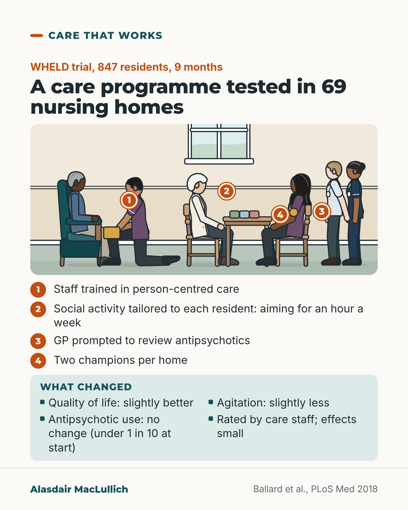

# G082: What helped in 69 nursing homes

- Category: C08 Dementia: living with it and caring well
- Audience: practitioners
- Series: Care that works
- Post type: good_care
- Visual format: annotated scene
- Status: text text_final, visual final
- Working id: C08-P10 (candidate C08-26)

## Insight

In the WHELD trial in 69 UK nursing homes, staff training in person-centred care, tailored social activity and a route to antipsychotic review slightly improved residents' quality of life and reduced agitation over 9 months; antipsychotic use did not fall.

## Angle and position

Ordinary care done systematically produced small real gains. Expect small effects, and start with tailored social activity, which the authors thought most useful (their view, not a tested result).

Basis: mixed: trial effects are empirical; the suggested first step is the authors' view and editorial judgement

## X (803 characters)

```text
Sixty-nine UK nursing homes took part in WHELD, a trial of a programme to improve everyday care.

Staff were trained in person-centred care. Each resident got social activity tailored to their interests, aiming for an hour a week. GPs were prompted to review antipsychotics. Two champions per home kept it going.

After 9 months, residents in programme homes had slightly better quality of life and slightly less agitation than in usual-care homes, rated by care staff who may have known their home was taking part. The researchers called the effects small. Observers saw more warm contact between staff and residents.

Antipsychotic use did not fall, but fewer than 1 in 10 were on one at the start.

In our view, a home could start with the tailored activity hour, though it was not tested on its own.
```

## LinkedIn (1693 characters)

```text
Sixty-nine UK nursing homes took part in WHELD, a trial of a programme to improve everyday care.

847 residents with dementia were followed for 9 months. About a third did not reach the final assessment, mostly because they had died, which is expected in nursing home research.

The programme trained staff in person-centred care and built in social activities tailored to each resident's interests, aiming for an hour a week each. It also set up a way to prompt the GP to review antipsychotic medicines. Two care staff in each home were trained as champions to keep it going.

After 9 months, residents in the programme homes had slightly better quality of life and slightly less agitation and distress than residents in usual-care homes. The researchers described the effects as small. Quality of life improved by about 2.5 points on a scale running from 31 to 124. The benefit was clearest in people with moderately severe dementia.

Observers also saw more positive, warm contact between staff and residents.

The result that went the other way: antipsychotic use did not fall. But fewer than 1 in 10 residents were taking antipsychotics at the start, and the GPs were given only limited training.

Two cautions. Quality of life and agitation were rated by care staff, who may have known their home was taking part. And the trial tested the whole package, so it could not show which part did the good.

The researchers speculated that the planned social activity probably helped most. In our judgement, an hour a week of activity chosen around each resident is a reasonable first step for a home, while being clear it has not been tested alone.

Source: Ballard et al., PLoS Medicine 2018.
```

## Bluesky (295 characters)

```text
In the WHELD trial in 69 UK nursing homes, staff training, tailored activity and antipsychotic review slightly improved residents' quality of life and agitation over 9 months compared with usual-care homes, rated by staff.

Antipsychotic use did not fall; under 1 in 10 were on one at the start.
```

## Threads (493 characters)

```text
Sixty-nine UK nursing homes tested staff training in person-centred care, social activity tailored to each resident (aiming for an hour a week), and GP review of antipsychotics.

After 9 months, residents had slightly better quality of life and slightly less agitation, rated by staff. Effects were small. Antipsychotic use did not fall, but under 1 in 10 were on one at the start.

In our view, the activity hour is a reasonable place for a home to start, though it was not tested on its own.
```

## Source reply

Source: WHELD trial https://doi.org/10.1371/journal.pmed.1002500

## Visual



Alt text: Nursing home lounge with four numbered pins for the WHELD programme: 1 staff training in person-centred care, 2 tailored social activity, 3 GP prompted to review antipsychotics, 4 two champions per home. A care worker kneels showing a man a photo album; others sit at a table with seed packets. Effects small: slightly better quality of life, slightly less agitation, no change in antipsychotic use.

Editable source: `visuals/src/G082.html`

Design instructions: Single 4:5 light card. Scene: man in armchair with kneeling care worker and blank album; resident (white curls) and champion care worker (headscarf, gold badge shape) at table with blank packets; nurse and doctor standing. Pins 1-4, key list, mint outcomes panel with words only. Claims C08-26-a to e, g.

## Sources and verification

- C08-26-a (supported): WHELD was a cluster-randomised trial in 69 UK nursing homes; 847 residents with dementia were randomised and 553 completed 9 months, with death the main reason for not completing.
  - Source: Ballard C, Corbett A, Orrell M, Williams G, Moniz-Cook E, Romeo R, et al. Impact of person-centred care training and person-centred activities on quality of life, agitation, and antipsychotic use in people with dementia living in nursing homes: a cluster-randomised controlled trial. PLoS Med. 2018;15(2):e1002500.
  - Passage: "Abstract: "This was a randomised controlled cluster trial conducted between 1 January 2013 and 30 September 2015 that compared the WHELD intervention with treatment as usual (TAU) in people with dementia living in 69 UK nursing homes, using an intention to treat analysis." ... "In all, 847 people were randomised to WHELD or TAU, of whom 553 completed the 9-month randomised controlled trial." Full text, Results: "The majority of participants had moderately severe or severe dementia, and 71% were female. Follow-up assessments were available for 553 participants. Mortality accounted for the majority of participants who did not complete follow-up assessments."" (Abstract (Methods and findings); Results (Cohort characteristics))
- C08-26-b (supported): The programme combined staff training in person-centred care, tailored social activities aiming at 60 minutes per resident per week, and a system to trigger antipsychotic review, delivered through two trained care staff champions in each home.
  - Source: Ballard C, Corbett A, Orrell M, Williams G, Moniz-Cook E, Romeo R, et al. Impact of person-centred care training and person-centred activities on quality of life, agitation, and antipsychotic use in people with dementia living in nursing homes: a cluster-randomised controlled trial. PLoS Med. 2018;15(2):e1002500.
  - Passage: "Full text, Interventions: "The intervention focused on training in PCC for care staff and on promoting tailored person-centred activities and social interactions. The intervention also involved the development of a system for triggering appropriate review of antipsychotic medications by the prescribing physician attached to each home." ... "Two lead care staff members (WHELD champions) were nominated in each care home. These individuals received additional training over a period of 4 months (1 training day per month) with further coaching, supervision, and regular review with the therapist over the 9-month period." Box 1: "Writing strengths-based care plans and providing tailored, structured social activities that recognise people's abilities and interests, with the aim of providing 60 minutes per week per person."" (Methods (Interventions; Box 1))
- C08-26-c (supported_with_qualification): The programme improved residents' quality of life (effect size 0.24), agitation (0.23) and neuropsychiatric symptoms (0.30) by small amounts, with the largest benefits in moderately severe dementia.
  - Source: Ballard C, Corbett A, Orrell M, Williams G, Moniz-Cook E, Romeo R, et al. Impact of person-centred care training and person-centred activities on quality of life, agitation, and antipsychotic use in people with dementia living in nursing homes: a cluster-randomised controlled trial. PLoS Med. 2018;15(2):e1002500.
  - Passage: "Abstract: "The intervention conferred a statistically significant improvement in QoL (DEMQOL-Proxy Z score 2.82, p = 0.0042; mean difference 2.54, SEM 0.88; 95% CI 0.81, 4.28; Cohen's D effect size 0.24). There were also statistically significant benefits in agitation (CMAI Z score 2.68, p = 0.0076; mean difference 4.27, SEM 1.59; 95% CI -7.39, -1.15; Cohen's D 0.23) and overall neuropsychiatric symptoms (NPI-NH Z score 3.52, p < 0.001; mean difference 4.55, SEM 1.28; 95% CI -7.07,-2.02; Cohen's D 0.30). Benefits were greatest in people with moderately severe dementia." ... Conclusions: "These findings suggest that the WHELD intervention confers benefits in terms of QoL, agitation, and neuropsychiatric symptoms, albeit with relatively small effect sizes". Full text, Outcome measures: "The primary outcome was QoL, measured by the DEMQOL-Proxy [], a 31-item interviewer-administered questionnaire answered by a caregiver, with a score range of 31 to 124". Discussion: "Whilst the effect sizes would be considered marginal in terms of a clinically significant benefit, we believe that the benefits to the broader population of people with dementia in care homes make this a meaningful benefit in the quality of care."" (Abstract (Methods and findings; Conclusions); Methods (Outcome measures); Discussion)
- C08-26-d (supported_with_qualification): Positive care interactions between staff and residents increased more in programme homes.
  - Source: Ballard C, Corbett A, Orrell M, Williams G, Moniz-Cook E, Romeo R, et al. Impact of person-centred care training and person-centred activities on quality of life, agitation, and antipsychotic use in people with dementia living in nursing homes: a cluster-randomised controlled trial. PLoS Med. 2018;15(2):e1002500.
  - Passage: "Abstract: "There was a statistically significant benefit in positive care interactions as measured by QUIS (19.7% increase, SEM 8.94; 95% CI 2.12, 37.16, p = 0.03; Cohen's D 0.55)." Full text, Results: "The quality of interactions of positive care between care staff and residents with dementia (QUIS) was collected as a care-home-level assessment in 62 of the participating care homes. There was a statistically significant 19.7% greater increase in the proportion of positive care interactions from baseline to 9 months in the WHELD group compared to the TAU group"" (Abstract (Methods and findings); Results (Outcome measures))
- C08-26-e (supported): Antipsychotic use was already low (under 10%) and was not reduced.
  - Source: Ballard C, Corbett A, Orrell M, Williams G, Moniz-Cook E, Romeo R, et al. Impact of person-centred care training and person-centred activities on quality of life, agitation, and antipsychotic use in people with dementia living in nursing homes: a cluster-randomised controlled trial. PLoS Med. 2018;15(2):e1002500.
  - Passage: "Abstract: "Antipsychotic drug use was at a low stable level in both treatment groups, and the intervention did not reduce use." Full text, Results: "no reduction in antipsychotic use in the WHELD treatment group compared to TAU (change in antipsychotic use: WHELD −0.1%, SEM 0.1; TAU −0.2%, SEM 0.1, [p =] 0.60; antipsychotic use at 9 months: WHELD versus TAU relative risk 1.06, 95% CI 0.62 to 1.82, [p =] 0.82)". Discussion: "Interestingly, there was a low baseline use of antipsychotic medications (<10%) in this study" ... "This is likely attributable to a combination of the low baseline levels of antipsychotic prescription and the more limited education programme for primary care physicians within the current study than in the previous factorial RCT"." (Abstract; Results (Outcome measures); Discussion)
- C08-26-g (partly_supported): The trial tested the programme as a package; the authors thought the structured social activities probably contributed the added benefit; sustaining it with staff turnover is a challenge.
  - Source: Ballard C, Corbett A, Orrell M, Williams G, Moniz-Cook E, Romeo R, et al. Impact of person-centred care training and person-centred activities on quality of life, agitation, and antipsychotic use in people with dementia living in nursing homes: a cluster-randomised controlled trial. PLoS Med. 2018;15(2):e1002500.
  - Passage: "Discussion: "That study reported a reduction in QoL following antipsychotic review that was mediated by social interaction within the context of an overall PCC training paradigm for care staff []. We would speculate that the added benefit was probably a reflection of the structured approach to promoting pleasant activities involving social interaction." ... "Elements of the WHELD intervention, such as social interaction and pleasant events, have previously been demonstrated to improve agitation in modest-sized RCTs" ... "A key issue for future studies is the sustainability of the intervention, particularly with turnover of staff, including the WHELD champions." ... "In what is, to our knowledge, the largest RCT conducted of a staff training and non-pharmacological intervention for people with dementia living in nursing homes"" (Discussion)

Verification notes: WHELD full text: design and attrition (C08-26-a), components (C08-26-b), small staff-rated effects with 2.5 on 31 to 124 (C08-26-c), warm contact without the ambiguous percentage (C08-26-d), antipsychotic null with low baseline (C08-26-e), authors' speculation labelled and first step marked as judgement (C08-26-g). Cost result omitted (C08-26-f fragile).

## Attention and follow potential

Pause: Care home managers and staff looking for something with trial evidence behind it.

Gain: A concrete programme, the size of its effect, and a reasonable first step.

Follow: Examples of good care with honest effect sizes.

## Open issues

None.
