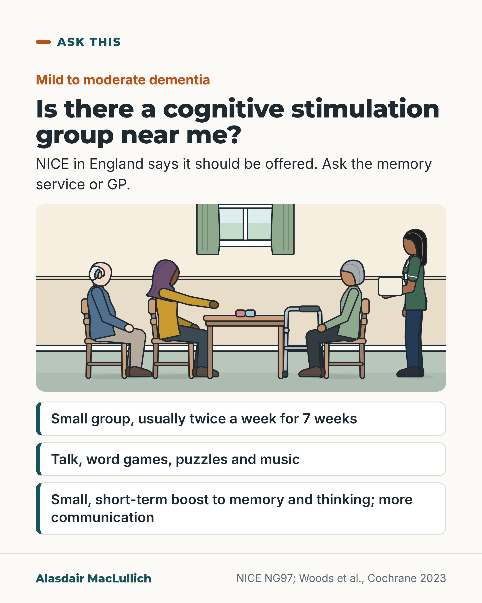

# G083: Ask about a cognitive stimulation group

- Category: C08 Dementia: living with it and caring well
- Audience: public
- Series: Ask this
- Post type: good_care
- Visual format: question card with drawn scene
- Status: text text_final, visual final
- Working id: C08-P11 (candidate C08-18)

## Insight

NICE in England says people with mild to moderate dementia should be offered group cognitive stimulation therapy; trials show a small short-term benefit to memory and thinking and more communication.

## Angle and position

After diagnosis, people often receive a prescription and a follow-up letter. This is a named, evidence-based offer that people can ask for.

Basis: mixed: the recommendation and trial findings are empirical; that asking for it is reasonable is judgement

## X (715 characters)

```text
After a diagnosis of mild or moderate dementia, you can ask whether a cognitive stimulation group runs near you.

Cognitive stimulation therapy is a small group that usually meets twice a week for about 45 minutes, 14 sessions over 7 weeks. Sessions use talk about the news and the past, word games, puzzles and music.

In England, NICE (the body that sets national health guidance) says people with mild to moderate dementia should be offered it. A 2023 review of 37 trials found that, by the end of the course, the groups probably help memory and thinking a little. People also communicated and joined in more. Gains in well-being were slight, and how long benefits last is unknown.

Ask the memory service or GP.
```

## LinkedIn (1619 characters)

```text
After a diagnosis of mild or moderate dementia, you can ask whether a cognitive stimulation group runs near you.

Cognitive stimulation therapy (CST) is a small group, run by trained staff. It usually meets twice a week for about 45 minutes, 14 sessions over 7 weeks. Local formats vary. Sessions use themed activities such as talking about the news and the past, word games, puzzles and music.

In England, NICE (the body that sets national health guidance) says people with mild to moderate dementia should be offered group cognitive stimulation therapy.

In an early UK trial in 2003, 201 people with dementia took part. Those who went to the group scored better afterwards on memory and thinking tests and on a quality-of-life scale than those who did not.

A 2023 Cochrane review pooled 37 trials with 2,766 people. By the end of the course, the groups probably help memory and thinking a little. That was about 2 points on a 30-point test of memory and thinking, which the reviewers compare to roughly a six-month delay in the usual decline. People also communicated and joined in more.

The limits: gains in well-being and mood were slight, results varied between studies, and it is not known how long the benefits last.

So it is a modest, short-term help with moderate-quality evidence behind it, and it involves meeting other people.

Questions to ask the memory service or GP:
1. Is there a cognitive stimulation group near me?
2. How often does it meet, and for how many weeks?
3. Can a family member help me get there?

Sources: NICE NG97; Spector et al., Br J Psychiatry 2003; Woods et al., Cochrane 2023.
```

## Bluesky (298 characters)

```text
With mild or moderate dementia, ask whether a cognitive stimulation group (talk and word games) runs near you.

NICE, which sets health guidance in England, says it should be offered. Trials show small, short-term gains in memory and thinking, and more communication.

Ask the memory service or GP.
```

## Threads (460 characters)

```text
After a diagnosis of mild or moderate dementia, you can ask whether a cognitive stimulation group runs near you.

It is a small group, usually twice a week for 7 weeks, with talk, word games, puzzles and music. NICE, the body that sets health guidance in England, says it should be offered.

A review of 37 trials found a small, short-term improvement in memory and thinking, and more joining in. Gains in well-being were slight.

Ask the memory service or GP.
```

## Source reply

Sources: NICE NG97 https://www.nice.org.uk/guidance/ng97/chapter/recommendations | Cochrane https://doi.org/10.1002/14651858.CD005562.pub3 | trial https://doi.org/10.1192/bjp.183.3.248

## Visual



Alt text: Question card: is there a cognitive stimulation group near me? For mild to moderate dementia. Drawn scene of a small group round a table: a woman in a headscarf reaching to place a puzzle piece, a man with a hearing aid, a woman beside a parked walking frame, and a leader holding a blank picture card. Small group, usually twice a week for 7 weeks; modest short-term gain in memory and thinking.

Editable source: `visuals/src/G083.html`

Design instructions: Single 4:5 light card. Kicker, h1.s question, body. Scene care_home_lounge with four seated or standing people, table with blank puzzle pieces, parked standard walking frame, OT-style leader holding blank card. Three fact rows with teal left rule. Claims C08-18-a to d.

## Sources and verification

- C08-18-a (supported_with_qualification): NICE recommends offering group cognitive stimulation therapy to people living with mild to moderate dementia.
  - Source: National Institute for Health and Care Excellence. Dementia: assessment, management and support for people living with dementia and their carers. NICE guideline NG97. London: NICE; 2018 [web page not opened; search-engine extract only].; Crawley D, Saunders R, Buckman JEJ, Hui E, Walker R, Dotchin C, et al. Identifying prognostic indicators for cognitive stimulation therapy for dementia: protocol for a systematic review and individual participant data meta-analysis. BJPsych Open. 2023;9(3):e69.; Fisher E, Chick I, Fossey J, Spector A. Barriers and facilitators to implementing cognitive stimulation and reminiscence therapy for dementia in care homes: systematic review. Int J Geriatr Psychiatry. 2025;40(7):e70124.
  - Passage: "Search-engine extract (nice.org.uk NG97): "NICE NG97 Recommendation 1.4.2 states: 'Offer group cognitive stimulation therapy to people living with mild to moderate dementia.'" | Crawley 2023, Abstract: "Cognitive stimulation therapy (CST) is the only non-pharmacological, treatment for dementia recommended by the UK National Institute for Health and Care Excellence, following multiple international trials demonstrating beneficial cognitive outcomes in people with mild-to-moderate dementia." | Fisher 2025, Abstract: "Cognitive stimulation and reminiscence therapy are recommended by the UK National Institute for Health and Care Excellence to support the cognition, independence, and wellbeing of people with dementia, and crucially, they can be delivered by care home staff or non-specialist interventionists."" (NG97 rec 1.4.2 (search extract); Crawley 2023 abstract; Fisher 2025 abstract)
- C08-18-b (supported): Standard CST is 14 sessions over 7 weeks in a small group, with themed activities such as discussion of past and present events, word games, puzzles, music and creative activities; sessions usually run about 45 minutes twice a week.
  - Source: Crawley D, Saunders R, Buckman JEJ, Hui E, Walker R, Dotchin C, et al. Identifying prognostic indicators for cognitive stimulation therapy for dementia: protocol for a systematic review and individual participant data meta-analysis. BJPsych Open. 2023;9(3):e69.; Woods B, Rai HK, Elliott E, Aguirre E, Orrell M, Spector A. Cognitive stimulation to improve cognitive functioning in people with dementia. Cochrane Database Syst Rev. 2023;1(1):CD005562.
  - Passage: "Crawley 2023, Background: "CST follows a format of 14 sessions over 7 weeks, with enrolment immediately post-diagnosis." ... "As a non-specialist intervention, any health or social care professional can be trained to deliver CST, and there is good evidence of its cost-effectiveness." | Woods 2023, plain-language summary: "It involves a wide range of activities aiming to stimulate thinking and memory generally, including discussion of past and present events and topics of interest, word games, puzzles, music and creative practical activities. Usually delivered by trained staff working with a small group of people with dementia for around 45 minutes twice‐weekly, it can also be provided on a one‐to‐one basis."" (Crawley 2023, Background (full text); Woods 2023, plain-language summary)
- C08-18-c (supported_with_qualification): In the original UK trial of 201 older people with dementia, the CST group improved relative to controls on the MMSE, ADAS-Cog and a dementia quality-of-life scale; about 1 in 6 treated people had a 4-point or greater ADAS-Cog improvement attributable to CST (NNT 6).
  - Source: Spector A, Thorgrimsen L, Woods B, Royan L, Davies S, Butterworth M, et al. Efficacy of an evidence-based cognitive stimulation therapy programme for people with dementia: randomised controlled trial. Br J Psychiatry. 2003;183:248-54.
  - Passage: ""A single-blind, multi-centre, randomised controlled trial recruited 201 older people with dementia." ... "One hundred and fifteen people were randomised within centres to the intervention group and 86 to the control group. At follow-up the intervention group had significantly improved relative to the control group on the Mini-Mental State Examination (P=0.044), the Alzheimer's Disease Assessment Scale - Cognition (ADAS-Cog) (P=0.014) and Quality of Life - Alzheimer's Disease scales (P=0.028). Using criteria of 4 points or more improvement on the ADAS-Cog the number needed to treat was 6 for the intervention group."" (Spector 2003, Abstract (Method, Results))
- C08-18-d (supported_with_qualification): The 2023 Cochrane review (37 trials, 2,766 people) found a small short-term benefit to cognition (moderate-quality evidence; about 2 MMSE points, roughly equal to a six-month delay in expected decline), clinically relevant gains in communication and social interaction (high quality), and slight gains in quality of life, mood and day-to-day activities; no negative effects; little or no difference to carers' mood.
  - Source: Woods B, Rai HK, Elliott E, Aguirre E, Orrell M, Spector A. Cognitive stimulation to improve cognitive functioning in people with dementia. Cochrane Database Syst Rev. 2023;1(1):CD005562.
  - Passage: "Abstract: "We included 37 RCTs (with 2766 participants), 26 published since the previous update." ... "No negative effects were reported. Overall, we found moderate-quality evidence for a small benefit in cognition associated with CS (standardised mean difference (SMD) 0.40, 95% CI 0.25 to 0.55). In the 25 studies, with 1893 participants, reporting the widely used MMSE (Mini-Mental State Examination) test for cognitive function in dementia, there was moderate-quality evidence of a clinically important difference of 1.99 points between CS and controls (95% CI: 1.24, 2.74)." ... "we found moderate-quality evidence of a slight improvement in self-reported QoL (18 studies, 1584 participants; SMD: 0.25 [95% CI: 0.07, 0.42]) as well as in QoL ratings made by proxies (staff or caregivers). We found high-quality evidence for clinically relevant improvements in staff/interviewer ratings of communication and social interaction (5 studies, 702 participants; SMD: 0.53 [95% CI: 0.36, 0.70])" ... "We found moderate-quality evidence that overall CS made little or no difference to caregivers' mood or anxiety." ... "We found a high level of inconsistency between studies in relation to both cognitive outcomes and QoL." Plain-language summary: "This benefit equates roughly to a six‐month delay in the cognitive decline usually expected in mild‐to‐moderate dementia." Authors' conclusions: "There remains an evidence gap in relation to the potential benefits of longer-term CS programmes and their clinical significance."" (Woods 2023, Abstract (Main results, Authors' conclusions) and plain-language summary)
- C08-18-e (not_found): Cognitive stimulation groups are often available through memory services or charities, and availability varies by area.
  - Source: 
  - Passage: "No source found. PubMed searches for audits or surveys of CST provision in UK memory services returned nothing; NICE and audit web pages could not be opened." (Not applicable)

Verification notes: NICE recommendation from search extract corroborated by Crawley 2023 full text and Fisher 2025 (C08-18-a), attributed to NICE in England; not called the only option. Format from Cochrane and Crawley (C08-18-b), 'usually'. Spector 2003 abstract (C08-18-c). Cochrane 2023 small short-term, slight QoL, six-month equivalence as reviewers' comparison (C08-18-d). No availability claims (C08-18-e).

## Attention and follow potential

Pause: People newly diagnosed and families who want something to do beyond waiting.

Gain: A named, evidence-based option and the words to ask for it.

Follow: Practical questions people can take to appointments.

## Open issues

None.
