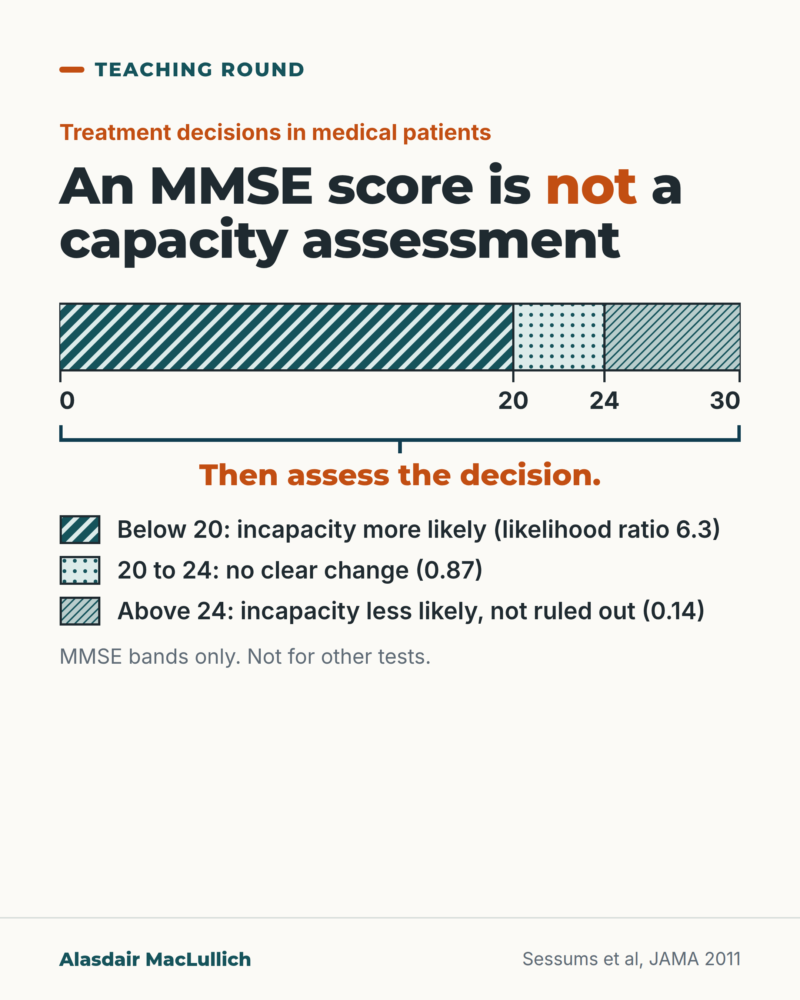

# G084: An MMSE score is not a capacity assessment

- Category: C09 Communication, capacity and supported decision-making
- Audience: practitioners
- Series: Teaching round
- Post type: teaching
- Visual format: diagram
- Status: text text_final, visual final
- Working id: C09-P01 (candidate C09-26)

## Insight

In a systematic review of treatment decisions in medical patients, an MMSE score of 20 to 24 did not change the likelihood of incapacity; below 20 made it more likely and above 24 less likely, but not ruled out. Capacity is judged one decision at a time, so a score can prompt an assessment and does not replace one.

## Angle and position

A cognitive screening score helps only at the extremes. The practical position: use a score as a reason to look harder, then assess the decision itself and record what was asked, what was explained and how the person reasoned.

Basis: Mixed. The MMSE bands and likelihood ratios are an empirical finding (Sessums 2011). That a score above 24 does not rule out incapacity, and that capacity is judged one decision at a time, are supported principles. The advice on what to record is clinical judgement.

## X (815 characters)

```text
An MMSE score of 20 to 24 did not change the likelihood that a patient lacked capacity for a treatment decision.

The MMSE (Mini-Mental State Examination) is a 30-point test of memory and thinking. It was not designed to assess capacity. A JAMA systematic review of treatment decisions in medical patients found that below 20, incapacity was more likely (likelihood ratio 6.3). Above 24 it was less likely (likelihood ratio 0.14). In the 20 to 24 band there was no clear shift (likelihood ratio 0.87, 95% confidence interval 0.53 to 1.2).

A high score lowers the chance of incapacity but does not rule it out. Capacity is judged one decision at a time, so a score can prompt an assessment and does not replace one. Our judgement: in the notes, record what was asked, what was explained and how the person reasoned.
```

## LinkedIn (1611 characters)

```text
An MMSE score of 20 to 24 did not change the likelihood that a patient lacked capacity for a treatment decision.

The MMSE (Mini-Mental State Examination) is a 30-point test of memory and thinking. It was not designed to assess capacity. A JAMA systematic review (Sessums and colleagues, 2011) pooled studies of treatment decisions in adult medical patients and reported these likelihood ratios for incapacity:

Below 20: 6.3 (95% CI 3.7 to 11). Incapacity more likely.

20 to 24: 0.87 (0.53 to 1.2). No clear change either way.

Above 24: 0.14 (0.06 to 0.34). Incapacity less likely.

Three limits. The bands apply to the MMSE only, so they should not be carried over to other tests such as the MoCA or ACE-III. The review studied treatment decisions, not decisions about where to live. And a score above 24 lowers the chance of incapacity without ruling it out: a person may still lack capacity for a complex decision; the review did not measure this.

An earlier study of 37 people with mild to moderate Alzheimer's disease found a similar pattern. Scores of 21 to 25 did not reliably separate people who could consent to research from those who could not.

In the same review, about 1 in 4 medical inpatients lacked capacity for a treatment decision, and clinicians recognised it in about 4 in 10 of those patients. The Aid to Capacity Evaluation is free to use. The studies were mostly North American and ran up to 2011.

Our judgement: treat a score as a reason to look harder at the decision, then assess that decision. In the notes, record what was asked, what was explained and how the person reasoned.
```

## Bluesky (283 characters)

```text
In a JAMA review of treatment decisions, an MMSE score of 20 to 24 did not shift the likelihood of incapacity either way. Below 20 made it more likely; above 24 less likely, but not ruled out. Capacity is judged decision by decision: a score can prompt an assessment, not replace it.
```

## Threads (353 characters)

```text
An MMSE score of 20 to 24 did not change the likelihood that a patient lacked capacity for a treatment decision (JAMA systematic review).

Below 20 made incapacity more likely. Above 24 made it less likely, but did not rule it out. The MMSE was not designed to assess capacity.

A score can prompt an assessment of the decision. It does not replace one.
```

## Source reply

Sources: Sessums et al, JAMA 2011 https://doi.org/10.1001/jama.2011.1023 ; Kim and Caine, Psychiatr Serv 2002 https://doi.org/10.1176/appi.ps.53.10.1322

## Visual



Alt text: Diagram of an MMSE scale from 0 to 30 in three zones. Below 20: incapacity for a treatment decision is more likely (likelihood ratio 6.3). 20 to 24: no clear change (0.87). Above 24: incapacity less likely, but not ruled out (0.14). A bracket reads: Then assess the decision. Pooled studies of treatment decisions in medical patients; MMSE bands only.

Editable source: `visuals/src/G084.html`

Design instructions: Single light card, series Teaching round. Kicker, h1.m with orange em on not. SVG scale bar 920 px wide, 0 to 30, zones 0-20, 20-24, 24-30 at true widths; patterns: teal diagonal hatch, mint dots, pale teal fine lines; tick labels; deep teal bracket and orange line Then assess the decision.; three legend rows with swatches. Claim C09-26-a. Centered.

## Sources and verification

- C09-26-a (supported_with_qualification): In a systematic review of capacity for treatment decisions in adult medical patients, MMSE scores below 20 made incapacity more likely, scores of 20 to 24 did not change the likelihood, and scores above 24 made incapacity less likely.
  - Source: Sessums LL, Zembrzuska H, Jackson JL. Does this patient have medical decision-making capacity? JAMA. 2011;306(4):420-7.
  - Passage: "Although not designed to assess incapacity, Mini-Mental State Examination (MMSE) scores less than 20 increased the likelihood of incapacity (LR, 6.3; 95% CI, 3.7-11), scores of 20 to 24 had no effect (LR, 0.87; 95% CI, 0.53-1.2), and scores greater than 24 significantly lowered the likelihood of incapacity (LR, 0.14; 95% CI, 0.06-0.34). ... The MMSE is useful only at extreme scores." (Abstract, Results and Conclusions)
- C09-26-b (supported): A score above 24 lowers but does not rule out incapacity; a decision-specific assessment is still needed.
  - Source: Sessums LL, Zembrzuska H, Jackson JL. Does this patient have medical decision-making capacity? JAMA. 2011;306(4):420-7.; Orr T, Baruah R. Consent in anaesthesia, critical care and pain medicine. BJA Educ. 2018;18(5):135-9.; Poole M, Bond J, Emmett C, et al. Going home? An ethnographic study of assessment of capacity and best interests in people with dementia being discharged from hospital. BMC Geriatr. 2014;14:56.
  - Passage: "Sessums 2011: "scores greater than 24 significantly lowered the likelihood of incapacity (LR, 0.14; 95% CI, 0.06-0.34)"; "Evaluation of the capacity of a patient to make medical decisions should occur in the context of specific medical decisions when incapacity is considered." Orr and Baruah 2018: "This decision confirms that capacity is time-and decision-specific and can fluctuate." Poole 2014 (Discussion): "The MMSE neither determines residence capacity, nor any other specific capacity [41]."" (Sessums abstract (Context, Results); Orr 2018 full text ('Capacity: evolution of case law'); Poole 2014 full text, Discussion)
- C09-26-c (supported_with_qualification): In 37 patients with mild to moderate Alzheimer's disease, MMSE scores of 21 to 25 did not separate those with and without capacity well.
  - Source: Kim SY, Caine ED. Utility and limits of the mini mental state examination in evaluating consent capacity in Alzheimer's disease. Psychiatr Serv. 2002;53(10):1322-4.
  - Passage: "In this study of 37 patients with mild to moderate Alzheimer's disease, a fairly wide range of MMSE scores (21 to 25, which includes an often used cutoff for "normal") did not discriminate capacity status well." (Abstract)
- C09-26-d (supported): Incapacity for treatment decisions was common among medical inpatients and often missed by clinicians; the Aid to Capacity Evaluation had useful test characteristics and is freely available.
  - Source: Sessums LL, Zembrzuska H, Jackson JL. Does this patient have medical decision-making capacity? JAMA. 2011;306(4):420-7.
  - Passage: "Incapacity was uncommon in healthy elderly control participants (2.8%; 95% confidence interval [CI], 1.7%-3.9%) compared with medicine inpatients (26%; 95% CI, 18%-35%). Clinicians accurately diagnosed incapacity (positive likelihood ratio [LR+] of 7.9; 95% CI, 2.7-13), although they recognized it in only 42% (95% CI, 30%-53%) of affected patients. ... The ACE was validated in the largest study; it is freely available online and includes a training module." (Abstract, Results)

Verification notes: C09-26-a: bands and likelihood ratios read word for word in the Sessums 2011 JAMA abstract (access: abstract; full text closed). Carried: treatment decisions in medical patients only; MMSE not designed for capacity; no conversion to probabilities; bands not transferred to MoCA or ACE-III. C09-26-b: principle that a score above 24 lowers but does not rule out incapacity, and decision-specific capacity (Sessums; Orr 2018 and Poole 2014, full text). The executive-impairment point is worded as a reasoned point, not a measured rate. C09-26-c: Kim and Caine 2002 (37 people, research consent, abstract). C09-26-d: 26% prevalence and 42% recognition as 'about 1 in 4' and 'about 4 in 10', studies mostly North American to 2011.

## Attention and follow potential

Pause: A very familiar score is shown to leave the middle band uninformative, which many clinicians do not expect.

Gain: A precise reading of what an MMSE score adds, what it leaves open, and what to record instead.

Follow: Teaching round posts qualify common shortcuts with the data behind them.

## Open issues

None.
