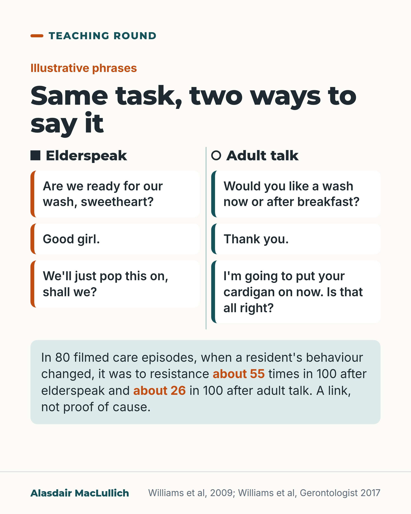

# G085: Elderspeak and resistance to care

- Category: C09 Communication, capacity and supported decision-making
- Audience: practitioners
- Series: Teaching round
- Post type: teaching
- Visual format: comparison
- Status: text text_final, visual final
- Working id: C09-P02 (candidate C09-18)

## Insight

In filmed care of nursing home residents with dementia, resistance to care followed elderspeak more often than ordinary adult talk, and a short staff training course cut elderspeak and, alongside it, resistance, though the 3-month fall in resistance was not statistically clear.

## Angle and position

Elderspeak is usually meant kindly, so the post starts from the ordinary kind phrase staff recognise, not from blame. Position: treat it as a care-quality problem that staff can change.

Basis: Mixed. The 55 versus 26 in 100 link, the trial results and the hospital finding are empirical (observational for the link; small trial for training). Treating elderspeak as a care-quality problem is ethical and clinical judgement.

## X (976 characters)

```text
'Are we ready for our wash, sweetheart?' Staff say things like this to be kind. It is called elderspeak: pet names, 'we' instead of 'you', and a high, sing-song voice.

A US study filmed 80 care episodes with 20 nursing home residents with dementia. When a resident's behaviour changed after staff spoke, it turned to resistance about 55 times in 100 after elderspeak. After ordinary adult talk it turned to resistance about 26 times in 100. That is a link in the moment, not proof that elderspeak causes resistance.

In a small trial in 13 nursing homes (27 residents), three one-hour training sessions cut the share of care time spent in elderspeak, on average by about 14 percentage points from before training. Over the same period, resistance fell by about 15 percentage points of care time. At 3 months the fall in elderspeak held, but the fall in resistance was no longer statistically clear.

We should treat elderspeak as a care-quality problem that staff can change.
```

## LinkedIn (1945 characters)

```text
'Are we ready for our wash, sweetheart?' Staff usually say things like this to be kind or to get care done. Older adults without dementia who are asked mostly find it patronising.

This way of talking has a name, elderspeak. It means talking to an older adult the way people talk to a small child: pet names such as 'sweetheart' or 'good girl', 'we' instead of 'you', questions that answer themselves ('You want to get up now, don't you?') and a high, sing-song voice.

What the studies show:

1. A US study filmed 80 care episodes with 20 nursing home residents with dementia. When a resident's behaviour changed after staff spoke, it turned to resistance about 55 times in 100 after elderspeak. After ordinary adult talk it turned to resistance about 26 times in 100. The authors say an experiment is needed to show cause.

2. A US hospital study recorded 88 care encounters with 16 people with dementia. 85 of the 88 included some elderspeak, and about half included refusal or resistance. Encounters with less elderspeak were less likely to include refusal. Pain was linked with refusal too.

3. In a small trial that put 13 nursing homes into groups by chance (27 residents), three one-hour training sessions cut the share of care time spent in elderspeak, from about 35%, by about 14 percentage points. Over the same period, resistance fell from about 36% of care time by about 15 percentage points. At 3 months the fall in elderspeak held (12 percentage points), but the fall in resistance (13 percentage points) was no longer statistically clear, so chance could not be ruled out. Only half of participating staff attended all three sessions.

These are small studies, and the link could run both ways, for example if staff use more elderspeak with people who are already distressed.

Our judgement: elderspeak is a care-quality problem. Staff mostly use it to be kind, so the response is training of the kind tested in this small trial.
```

## Bluesky (299 characters)

```text
Elderspeak means pet names, 'we' for 'you', a sing-song voice. In filmed nursing home care, residents with dementia whose behaviour changed after staff spoke turned to resistance about 55 times in 100 after elderspeak, 26 in 100 after adult talk. A link, not proof of cause. Training cut elderspeak.
```

## Threads (497 characters)

```text
'Are we ready for our wash, sweetheart?' Meant kindly. This is elderspeak: pet names, 'we' for 'you', a sing-song voice.

In 80 filmed care episodes (nursing home residents with dementia), when behaviour changed after staff spoke, it turned to resistance about 55 times in 100 after elderspeak, 26 after adult talk. A link, not proof.

In a small trial, staff training cut elderspeak. Resistance fell too, but not clearly at 3 months. We should treat it as a care-quality problem staff can change.
```

## Source reply

Sources: Williams et al, 2009 https://doi.org/10.1177/1533317508318472 ; Williams et al, Gerontologist 2017 https://doi.org/10.1093/geront/gnw047 ; Shaw et al, J Am Geriatr Soc 2022 https://doi.org/10.1111/jgs.17910

## Visual



Alt text: Illustrative phrases in two columns. Elderspeak: 'Are we ready for our wash, sweetheart?', 'Good girl.', 'We'll just pop this on, shall we?'. Adult talk: 'Would you like a wash now or after breakfast?', 'Thank you.', 'I'm going to put your cardigan on now.' In 80 filmed episodes, behaviour changes were to resistance about 55 times in 100 after elderspeak and 26 after adult talk. A link, not proof.

Editable source: `visuals/src/G085.html`

Design instructions: Light card, Teaching round. Two columns split by thin rule: Elderspeak (solid square, orange edge phrase cards) and Adult talk (open circle, teal edge). Mint band with filmed-care figures, 55 and 26 in orange bold. Claim C09-18-a.

## Sources and verification

- C09-18-a (supported_with_qualification): In videotaped nursing home care of people with dementia, resistance to care was more likely to follow elderspeak than ordinary adult talk (about 55 in 100 versus 26 in 100).
  - Source: Williams KN, Herman R, Gajewski B, Wilson K. Elderspeak communication: impact on dementia care. Am J Alzheimers Dis Other Demen. 2009;24(1):11-20.; Shaw CA, Gordon JK. Understanding elderspeak: an evolutionary concept analysis. Innov Aging. 2021;5(3):igab023.
  - Passage: "Williams 2009, Abstract: "Videotaped care episodes (n = 80) of nursing home residents with dementia (n = 20) were coded for type of staff communication (normal talk and elderspeak) and subsequent resident behavior (cooperative or resistive to care)." ... "An increased probability of resistiveness to care occurred with elderspeak (.55, 95% CrI, .44-.66), compared with normal talk (.26, 95% CrI, .12-.44)." | Results: "Silence resulted in a probability of .36 for RTC (95% CrI, .21-.55)." | Analyses: "When resident behavior changed, (among states of cooperative, neutral, and RTC), we looked back 7 seconds to determine what staff communication style (normal, elderspeak, or silent) was in use" | Discussion: "A research design that experimentally manipulates nursing staff communication and then assesses resulting resident RTC behaviors is essential to establish a true antecedent-consequent (cause and effect) relationship."" (Williams 2009: Abstract; Methods (Analyses); Results; Discussion)
- C09-18-b (supported_with_qualification): In a small cluster randomised trial in 13 US nursing homes, three one-hour staff sessions (CHAT) reduced staff elderspeak, and residents' resistance to care fell alongside it; the fall in elderspeak held at 3 months, but the fall in resistance at 3 months was not statistically clear.
  - Source: Williams KN, Perkhounkova Y, Herman R, Bossen A. A communication intervention to reduce resistiveness in dementia care: a cluster randomized controlled trial. Gerontologist. 2017;57(4):707-18.
  - Passage: "Williams 2017, Abstract: "Thirteen NHs were randomized to intervention and control groups. Dyads (n = 42) including 29 staff and 27 persons with dementia were videorecorded during care before and/or after the intervention and at a 3-month follow-up." | Intervention: "The Changing Talk (CHAT) intervention includes three 1-hour sessions that train staff to self-monitor and avoid specific aspects of elderspeak that are associated with RTC." | Results: "On average, the proportion of staff elderspeak use declined from 34.6% of the time (SD = 18.7) prior to the intervention by 13.6% points (SD = 20.00, p = .002) immediately post intervention and 12.2% points (SD = 22.0, p = .016) at 3-month follow-up. Resident RTC was reduced from 35.7% of the time (SD = 23.2) by 15.3% points (SD = 32.4, p = .021) post intervention and 13.4% points (SD = 33.7, p = .077) at 3 months (Table 3)." | Table 3, changes without intervention: staff elderspeak baseline to 1 month mean 1.1 (p = .838); resident RTC baseline to 1 month mean 1.7 (p = .785). | Model for change in RTC: "Explanatory variables in the final model for change in RTC were change in elderspeak (b = 0.43, p < .001) and baseline RTC (b = -0.58, p < .001)." | Discussion: "Only 50% of participating staff attended all sessions despite reminders, a $10 incentive per session, and paid work time for attendance."" (Williams 2017: Abstract; Intervention section; Results; Table 3; Model for change in RTC; Discussion)
- C09-18-c (supported_with_qualification): In recorded hospital care of people with dementia, almost every encounter included some elderspeak, and less elderspeak was linked with lower odds of rejection of care.
  - Source: Shaw CA, Ward C, Gordon J, Williams KN, Herr K. Elderspeak communication and pain severity as modifiable factors to rejection of care in hospital dementia care. J Am Geriatr Soc. 2022;70(8):2258-68.
  - Passage: "Shaw 2022, Abstract: "Eighty-eight care encounters between 16 PLWD and 53 nursing staff were audio-recorded for elderspeak and scored for RoC. Nearly all (96.6%) of the encounters included some form of elderspeak. Almost half of the care encounters (48.9%) included RoC behaviors. A 10% decrease in elderspeak was associated with a 77% decrease in odds of RoC (OR = 0.23, 95% CI = 0.03, 0.68)" ... "A one-unit decrease in pain severity was associated with 73% reduced odds of RoC"" (Shaw 2022: Abstract, Results)
- C09-18-d (supported): Elderspeak features include terms of endearment and diminutives ('honey', 'good girl'), 'we' in place of 'you', tag questions, high pitch and exaggerated sing-song intonation.
  - Source: Williams KN, Herman R, Gajewski B, Wilson K. Elderspeak communication: impact on dementia care. Am J Alzheimers Dis Other Demen. 2009;24(1):11-20.; Shaw CA, Gordon JK. Understanding elderspeak: an evolutionary concept analysis. Innov Aging. 2021;5(3):igab023.; Williams KN, Perkhounkova Y, Herman R, Bossen A. A communication intervention to reduce resistiveness in dementia care: a cluster randomized controlled trial. Gerontologist. 2017;57(4):707-18.
  - Passage: "Williams 2009, Elderspeak and Dementia Care: "Features of elderspeak include diminutives, inappropriately intimate nominal references, such as “honey” and “good girl.” Collective (plural) pronouns substitute the plural reference when a singular form is grammatically correct and imply that the older adult cannot act independently. For example, “Are we (italics added) ready for our (italics added) bath?” Tag questions prompt resident responses, thus suggesting the resident’s inability to independently choose. “You want to get up now, don’t you (italics added)?”" | Shaw and Gordon 2021, Paralinguistic attributes: "Prosodic characteristics are considered hallmark attributes of elderspeak ... A high-pitched register may be adopted, vocal volume may be inappropriately loud, and speech may be overarticulated. Intonation patterns (i.e., the melody and rhythm) of utterances are often exaggerated." | Semantic attributes: "In observational studies in US nursing homes, diminutives were found in 53% of 80 staff–resident interactions" ... collective pronoun substitution "in 69% of encounters in U.S. nursing homes" | Williams 2017, Behavioral Coding: "Coding of staff elderspeak communication included verbal features (such as diminutives, collective pronoun substitutions) as well as nonverbal prosody (exaggerated voice intonation, high pitch, shouting, exaggerated punctuation)"" (Williams 2009: Elderspeak and Dementia Care; Shaw and Gordon 2021: Attributes of Elderspeak (Semantic, Paralinguistic); Williams 2017: Behavioral Coding)
- C09-18-e (supported): Elderspeak is usually meant kindly, but older adults generally find it patronising.
  - Source: Lillekroken D, Röthig A, Bjørnnes AK. Elderspeak in healthcare settings: how care, control and personhood intersect in care communication. A qualitative meta-synthesis. J Adv Nurs. 2026. doi:10.1111/jan.70664.; Shaw CA, Gordon JK. Understanding elderspeak: an evolutionary concept analysis. Innov Aging. 2021;5(3):igab023.; García AM. The two faces of elderspeak. NPJ Dement. 2026;2(1):64.
  - Passage: "Lillekroken 2026, Abstract: "Findings suggest that elderspeak is often used with caring intentions and to facilitate care delivery, cooperation and organizational routines. However, these communication practices may simultaneously constrain older adults' autonomy, participation and personhood." | Shaw and Gordon 2021, Abstract: "Elderspeak was generally perceived as patronizing by older adults and speakers were perceived as less respectful." | Contextual and dyadic characteristics: "Despite these positive intentions, cognitively intact older adults usually perceive elderspeak as patronizing" | García 2026, Abstract: "Often rejected as ageist and patronizing, it actually has mixed effects: some features hinder comprehension and well-being, while others aid understanding, social connection, or care."" (Lillekroken 2026: Abstract (meta-synthesis of 13 qualitative studies); Shaw and Gordon 2021: Abstract and body; García 2026: Abstract)

Verification notes: C09-18-a Williams 2009 (full text): 80 episodes, 20 residents, 55 versus 26 in 100, association only. C09-18-b Williams 2017 CHAT trial (full text): 13 homes, 27 residents, 34.6% baseline elderspeak, falls of 13.6 and 12.2 points; resistance 35.7% baseline, falls of 15.3 (p=.021) and 13.4 (p=.077, not clear); half of staff attended all sessions; figures given as percentage points of care time; no claim that resistance fall lasted to 3 months. C09-18-c Shaw 2022 (abstract): 88 encounters, 16 people, 85 of 88; odds ratio not used; pain linked too; reverse direction noted. C09-18-d definition (Shaw and Gordon 2021, full text). C09-18-e meant kindly, mostly found patronising (Lillekroken 2026 and others, abstracts); García 2026 argues some features help, so the post targets pet names, 'we' and sing-song pitch only. Scheduling: keep apart from C09-19.

## Attention and follow potential

Pause: Staff will recognise their own kind phrases in the left column, which makes the finding personal without accusing anyone.

Gain: Specific wording swaps, the size of the link in filmed care, and the honest state of the training evidence.

Follow: Teaching round posts turn research into things staff can change on the next shift.

## Open issues

- Scheduling (editor): publish apart from C09-19 (C09-P08).
