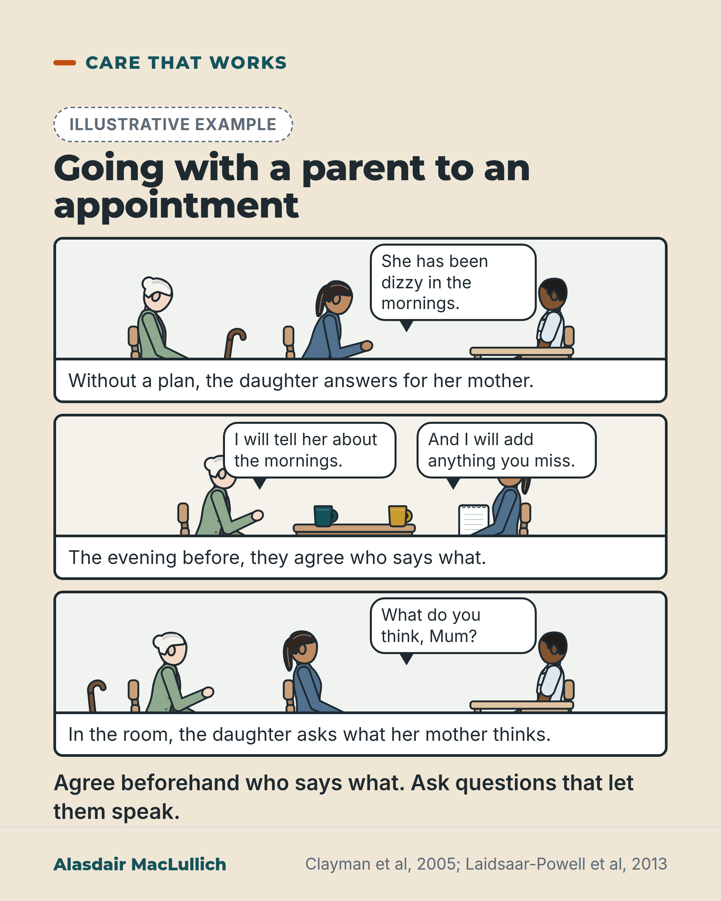

# G086: Going with a parent to an appointment, without taking over

- Category: C09 Communication, capacity and supported decision-making
- Audience: public
- Series: Care that works
- Post type: good_care
- Visual format: comic strip (3 panels)
- Status: text text_final, visual final
- Working id: C09-P03 (candidate C09-09)

## Insight

Nearly 4 in 10 adults at routine medical appointments bring someone along. In a US study, older patients were more likely to take an active part in decisions when the companion asked them questions, prompted them to speak and asked what they thought; agreeing roles beforehand is sensible advice.

## Angle and position

Speak to the relative who goes along: the most useful job is helping the person speak for themselves. Practical, warm, and honest that the evidence shows a link and the beforehand step is advice, not a tested intervention.

Basis: Mixed. The accompaniment rate, the 93-visit link and the small comparison are empirical. Agreeing roles beforehand and asking what the person thinks is practical advice consistent with a review's proposed strategy, not a tested family intervention.

## X (626 characters)

```text
Across 13 studies, nearly 4 in 10 adults at routine medical appointments brought someone with them, most often a husband, wife or grown-up child.

If that is you, one thing is linked with more patient involvement. A US study filmed 93 visits by people aged 65 to 95. Patients were more likely to take an active part in decisions when the person with them asked them questions, prompted them to speak and asked what they thought. One visit each, so it shows a link, not proof of cause.

Before the appointment, agree what your parent wants to say themselves and what they want you to add. In the room, ask: 'What do you think?'
```

## LinkedIn (1842 characters)

```text
Nearly 4 in 10 adults at routine medical appointments bring someone with them, most often a husband, wife or grown-up child. That is the average across 13 studies in a 2011 review, so it is not a UK figure. The people who brought someone were, on average, older and in poorer health.

If you go with an older parent, what a companion does in the room is linked with how much the patient takes part.

In a US study that filmed 93 visits by people aged 65 to 95 who came with a relative or friend, patients were more likely to take an active part in decisions when the companion asked them questions, prompted them to speak and asked what they thought. The study looked at one visit each, so it shows a link and not proof that the companion's behaviour caused the difference. The patients also differed in other ways: companions of sicker patients were more likely to do this.

A small 1994 US comparison of 15 audiotaped first visits made with a companion and 15 made alone found that accompanied patients raised fewer topics themselves and were often left out of the conversation. This was a small, old study, and later work found that being left out is not universal.

A review of 52 studies found that companions were often seen as helpful. Taking over or making demands was seen as less helpful. People differed widely in how much they wanted a companion to do. That is why it helps to agree beforehand what your parent wants to say themselves and what they want you to add. This is practical advice, and it has not been tested as a family intervention.

Five studies looked at outcomes for accompanied patients. None found worse outcomes, but three of the five could not say either way, so this does not show that a companion helps.

At the appointment, ask questions that let your parent answer first. 'What do you think?' is a good one.
```

## Bluesky (274 characters)

```text
Nearly 4 in 10 adults at routine medical appointments bring someone along. A US study filmed 93 visits. Older patients were more likely to take an active part in decisions when the companion asked what they thought. That is a link, not proof. Agree beforehand who says what.
```

## Threads (421 characters)

```text
Across 13 studies, nearly 4 in 10 adults at routine appointments brought someone along.

A US study filmed 93 visits by people aged 65 to 95. Those patients were more likely to take an active part in decisions when the person with them asked questions and asked what they thought. That is a link, not proof.

Before you go, agree what your parent wants to say and what they want you to add. Then ask: 'What do you think?'
```

## Source reply

Sources: Wolff and Roter, Soc Sci Med 2011 https://doi.org/10.1016/j.socscimed.2011.01.015 ; Clayman et al, Soc Sci Med 2005 https://doi.org/10.1016/j.socscimed.2004.08.004 ; Laidsaar-Powell et al, Patient Educ Couns 2013 https://doi.org/10.1016/j.pec.2012.11.007 ; Greene et al, J Am Geriatr Soc 1994 https://doi.org/10.1111/j.1532-5415.1994.tb07490.x

## Visual



Alt text: Illustrative three-panel comic. Panel 1: in a clinic, a daughter answers for her older mother, who looks down; a doctor sits at a desk. Panel 2: the evening before, at a kitchen table, they agree who says what. Panel 3: the daughter asks "What do you think, Mum?" In a US study of 93 visits, patients took part more when companions asked what they thought. A link, not proof.

Editable source: `visuals/src/G086.html`

Design instructions: Sand card, Care that works. Badge, h1 54px, .strip.p3 of three kit panels (viewBox 1000x190, gp_room and kitchen, scale 0.74): older woman white bun with crook stick, daughter ponytail, male doctor. Typeset bubbles and captions. Claims C09-09-a to f.

## Sources and verification

- C09-09-a (supported): Across 13 studies, nearly 4 in 10 adults at routine medical visits were accompanied, usually by a spouse or an adult child; accompanied patients were older and in worse health.
  - Source: Wolff JL, Roter DL. Family presence in routine medical visits: a meta-analytical review. Soc Sci Med. 2011;72(6):823-31.
  - Passage: "The weighted mean rate of patient accompaniment to routine adult medical visits was 37.6% in 13 contributing studies. Accompanied patients were significantly older and more likely to be female, less educated, and in worse physical and mental health than unaccompanied patients. Companions were on average 63 years of age, predominantly female (79.4%), and spouses (54.7%) or adult children (32.2%) of patients." (Abstract)
- C09-09-b (supported_with_qualification): In videotaped US geriatric primary care visits with 93 patients, those whose companions asked them questions, prompted them to talk and asked their opinion were more likely to be active in decision-making (cross-sectional association).
  - Source: Clayman ML, Roter D, Wissow LS, Bandeen-Roche K. Autonomy-related behaviors of patient companions and their effect on decision-making activity in geriatric primary care visits. Soc Sci Med. 2005;60(7):1583-91.
  - Passage: "Patients (N = 93) in this cross-sectional sample range in age from 65 to 95 years and are mostly white (n = 73, 79%) and female (n = 67, 72%). ... Patients whose companions facilitated their involvement in the medical visit by asking the patient questions, prompting the patient to talk, and asking for the patient's opinion were more than four times as likely to be active in decision-making as patients whose companions did not assist in this manner (unadjusted OR 3.5, CI 1.4-8.7, p < .01; adjusted OR 4.5, CI 1.6-12.4, p < .01)." (Abstract)
- C09-09-c (supported_with_qualification): When a third person was present, older patients raised fewer topics, were less assertive, and were frequently excluded from the conversation (small US matched comparison).
  - Source: Greene MG, Majerovitz SD, Adelman RD, Rizzo C. The effects of the presence of a third person on the physician-older patient medical interview. J Am Geriatr Soc. 1994;42(4):413-9.
  - Passage: "In a sample of 96 audiotaped initial medical visits, 15 encounters involved three persons. These 15 cases were matched with 15 dyadic interviews for gender and race of the patient and for gender and race of the physician. ... The specific content and the quality of interactional processes of physicians were not affected by the presence of a third person. However, older patients raised fewer topics in all content areas (medical, personal habits, psychosocial, and physician-patient relationship) in triads than in dyads. ... Patients were rated as less assertive and expressive, and there was less joint decision-making and shared laughter in triads than in dyads. Patients were frequently excluded from conversations in visits in which a third person was present." (Abstract)
- C09-09-d (supported_with_qualification): Some companion behaviours (informational support) are seen as helpful and others (dominating or demanding) as less helpful; preferences vary, and agreeing roles is a proposed strategy.
  - Source: Laidsaar-Powell RC, Butow PN, Bu S, Charles C, Gafni A, Lam WW, et al. Physician-patient-companion communication and decision-making: a systematic review of triadic medical consultations. Patient Educ Couns. 2013;91(1):3-13.
  - Passage: "Of the 8409 titles identified, 52 studies were included. ... Results indicated companions regularly attended consultations, were frequently perceived as helpful, and assumed a variety of roles. However, their involvement often raised challenges. Patients with increased need were more often accompanied. Some companion behaviours were felt to be more helpful (e.g. informational support) and less helpful (e.g. dominating/demanding behaviours), and preferences for involvement varied widely. ... Preliminary strategies for health professionals include (i) encourage/involve companions, (ii) highlight helpful companion behaviours, (iii) clarify and agree upon role preferences of patient/companions." (Abstract, Results and Practice implications)
- C09-09-e (partly_supported): Companions showed autonomy-detracting behaviours (controlling the patient, building alliances with the doctor), and these go with less patient involvement.
  - Source: Clayman ML, Roter D, Wissow LS, Bandeen-Roche K. Autonomy-related behaviors of patient companions and their effect on decision-making activity in geriatric primary care visits. Soc Sci Med. 2005;60(7):1583-91.
  - Passage: "These behaviors were coded throughout the visit using an autonomy-based framework that included both autonomy enhancing (i.e. facilitating patient understanding, patient involvement, and doctor understanding) and detracting behaviors, (i.e. controlling the patient and building alliances with the physician). ... Companions are active participants in medical visits and engage in more autonomy enhancing than detracting behaviors." (Abstract)
- C09-09-f (supported): When a companion was present, clinicians gave more biomedical information; effects of accompaniment on patient outcomes were inconclusive or favourable.
  - Source: Wolff JL, Roter DL. Family presence in routine medical visits: a meta-analytical review. Soc Sci Med. 2011;72(6):823-31.
  - Passage: "Accompanied patient visits were significantly longer, but verbal contribution to medical dialog was comparable when accompanied patients and their family companion were compared with unaccompanied patients. When a companion was present, health care providers engaged in more biomedical information giving. Given the diversity of outcomes, pooled estimates could not be calculated: of 5 contributing studies 0 were unfavorable, 3 inconclusive, and 2 favorable for accompanied relative to unaccompanied patients." (Abstract)

Verification notes: C09-09-a Wolff and Roter 2011 (abstract): 37.6% weighted mean from 13 studies, 'nearly 4 in 10', not a UK figure; companions mainly spouses and adult children. C09-09-b Clayman 2005 (abstract): 93 patients aged 65 to 95, association only, no multiplier used, sicker patients' companions more likely to facilitate. C09-09-c Greene 1994 (abstract): 15 versus 15, 'often left out of the conversation'; the post does not say clinicians turn to the companion. C09-09-d Laidsaar-Powell 2013 (abstract): 52 studies; the 'agree beforehand' step labelled as advice and untested as a family intervention. C09-09-e narrowed to 'companions did more to help the patient take part than to take over'; the clause about controlling behaviour going with less involvement was dropped. C09-09-f five outcome studies (0 unfavourable, 3 inconclusive, 2 favourable).

## Attention and follow potential

Pause: Older people recognise being talked over, and relatives recognise doing it without meaning to.

Gain: Two things to do before and during the next appointment, with an honest note on what the evidence shows.

Follow: Practical help for families that keeps the older person at the centre of their own care.

## Open issues

None.
