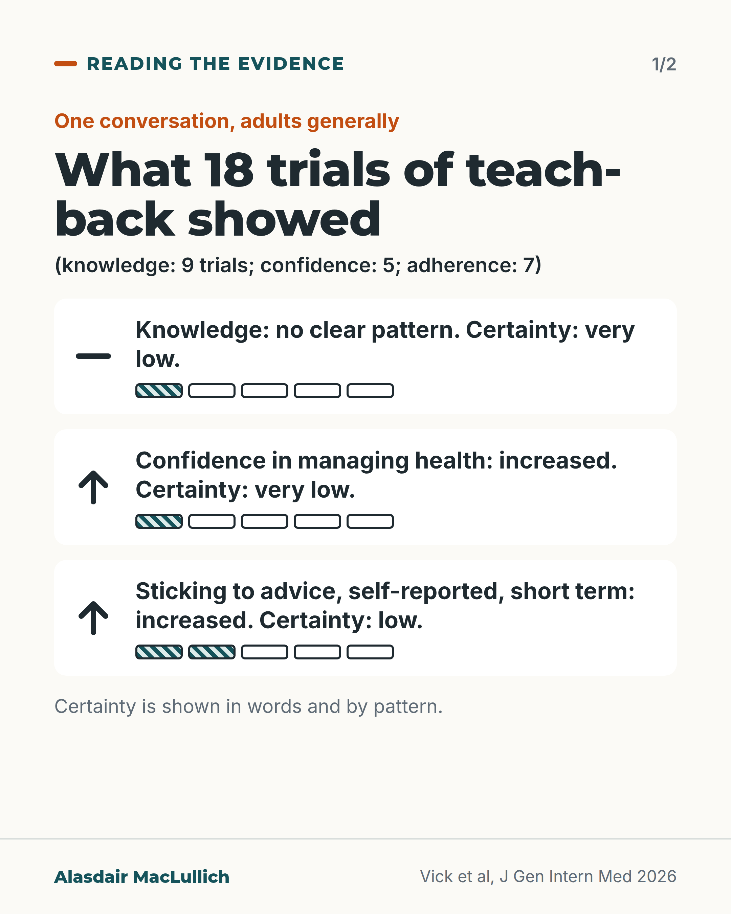
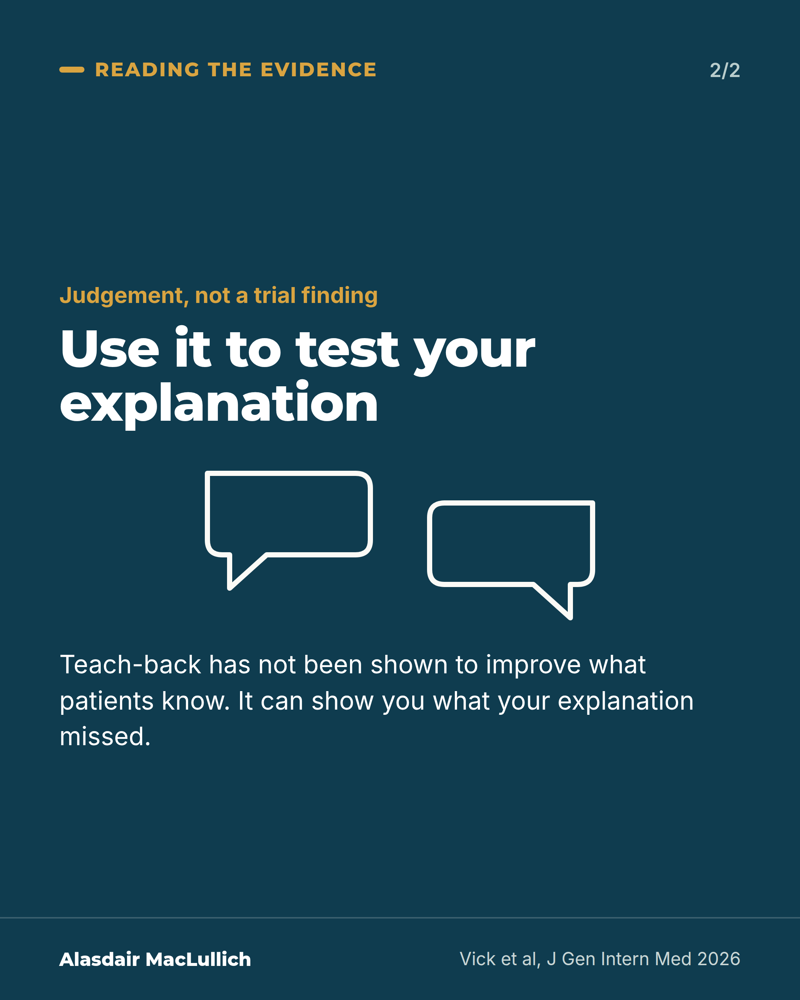

# G087: Teach-back: what the newest review found

- Category: C09 Communication, capacity and supported decision-making
- Audience: practitioners
- Series: Reading the evidence
- Post type: evidence_interpretation
- Visual format: carousel (2 cards)
- Status: text text_final, visual final
- Working id: C09-P04 (candidate C09-23)

## Insight

A 2026 review of 18 randomised trials found no clear effect of teach-back on what patients knew, with improved confidence and short-term self-reported adherence at low or very low certainty. That is an evidence gap, not a failure.

## Angle and position

Teach-back is often taught as a technique that works. The best-supported randomised evidence is thinner than the teaching suggests. Position: keep using it to find what our own explanation missed, and stop saying it has been shown to improve what patients know.

Basis: Mixed. The review findings and the contrast with the earlier review are empirical. Using teach-back to check one's own explanation is clinical judgement and is marked as such.

## X (906 characters)

```text
Teach-back, asking a patient to say in their own words what you told them, is often taught as a technique that improves understanding.

A 2026 review of 18 randomised trials (about 2,000 people) found no clear pattern of effect on what patients knew afterwards. Certainty was very low, and the 9 trials that measured knowledge were too different to combine. Patients' confidence in managing their health improved (very low certainty). Their own reports of sticking to advice in the short term also improved (low certainty). The size of both effects was very uncertain.

That is an evidence gap. Teach-back has not been shown to fail. The review covered single-encounter teach-back in adults generally, and an earlier review of mixed designs reported benefit in 19 of 20 studies.

We should keep using it to find what our explanation missed, and avoid saying it has been shown to improve what patients know.
```

## LinkedIn (1717 characters)

```text
Teach-back, asking a patient to say in their own words what you told them, is often taught as a technique that improves understanding. An earlier systematic review (Talevski and colleagues, 2020) reported that it worked on some outcome in 19 of 20 studies. Those studies had mixed designs and quality.

A 2026 systematic review (Vick and colleagues, Journal of General Internal Medicine) included only randomised trials of teach-back in a single encounter, and graded the certainty of the evidence. It found 18 trials with 1,985 participants.

Knowledge: no clear pattern of effect, very low certainty. The 9 trials that measured knowledge were too different to combine.

Confidence in managing health (self-efficacy): increased, very low certainty, from 5 trials.

Sticking to advice (adherence): increased, low certainty, from 7 trials. This was self-reported and short term.

The confidence intervals were wide and the trials differed a lot from each other.

Two limits. The trials were in adults generally, not older people specifically. And multi-session education programmes that include teach-back were outside the review.

This is an evidence gap. Teach-back has not been shown to fail. It does give us a reason to check, because older patients may recall less when a lot is said. In a study of 260 people with cancer who had their first appointment recorded, older patients recalled less than younger ones when a lot of information was given. How much was said, and how serious the news was, predicted recall better than age alone.

Our judgement: use teach-back to test our own explanation and find what we missed, and avoid telling patients or trainees that it has been shown to improve what patients know.
```

## Bluesky (300 characters)

```text
A 2026 review of 18 randomised trials found no clear effect of teach-back on what patients knew (very low certainty). Confidence and short-term self-reported adherence improved, with low or very low certainty and a very uncertain size. An evidence gap, not a failure. Use it to test your explanation.
```

## Threads (457 characters)

```text
Teach-back is often taught as a technique that improves understanding.

A 2026 review of 18 randomised trials (about 2,000 people) found no clear effect on what patients knew, at very low certainty. Confidence and short-term self-reported adherence improved, but the certainty was low or very low and the size of the effect was very uncertain.

That is an evidence gap. Teach-back has not been shown to fail. Use it to find what your own explanation missed.
```

## Source reply

Sources: Vick et al, J Gen Intern Med 2026 https://doi.org/10.1007/s11606-026-10678-y ; Talevski et al, PLoS One 2020 https://doi.org/10.1371/journal.pone.0231350 ; Jansen et al, J Clin Oncol 2008 https://doi.org/10.1200/JCO.2007.15.2322

## Visual



Alt text: Summary of 18 randomised trials of teach-back in one conversation, adults generally. Knowledge: no clear pattern, very low certainty. Confidence in managing health: increased, very low certainty. Sticking to advice, self-reported and short term: increased, low certainty. Certainty is shown in words and by filled segments.



Alt text: Statement card: Use it to test your explanation. A judgement, not a trial finding: teach-back has not been shown to improve what patients know, but it can show what an explanation missed.

Editable source: `visuals/src/G087.html`

Design instructions: Two cards, Reading the evidence. Card 1 light: h1.m with grey trial-count line, three white rows with dash or up arrow, text, 5-segment hatched certainty bar (1 filled very low, 2 filled low). Card 2 deep teal statement with two speech outlines. Claims C09-23-a to d.

## Sources and verification

- C09-23-a (supported_with_qualification): In a 2026 systematic review of 18 RCTs (1985 participants), there was no clear pattern of effect of teach-back on patient knowledge (very low certainty); the 9 knowledge trials could not be pooled.
  - Source: Vick JB, Pace R, Klimek-Johnson P, Rushton S, Roberts M, Lewinski A, et al. Teach-back in clinical communication: a systematic review and meta-analysis. J Gen Intern Med. 2026. doi:10.1007/s11606-026-10678-y. Epub 2026 Sep 3.
  - Passage: "Our systematic review included 18 randomized controlled trials (RCTs) involving 1985 participants. Across 9 RCTs assessing knowledge acquisition, conceptual inconsistencies precluded meta-analysis. Overall, there was no clear pattern of the effect of teach-back on knowledge (very low COE). ... In this systematic review and meta-analysis, we did not identify a clear benefit of teach-back on knowledge acquisition" (Abstract, Results and Conclusions)
- C09-23-b (supported_with_qualification): Teach-back increased self-efficacy (5 RCTs, very low certainty) and self-reported short-term adherence (7 RCTs, low certainty), with wide confidence intervals and substantial heterogeneity.
  - Source: Vick JB, Pace R, Klimek-Johnson P, Rushton S, Roberts M, Lewinski A, et al. Teach-back in clinical communication: a systematic review and meta-analysis. J Gen Intern Med. 2026. doi:10.1007/s11606-026-10678-y. Epub 2026 Sep 3.
  - Passage: "In a meta-analysis of 5 RCTs assessing self-efficacy (416 participants), we found that teach-back interventions led to a large increase in self-efficacy relative to usual care (SMD = 2.40; 95%CI 0.37-4.44) (very low COE). In a meta-analysis of 7 RCTs assessing adherence to health behaviors (571 participants), teach-back interventions led to a large increase in adherence (SMD = 1.04; 95%CI 0.45-1.64) (low COE). Meta-analyses for both self-efficacy and adherence had large confidence intervals that ranged from small to large effect sizes and had substantial heterogeneity. ... but did find evidence that teach-back improves self-efficacy and self-reported, short-term adherence to health behaviors." (Abstract, Results and Conclusions)
- C09-23-c (supported_with_qualification): Teach-back is widely presented as an effective, high-quality communication strategy.
  - Source: Vick JB, Pace R, Klimek-Johnson P, Rushton S, Roberts M, Lewinski A, et al. Teach-back in clinical communication: a systematic review and meta-analysis. J Gen Intern Med. 2026. doi:10.1007/s11606-026-10678-y. Epub 2026 Sep 3.; Talevski J, Wong Shee A, Rasmussen B, Kemp G, Beauchamp A. Teach-back: a systematic review of implementation and impacts. PLoS One. 2020;15(4):e0231350.
  - Passage: "Vick 2026: "Teach-back has been identified as a high-quality clinical communication strategy." Talevski 2020: "Use of 'teach-back' has been shown to improve patients' knowledge and self-care abilities, however there is little guidance for healthcare services seeking to embed teach-back in their setting." ... "Overall, 20 studies of moderate quality were included in this review (four rated high, nine rated moderate, seven rated weak)." ... "Use of teach-back proved effective in 19 of the 20 studies, ranging from learning-related outcomes (e.g. knowledge recall and retention) to objective health-related outcomes (e.g. hospital re-admissions, quality of life)."" (Vick 2026 abstract, Background; Talevski 2020 abstract)
- C09-23-d (supported_with_qualification): Older patients remember less than younger patients when more information is given in a consultation.
  - Source: Jansen J, Butow PN, van Weert JC, van Dulmen S, Devine RJ, Heeren TJ, et al. Does age really matter? Recall of information presented to newly referred patients with cancer. J Clin Oncol. 2008;26(33):5450-7.
  - Passage: "Recall decreased significantly with age, but only when total amount of information presented was taken into account. This indicates that if more information is discussed, older patients have more trouble remembering the information than younger ones. ... Recall is not simply a function of patient age. Age only predicts recall when controlling for amount of information presented. Both prognosis and information about prognosis are better predictors of recall than age." (Abstract, Results and Conclusions)

Verification notes: C09-23-a Vick 2026 (abstract): 18 RCTs, 1,985 participants, 9 knowledge trials not pooled, very low certainty; phrased as an evidence gap and scoped to single-encounter teach-back in adults generally. C09-23-b: self-efficacy 5 RCTs (416; very low) and adherence 7 RCTs (571; low), self-reported and short term; no effect sizes given to readers. C09-23-c: 'often taught as' rests on the literature description and Talevski 2020 (19 of 20 studies; mixed designs and quality); no NHS body named (C09-23-e not found, excluded). C09-23-d Jansen 2008 (abstract): 260 patients, oncology only, age effect depends on amount of information. The link from older-patient recall to checking explanations is stated as reasoning in the LinkedIn caption.

## Attention and follow potential

Pause: It questions a technique most clinicians were taught as settled, without claiming it fails.

Gain: A calibrated reading of a common technique and a better reason to use it.

Follow: Reading the evidence posts separate what trials show from what is assumed.

## Open issues

None.
