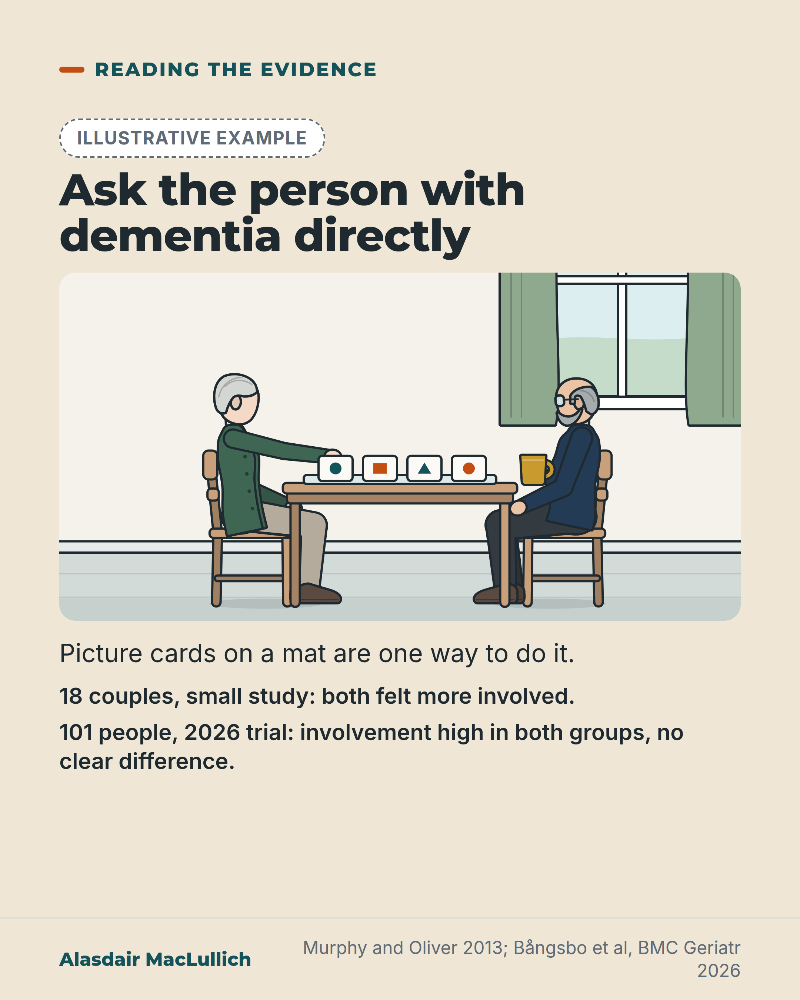

# G088: Talking Mats: a picture method, and what the trials show

- Category: C09 Communication, capacity and supported decision-making
- Audience: both
- Series: Reading the evidence
- Post type: evidence_interpretation
- Visual format: drawn illustration
- Status: text text_final, visual final
- Working id: C09-P05 (candidate C09-22)

## Insight

Talking Mats, a set of picture cards and a mat, made both partners in 18 couples feel more involved in one small study, but a 2026 randomised trial of 101 people with dementia in home care found no clear difference from usual conversation, with high scores in both groups.

## Angle and position

A visual way to ask the person with dementia directly may help some conversations, but it has not been shown to beat a careful ordinary conversation. The constant is to ask the person, not only the family. Neutral about the product.

Basis: Mixed. The two study results and the review are empirical. 'Ask the person directly, whatever method is used' is an ethical judgement and is marked as such.

## X (866 characters)

```text
Talking Mats is a set of picture cards and a mat that lets a person show how they feel about each part of daily life. It comes from the Talking Mats Centre in Stirling.

In one small study of 18 couples living with dementia, both partners said they felt more involved using the mats than in their usual conversation. A 2026 Swedish trial put 101 people with mild to moderate dementia in home care into two groups by chance. One group had care-planning talks with the mats, after staff had two days of training, and one talked as usual. Involvement scores were high in both groups, with no clear difference. High scores in both may have made a difference hard to detect.

A picture method may help some conversations. It has not been shown to beat a careful ordinary one. We should ask the person with dementia directly, not only the family, whichever method is used.
```

## LinkedIn (1550 characters)

```text
Talking Mats is a set of picture cards and a mat that lets a person show how they feel about each part of daily life. It comes from the Talking Mats Centre in Stirling. In a 2026 Swedish trial, staff had two days of training before using it.

In one small study, 18 couples living with dementia (a person with dementia and a family carer) talked about daily life twice, once with the mats and once as usual. Both partners said they felt more involved with the mats. That study was not randomised, had one visit per couple, and was led by the tool's developers.

In a 2026 Swedish randomised trial, 101 older people with mild to moderate dementia, mean age 84, were randomly assigned to care-planning talks with or without the mats. Both groups rated their involvement high, and the trial did not show a clear difference between them. Scores were high in both groups, which may have left little room to show a difference. The same staff ran both kinds of talk, and about a quarter to a third of participants had no data after each conversation.

A systematic review looked at 7 studies of ways to include the views of people with moderate-to-severe dementia in research. Each tool had some use. None had clear evidence over the others.

So a structured, visual way to ask the person directly may help some conversations. It has not been shown to beat a careful ordinary conversation. Staff need training and a licence to use the product.

Our judgement: whichever method is used, we should ask the person with dementia directly, not only their family.
```

## Bluesky (296 characters)

```text
Talking Mats are picture cards on a mat for asking about daily life. A small study (18 couples with dementia, no groups set by chance): both felt more involved than in usual talk. A 2026 trial (101 people, home care): high involvement in both groups, no clear difference. Ask the person directly.
```

## Threads (430 characters)

```text
Talking Mats are picture cards and a mat for asking a person how each part of daily life is going.

One small study (18 couples with dementia): both partners felt more involved. A 2026 Swedish trial (101 people in home care, groups set by chance): high involvement in both groups, no clear difference.

A picture method may help some conversations. We should ask the person directly, not only the family, whichever method is used.
```

## Source reply

Sources: Murphy and Oliver, Health Soc Care Community 2013 https://doi.org/10.1111/hsc.12005 ; Bångsbo et al, BMC Geriatr 2026 https://doi.org/10.1186/s12877-026-07518-3 ; Collins et al, Int J Older People Nurs 2024 https://doi.org/10.1111/opn.12594

## Visual



Alt text: Illustration: an older woman with dementia places a picture card on a mat at a kitchen table while her husband sits opposite, watching and listening. Text: Ask the person with dementia directly. A small study of 18 couples found both felt more involved; a 2026 trial of 101 people found high involvement in both groups and no clear difference.

Editable source: `visuals/src/G088.html`

Design instructions: Sand card, Reading the evidence. Badge, h1.s, kit kitchen scene 920x520 scale 0.95: older woman silver pixie, green cardigan, placing a picture card on a mat (shape pictograms); husband grey beard, glasses, navy. Body and two study lines. Claims C09-22-a to d.

## Sources and verification

- C09-22-a (supported_with_qualification): In 18 couples (a person with dementia and a family carer) in Scotland and the North of England, both partners felt more involved and more satisfied with discussions about daily living when using Talking Mats than with their usual way of talking.
  - Source: Murphy J, Oliver T. The use of Talking Mats to support people with dementia and their carers to make decisions together. Health Soc Care Community. 2013;21(2):171-80.
  - Passage: "Murphy and Oliver 2013, Abstract: "Eighteen couples (person with dementia and their family carer) from Scotland and the North of England were involved. The couples were visited in their own homes and asked to discuss together four topics (Personal Care; Getting Around; Housework; Activities) under two different conditions: (i) using the Talking Mats framework and (ii) using their usual communication methods (UCMs)." ... "The findings show that both people with dementia and their carers feel more involved in discussions about how they are managing their daily living when using the Talking Mats framework, compared with their UCM. They also feel more satisfied with the outcome of those discussions."" (Abstract)
- C09-22-b (supported): In the first randomised trial found (Sweden, 2026), older people with dementia in home care felt equally involved and satisfied whether or not staff used Talking Mats; scores were high in both groups.
  - Source: Bångsbo A, Dunér A, Olsson TM. Talking Mats and self-perceived involvement for service recipients with dementia in Swedish home care services: a randomized controlled trial. BMC Geriatr. 2026;26(1). doi:10.1186/s12877-026-07518-3.
  - Passage: "Bångsbo 2026, Abstract: "101 older home care services recipients were recruited, 51 in the TM group and 50 in the control group." ... "High involvement and satisfaction were found in both TM and control group in conversations with care managers and nurse assistants. No difference between groups was detected." ... "There were no significant differences between TM and control groups regarding self-perceived involvement and satisfaction after conversations with care managers and nurse assistants." | Table 2: involvement (care managers) TM 3.82 vs UCM 3.62, p = 0.60; (nursing assistants) 3.88 vs 3.64, p = 0.32; satisfaction 5.07 vs 5.18, p = 0.65; 5.31 vs 5.45, p = 0.59. | Method discussion: "given the relatively high scores on self-perceived involvement, we cannot rule out a ceiling effect on this measure" ... "the TM training may also have influenced their delivery of UCM, and thus we cannot ignore the risk that contamination may have impacted study results."" (Abstract; Results (Table 2); Discussion; Method discussion)
- C09-22-c (partly_supported): Talking Mats is a low-tech, picture-based communication framework; staff use requires training (two days, then a licence, in the Swedish trial); its home is the Talking Mats Centre at the University of Stirling.
  - Source: Murphy J, Oliver T. The use of Talking Mats to support people with dementia and their carers to make decisions together. Health Soc Care Community. 2013;21(2):171-80.; Ferm U, Sahlin A, Sundin L, Hartelius L. Using Talking Mats to support communication in persons with Huntington's disease. Int J Lang Commun Disord. 2010;45(5):523-36.; Bångsbo A, Dunér A, Olsson TM. Talking Mats and self-perceived involvement for service recipients with dementia in Swedish home care services: a randomized controlled trial. BMC Geriatr. 2026;26(1). doi:10.1186/s12877-026-07518-3.
  - Passage: "Murphy and Oliver 2013, Abstract: "This project, funded by Joseph Rowntree Foundation, examined if Talking Mats, a low-tech communication framework, could support family carers and people with dementia" | Author affiliation (PubMed record): "Talking Mats Centre, Stirling University Innovation Park, University of Stirling, UK." | Ferm 2010, Abstract: "Talking Mats is a visually based low technological augmentative communication framework that supports communication in people with different cognitive and communicative disabilities." | Bångsbo 2026, Interventions: "All participating CMs and NAs received a two-days TM training, after which they were licensed to use TM."" (Murphy and Oliver 2013: Abstract and affiliation; Ferm 2010: Abstract; Bångsbo 2026: Methods, Interventions)
- C09-22-d (supported_with_qualification): A systematic review of tools for including people with moderate-to-severe dementia found no clear evidence to recommend any one tool, Talking Mats included.
  - Source: Collins R, Martyr A, Hunt A, Quinn C, Pentecost C, Hughes JC, et al. Methods and approaches to facilitate inclusion of the views, perspectives and preferences of people with moderate-to-severe dementia in research: a narrative systematic review. Int J Older People Nurs. 2024;19(1):e12594.
  - Passage: "Collins 2023, Abstract: "In these studies five specific communication tools were used: Talking Mats, Augmentative and Alternative Communication Flexiboard, generic photographs in combination with a preference placement board, consultation ballot and personalised communication prescriptions." ... "All tools had some utility and there was no clear evidence to support the recommendation of any one specific tool"" (Abstract)

Verification notes: C09-22-a Murphy and Oliver 2013 (abstract): 18 couples, non-randomised, developer-led, size of difference not seen. C09-22-b Bångsbo 2026 (full text): 101 randomised (51 and 50), mean age 84.2, no clear difference, high scores in both arms, possible ceiling effect and contamination, 24% and 35% without data; 'did not show a clear difference'. C09-22-c: described neutrally, no price, 'from the Talking Mats Centre in Stirling' (not 'developed at the University of Stirling'); two days' training from the Swedish trial; 'licence' from the evidence note. C09-22-d Collins 2023 review (7 studies, 5 tools): no clear evidence over others. Revised angle applied (Reading the evidence, audience both); 'cheap' and 'Care that works' framing dropped.

## Attention and follow potential

Pause: A tool many carers will have heard of is shown with its mixed evidence, so readers get both the idea and the limits.

Gain: A concrete way to include the person in a conversation, and a fair reading of the evidence.

Follow: Reading the evidence posts say plainly when a promising idea has thin or mixed support.

## Open issues

None.
