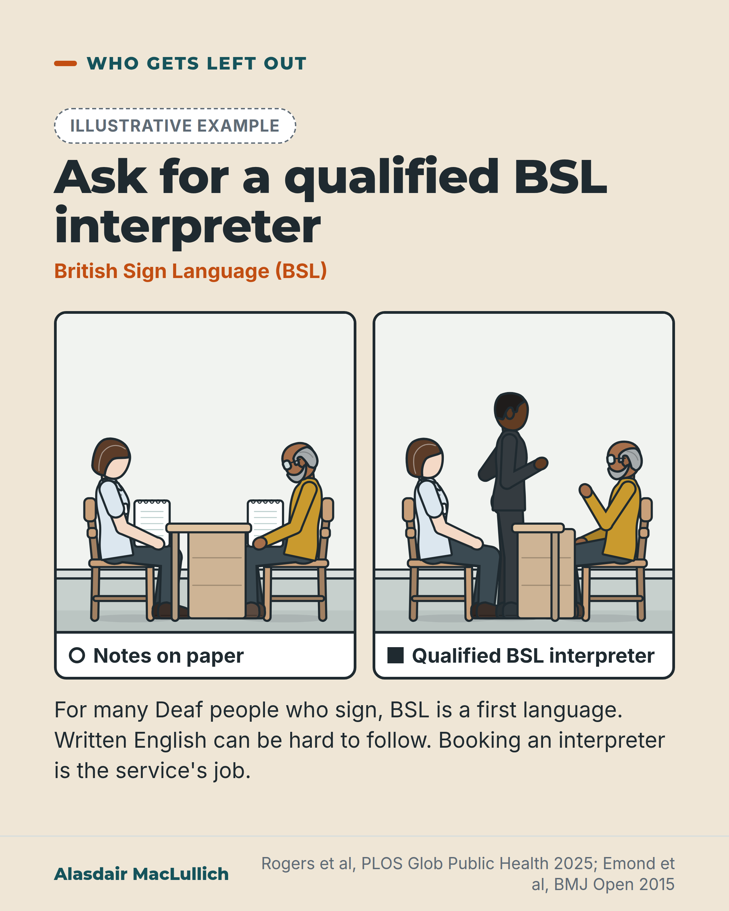

# G089: Many Deaf people who sign need a BSL interpreter for health conversations

- Category: C09 Communication, capacity and supported decision-making
- Audience: both
- Series: Who gets left out
- Post type: public_explanation
- Visual format: comparison (two drawn scenes)
- Status: text text_final, visual final
- Working id: C09-P06 (candidate C09-27)

## Insight

For many Deaf people who sign, British Sign Language is a first language and written English a second, so written notes are an unreliable substitute for a qualified interpreter in health conversations. Booking one is the service's job.

## Angle and position

Pen and paper is often what is offered. Research with Deaf patients finds it often leaves gaps, relatives who interpret can leave things out, and a UK health check found more unrecognised and poorly controlled high blood pressure among Deaf BSL users. For any talk about diagnosis, treatment, consent or going home, ask for a qualified BSL interpreter.

Basis: Mixed. Experience research and the health-check figures are empirical (the communication explanation is the authors' interpretation). The request to ask for a qualified interpreter is practical advice, and the booking responsibility comes from patient accounts and the Equality Act and Accessible Information Standard as described in secondary sources.

## X (1097 characters)

```text
For many Deaf people who sign, British Sign Language (BSL) is a first language and written English is a second. BSL is a language in its own right, with its own grammar.

Research with Deaf patients finds that handing over pen and paper often does not fix the problem, especially when notes are full of medical words. Patients describe interpreters not being booked, being asked to bring a relative, and relatives leaving things out. Some people prefer a relative to interpret for particular appointments, and that is their choice.

In a UK health check of 298 Deaf BSL users aged 20 to 82, 37 in 100 had a high blood pressure reading, against 21 in 100 in an English population survey. Among those treated for high blood pressure, 42 in 100 had it under control, against 62 in 100 in the wider population. The authors suggested unclear communication with doctors and nurses may be part of the reason treated blood pressure was less well controlled.

For any talk about diagnosis, treatment, consent or going home, ask the service to book a qualified BSL interpreter. Booking is the service's job.
```

## LinkedIn (2272 characters)

```text
For many Deaf people who sign, British Sign Language (BSL) is a first language, with its own grammar. For some, written English is a second language, and notes full of medical words are hard to follow. Reading ability varies, and some prefer writing for a simple exchange. The evidence concerns health conversations where understanding is critical.

A review that mapped 51 studies from 12 countries on Deaf sign language users as patients found that handing over pen and paper often does not fix the problem. That review and a Welsh focus-group study (66 Deaf and hard of hearing people) also describe interpreters not being booked, relatives being asked to interpret instead, and relatives leaving things out. Some people prefer a family member to interpret for particular appointments, which is their choice.

In a UK health check of 298 Deaf BSL users aged 20 to 82, 37 in 100 had a high blood pressure reading, against 21 in 100 in an English population survey. Among those treated for high blood pressure, 42 in 100 had it under control, against 62 in 100 in the wider population. The authors suggested that unclear communication with doctors and nurses may be part of the reason treated blood pressure was less well controlled; the study did not test this. People were recruited to include set numbers of each kind of participant. Blood pressure was measured once. The sample covered all adult ages.

A review of research on older Deaf people who sign found that patchy access to interpreters puts them at risk of treatment without proper consent. That review mostly covers US studies and people's accounts rather than measurements, and little UK evidence on older Deaf people was found.

In England, NHS and adult social care services must record a person's communication needs and meet them. Any BSL interpreter they use must be qualified. This is the Accessible Information Standard. Across Great Britain, the Equality Act 2010 expects services to make reasonable adjustments for disabled people, including how they communicate. These points come from secondary sources and do not guarantee an interpreter.

For any conversation about diagnosis, treatment, consent or going home, ask the service to book a qualified BSL interpreter. Booking is the service's job.
```

## Bluesky (295 characters)

```text
For many Deaf people who sign, British Sign Language is a first language and written English a second. Pen and paper often does not fix this, and relatives interpreting can leave things out. For talks about diagnosis, treatment or going home, ask the service to book a qualified BSL interpreter.
```

## Threads (465 characters)

```text
For many Deaf people who sign, British Sign Language is a first language and written English is a second. Research with Deaf patients finds pen and paper often does not fix the problem, and relatives who interpret can leave things out. Some people prefer a relative for particular appointments, and that is their choice.

For talks about diagnosis, treatment, consent or going home, ask the service to book a qualified BSL interpreter. Booking is the service's job.
```

## Source reply

Sources: Rogers et al, PLOS Glob Public Health 2025 https://doi.org/10.1371/journal.pgph.0003535 ; Emond et al, BMJ Open 2015 https://doi.org/10.1136/bmjopen-2014-006668 ; Terry et al, J Public Health 2024 https://doi.org/10.1093/pubmed/fdae112

## Visual



Alt text: Illustrative drawing of two scenes of a health appointment with an older Deaf man. Left: a doctor writes notes on a pad and he looks at them with a frown. Right: a qualified BSL interpreter signs beside the doctor and he watches attentively. Text: Ask for a qualified BSL interpreter. For many Deaf people who sign, BSL is a first language and written English can be hard to follow.

Editable source: `visuals/src/G089.html`

Design instructions: Sand card, Who gets left out. Badge, h1.m, kicker, two framed kit gp_room scenes labelled Notes on paper (open circle) and Qualified BSL interpreter (solid square): woman GP, older Deaf man, young interpreter signing. Claims C09-27-a to f.

## Sources and verification

- C09-27-a (supported): For many Deaf people who sign, BSL is their first language and written English can be hard to follow, so written notes are an unreliable substitute for an interpreter.
  - Source: Rogers KD, Lovell K, Bower P, Armitage CJ, Young A. What are Deaf sign language users' experiences as patients in healthcare services? A scoping review. PLOS Glob Public Health. 2025;5(2):e0003535.; Emond A, Ridd M, Sutherland H, Allsop L, Alexander A, Kyle J. The current health of the signing Deaf community in the UK compared with the general population: a cross-sectional study. BMJ Open. 2015;5(1):e006668.; Terry J, Meara R, England R. "They still phone even though they know I'm deaf": exploring experiences of deaf people in health services in Wales, UK. J Public Health (Oxf). 2024;46(3):e520-e527.; Selby A, Jones A, Radford H, Hind D. Reducing health inequalities in the deaf community: a priority setting exercise. BMC Health Serv Res. 2026;26(1):131.
  - Passage: "Rogers 2025, Narrative synthesis (Language access): "Some communicated through passing written notes between professional and patient, but this is problematic if the written/spoken language of the country was not their first or preferred language or literacy was poor" | Cultural competency: "not being aware that some Deaf people struggle to understand not just a spoken language but also a written language. Consequently, assumptions that written communication can resolve communication barriers are unhelpful" | Emond 2015, Introduction: "Deaf adults in the UK occupy poorer socio-economic positions, have poorer literacy and have limited access to communicate through speech. Yet they have their own fully functioning language (British Sign Language—BSL)" | Terry 2024, Methods: "most participants were using BSL as their first language" | Selby 2025, Background: "When they do attend, consultations often rely on lip-reading or written notes instead of BSL, undermining both trust and care quality."" (Rogers 2025: Narrative synthesis; Emond 2015: Introduction; Terry 2024: Methods; Selby 2025: Background)
- C09-27-b (supported_with_qualification): BSL is a full language with its own grammar, distinct from English.
  - Source: Ahmed TA, Bradley N, Fenesan S. Dental management of patients with sensory impairments. Br Dent J. 2022;233(8):627-33.; Emond A, Ridd M, Sutherland H, Allsop L, Alexander A, Kyle J. The current health of the signing Deaf community in the UK compared with the general population: a cross-sectional study. BMJ Open. 2015;5(1):e006668.; British Sign Language Act 2022 (c. 34). London: The Stationery Office; 2022.
  - Passage: "Ahmed 2022, Managing patients with sensory impairments (Hearing impairment or deaf): "BSL is an official language, recognised in 2003, with its own grammar and structure and variations across regions within the UK." | Table 4: Sign Supported English "Unlike BSL, this type of sign language follows the spoken and reading English language and follows its structure" | Emond 2015: "they have their own fully functioning language (British Sign Language—BSL)" | Search extract only (legislation.gov.uk result via WebSearch): "British Sign Language is recognised as a language of England, Wales and Scotland under the British Sign Language Act 2022."" (Ahmed 2022: Hearing impairment or deaf; Table 4. Emond 2015: Introduction. BSL Act 2022: search extract only)
- C09-27-c (supported_with_qualification): Deaf BSL users in the UK showed signs of undiagnosed and undertreated illness: more high blood pressure readings, more of it unrecognised, and less of it controlled, than in the general population.
  - Source: Emond A, Ridd M, Sutherland H, Allsop L, Alexander A, Kyle J. The current health of the signing Deaf community in the UK compared with the general population: a cross-sectional study. BMJ Open. 2015;5(1):e006668.
  - Passage: "Emond 2015, Abstract: "298 Deaf people, 20-82 years old" ... "High BP readings were obtained in 37% of Deaf people (21% in HSE): 29% were unaware of this (6% in HSE). Only 42% of Deaf people being treated for hypertension had adequate control, compared with 62% of the general population." ... "Deaf people's health is poorer than that of the general population, with probable underdiagnosis and undertreatment of chronic conditions putting them at risk of preventable ill health." | Discussion: "Our data also show that even if prescribed antihypertensives, the Deaf patient may not be taking enough tablets or may not be taking the medication regularly to control the BP—again suggesting that communication with doctors and nurses has not been clear."" (Abstract; Discussion)
- C09-27-d (supported): Deaf patients value qualified interpreters; services often fail to provide them, and relatives who interpret can edit what is said and remove privacy.
  - Source: Rogers KD, Lovell K, Bower P, Armitage CJ, Young A. What are Deaf sign language users' experiences as patients in healthcare services? A scoping review. PLOS Glob Public Health. 2025;5(2):e0003535.; Terry J, Meara R, England R. "They still phone even though they know I'm deaf": exploring experiences of deaf people in health services in Wales, UK. J Public Health (Oxf). 2024;46(3):e520-e527.; Selby A, Jones A, Radford H, Hind D. Reducing health inequalities in the deaf community: a priority setting exercise. BMC Health Serv Res. 2026;26(1):131.
  - Passage: "Rogers 2025, Partial or inadequate solutions: "Many healthcare professionals did not know sign language, or were not fluent in sign language, so qualified interpreters were needed for effective communication between Deaf patients and healthcare providers." ... "Often, healthcare professionals would expect Deaf people to bring their family members to ‘interpret’ or ‘assist’ with communication ... However, hearing relatives sometimes edited the interactions, not sharing a full account of the information exchanged with a doctor, which diminished the Deaf patient’s autonomy" | Language access: "it has been reported not only that providers have failed or refused to provide interpreters ... but additionally that they do not understand their responsibilities for providing an interpreter" | Terry 2024, Results: "Access to qualified BSL/English interpreters was a common discussion point across all 10 focus groups, with frequent misunderstandings between healthcare settings and patients as to who was responsible for booking interpreters. Booking interpreters is not a patient responsibility." | Box 1 (participant comments): "Consent is impossible to give without interpreters."" (Rogers 2025: Narrative synthesis; Terry 2024: Results and Box 1; Selby 2025: Background)
- C09-27-e (supported_with_qualification): Older Deaf people who sign face these barriers when decisions are hardest; inconsistent interpreter access puts them at risk of treatment without adequate consent.
  - Source: Lesch H, Burcher K, Wharton T, Chapple R, Chapple K. Barriers to healthcare services and supports for signing deaf older adults. Rehabil Psychol. 2019;64(2):237-44.; Terry J, Meara R, England R. "They still phone even though they know I'm deaf": exploring experiences of deaf people in health services in Wales, UK. J Public Health (Oxf). 2024;46(3):e520-e527.; Emond A, Ridd M, Sutherland H, Allsop L, Alexander A, Kyle J. The current health of the signing Deaf community in the UK compared with the general population: a cross-sectional study. BMJ Open. 2015;5(1):e006668.
  - Passage: "Lesch 2019, Abstract: "Lack of cultural competence among providers, coupled with inconsistent access to interpreters in medical settings, puts deaf individuals at risk for treatment without adequate consent, or insufficient care due to communication barriers or misperceptions of expression or culture." | Terry 2024, Box 1: "Long hospital stays without interpreters (4 months+)" ... "I fell and hurt my hip and there was no interpreter had to sit with my daughter who came with me, if interpreter at hospital no problem but using family invades privacy" | Emond 2015, Results: "In the Deaf sample, 90% of those over 65 years were classed as overweight or obese."" (Lesch 2019: Abstract; Terry 2024: Box 1; Emond 2015: Results (Obesity))
- C09-27-f (supported_with_qualification): The basis for asking is the Equality Act 2010 duty to make reasonable adjustments and, in England, the Accessible Information Standard, which requires NHS and adult social care to meet communication needs and to use qualified interpreters.
  - Source: Ahmed TA, Bradley N, Fenesan S. Dental management of patients with sensory impairments. Br Dent J. 2022;233(8):627-33.; Accessible information. Nurs Manag (Harrow). 2017;23(10):13.; Selby A, Jones A, Radford H, Hind D. Reducing health inequalities in the deaf community: a priority setting exercise. BMC Health Serv Res. 2026;26(1):131.
  - Passage: "Ahmed 2022, Conclusion: "Sensory impairments are common within the UK and dental practitioners have a legislative duty to make reasonable adjustments to dental care for this population, including considering alternative communication methods." | Introduction: "All organisations offering NHS care are legally required to follow the Standard (commenced 1 August 2016), including dental services. The Standard sets out a consistent approach to identifying, recording, flagging, sharing and meeting the information and communication support needs of patients, service users, carers and parents with a disability, impairment or sensory loss." | Box 1: "Organisations must ensure that communication professionals (including BSL interpreters and deafblind manual interpreters) used in health and social care settings have: Appropriate qualifications; Disclosure and Barring Service (DBS) clearance; Signed up to a relevant professional code of conduct." | Nursing Management 2017, Abstract: "All organisations that provide NHS or adult social care are legally required to follow the Accessible Information Standard" | Selby 2025, Discussion: "Currently, there is no process in the NHS to ensure that this legal requirement is met."" (Ahmed 2022: Introduction, Box 1, Conclusion; Nursing Management 2017: Abstract; Selby 2025: Discussion)

Verification notes: C09-27-a: Rogers 2025 scoping review (51 studies, 12 countries), Emond 2015, Terry 2024 (66 participants, Wales), Selby 2025, all full text; 'many' and 'some', no reading-age figure. C09-27-b: BSL as a language with its own grammar; the BSL Acts were not verified and are left out. C09-27-c: Emond 2015 (298 Deaf BSL users aged 20 to 82; 37% vs 21%; 42% vs 62%); association, communication explanation is the authors' interpretation, whole sample not older people. C09-27-d: interpreters not booked, relatives asked to interpret and leaving things out; Rogers notes some prefer a family member, carried. C09-27-e: Lesch 2019 (abstract), US-focused. C09-27-f: Equality Act and Accessible Information Standard (England only) from secondary sources (Ahmed 2022, Nursing Management 2017); Standard not presented as UK-wide and no guarantee of an interpreter claimed; Ahmed 2022 has an unreadable correction. Revised angle applied; the original 'X, not Y' title dropped.

## Attention and follow potential

Pause: Many hearing readers have not thought of BSL as a separate language, or of pen and paper as an inadequate fix.

Gain: A clear request to make and a reason it is reasonable, with the limits of the evidence stated.

Follow: Who gets left out posts name people routine practice serves poorly, with evidence.

## Open issues

None.
