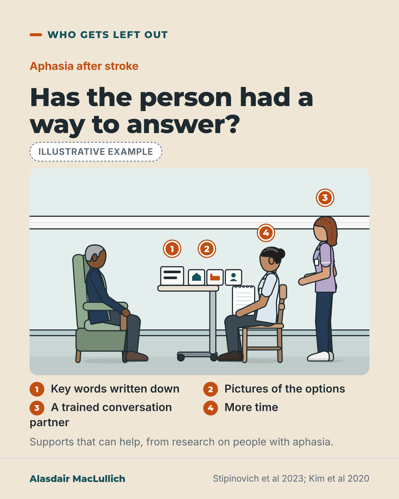

# G090: Aphasia and capacity assessment

- Category: C09 Communication, capacity and supported decision-making
- Audience: practitioners
- Series: Who gets left out
- Post type: teaching
- Visual format: annotated scene
- Status: text text_final, visual final
- Working id: C09-P07 (candidate C09-21)

## Insight

After a stroke, some people lose words but may keep their judgement; aphasia can make the ability to decide hard to see, and some people also have wider problems. Ask the speech and language therapist to help before the capacity conversation.

## Angle and position

Capacity assessments run mostly on talk, so people with aphasia risk being judged unable when the difficulty may lie in the channel. Position: give communication support, and involve the speech and language therapist, before concluding anything.

Basis: Mixed. The frequency of aphasia, the small laboratory study, the survey and the staff screening study are empirical. That a supported assessment, not the diagnosis, gives the answer, and the request to involve the therapist, are clinical judgement supported by the legal duty to help.

## X (1077 characters)

```text
After a stroke, some people lose words but may keep their judgement. Aphasia, a difficulty with understanding or using language, affects about 1 in 3 people in hospital after a stroke (a median across studies; the range is wide). Some people with aphasia also have problems with memory or reasoning, so the answer comes from a supported assessment, not from the diagnosis.

In a small laboratory study of 16 people with aphasia, they struggled most when a decision task relied on words, especially explaining their reasons aloud. On tasks without words they did not score clearly differently from people without aphasia.

Research describes supports that can help, though none has been tested on its own: key words written down, pictures of the options, trained conversation partners and more time. In a 2026 survey of 195 speech and language therapists in 32 countries, one barrier they reported was that other professionals did not seek their involvement.

Our judgement: where one is available, ask the speech and language therapist to help before the capacity conversation.
```

## LinkedIn (2176 characters)

```text
After a stroke, some people lose words but may keep their judgement.

Aphasia is a difficulty with understanding or using language. About 1 in 3 people in hospital after a stroke have it (a median of 30% in acute settings and 34% in rehabilitation, across mixed stroke populations, with a wide range). Aphasia can make a person's ability to decide hard to see. Some people with aphasia also have problems with memory or reasoning, so the answer comes from a supported assessment, not from the diagnosis.

Capacity assessments run largely on talk. In a small laboratory study, 16 people with aphasia struggled most when a decision task relied on words, especially explaining their reasons aloud. On decision tasks without words they did not score clearly differently from 16 matched people without aphasia. That study was small, used laboratory tasks rather than real assessments, and 'not clearly different' is not proof of equal ability.

Research on people with aphasia describes supports that can help them take part in decisions: key words written down, pictures of the options, trained conversation partners and more time. Their effectiveness has not been tested one by one.

Staff do not always spot who needs support. In one small English study, staff skipped communication screening when they thought a patient's communication was fine. Of 8 unscreened patients with dementia or memory problems, 4 turned out to have significant communication needs. In a 2026 survey of 195 speech and language therapists in 32 countries, one barrier they reported was that other professionals did not seek their involvement. The survey gives no proportion.

The law points the same way. In England and Wales a person can't be treated as unable to decide until all practicable steps to help them have failed. In Scotland, an inability to communicate that can be overcome with human or mechanical aids does not count as incapacity. (These statements come from published secondary sources.)

Our judgement: before concluding that a person with aphasia lacks capacity, ask the speech and language therapist to help with the conversation, and check that the person has had a way to answer.
```

## Bluesky (296 characters)

```text
After a stroke, some people lose words but may keep their judgement. About 1 in 3 people in hospital after stroke have aphasia. Some also have wider problems, so whether a person can decide needs a supported assessment, not the diagnosis. Our judgement: involve the speech and language therapist.
```

## Threads (490 characters)

```text
After a stroke, some people lose words but may keep their judgement. About 1 in 3 people in hospital after a stroke have aphasia, a difficulty with language. That is a median across studies. Some also have problems with memory or reasoning.

Key words written down, pictures of the options, trained partners and more time can help, though none has been tested on its own. Our judgement: where one is available, ask the speech and language therapist to help before the capacity conversation.
```

## Source reply

Sources: Flowers et al, Arch Phys Med Rehabil 2016 https://doi.org/10.1016/j.apmr.2016.03.006 ; Kim et al, J Speech Lang Hear Res 2020 https://doi.org/10.1044/2020_JSLHR-19-00182 ; Stipinovich et al, 2023 https://doi.org/10.1111/1460-6984.12925 ; Jayes et al, Disabil Rehabil 2026 https://doi.org/10.1080/09638288.2026.2662096 ; Jayes et al, Int J Lang Commun Disord 2021 https://doi.org/10.1111/1460-6984.12585 ; Hughes et al, BJPsych Adv 2015 https://doi.org/10.1192/apt.bp.114.013110

## Visual



Alt text: Illustrative annotated bedside scene. An older man with aphasia after a stroke sits attentively in a chair. On the table in front of him are a pad of key words and picture cards of options. An assessor with a notepad and a speech and language therapist stand by. Pins: 1 key words written down, 2 pictures of the options, 3 a trained conversation partner, 4 more time.

Editable source: `visuals/src/G090.html`

Design instructions: Sand card, Who gets left out. Kicker, h1.m, badge, kit hospital_bay scene 920x560: older man in armchair, over-bed table with pad and three pictogram cards, assessor with notepad, SLT in lilac. Orange pins 1 to 4 and key list. Claims C09-21-a to g.

## Sources and verification

- C09-21-a (supported_with_qualification): About 1 in 3 people in hospital after a stroke have aphasia.
  - Source: Flowers HL, Skoretz SA, Silver FL, Rochon E, Fang J, Flamand-Roze C, et al. Poststroke aphasia frequency, recovery, and outcomes: a systematic review and meta-analysis. Arch Phys Med Rehabil. 2016;97(12):2188-2201.e8.
  - Passage: "Median frequencies for mixed stroke (ischemic and hemorrhagic) were 30% and 34% for acute and rehabilitation settings, respectively. Frequencies by stroke type were lowest for acute subarachnoid hemorrhage (9%) and highest for acute ischemic stroke (62%) when arrival to the hospital was ≤3 hours from stroke onset. Articles monitoring aphasia for 1 year demonstrated aphasia frequencies 2% to 12% lower than baseline." (Abstract, Results)
- C09-21-b (supported_with_qualification): Aphasia is a disorder of language; it can hide a person's ability to decide, and some people with aphasia also have other cognitive problems, so aphasia alone does not show that the person lacks capacity or that they have it.
  - Source: Stipinovich AM, Tönsing K, Dada S. Communication strategies to support decision-making by persons with aphasia: a scoping review. Int J Lang Commun Disord. 2023;58(6):1955-76.; Kim ES, Suleman S, Hopper T. Decision making by people with aphasia: a comparison of linguistic and nonlinguistic measures. J Speech Lang Hear Res. 2020;63(6):1845-60.; Hughes JC, Poole M, Louw S, et al. Residence capacity: its nature and assessment. BJPsych Adv. 2015;21(5):307-12.
  - Passage: "Stipinovich 2023: "The presence of neurological pathology, for example, aphasia, and its associated difficulties with language and/or cognition, may affect an individual's capacity to make decisions, or their ability to reveal their capacity to make decisions." Kim 2020: "Because people with aphasia (PWA) have impaired language abilities and may also present with cognitive deficits, they may have difficulty during decision-making tasks." Hughes 2015 (Box 3): "Status Capacity is determined by the person's status as, for example, someone who is old, has an intellectual disability or dementia, has speech problems, has had a stroke"; "Professionals are mostly aware that assessments based on status should be avoided because they are unfairly discriminatory"." (Stipinovich abstract (Background); Kim abstract (Purpose); Hughes 2015 full text, Box 3 and 'Approaches to assessment')
- C09-21-c (supported_with_qualification): In a small study, people with aphasia did worse than matched controls on a language-based decision task but did not differ clearly on non-verbal decision tasks.
  - Source: Kim ES, Suleman S, Hopper T. Decision making by people with aphasia: a comparison of linguistic and nonlinguistic measures. J Speech Lang Hear Res. 2020;63(6):1845-60.
  - Passage: "PWA differed significantly from control participants on linguistic decision making, particularly when required to verbalize their rationale for making their decision. PWA and control participants did not differ significantly on measures of nonlinguistic decision making. ... Decision-making tasks that are heavily dependent on language, such as those used in capacity assessments, may disadvantage PWA. Assessments of decision-making capacity should include communication supports for people with acquired communication disorders" (Abstract, Results and Conclusions)
- C09-21-d (supported_with_qualification): Communication supports (information in several forms, trained partners, extra time) can help people with aphasia take part in decisions.
  - Source: Stipinovich AM, Tönsing K, Dada S. Communication strategies to support decision-making by persons with aphasia: a scoping review. Int J Lang Commun Disord. 2023;58(6):1955-76.
  - Passage: "Decision-making by persons with aphasia (PWA) can be enhanced when communication partners are trained and if communication supports are provided, for example, supports that reduce the linguistic and cognitive demands of the task, and/or that facilitate expression. ... The most frequently listed strategies include augmenting information with different modalities, acknowledging the competence of the PWA, thereby inviting initiation and collaboration by the PWA, and the allocation of sufficient time for the decision-making process. ... Future research should focus on the effectiveness of the different strategies identified" (Abstract (Background, Outcomes & Results, Conclusions))
- C09-21-e (supported_with_qualification): In an international survey of 195 speech and language therapists, barriers to supporting decision-making for people with aphasia included other disciplines not seeking their involvement.
  - Source: Jayes M, Wong WW, Stipinovich A, Shumway E, Rotherham A, Pais AM, et al. The speech and language therapist's role in supporting decision-making for people with aphasia: an international cross-sectional survey. Disabil Rehabil. 2026:1-23.
  - Passage: "One hundred ninety-five SLTs from 32 countries responded. Most respondents, especially those working in inpatient settings, had supported people with aphasia to make decisions as part of a general conversation or had enabled other professionals to provide decision-making support, including during capacity assessments. Fewer had been involved directly in capacity assessments. ... There are barriers to SLTs being able to provide this support, for example, other disciplines not seeking their involvement in decision-making processes." (Abstract (Results; Implications for rehabilitation))
- C09-21-f (supported_with_qualification): Health professionals without speech and language therapy training had difficulty identifying communication difficulties before capacity assessments.
  - Source: Jayes M, Palmer R, Enderby P. Giving voice to people with communication disabilities during mental capacity assessments. Int J Lang Commun Disord. 2021;56(1):90-101.
  - Passage: "Professionals reported they chose not to use the tool when they perceived patients' communication to be intact. Four of eight patients with a diagnosis of dementia or memory impairment, who professionals elected not to screen, were found to have significant communication needs. ... This study highlights that non-speech and language therapist health professionals have difficulty identifying and screening for communication difficulties." (Abstract (Outcomes & Results; Conclusions & Implications))
- C09-21-g (supported_with_qualification): UK capacity law requires help with communication before concluding incapacity: in England and Wales, all practicable steps to help the person decide; in Scotland, an inability to communicate that can be overcome with human or mechanical aids is not incapacity.
  - Source: Hughes JC, Poole M, Louw S, et al. Residence capacity: its nature and assessment. BJPsych Adv. 2015;21(5):307-12.; Orr T, Baruah R. Consent in anaesthesia, critical care and pain medicine. BJA Educ. 2018;18(5):135-9.; Edwardson S, Baruah R. Scots law and its relevance to anaesthesia, critical care, and pain medicine. BJA Educ. 2018;18(6):178-84.
  - Passage: "Hughes 2015 (quoting MCA 2005 s1): "A person is not to be treated as unable to make a decision unless all practicable steps to help him to do so have been taken without success." Hughes 2015: "They must be able to hear and see adequately; if special means of communication are required, these should be available; and so on. In keeping with the principles of the MCA (Box 1), 'all practicable steps' must be taken to help the person make a decision." Orr 2018: "A person must be given all practicable help to make their own decision before being treated as lacking capacity." Edwardson 2018: "This incapacity must be resulting from a mental disorder or inability to communicate because of physical disability. If this inability to communicate can be overcome with human or mechanical aids, it does not constitute incapacity for the purposes of the Act."" (Hughes 2015 full text, Box 1 and 'Delirium, time and the UN Convention'; Orr 2018 full text, Table 2; Edwardson 2018 full text, 'Mental capacity in Scots law')

Verification notes: C09-21-a Flowers 2016 (abstract): median 30% acute, 34% rehabilitation, 9% to 62%; 'about 1 in 3' for hospital stroke populations. C09-21-b: 'may keep their judgement', always paired with wider cognitive problems (Stipinovich 2023, Kim 2020, Hughes 2015). C09-21-c Kim 2020 (abstract): 16 and 16, small laboratory study. C09-21-d: supports 'can help', effectiveness not established (scoping review, 16 articles). C09-21-e Jayes 2026 survey: no proportion given. C09-21-f Jayes 2021: 4 of 8, counts only, dementia or memory impairment. C09-21-g: legal duty from published secondary sources (Orr 2018, Edwardson 2018, Hughes 2015); kept as one supporting line. C09-21-h (screening tool) not used.

## Attention and follow potential

Pause: Stroke teams know the patient described as unable to engage in a capacity assessment.

Gain: Concrete supports and a clear reason to call the speech and language therapist early.

Follow: Who gets left out posts name the people services overlook, with evidence.

## Open issues

None.
