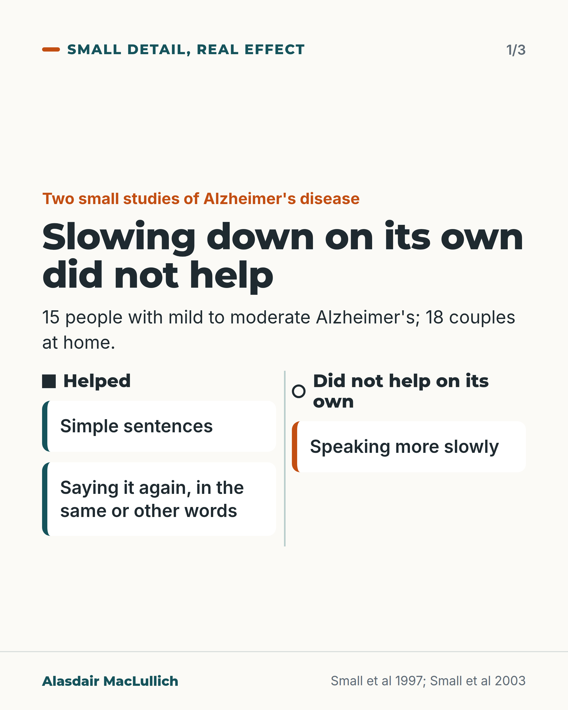
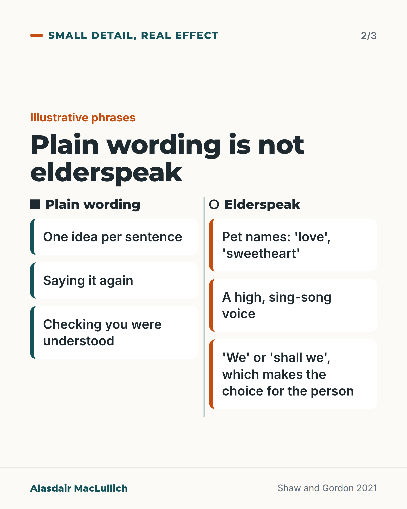
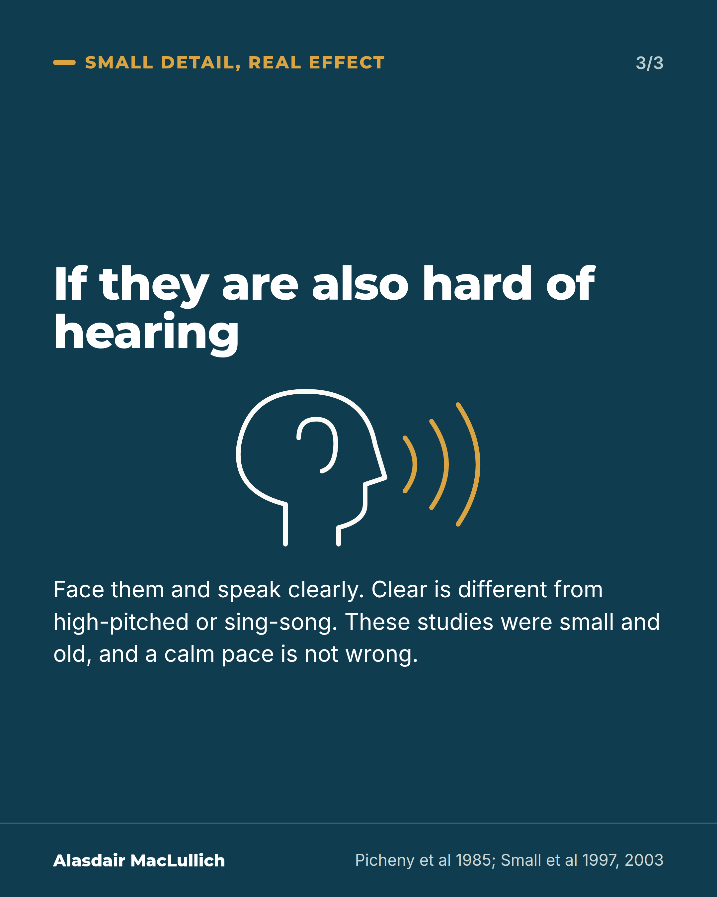

# G091: What helps a person with Alzheimer's follow what you say

- Category: C09 Communication, capacity and supported decision-making
- Audience: public
- Series: Small detail, real effect
- Post type: public_explanation
- Visual format: carousel (3 cards)
- Status: text text_final, visual final
- Working id: C09-P08 (candidate C09-19)

## Insight

In two small studies, speaking more slowly did not, on its own, help people with Alzheimer's disease follow what was said, while repeating a sentence and using simple sentences did. Plain wording is not elderspeak.

## Angle and position

Speak plainly, with one idea per sentence, repeat it if needed and check you were understood, and avoid pet names, a sing-song voice and 'shall we'. The studies are small and old, and a calm pace is not wrong.

Basis: Empirical for the study findings (small, 1990s and 2000s). The line separating plain wording from elderspeak is a definition from the literature. The practical advice is clinical interpretation.

## X (756 characters)

```text
In two small studies, speaking more slowly did not, on its own, help people with Alzheimer's disease follow what was said.

In an experiment with 15 people with mild to moderate Alzheimer's, saying a sentence again, in the same or different words, helped them understand it. Slower speech did not. In a study that recorded 18 couples at home, simple sentences worked and slowing down did not. 'Simple' means grammatically simple, not just short.

Both studies are small and from the 1990s and 2000s. A calm pace is not wrong. Plain wording is ordinary adult speech. Elderspeak adds pet names like 'love', a high sing-song voice, and 'we' or 'shall we' that make the choice for the person. If the person is also hard of hearing, face them and speak clearly.
```

## LinkedIn (1695 characters)

```text
In two small studies, speaking more slowly did not, on its own, help people with Alzheimer's disease follow what was said.

In an experiment with 15 people with mild to moderate Alzheimer's, saying a sentence again, in the same or different words, helped them understand it. Saying it more slowly did not. In a study that recorded 18 couples at home during daily activities, simple sentences worked and slowing down did not. 'Simple' means grammatically simple, not just short.

Experiments with older adults who do not have dementia point the same way. Keeping each sentence to one idea and adding a word of explanation helped. A high-pitched voice did not help, and made people report more trouble following.

These were small studies from the 1990s and 2000s, in laboratory or home settings. Across studies, changing several things at once, including a slower rate, sometimes helped older listeners. So the finding is that slowing down on its own did not help, and a calm pace is not wrong.

Plain wording is ordinary adult speech: one idea per sentence, saying it again, and checking you were understood. Elderspeak is talking to an older adult the way people talk to a small child. It adds pet names ('love', 'sweetheart'), a high sing-song voice, and 'we' or 'shall we' that make the choice for the person.

If the person is also hard of hearing, face them and speak clearly. Clear is different from high-pitched or sing-song. In a tiny 1985 laboratory study, 5 listeners with hearing loss understood deliberately clear speech better than ordinary conversational speech.

Try it at the next conversation: one idea, say it again in other words if needed, and ask what they would like to do.
```

## Bluesky (298 characters)

```text
In 2 small studies, slowing down alone did not help people with Alzheimer's follow a sentence (15 people; 18 couples). Repeating it and grammatically simple sentences did. Elderspeak is talking to older adults like small children: pet names, sing-song voice, 'shall we'. Plain wording avoids these.
```

## Threads (419 characters)

```text
In two small studies, speaking more slowly did not, on its own, help people with Alzheimer's disease follow a sentence.

Saying it again, in the same or other words, helped (15 people). Grammatically simple sentences worked (18 couples at home). A calm pace is not wrong.

Elderspeak means talking to an older adult the way people talk to a small child. Plain wording avoids pet names, a sing-song voice and 'shall we'.
```

## Source reply

Sources: Small et al, Psychol Aging 1997 https://doi.org/10.1037//0882-7974.12.1.3 ; Small et al, J Speech Lang Hear Res 2003 https://doi.org/10.1044/1092-4388(2003/028) ; Kemper and Harden, Psychol Aging 1999 https://doi.org/10.1037//0882-7974.14.4.656 ; Shaw and Gordon, Innov Aging 2021 https://doi.org/10.1093/geroni/igab023 ; Picheny et al, J Speech Hear Res 1985 https://doi.org/10.1044/jshr.2801.96

## Visual



Alt text: Two small studies of Alzheimer's disease (15 people; 18 couples at home). Helped: simple sentences, saying it again in the same or other words. Did not help on its own: speaking more slowly.



Alt text: Plain wording: one idea per sentence, saying it again, checking you were understood. Elderspeak: pet names such as love or sweetheart, a high sing-song voice, and we or shall we, which makes the choice for the person.



Alt text: If the person is also hard of hearing: face them and speak clearly. Clear is different from high-pitched or sing-song. The studies were small and old, and a calm pace is not wrong.

Editable source: `visuals/src/G091.html`

Design instructions: Three cards, Small detail, real effect. Card 1: Helped (solid square, two cards) vs Did not help on its own (open circle, one card). Card 2: Plain wording vs Elderspeak. Card 3 deep teal statement with head and ear outline, gold sound lines. Claims C09-19-a to f.

## Sources and verification

- C09-19-a (supported_with_qualification): In an experiment with 15 people with mild to moderate Alzheimer's disease, understanding improved when a sentence was repeated, in the same or different words, but not when it was spoken slowly.
  - Source: Small JA, Kemper S, Lyons K. Sentence comprehension in Alzheimer's disease: effects of grammatical complexity, speech rate, and repetition. Psychol Aging. 1997;12(1):3-11.
  - Passage: "Small 1997, Abstract: "Fifteen patients with mild to moderate AD and 20 healthy older persons were tested on a sentence comprehension task with sentences varying in terms of (a) degree of grammatical complexity, (b) rate of presentation (normal vs. slow), and (c) form of repetition (verbatim vs. paraphrase)." ... "Sentence comprehension improved, however, after the sentence was repeated in either verbatim or parapharsed form. However, the patients' comprehension did not improve for sentences presented at the slow speech rate." ... "The findings challenge the appropriateness of several clinical recommendations."" (Abstract)
- C09-19-b (supported_with_qualification): In 18 couples recorded at home during daily activities, simple sentences were an effective strategy and slow speech was not.
  - Source: Small JA, Gutman G, Makela S, Hillhouse B. Effectiveness of communication strategies used by caregivers of persons with Alzheimer's disease during activities of daily living. J Speech Lang Hear Res. 2003;46(2):353-67.
  - Passage: "Small 2003, Abstract: "The study included a self-report questionnaire and wireless audio-recorded interactions between 18 persons with AD and their spousal caregivers during activities of daily living. The findings validate the effectiveness of certain communication strategies (e.g., simple sentences) but not others (e.g., slow speech)."" (Abstract)
- C09-19-c (supported_with_qualification): In older adults without dementia, fewer clauses tucked inside sentences and added explanation helped, while short sentences, slow speech and high pitch did not, and led older adults to report more communication problems.
  - Source: Kemper S, Harden T. Experimentally disentangling what's beneficial about elderspeak from what's not. Psychol Aging. 1999;14(4):656-70.; Shaw CA, Gordon JK. Understanding elderspeak: an evolutionary concept analysis. Innov Aging. 2021;5(3):igab023.
  - Passage: "Kemper and Harden 1999, Abstract: "Providing semantic elaborations and reducing the use of subordinate and embedded clauses benefit older adults and improve their performance on the referential communication task, whereas reducing sentence length, slowing speaking rate, and using high pitch do not. The use of short sentences, a slow rate of speaking, and high pitch resulted in older adults' reporting more communication problems." | Shaw and Gordon 2021, Discussion: "There is evidence that simplification—specifically reducing syntactic and semantic complexity—enhances comprehension but that other modifications (e.g., shortening utterances without reducing complexity) have little or no impact. Perhaps the most important finding is that exaggerated prosody may reduce both actual and perceived comprehension, eradicating the benefits of more helpful attributes like reducing complexity (Kemper & Harden, 1999)."" (Kemper and Harden 1999: Abstract; Shaw and Gordon 2021: Discussion and 'Impact of elderspeak on comprehension')
- C09-19-d (supported): What separates plain wording from elderspeak: simplifying grammar, repeating and checking are normal adult speech that can help; elderspeak is marked by childish words (pet names), exaggerated sing-song pitch, and 'we' or tag questions that take the choice away.
  - Source: Shaw CA, Gordon JK. Understanding elderspeak: an evolutionary concept analysis. Innov Aging. 2021;5(3):igab023.; Williams KN, Herman R, Gajewski B, Wilson K. Elderspeak communication: impact on dementia care. Am J Alzheimers Dis Other Demen. 2009;24(1):11-20.
  - Passage: "Shaw and Gordon 2021, Operationalizing Elderspeak: "In operationalizing attributes of elderspeak, we propose to remove (or consider separately) attributes that are within the range of normal variation in adult-to-adult speech. Many of these have been repeatedly noted to enhance comprehension, including reduced syntactic complexity, repetitions, verifications, and focal stress. Among the attributes to retain are those that are exaggerated—this is the essence of overaccommodation—and thus give rise to perceptions of patronization." ... "'Elderspeak is a form of communication overaccommodation used with older adults that: is evidenced by inappropriately juvenile lexical choices and/or exaggerated prosody; arises from implicit ageist stereotypes; carries goals of expressing care, exerting control, and/or facilitating comprehension; and may lead to negative self-perceptions in older adults and challenging behaviors in persons with dementia.'" | Pragmatic attributes: "Tag questions, questions attached to the end of a statement providing the illusion of choice" | Williams 2009: collective pronouns "imply that the older adult cannot act independently"" (Shaw and Gordon 2021: Operationalizing Elderspeak; Pragmatic/discourse attributes; Williams 2009: Elderspeak and Dementia Care)
- C09-19-e (supported): Limitation: the studies are small and old, and across studies a combination of changes that includes a slower rate sometimes helped older listeners, so the finding is that slowing down on its own did not help, not that it harms.
  - Source: Small JA, Kemper S, Lyons K. Sentence comprehension in Alzheimer's disease: effects of grammatical complexity, speech rate, and repetition. Psychol Aging. 1997;12(1):3-11.; Small JA, Gutman G, Makela S, Hillhouse B. Effectiveness of communication strategies used by caregivers of persons with Alzheimer's disease during activities of daily living. J Speech Lang Hear Res. 2003;46(2):353-67.; Shaw CA, Gordon JK. Understanding elderspeak: an evolutionary concept analysis. Innov Aging. 2021;5(3):igab023.
  - Passage: "Shaw and Gordon 2021, Impact of elderspeak on comprehension: "Across studies, comprehension was generally optimized by a combination of decreases in the rate of speech, sentence length, and sentence complexity and increases in the number of words and utterances, redundancy, and semantic content. However, there was a limit to the effectiveness of these accommodations." | Abstract: "Research studies varied in reporting whether elderspeak facilitated or interfered with comprehension by older adults, in part depending on the operational definition of elderspeak and experimental manipulations."" (Shaw and Gordon 2021: Abstract; 'Impact of elderspeak on comprehension')
- C09-19-f (supported_with_qualification): For listeners with hearing loss, deliberately clear speech is easier to understand than ordinary conversational speech (reconciles C09-19 with hearing advice).
  - Source: Picheny MA, Durlach NI, Braida LD. Speaking clearly for the hard of hearing I: intelligibility differences between clear and conversational speech. J Speech Hear Res. 1985;28(1):96-103.; Shaw CA, Gordon JK. Understanding elderspeak: an evolutionary concept analysis. Innov Aging. 2021;5(3):igab023.
  - Passage: "Picheny 1985, Abstract: "Five listeners with sensorineural hearing losses were tested on groups of nonsense sentences spoken clearly and conversationally by three male talkers" ... "The average intelligibility difference between clear and conversational speech averaged across talker was found to be 17 percentage points." | Shaw and Gordon 2021: "Exaggerated prosody, a key feature of elderspeak, was found to reduce comprehension."" (Picheny 1985: Abstract; Shaw and Gordon 2021: Abstract)

Verification notes: C09-19-a Small 1997 (abstract): 15 people with mild to moderate Alzheimer's; repetition helped, slower speech did not. C09-19-b Small 2003 (abstract): 18 couples; simple sentences effective, slow speech not. C09-19-c Kemper and Harden 1999 (abstract): older adults without dementia, laboratory; one idea per sentence plus explanation helped, high pitch did not and increased reported problems. C09-19-d Shaw and Gordon 2021 (full text) and Williams 2009: line separating plain wording from elderspeak, as the editor required. C09-19-e limitation: sample sizes stated; slowing alone did not help does not make a calm pace wrong; rate evidence mixed across studies. C09-19-f Picheny 1985 (abstract), 5 listeners, used only as reconciling line. Scheduling: apart from C09-18.

## Attention and follow potential

Pause: It questions the common advice to speak slowly, while saying a calm pace is not wrong.

Gain: Techniques that were tested, a clear line between plain wording and elderspeak, and an honest note on study size.

Follow: Everyday advice checked against what the studies show.

## Open issues

- Scheduling (editor): publish apart from C09-18 (C09-P02).
