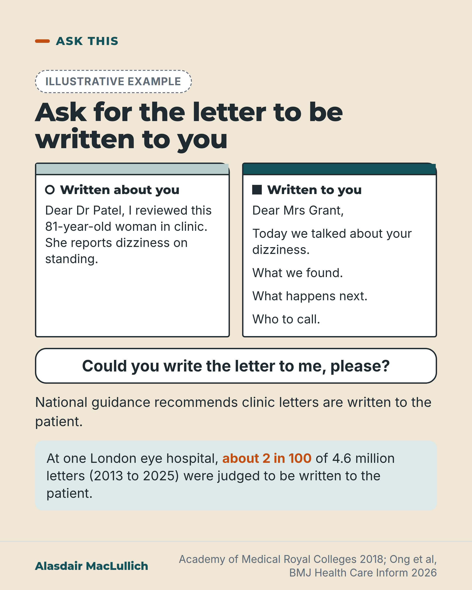

# G092: Ask for the clinic letter to be written to you

- Category: C09 Communication, capacity and supported decision-making
- Audience: public
- Series: Ask this
- Post type: decision_support
- Visual format: comparison
- Status: text text_final, visual final
- Working id: C09-P09 (candidate C09-02)

## Insight

National guidance from the Academy of Medical Royal Colleges (2018) recommends that outpatient clinic letters are written to the patient. In one large London eye hospital, about 2 in 100 of 4.6 million letters were, and about 95 in 100 were harder to read than recommended.

## Angle and position

The letter is often written to the GP and about you. You can ask: 'Could you write the letter to me, please?' Honest on scope: one hospital, a computer rule, patients of all ages, reading level not understanding.

Basis: Mixed. The guidance recommendation and the letter figures are factual. That clinic letters should be written to the patient in words they can use is a judgement, offered as a request the reader can make.

## X (718 characters)

```text
National guidance from the Academy of Medical Royal Colleges (2018) recommends that hospital doctors write outpatient clinic letters to the patient, rather than about the patient to the GP.

Many people already get a copy of the clinic letter, but it is usually written to the GP and about them. One large London eye hospital wrote 4.6 million letters between 2013 and 2025, which includes years before the 2018 guidance. About 2 in 100 were written to the patient. About 95 in 100 were harder to read than recommended. That is one hospital, with patients of all ages, and a computer rule decided what counted as written to the patient.

After your next clinic, you can ask: 'Could you write the letter to me, please?'
```

## LinkedIn (1471 characters)

```text
National guidance from the Academy of Medical Royal Colleges (2018), 'Please, write to me', recommends that hospital doctors write outpatient clinic letters to the patient, rather than about the patient to the GP. It is professional guidance, not law.

Many people already get a copy of the clinic letter, but it is usually written to the GP and about them.

One study analysed 4.6 million clinic letters written at Moorfields Eye Hospital in London between 2013 and 2025, which includes the years before the 2018 guidance. About 2 in 100 were written to the patient, and about 95 in 100 were harder to read than the level recommended for patients. This has limits. It is one eye hospital. The patients were of all ages (half were older than 53). A computer rule decided which letters counted as written to the patient: at least 6 uses of 'you' or 'your' per 100 words. The study measured reading level, and did not ask whether patients understood.

In a survey at one English hospital clinic, 42 of 80 patients wanted letters written to them, 4 wanted them written to their GP and 34 had no preference. In one Dublin urology clinic that redesigned its letters and sent them to patients, 39 of the 53 patients who gave feedback found the letter easy to understand and 38 said it helped them understand their visit. That was a small project with no comparison group, and only 53 of 120 recipients gave feedback.

So you can ask: 'Could you write the letter to me, please?'
```

## Bluesky (297 characters)

```text
Guidance (Academy of Medical Royal Colleges, 2018) recommends writing clinic letters to the patient. One London eye hospital wrote 4.6 million letters in 2013 to 2025 (some before 2018); a computer rule judged about 2 in 100 written to the patient. Ask: 'Could you write the letter to me, please?'
```

## Threads (492 characters)

```text
National guidance from the Academy of Medical Royal Colleges (2018) recommends that clinic letters are written to the patient, not about the patient to the GP.

At one large London eye hospital, 4.6 million letters were written between 2013 and 2025, some before the guidance. A computer rule judged about 2 in 100 to be written to the patient. About 95 in 100 were harder to read than recommended. One hospital, patients of all ages.

You can ask: 'Could you write the letter to me, please?'
```

## Source reply

Sources: Academy of Medical Royal Colleges, Please, write to me (2018) https://www.aomrc.org.uk/reports-guidance/please-write-to-me-writing-outpatient-clinic-letters-to-patients-guidance/ ; Ong et al, BMJ Health Care Inform 2026 https://doi.org/10.1136/bmjhci-2026-102086 ; Gupta et al, Int J Clin Pract 2021 https://doi.org/10.1111/ijcp.13907 ; Lonergan et al, BMJ Open Qual 2019 https://doi.org/10.1136/bmjoq-2019-000721

## Visual



Alt text: Illustrative clinic letters. Written about you: 'Dear Dr Patel, I reviewed this 81-year-old woman in clinic.' Written to you: 'Dear Mrs Grant, Today we talked about your dizziness. What we found. What happens next. Who to call.' Ask: Could you write the letter to me, please? At one London eye hospital, about 2 in 100 of 4.6 million letters (2013 to 2025) were judged to be written to the patient.

Editable source: `visuals/src/G092.html`

Design instructions: Sand card, Ask this. Badge, h1.s, two letter sheets (Written about you, circle; Written to you, square), question bubble, body, mint band with 2 in 100 in orange. Claim C09-02-b.

## Sources and verification

- C09-02-a (supported_with_qualification): The Academy of Medical Royal Colleges 2018 guidance 'Please, write to me' recommends that outpatient clinic letters be written directly to patients.
  - Source: Ong AY, Kiire CA, Wagner SK, Nguyen Q, Thomas PBM, Keane PA. How well do we write for patients? Longitudinal analysis of the readability and complexity of 4.6 million ophthalmic clinical letters. BMJ Health Care Inform. 2026;33(1). doi:10.1136/bmjhci-2026-102086.; Lonergan PE, Gnanappiragasam S, Redmond EJ, Fitzpatrick F, McNamara DA. Write2me: using patient feedback to improve postconsultation urology clinic letters. BMJ Open Qual. 2019;8(3):e000721.; Gupta KK, Ismail A, Balai E, Osborne MS, Murphy J. Writing clinic letters in head and neck outpatient services: are we doing what patients want? Int J Clin Pract. 2021;75(4):e13907. Epub 2020 Dec 14.; Academy of Medical Royal Colleges. Please, write to me. Writing outpatient clinic letters to patients: guidance. London: Academy of Medical Royal Colleges; 2018.
  - Passage: "Ong 2026 (full text, Introduction): "Key drivers for this shift include the 2018 Academy of Medical Royal Colleges (AoMRC) guidance, ‘Please, write to me’, which established the best practice of writing letters directly to patients rather than about them." Lonergan 2019 (abstract): "Recent guidelines from the Academy of Medical Royal Colleges recommend that all OPD letters should be written directly to the patient." Gupta 2021 (abstract): "The Academy of Medical Royal Colleges have recently recommended all outpatient letters to be written directly to patients." Search extract (not opened): the guidance "aims to encourage doctors to write most of their outpatient clinic letters directly to patients and send a copy to the patient's General Practitioner"." (Ong 2026 Introduction and Discussion; Lonergan 2019 and Gupta 2021 abstracts; AoMRC web page search extract)
- C09-02-b (supported_with_qualification): Of 4.6 million outpatient letters at Moorfields Eye Hospital (2013 to 2025), about 2 in 100 were classified as addressed to patients and about 95 in 100 were less readable than recommended.
  - Source: Ong AY, Kiire CA, Wagner SK, Nguyen Q, Thomas PBM, Keane PA. How well do we write for patients? Longitudinal analysis of the readability and complexity of 4.6 million ophthalmic clinical letters. BMJ Health Care Inform. 2026;33(1). doi:10.1136/bmjhci-2026-102086.
  - Passage: "The dataset comprised 4 648 289 letters from 804 986 patients (median 3, IQR 1–6 letters per patient) over the 13 year study period. ... age of 53 (IQR 31–69) years at the baseline visit. ... FRE had a median value of 51.1 (IQR 41.9–58.5), indicating substantially lower readability than the suggested reference range of 70–90 for patient-facing materials. ... Overall, 95.3% of letters fell below the recommended FRE range ... Only a minority of letters (2.25%) were classified as patient-addressed. There was a small annual increase in the likelihood of letters being addressed directly to patients over time ... Based on this exploratory review, a pragmatic threshold of at least six second-person pronouns per 100 words was selected to classify letters as patient addressed for subsequent analyses." (Full text, Methods and Results)
- C09-02-c (supported_with_qualification): In the NHS, patients often receive a copy of the clinic letter even when it is addressed to the GP.
  - Source: Ong AY, Kiire CA, Wagner SK, Nguyen Q, Thomas PBM, Keane PA. How well do we write for patients? Longitudinal analysis of the readability and complexity of 4.6 million ophthalmic clinical letters. BMJ Health Care Inform. 2026;33(1). doi:10.1136/bmjhci-2026-102086.
  - Passage: "The practice of sending copies of clinical letters directly to patients is well established in the National Health Service (NHS) in the United Kingdom (UK), where these letters serve several key purposes simultaneously ... Letters could be addressed to—and therefore written for—healthcare professionals or patients and copied to the other party." (Full text, Introduction and Methods)
- C09-02-d (supported_with_qualification): In a urology quality improvement project, most patients interviewed after receiving a restructured clinic letter found it easy to understand and said it improved their understanding.
  - Source: Lonergan PE, Gnanappiragasam S, Redmond EJ, Fitzpatrick F, McNamara DA. Write2me: using patient feedback to improve postconsultation urology clinic letters. BMJ Open Qual. 2019;8(3):e000721.
  - Passage: "In one OPD, 71% of patients stated that they wished to receive a copy of their letter. ... Following the implementation of the intervention, letters were sent to 120 patients and feedback was obtained from 63 patients with either a feedback postcard or telephone interview. Of the 53 patients who agreed to participate in the telephone feedback, 39 (74%) found the letter easy to understand, 49 (92%) reported it was accurate and summarised the consultation as they remembered it and 38 (72%) reported that reading the letter improved their understanding of their OPD visit. All patients said they would like to receive similar letters from future OPD consultations." (Abstract)
- C09-02-e (supported_with_qualification): In a UK head and neck clinic survey, about half of patients preferred letters written to them and very few preferred letters to the GP, yet all sampled surgeon letters were addressed to GPs.
  - Source: Gupta KK, Ismail A, Balai E, Osborne MS, Murphy J. Writing clinic letters in head and neck outpatient services: are we doing what patients want? Int J Clin Pract. 2021;75(4):e13907. Epub 2020 Dec 14.
  - Passage: "Of all 80 included patient responses, 42 expressed a preference for letters to be written directly to the patient (52.5%). Only 5.0% (n = 4) of respondents exhibited a preference for letters to be written to their GP, with 42.5% (n = 34) of patients having no preference. All 54 surgeon letters (100%) were addressed to GPs." (Abstract)

Verification notes: C09-02-a: AoMRC 2018 recommendation described consistently by Ong 2026 (full text), Lonergan 2019 and Gupta 2021 (abstracts); guidance document itself not opened (search extract only), so worded 'national guidance recommends', never 'entitled', with no 'all' or 'most', and noted as professional guidance. C09-02-b: Ong 2026 (full text): 4,648,289 letters, 2.25% and 95.3%, one eye hospital, rule-based proxy (6 or more 'you'/'your' per 100 words), median age 53, reading level not understanding. C09-02-c: background statement from the introduction, no figure. C09-02-d: Lonergan 2019, Dublin, 39 of 53 and 38 of 53, 'sent to patients' not 'written to them'. C09-02-e: Gupta 2021, 42 of 80, 4 of 80, 34 of 80 no preference, so 'most patients want' is not used. Accessible Information Standard and 'not sent to your home' omitted (not found). One invitation-to-follow line used on X and LinkedIn only.

## Attention and follow potential

Pause: Many people have never read the letter written about them, or found it hard to read when they did.

Gain: One specific request to make after a clinic visit, and the national guidance behind it.

Follow: The Ask this series offers questions that change what people actually receive from services.

## Open issues

None.
