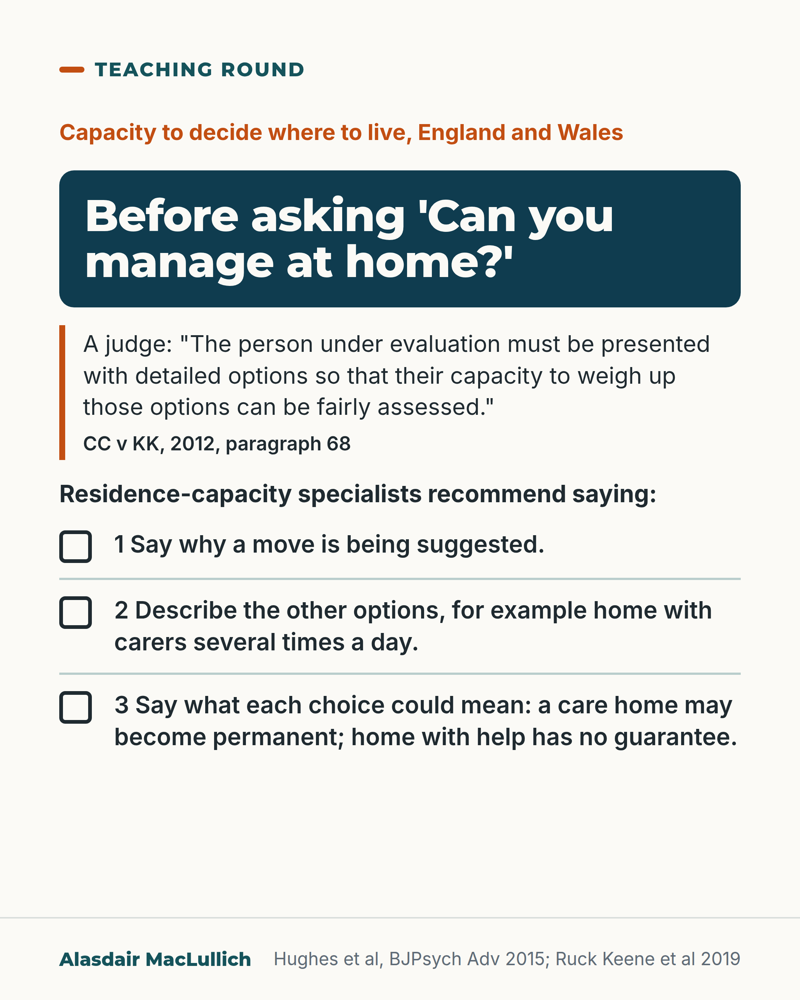

# G093: Put the options to the person before judging capacity to decide where to live

- Category: C09 Communication, capacity and supported decision-making
- Audience: practitioners
- Series: Teaching round
- Post type: teaching
- Visual format: checklist card
- Status: text text_final, visual final
- Working id: C09-P10 (candidate C09-08)

## Insight

In a 2012 Court of Protection case, a judge found that an 82-year-old woman with dementia whom several professionals had assessed as lacking capacity to decide where to live had it, and said the person must be presented with detailed options so that their capacity to weigh them can be fairly assessed.

## Angle and position

A bare question like 'Can you manage at home?' is an unfair test if the person has not been told what help would be there or what a care home would honestly mean. Position: put both options, with the support attached to each, before judging.

Basis: Mixed. The case facts and the quoted words are documented in published secondary sources; the specialist recommendations are expert advice, not statute; the study of ward practice is empirical (qualitative, 29 cases). That asking without describing the options is unfair is judgement.

## X (840 characters)

```text
A judge found that an 82-year-old woman with dementia, whom several professionals had assessed as lacking capacity to decide where to live, had that capacity.

That was a 2012 Court of Protection case in England (CC v KK). The judge said: 'The person under evaluation must be presented with detailed options so that their capacity to weigh up those options can be fairly assessed.' It is one first-instance ruling, and Scotland has different law.

Specialists in residence capacity recommend telling the person why a move is suggested, what the other options are, such as going home with carers several times a day, and what each could mean. That includes saying that a care home may become permanent and that going home with help carries no guarantee.

We should say what help there would be at home before asking 'Can you manage at home?'
```

## LinkedIn (2104 characters)

```text
A judge found that an 82-year-old woman with dementia, whom several professionals had assessed as lacking capacity to decide where to live, had that capacity.

She had vascular dementia, Parkinson's disease and hemiplegia, and wanted to go home from a nursing home. In this 2012 Court of Protection case in England (CC v KK), the judge said: 'The person under evaluation must be presented with detailed options so that their capacity to weigh up those options can be fairly assessed.' (paragraph 68, as quoted by Ruck Keene and colleagues). This is one first-instance ruling in England and Wales. It binds no other court, and Scotland has different legislation, the Adults with Incapacity (Scotland) Act 2000. (Hughes and colleagues note that the person needs a broad, general understanding, not every detail.)

Residence-capacity specialists (Hughes and colleagues, BJPsych Advances, 2015) recommend telling the person:

1. Why a move is being suggested.

2. What the other options are, for example going home with carers several times a day.

3. What each choice could mean, including saying clearly that a care home may become permanent and that going home with help carries no guarantee.

That is expert advice in a peer-reviewed review, not the wording of the statute. The same judge warned that professionals can move from asking 'can she decide?' to asking 'what is best for her?', and then expect the person to value a care home's safety over the security of being at home.

A study on English hospital wards (29 cases, fieldwork 2008 to 2009) looked at how staff judged whether a person with dementia could decide where to live. Staff varied widely in what information they gave or tested. Practice may have changed since. In four filmed capacity assessments in hospital, in people with communication difficulties after acquired brain injury, not specifically older people, options were not always put to the patient. Four recordings is too few to generalise.

Our judgement: we should put the options to the person, with the support attached to each, before judging whether they can weigh them.
```

## Bluesky (295 characters)

```text
A 2012 English court found an 82-year-old woman with dementia had capacity to decide where to live, after professionals judged otherwise. The judge said the person must get detailed options (one first-instance ruling). Say what help there would be at home before asking 'Can you manage at home?'
```

## Threads (441 characters)

```text
A judge found that an 82-year-old woman with dementia had capacity to decide where to live (CC v KK, England, 2012). Several professionals had judged that she lacked it.

The judge said the person must be presented with detailed options so their capacity to weigh them can be fairly assessed. One first-instance ruling.

We should say what help there would be at home, and what a care home could mean, before asking 'Can you manage at home?'
```

## Source reply

Sources: Hughes et al, BJPsych Adv 2015 https://doi.org/10.1192/apt.bp.114.013110 ; Ruck Keene et al, Int J Law Psychiatry 2019 https://doi.org/10.1016/j.ijlp.2018.11.005 ; Emmett et al, Int J Law Psychiatry 2013 https://doi.org/10.1016/j.ijlp.2012.11.009 ; Foulkes et al, Int J Lang Commun Disord 2024 https://doi.org/10.1111/1460-6984.13020

## Visual



Alt text: Checklist card for capacity to decide where to live, England and Wales. Before asking 'Can you manage at home?': specialists recommend saying: 1 why a move is suggested; 2 what the other options are, for example home with carers several times a day; 3 what each choice could mean, including that a care home may become permanent and that home with help has no guarantee. Based on CC v KK, 2012.

Editable source: `visuals/src/G093.html`

Design instructions: Light card, Teaching round. Kicker, deep teal band with h1.s, orange-edged quotation, lead line, three numbered rows with open check boxes. Claims C09-08-a to e, g.

## Sources and verification

- C09-08-a (supported): In CC v KK (Court of Protection, England and Wales, 2012) an 82-year-old woman with vascular dementia, Parkinson's disease and hemiplegia, whom several professionals had assessed as lacking capacity to decide where to live, was found by the judge to have that capacity.
  - Source: Hughes JC, Poole M, Louw S, et al. Residence capacity: its nature and assessment. BJPsych Adv. 2015;21(5):307-12.; Ruck Keene A, Kane NB, Kim SYH, Owen GS. Taking capacity seriously? Ten years of mental capacity disputes before England's Court of Protection. Int J Law Psychiatry. 2019;62:56-76.
  - Passage: "Hughes 2015: "The case concerned an 82-year-old woman, KK, who had hemiplegia, Parkinson's disease and vascular dementia. She was totally dependent on others for her personal care, frequently sought help by the use of a telecare alarm service and showed considerable anxiety. Finally, she was admitted to a nursing home with dehydration and a urinary tract infection. But she wanted to return home. Her case involved a number of professionals assessing her capacity on a number of occasions. They all found that she lacked residence capacity, but Mr Justice Baker determined otherwise." Ruck Keene 2019: "One of the other cases in which the judge showed clear commitment to fully articulating and applying the functional conception of capacity (and in doing so, overruled expert evidence) was CC v KK [2012] EWCOP 2136, concerning the capacity of an elderly woman with dementia to make decisions about her residence and care."" (Hughes 2015 full text, 'Approaches to assessment: outcome v. functional'; Ruck Keene 2019 full text, Discussion)
- C09-08-b (supported): The judge said the person must be presented with detailed options so that their ability to weigh them can be fairly assessed.
  - Source: Ruck Keene A, Kane NB, Kim SYH, Owen GS. Taking capacity seriously? Ten years of mental capacity disputes before England's Court of Protection. Int J Law Psychiatry. 2019;62:56-76.
  - Passage: "Moreover, different individuals may give different weight to different factors; and capacity assessors should not start with a blank canvas: "The person under evaluation must be presented with detailed options so that their capacity to weigh up those options can be fairly assessed" (CC v KK, para 68)." (Ruck Keene 2019 full text, Discussion (quoting CC v KK para 68))
- C09-08-c (supported_with_qualification): For a decision about where to live, the information the person should be given includes why a move is proposed, the other options (for example home with extra help), and the likely consequences of each choice and of not deciding, stated honestly for the care home option too.
  - Source: Hughes JC, Poole M, Louw S, et al. Residence capacity: its nature and assessment. BJPsych Adv. 2015;21(5):307-12.
  - Passage: "Box 4: "The person should know why a change of residence is being proposed ... The person should know what is being proposed (e.g. they should know that it is being suggested they should move into a care home) The person should be informed if there are other options (e.g. that they could go home but extra help is recommended because of the risks identified) The person should understand the likely consequences of making any particular decision, including a decision not to follow the advice being given, as well as the consequences of making no decision at all". Worked example: "an alternative would be for him to go home with professional carers coming in to see him several times a day; and he should understand that if he goes into a care home it might well become the place he lives permanently and, alternatively, if he goes home and accepts the care package it cannot be guaranteed that he will not run into similar problems again in the future." Statute as quoted: "The person will be unable to make the required decision if, owing to the impairment or disturbance, he or she is unable to understand, retain, use or weigh the relevant information or to communicate the decision (MCA: section 3)."" (Hughes 2015 full text, 'The ‘information’', Box 4 and vignette; 'Context' for MCA s3)
- C09-08-d (supported_with_qualification): On English hospital wards, professionals varied widely in what information they treated as relevant when assessing whether people with dementia could decide where to live, and legal standards were not routinely applied.
  - Source: Emmett C, Poole M, Bond J, Hughes JC. Homeward bound or bound for a home? Assessing the capacity of dementia patients to make decisions about hospital discharge: comparing practice with legal standards. Int J Law Psychiatry. 2013;36(1):73-82.
  - Passage: "Abstract: "Our findings suggest that whilst professionals profess to be familiar with broad legal standards governing the assessment of capacity under the MCA, these standards are not routinely applied in practice in general hospital settings when assessing capacity to decide place of residence on discharge from hospital." Full text: "Our findings suggest that there is currently a wide inconsistency of approach amongst professionals when identifying 'information relevant to the decision' (section 3(1)(a) MCA) during the assessment of residence capacity." "Only by gathering this information can the assessor present the various options, alternatives and risks associated with a particular choice of residence to a patient so that they can understand and weigh those factors in the balance in order to demonstrate decisional capacity and make an informed choice."" (Abstract (Results); full text (accepted manuscript), Introduction and 'Understanding Information Relevant to the Decision')
- C09-08-e (supported_with_qualification): In video-recorded hospital capacity assessments, options were not always presented to the patient.
  - Source: Foulkes J, Volkmer A, Beeke S. Using Conversation Analysis to explore assessments of decision-making capacity in a hospital setting. Int J Lang Commun Disord. 2024;59(4):1612-27.
  - Passage: "Variation from this structure was observed across the dataset, notably in the way in which options were (or were not) presented. ... One phase, option listing, varied in practice and options were not always presented." (Abstract, Outcomes & Results; What this study adds)
- C09-08-g (supported): The judge warned that professionals may conflate capacity assessment with best interests and give more weight to the physical safety of a care home than to the emotional security of home.
  - Source: Hughes JC, Poole M, Louw S, et al. Residence capacity: its nature and assessment. BJPsych Adv. 2015;21(5):307-12.
  - Passage: "In para. 65, he reiterated the point about the importance of the objective test of capacity being made without reference to what might be best for the person and emphasised again the saliency of home: 'There is, I perceive, a danger that professionals, including judges, may objectively conflate a capacity assessment with a best interests analysis and conclude that the person under review should attach greater weight to the physical security and comfort of a residential home and less importance to the emotional security and comfort that the person derives from being in their own home'." (Hughes 2015 full text, 'Approaches to assessment: outcome v. functional')

Verification notes: C09-08-a: case facts from Hughes 2015 (full text) and Ruck Keene 2019 (full text); judgment itself not opened; framed as 'a judge found', one first-instance England and Wales ruling, Scotland different. C09-08-b: para 68 quotation verbatim as quoted in Ruck Keene 2019; 'broad, general understanding' from Hughes 2015 quoting Heart of England v JB. C09-08-c: expert proposal, attributed to specialists, not statute. C09-08-d: Emmett 2013 (full text), qualitative, 29 cases, 2008 to 2009, no percentages. C09-08-e: Foulkes 2024 (abstract), 4 recordings, acquired brain injury, illustration only. C09-08-g: judge's warning paraphrased from the safe wording (paragraph 65).

## Attention and follow potential

Pause: Ward teams will recognise the bare question from assessments they have seen or done.

Gain: A concrete fix for a common flaw, tied to a court's words and to specialist advice.

Follow: Practical capacity teaching that stands up in law.

## Open issues

None.
