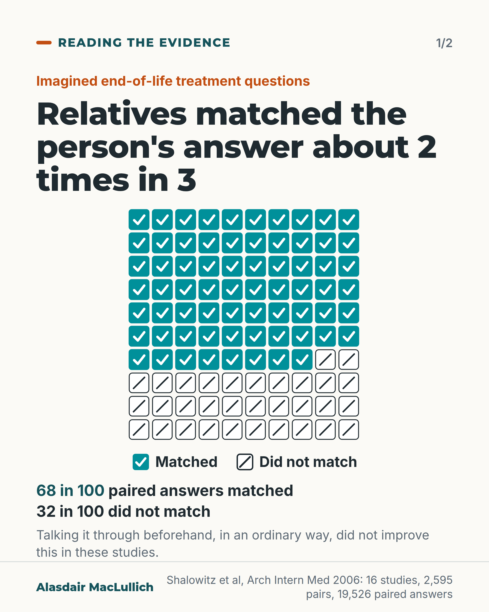
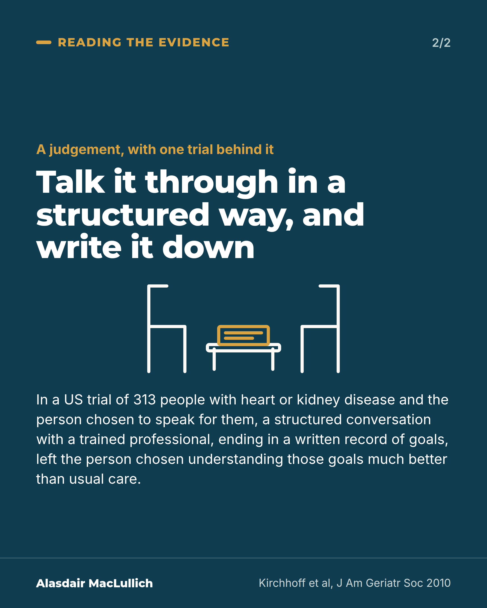

# G094: Relatives predict treatment wishes about 2 times in 3

- Category: C09 Communication, capacity and supported decision-making
- Audience: both
- Series: Reading the evidence
- Post type: evidence_interpretation
- Visual format: carousel (2 cards): icon array, statement card
- Status: text text_final, visual final
- Working id: C09-P11 (candidate C09-25)

## Insight

In a review of imagined end-of-life treatment questions, relatives who would speak for the person gave the same answer about 2 times in 3. Choosing the relative or chatting beforehand did not improve this, but in a US trial a structured conversation with a trained professional, ending in a written record, left relatives understanding the person's goals much better.

## Angle and position

Do not leave it to chance that your family knows what you would want. Record your own views and reasons while you can, and go through them in a structured way, ideally with a professional's help. Clinicians should ask relatives what the person valued and said, not only what they would choose.

Basis: Mixed. The 68% figure and the null result for chosen surrogates and informal discussion are empirical (hypothetical scenarios, 2006 review). The structured-conversation result is one US trial in two diseases plus a narrative review. The advice to write views down and go through them is a judgement.

## X (1073 characters)

```text
Relatives asked to predict a person's answers to imagined end-of-life treatment questions matched them about 2 times in 3.

In a review of 16 studies (2,595 pairs), the relative who would speak for the person gave the same answer about 2 times in 3, and a different answer about 1 time in 3. Relatives the person had chosen were no more accurate than next of kin. Pairs who said they had talked it through beforehand were no more accurate than pairs who had not, and that talk was ordinary conversation. These were imagined situations, not real decisions.

Talking in a structured way did better. A US trial included 313 pairs, each a person with heart or kidney disease and the person chosen to speak for them. A trained professional led a planning conversation that ended in a written record of the person's goals. The person chosen then understood those goals much better than after usual care.

We should write down our own views and reasons while we can, and go through them with the person who would speak for us, ideally with a trained professional, as in the trial.
```

## LinkedIn (1721 characters)

```text
Relatives asked to predict a person's answers to imagined end-of-life treatment questions matched them about 2 times in 3.

In a 2006 systematic review (Shalowitz and colleagues) of 16 studies with 2,595 pairs of patients and the relatives who would speak for them, the relative gave the same answer as the person about 2 times in 3 (68% of 19,526 paired answers). They gave a different answer about 1 time in 3. Two further findings: relatives the person had chosen were no more accurate than next of kin, and pairs who said they had talked about it beforehand were no more accurate than those who had not. Some agreement is expected by chance on yes or no questions. These were imagined situations, not real decisions, and the talk beforehand was ordinary, unstructured conversation.

Structured conversation did better. In a US trial (Kirchhoff and colleagues, 2010), 313 people with heart failure or kidney disease took part with the person chosen to speak for them. A trained professional led a planning conversation that ended in a written record of the person's goals. The person chosen then understood those goals much better than after usual care. A 2024 review of 14 trials of joint planning by patients and family suggests it may improve agreement, though the findings were described in words rather than combined into one number, and the authors call for more studies.

For anyone planning ahead: our judgement is that we should record our own views and the reasons for them while we can, and go through them with the person who would speak for us, ideally with a professional's help.

For clinicians, the same judgement applies: ask relatives what the person valued and said, not only what they would choose.
```

## Bluesky (295 characters)

```text
Relatives matched a person's answers on imagined end-of-life treatment about 2 times in 3. Choosing the relative, or chatting beforehand, did not make the match closer. In one US trial, a structured talk ending in a written record left the person speaking for them knowing the goals much better.
```

## Threads (499 characters)

```text
Relatives asked to predict a person's answers to imagined end-of-life treatment questions matched them about 2 times in 3 (16 studies, 2,595 pairs).

Ordinary chats beforehand did not improve this. In a US trial, a trained professional led a structured conversation that ended in a written record of the person's goals. The person chosen to speak for them then understood those goals much better.

Write down your views and reasons, and go through them with that person, ideally with a professional.
```

## Source reply

Sources: Shalowitz et al, Arch Intern Med 2006 https://doi.org/10.1001/archinte.166.5.493 ; Kirchhoff et al, J Am Geriatr Soc 2010 https://doi.org/10.1111/j.1532-5415.2010.02760.x ; Liu et al, J Pain Symptom Manage 2024 https://doi.org/10.1016/j.jpainsymman.2024.01.027

## Visual



Alt text: Icon array of 100 paired answers about imagined end-of-life treatment. 68 in 100 matched and 32 in 100 did not. From 16 studies with 2,595 pairs of patients and relatives. Talking it through beforehand in an ordinary way did not improve matching in these studies.



Alt text: Statement card: talk it through in a structured way, and write it down. In a US trial of 313 pairs, a structured conversation with a trained professional and a written record left relatives understanding the person's goals much better than usual care.

Editable source: `visuals/src/G094.html`

Design instructions: Two cards, Reading the evidence. Card 1: 10x10 array, 68 teal ticked squares then 32 outlined slashed squares, legend, 68 and 32 in 100 lines, source. Card 2 deep teal statement with chairs and table drawing. Claims C09-25-a to d.

## Sources and verification

- C09-25-a (supported_with_qualification): In 16 studies with 2595 patient-surrogate pairs answering hypothetical scenarios, surrogates predicted patients' treatment preferences with 68% accuracy.
  - Source: Shalowitz DI, Garrett-Mayer E, Wendler D. The accuracy of surrogate decision makers: a systematic review. Arch Intern Med. 2006;166(5):493-7.
  - Passage: "The search identified 16 eligible studies, involving 151 hypothetical scenarios and 2595 surrogate-patient pairs, which collectively analyzed 19 526 patient-surrogate paired responses. Overall, surrogates predicted patients' treatment preferences with 68% accuracy. ... Patient-designated and next-of-kin surrogates incorrectly predict patients' end-of-life treatment preferences in one third of cases." (Abstract, Results and Conclusions)
- C09-25-b (supported_with_qualification): Neither the patient choosing the surrogate nor prior discussion of preferences improved surrogates' accuracy.
  - Source: Shalowitz DI, Garrett-Mayer E, Wendler D. The accuracy of surrogate decision makers: a systematic review. Arch Intern Med. 2006;166(5):493-7.
  - Passage: "Neither patient designation of surrogates nor prior discussion of patients' treatment preferences improved surrogates' predictive accuracy." (Abstract, Results)
- C09-25-c (partly_supported): The studies used hypothetical end-of-life scenarios, mostly in the US.
  - Source: Shalowitz DI, Garrett-Mayer E, Wendler D. The accuracy of surrogate decision makers: a systematic review. Arch Intern Med. 2006;166(5):493-7.
  - Passage: "The search identified 16 eligible studies, involving 151 hypothetical scenarios and 2595 surrogate-patient pairs" (Abstract, Results)
- C09-25-d (supported_with_qualification): A structured, facilitated planning conversation improved surrogates' understanding of patients' goals in a randomised trial; reviews of joint patient-family planning suggest it may improve agreement.
  - Source: Kirchhoff KT, Hammes BJ, Kehl KA, Briggs LA, Brown RL. Effect of a disease-specific planning intervention on surrogate understanding of patient goals for future medical treatment. J Am Geriatr Soc. 2010;58(7):1233-40.; Liu X, Ho MH, Wang T, Cheung DST, Lin CC. Effectiveness of dyadic advance care planning: a systematic review and meta-analysis. J Pain Symptom Manage. 2024;67(6):e869-e889.
  - Passage: "Kirchhoff 2010: "Trained health professionals conducted a structured, patient-centered interview intended to promote informed decision-making and to result in the completion of a document clarifying the goals of the patient with regard to four disease-specific health outcome situations and the degree of decision-making latitude granted to the surrogate. ... Three hundred thirteen patient-surrogate pairs completed the study. As measured according to kappa scores and in all four situations and in the degree of latitude, intervention group surrogates demonstrated a significantly higher degree of understanding of patient goals than control group surrogates. Intervention group kappa scores ranged from 0.61 to 0.78, whereas control group kappa scores ranged from 0.07 to 0.28." Liu 2024: "In total, 14 randomized controlled trials were included. ... In addition, interventions may improve dyad's congruence on end-of-life care, family caregivers' confidence in surrogate decision-making, and quality of end-of-life communication."" (Kirchhoff 2010 abstract (Intervention, Results); Liu 2024 abstract (Results))

Verification notes: C09-25-a Shalowitz 2006 (abstract): 16 studies, 2,595 pairs, 19,526 paired responses, 68%, hypothetical scenarios; 'mostly US' omitted. C09-25-b: chosen surrogate and prior discussion no more accurate, restricted to ordinary unstructured discussion in the observational studies; paired with C09-25-d so the post does not say talking does not help. C09-25-c: 'imagined situations' only. C09-25-d Kirchhoff 2010 (abstract): 313 pairs, heart failure or kidney disease, trained facilitator, written document; kappa values not given to the public; Liu 2024 (14 RCTs) cited as 'may improve agreement', narrative and not pooled. Revised angle applied.

## Attention and follow potential

Pause: Most people assume their family knows what they would want.

Gain: A reason to record views in the person's own words and go through them in a structured way, and a better question for relatives.

Follow: Reading the evidence posts that change how readers plan ahead.

## Open issues

None.
