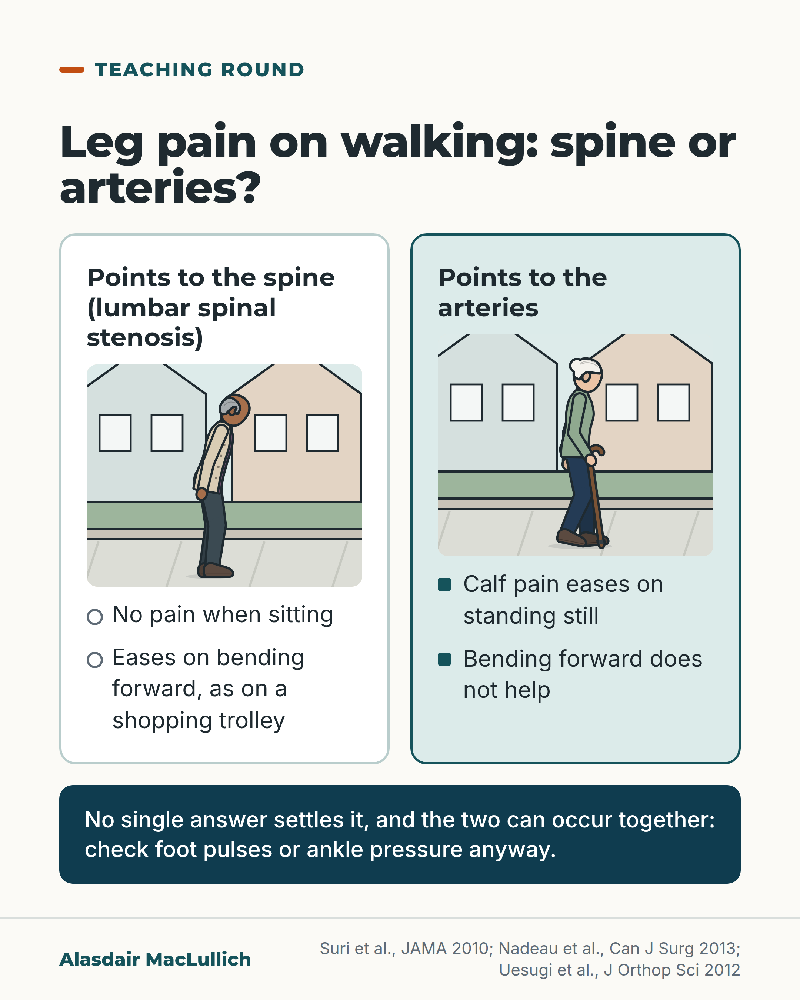

# G095: Leg pain that eases when sitting

- Category: C10 Pain
- Audience: practitioners
- Series: Teaching round
- Post type: teaching
- Visual format: comparison
- Status: text text_final, visual final
- Working id: C10-P01 (candidate C10-22)

## Insight

In an older person with leg pain on walking, no pain when sitting and relief on bending forward are the strongest single history pointers to lumbar spinal stenosis. Artery pain eases on standing still. The two can coexist, so pulses or ankle pressures are still checked.

## Angle and position

Two history questions do most of the diagnostic work before anyone says 'circulation' or 'arthritis'; the position is to ask them every time, and still check the arteries.

Basis: mixed: the diagnostic pointers and coexistence figures are empirical findings (Suri 2010, Nadeau 2013, Uesugi 2012); asking the questions routinely is clinical interpretation.

## X (1006 characters)

```text
Two history questions help most when an older person has leg pain on walking. Does it go when you sit down? Does leaning forward, say on a shopping trolley, ease it?

In a review of 4 studies (741 people with leg pain), those two answers were the strongest single pointers to lumbar spinal stenosis: narrowing of the spinal canal in the lower back. Most studies were in specialist clinics.

Leg pain from narrowed arteries is usually not helped by bending forward, and it tends to come on after about the same walking distance each time.

Spinal stenosis and narrowed leg arteries can occur together. A Japanese study looked at 570 people with stenosis seen in specialist clinics. About 7 in 100 also had narrowed leg arteries. About half of those 7 had not been picked up before. So check foot pulses or ankle blood pressure anyway.

The history makes stenosis likely, and a scan can confirm it. Many older people have some narrowing on a scan without symptoms, so read the scan together with the history.
```

## LinkedIn (1860 characters)

```text
Two history questions help most when an older person has leg pain on walking. Does it go when you sit down? Does leaning forward, say on a shopping trolley, ease it?

A JAMA Rational Clinical Examination review looked at 4 studies of 741 people with leg pain. The two strongest single pointers to lumbar spinal stenosis were no pain when seated and symptoms that ease on bending forward. Stenosis means narrowing of the spinal canal in the lower back.

The authors give a worked example. If 15 in 100 people with this kind of leg pain have stenosis, relief on bending forward raises the chance to about 53 in 100. That 15 in 100 is their assumption, and the result is a strong pointer, not a diagnosis. The estimates come mostly from specialist clinics and may be less accurate in primary care.

The contrast with the circulation:

1. Pain from narrowed leg arteries is usually not helped by bending forward, and tends to start after about the same walking distance each time.

2. A separate small study looked at 53 people who already had one of the two diagnoses. Calf pain that eased when the person simply stood still pointed strongly to the circulation. Pain above the knee brought on by standing, eased by sitting and helped by leaning on a trolley pointed strongly to the spine. Any one of these features alone was a weak guide, so the answers help most when taken together.

3. The two can occur together. In a Japanese study of 570 people with stenosis, about 7 in 100 also had narrowed leg arteries, and in half of those the artery disease had not been found before.

The history makes stenosis likely, and a scan can confirm it. Many older people have some narrowing on a scan without symptoms, so read the scan together with the history.

So ask both questions, and check foot pulses or ankle blood pressure (ABI) even when the story sounds spinal.
```

## Bluesky (300 characters)

```text
Leg pain on walking in an older person? Ask whether the pain goes on sitting, or eases leaning on a shopping trolley. Both point strongly to lumbar spinal stenosis. Calf pain that eases on standing still points towards the arteries. The two can coexist, so check foot pulses or ankle pressure anyway.
```

## Threads (492 characters)

```text
Leg pain on walking in an older person: ask whether it goes when they sit, and whether leaning forward on a shopping trolley eases it.

In a review of 4 studies (741 people), those two answers were the strongest single pointers to lumbar spinal stenosis. Calf pain that eases on standing still points to the arteries; artery pain is usually not helped by bending forward.

Both can coexist, so check foot pulses or ankle pressure anyway. A scan can confirm stenosis; read it with the history.
```

## Source reply

Sources: Suri et al., JAMA 2010 https://doi.org/10.1001/jama.2010.1833 ; Nadeau et al., Can J Surg 2013 https://doi.org/10.1503/cjs.016512 ; Uesugi et al., J Orthop Sci 2012 https://doi.org/10.1007/s00776-012-0311-z

## Visual



Alt text: Comparison card: leg pain on walking, spine or arteries. Spine side, with a drawn older man bending forward: no pain sitting, eases on bending forward. Artery side, older woman with a stick: calf pain eases on standing still, bending forward does not help. The two can occur together, so check foot pulses or ankle pressure.

Editable source: `visuals/src/G095.html`

Design instructions: Single comparison card. h1.s, two .compare columns (hollow vs solid markers, so not colour alone), each with a small Kit street scene (older man leaning forward; older woman with crook stick), deep-teal band with coexistence line.

## Sources and verification

- C10-22-a (supported_with_qualification): In adults with leg pain, having no pain when seated and symptoms that improve on bending forward are the most useful single history features pointing to the clinical syndrome of lumbar spinal stenosis.
  - Source: Suri P, Rainville J, Kalichman L, Katz JN. Does this older adult with lower extremity pain have the clinical syndrome of lumbar spinal stenosis? JAMA. 2010;304(23):2628-36.
  - Passage: "Four studies evaluating 741 patients were identified. [...] The most useful symptoms for increasing the likelihood of the clinical syndrome of LSS were having no pain when seated (LR, 7.4; 95% CI, 1.9-30), improvement of symptoms when bending forward (LR, 6.4; 95% CI, 4.1-9.9), the presence of bilateral buttock or leg pain (LR, 6.3; 95% CI, 3.1-13), and neurogenic claudication (LR, 3.7; 95% CI, 2.9-4.8). Absence of neurogenic claudication (LR, 0.23; 95% CI, 0.17-0.31) decreased the likelihood of the diagnosis. A wide-based gait (LR, 13; 95% CI, 1.9-95) and abnormal Romberg test result (LR, 4.2; 95% CI, 1.4-13) increased the likelihood of the clinical syndrome of LSS. [...] Absence of pain when seated and improvement of symptoms when bending forward are the most useful individual findings." (Abstract, Data Synthesis and Conclusions)
- C10-22-b (supported_with_qualification): Worked example: if about 15 in 100 older adults with leg pain in primary care have the syndrome, symptoms easing on bending forward raises the probability to about 53 in 100 (73 in 100 if the starting figure is 30 in 100).
  - Source: Suri P, Rainville J, Kalichman L, Katz JN. Does this older adult with lower extremity pain have the clinical syndrome of lumbar spinal stenosis? JAMA. 2010;304(23):2628-36.
  - Passage: "Assuming a primary care clinic prevalence of 15% and using only the finding of symptom improvement with bending forward, the probability of the clinical syndrome of LSS increases to 53%. However, if the clinic prevalence of the syndrome of LSS is 30%, the posttest probability would be 73%." (Full text, Scenario Resolution, Case 1)
- C10-22-c (supported): Leg pain from the circulation (vascular claudication) is typically not eased by changes in posture such as bending forward, tends to come on after a more consistent walking distance, and when the clinical picture is uncertain it can be checked with ankle brachial pressure (ABI) or vascular imaging.
  - Source: Suri P, Rainville J, Kalichman L, Katz JN. Does this older adult with lower extremity pain have the clinical syndrome of lumbar spinal stenosis? JAMA. 2010;304(23):2628-36.
  - Passage: "Vascular intermittent claudication due to peripheral arterial disease in particular is often considered when leg pain occurs with walking. Unlike neurogenic claudication, vascular claudication is typically not improved by changes in posture such as lumbar flexion.The discomfort of vascular claudication may be more consistently reproducible with a specific distance and time of ambulation than neurogenic claudication.When the diagnosis is uncertain by clinical evaluation, it can be confirmed by diagnostic testing including ankle brachial indices (ABIs), duplex ultrasound, computed tomographic angiography, or magnetic resonance angiography." (Full text, Differential Diagnosis of the Clinical Syndrome of LSS)
- C10-22-d (supported_with_qualification): In patients with claudication, calf symptoms that ease on standing still strongly suggest a circulation cause, while buttock or thigh symptoms that start on standing alone, ease on sitting and are helped by leaning on a shopping trolley strongly suggest spinal stenosis; single features on their own are weak.
  - Source: Nadeau M, Rosas-Arellano MP, Gurr KR, Bailey SI, Taylor DC, Grewal R, et al. The reliability of differentiating neurogenic claudication from vascular claudication based on symptomatic presentation. Can J Surg. 2013;56(6):372-7.
  - Passage: "We studied 53 patients. The most sensitive symptom attribute to rule out LSS was the absence of "triggering of pain with standing alone" (sensitivity 0.97, NLR 0.050). Pain alleviators and symptom location data showed a weak clinical significance for LSS and PVD. Constellation of symptoms yielded the strongest associations: patients with a positive shopping cart sign whose symptoms were located above the knees, triggered with standing alone and relieved with sitting had a strong likelihood of neurogenic claudication (PLR 13). Patients with symptoms in the calf that were relieved with standing alone had a strong likelihood of vascular claudication (PLR 20.0). [...] The classic symptom attributes used to differentiate neurogenic from vascular claudication are at best weakly valid independently. However, certain constellation of symptoms are much more indicative of etiology." (Abstract, Results and Conclusion)
- C10-22-e (supported_with_qualification): Spinal stenosis and peripheral arterial disease often coexist in older people, so the history points towards a cause but does not exclude the other; pulses or ankle brachial pressure should still be checked.
  - Source: Suri P, Rainville J, Kalichman L, Katz JN. Does this older adult with lower extremity pain have the clinical syndrome of lumbar spinal stenosis? JAMA. 2010;304(23):2628-36.; Uesugi K, Sekiguchi M, Kikuchi S, Kanayama M, Takahashi K, Chiba K, et al. Lumbar spinal stenosis associated with peripheral arterial disease: a prospective multicenter observational study. J Orthop Sci. 2012;17(6):673-81.
  - Passage: "Suri 2010: "The differential diagnosis of the clinical syndrome of LSS is complicated by the frequent coexistence of many of the above-described conditions in older adults." Uesugi 2012: "570 patients diagnosed with LSS using a clinical diagnostic support tool and MRI at 64 facilities were enrolled. [...] The LSSPAD group comprised 38 patients (6.7 %); 20 (3.5 %) had pre-diagnosised PAD while 18 (3.2 %) had undetected PAD. The clinical characteristics of these patients were advanced age, diabetes, and a history of ischemic heart disease and cerebrovascular disorder. [...] Pain in buttocks and legs improved less in the LSSPAD group than in the LSS group (p < 0.05). [...] clinicians should consider the coexistence of PAD in LSS patients."" (Suri: full text, Differential Diagnosis; Uesugi: Abstract, Results and Conclusions)
- C10-22-f (supported): The diagnosis of spinal stenosis needs the typical clinical picture confirmed with cross-sectional imaging; narrowing on MRI is common in older people without symptoms, so a scan alone does not make the diagnosis. Hip osteoarthritis is among the other causes to consider.
  - Source: Suri P, Rainville J, Kalichman L, Katz JN. Does this older adult with lower extremity pain have the clinical syndrome of lumbar spinal stenosis? JAMA. 2010;304(23):2628-36.; Katz JN, Zimmerman ZE, Mass H, Makhni MC. Diagnosis and management of lumbar spinal stenosis: a review. JAMA. 2022;327(17):1688-99.
  - Passage: "Suri 2010: "The diagnosis of the clinical syndrome of LSS requires the appropriate clinical picture and radiographic findings." and "The prevalence of radiographic LSS using qualitative criteria in asymptomatic older adults 55 years or older has been estimated at 21% to 30% for moderate stenosis and 6% to 7% for severe stenosis.These data make it clear that incidental radiographic LSS on spine magnetic resonance imaging (MRI) is common in asymptomatic patients." and "Lower extremity pain can also be caused by other spinal and extraspinal musculoskeletal diagnoses, including lumbosacral radicular pain due to nerve root impingement, [...] lumbar vertebral compression fractures, and hip osteoarthritis." Katz 2022: "The diagnosis can generally be made based on a clinical history of back and lower extremity pain that is provoked by lumbar extension, relieved by lumbar flexion, and confirmed with cross-sectional imaging, such as computed tomography or magnetic resonance imaging (MRI)."" (Suri: Abstract Conclusions and full text (Radiographic and Anatomic LSS; Differential Diagnosis); Katz: Abstract)

Verification notes: Suri 2010 (full text): strongest pointers, worked example (authors' assumed 15%), vascular contrast, scan with story. Nadeau 2013 (abstract): standing-still and trolley features, single features weak. Uesugi 2012 (abstract): 7 in 100 coexistence, half undetected; Japanese specialist clinics. Likelihood ratios kept out; described as strong pointers.

## Attention and follow potential

Pause: Clinicians who routinely write 'claudication' for any leg pain on walking.

Gain: Two questions to ask and a reminder to check the arteries even when the story sounds spinal.

Follow: Carries the one follow invitation in this set: Teaching round posts give one bedside distinction at a time.

## Open issues

None.
