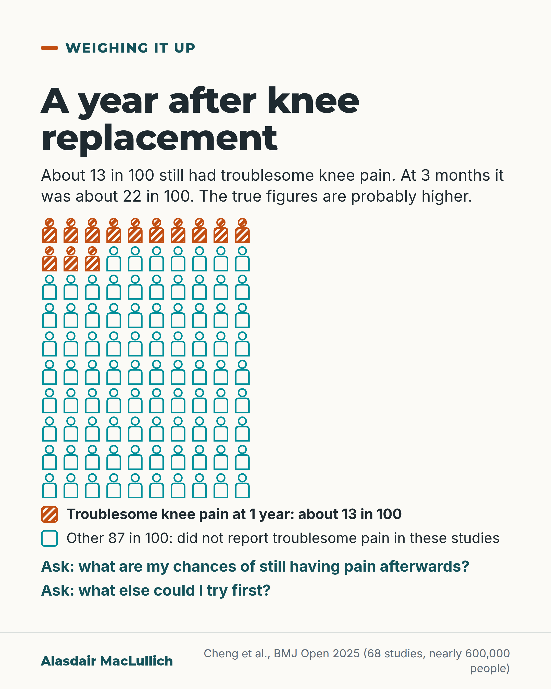

# G096: Knee replacement: ask about pain afterwards

- Category: C10 Pain
- Audience: public
- Series: Weighing it up
- Post type: decision_support
- Visual format: chart (10 by 10 icon array)
- Status: text text_final, visual final
- Working id: C10-P02 (candidate C10-30)

## Insight

Knee replacement relieves pain for most people, but in a 2025 review about 13 in 100 still had troublesome knee pain a year later, and probably more. Asking about this before surgery helps set expectations.

## Angle and position

The decision to have a knee replacement should include the chance of persistent pain, not only the chance of relief; the reader is given the numbers and two questions to ask.

Basis: mixed: the figures are empirical (Cheng 2025, Bourne 2010); that people should be told the chance of persistent pain is ethical judgement.

## X (850 characters)

```text
Knee replacement eases pain for most people who have it. About 13 in 100 still have troublesome knee pain a year later.

That figure comes from a 2025 review of 68 studies, nearly 600,000 people with an average age of about 70. At 3 months after the operation about 22 in 100 had troublesome pain, so fewer people had it by a year. Studies defined troublesome pain in different ways. The authors rated their confidence as low. They think the true figures are probably higher, because many people dropped out of the studies before they were checked again.

In a Canadian survey, about 4 in 5 people were satisfied with their new knee. People whose expectations were not met were the most likely to be dissatisfied.

If you are thinking about surgery, ask two questions. What are my chances of still having pain afterwards? What else could I try first?
```

## LinkedIn (1428 characters)

```text
Knee replacement eases pain for most people who have it. About 13 in 100 still have troublesome knee pain a year later.

That figure comes from a 2025 systematic review in BMJ Open: 68 studies, nearly 600,000 people, average age about 70.

At 3 months after the operation, about 22 in 100 had troublesome pain. At 1 year, about 13 in 100. Across individual studies the 1-year figure ranged from about 3 in 100 to about 43 in 100. Studies defined troublesome pain in different ways.

The authors rated their confidence as low. Many people dropped out of the studies before they were checked again, which is why the authors think the true figures are probably higher.

People were also asked how satisfied they were. In a Canadian survey, about 4 in 5 people were satisfied with their knee replacement. Asked only about pain relief, between 72 and 86 in 100 were satisfied, depending on the activity. Satisfaction is a different measure from pain. The survey was published in 2010 and covered one Canadian province.

In that survey, people whose expectations went unmet were the most likely to be dissatisfied. That is a reason to talk about likely pain before the operation.

In our view, anyone offered a knee replacement should hear the chance of still having pain as clearly as the chance of relief.

Two questions to take to the appointment:

What are my chances of still having pain afterwards?

What else could I try first?
```

## Bluesky (258 characters)

```text
Knee replacement eases pain for most people. In a 2025 review of 68 studies, about 13 in 100 still had troublesome knee pain a year on. The true figure may be higher. Before surgery, ask: what are my chances of still having pain? What else could I try first?
```

## Threads (495 characters)

```text
Knee replacement eases pain for most people, but some still have pain afterwards.

A 2025 review of 68 studies (average age about 70) found troublesome knee pain in about 22 in 100 people at 3 months and about 13 in 100 at a year. The authors think the true figures are probably higher.

In a Canadian survey, people whose expectations were not met were the most likely to be dissatisfied. So before surgery, ask: what are my chances of still having pain afterwards? What else could I try first?
```

## Source reply

Sources: Cheng et al., BMJ Open 2025 https://doi.org/10.1136/bmjopen-2024-088975 ; Bourne et al., Clin Orthop Relat Res 2010 https://doi.org/10.1007/s11999-009-1119-9

## Visual



Alt text: Grid of 100 person icons, 13 hatched orange and 87 outlined teal. About 13 in 100 still had troublesome knee pain a year after knee replacement; about 22 in 100 at 3 months. The true figures are probably higher. Two questions to ask: chances of pain afterwards, and what else to try first.

Editable source: `visuals/src/G096.html`

Design instructions: Single card. Custom 10x10 person icon array: first 13 hatched burnt orange (pattern), 87 teal outlines; legend with matching swatches; two Ask lines. Data: C10-30-b (13 in 100 at 12 months; 22 in 100 at 3 months).

## Sources and verification

- C10-30-b (supported_with_qualification): Current best estimate: after knee replacement, about 22 in 100 people report unfavourable pain at 3 months, falling to about 13 to 15 in 100 at 1 to 2 years; about 14 in 100 after hip replacement at 6 to 12 months. Confidence is low and the figures are probably underestimates.
  - Source: Cheng HY, Beswick AD, Bertram W, Siddiqui MA, Gooberman-Hill R, Whitehouse MR, et al. What proportion of people have long-term pain after total hip or knee replacement? An update of a systematic review and meta-analysis. BMJ Open. 2025;15(5):e088975.
  - Passage: "Abstract: "For TKR, 68 studies with 89 time points, including 598 498 patients, were included. Multivariate meta-analysis showed a general decrease in pain proportions over time: 21.9% (95% CrI 15.6% to 29.4%) at 3 months, 14.1% (10.9% to 17.9%) at 6 months, 12.6% (9.9% to 15.9%) at 12 months and 14.6% (9.5% to 22.4%) at 24 months. Considerable heterogeneity, unrelated to examined moderators, was indicated by substantial prediction intervals in the univariate models. Substantial loss to follow-up and risk of bias led to low confidence in the results. For THR, only 11 studies were included, so it was not possible to describe the trend. Univariate meta-analysis estimated 13.8% (8.5% to 20.1%) and 13.7% (4.8% to 31.0%) of patients experiencing long-term pain 6 and 12 months after THR". Methods: "We adopted the term 'unfavourable pain' from the previous review, which serves as a collective label to include the various descriptions used by study authors—such as persistent pain, worsening pain, or residual pain—rather than as an indicator of dissatisfaction." Strengths and limitations: "These prevalence rates are likely underestimated due to loss to follow-up and the high risk of bias in the included studies." Results: "Patients in 52 studies with data had a mean age of 69.6 (SD 9.4) years, and 63% (58 to 69) were women."" (Abstract; Methods, Outcome; Strengths and limitations; Results (full text via Undermind))
- C10-30-c (supported_with_qualification): Most people are satisfied after knee replacement, but about 1 in 5 are not; satisfaction with pain relief varies by activity, and unmet expectations are the strongest predictor of dissatisfaction.
  - Source: Bourne RB, Chesworth BM, Davis AM, Mahomed NN, Charron KD. Patient satisfaction after total knee arthroplasty: who is satisfied and who is not? Clin Orthop Relat Res. 2010;468(1):57-63.
  - Passage: ""We performed a cross-sectional study of patient satisfaction after 1703 primary TKAs performed in the province of Ontario. Our data confirmed that approximately one in five (19%) primary TKA patients were not satisfied with the outcome. Satisfaction with pain relief varied from 72-86% and with function from 70-84% for specific activities of daily living. The strongest predictors of patient dissatisfaction after primary TKA were expectations not met (10.7x greater risk), a low 1-year WOMAC (2.5x greater risk), preoperative pain at rest (2.4x greater risk) and a postoperative complication requiring hospital readmission (1.9x greater risk)."" (Abstract)

Verification notes: Cheng 2025 (full text): 13 in 100 at 1 year, 22 in 100 at 3 months, low confidence, probable underestimate, range 3.3% to 43.3%, variable definitions. Bourne 2010 (abstract): about 4 in 5 satisfied, 72% to 86% satisfied with pain relief by activity, unmet expectations strongest predictor; published 2010, one Canadian province. The 2012 figure and NICE referral criteria are omitted.

## Attention and follow potential

Pause: People waiting for, or being offered, a knee replacement and their families.

Gain: A realistic number and two questions that set expectations before surgery.

Follow: Shows the account gives the numbers on both sides of a treatment decision.

## Open issues

None.
