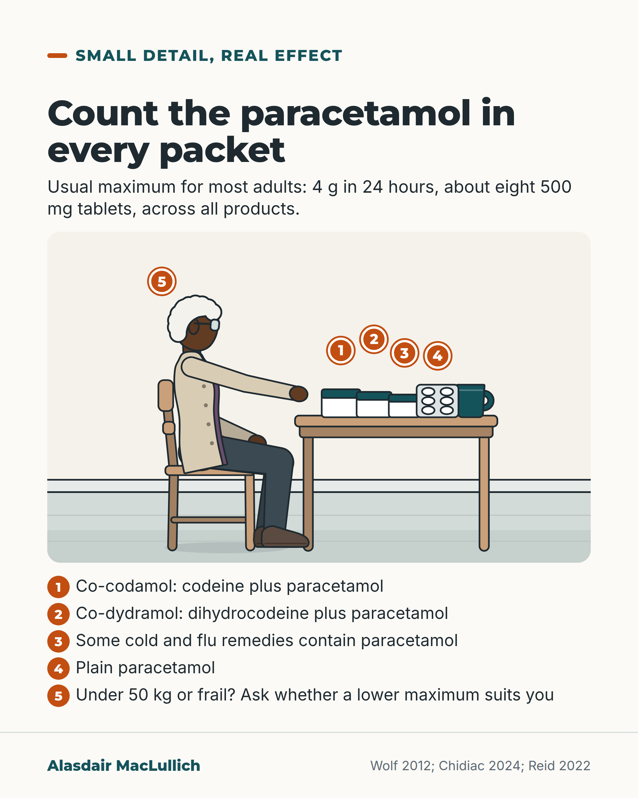

# G097: Paracetamol in more packets than one

- Category: C10 Pain
- Audience: public
- Series: Small detail, real effect
- Post type: public_explanation
- Visual format: annotated scene
- Status: text text_final, visual final
- Working id: C10-P03 (candidate C10-09)

## Insight

Co-codamol, co-dydramol and some cold and flu remedies all contain paracetamol, so taking two of them together can go over the usual 4 g daily maximum. Adding up paracetamol across every product prevents this.

## Angle and position

Accidental paracetamol excess is often a counting problem across products; the reader is shown how to count and whom to ask.

Basis: mixed: product contents, the 4 g maximum and the doubling-up studies are empirical; that clinicians should ask about bought medicines is clinical interpretation.

## X (876 characters)

```text
Co-codamol is codeine plus paracetamol. Co-dydramol is dihydrocodeine plus paracetamol. Some cold and flu remedies contain paracetamol too.

So taking two of these together can take you over the usual limit. For most adults that is 4 g of paracetamol in 24 hours: eight 500 mg tablets a day, counted across every product.

Doubling up is easy to do. In a US study, people were asked to show how they would take real shop products over a day. About 4 in 10 of those aged 61 to 80 showed they would take two paracetamol products together and go over 4 g. This was a pretend task with real products, not what they actually did.

If you weigh under 50 kg (about 7 stone 12 lb) or are frail, ask whether a lower daily maximum suits you. Research has not settled the safest dose.

Add up the paracetamol in everything you take, including what you buy, and ask a pharmacist to check.
```

## LinkedIn (1555 characters)

```text
Co-codamol is codeine plus paracetamol. Co-dydramol is dihydrocodeine plus paracetamol. Some cold and flu remedies contain paracetamol too.

So taking two of these together can take you over the usual limit without you meaning to. For most adults the usual maximum is 4 g of paracetamol in 24 hours. With 500 mg tablets, that is 8 a day, counting every product that contains paracetamol.

Doubling up is easy to do. In a US study, 500 adults were asked to show how they would take real shop products over a day. Nearly half (46 in 100) would have gone over 4 g by taking two paracetamol-containing products together. Among those aged 61 to 80 it was 4 in 10. This was a pretend task, not what people actually did.

At an Australian poisons centre, about 1 in 5 calls about accidentally taking too much paracetamol involved more than one paracetamol product.

Some Australian guidelines for older people advise a lower daily dose if you weigh under 50 kg (about 7 stone 12 lb) or are frail. Research has not established the safest dose. One Australian study looked at frail or low-weight hospital patients aged 70 and over. About 8 in 10 of their prescriptions on leaving hospital were above that lower dose.

What you can do:

1. Read the ingredients of every medicine you take, including anything bought for a cold.

2. Add up the paracetamol across all of them.

3. Ask a pharmacist to check the total, and whether a lower maximum is right for you.

If you help look after an older person, ask what they buy for themselves as well as what is prescribed.
```

## Bluesky (297 characters)

```text
Co-codamol and co-dydramol contain paracetamol. So do some cold and flu remedies. Take two together and you can pass the usual limit of 4 g a day (eight 500 mg tablets). If you weigh under 50 kg or are frail, a lower limit may suit you. Add up the paracetamol in all you take and ask a pharmacist.
```

## Threads (495 characters)

```text
Co-codamol and co-dydramol both contain paracetamol. So do some cold and flu remedies.

Take two together and you can pass the usual maximum without meaning to. That is 4 g in 24 hours, or eight 500 mg tablets. A US study had people show how they would take real products over a day. 4 in 10 of those aged 61 to 80 would have doubled up and gone over 4 g. It was a pretend task.

If you weigh under 50 kg or are frail, ask whether a lower maximum suits you. Ask a pharmacist to check your total.
```

## Source reply

Sources: Wolf et al., J Gen Intern Med 2012 https://doi.org/10.1007/s11606-012-2096-3 ; Chidiac et al., Drug Saf 2024 https://doi.org/10.1007/s40264-024-01472-y ; Reid et al., Br J Clin Pharmacol 2022 https://doi.org/10.1111/bcp.15394 ; Craig et al., Br J Clin Pharmacol 2012 https://doi.org/10.1111/j.1365-2125.2011.04067.x

## Visual



Alt text: Drawn kitchen table where an older Black woman in glasses and cardigan reaches for medicine boxes beside a blister strip and a mug, with numbered markers 1 to 5. Key: co-codamol, co-dydramol, cold and flu remedies, plain paracetamol, and a lower maximum if under 50 kg or frail. Usual maximum 4 g in 24 hours.

Editable source: `visuals/src/G097.html`

Design instructions: Single card. Kit kitchen scene S=1.4: older Black woman seated at table, three plain boxes, blister strip, mug; pins 1 to 5 (5 above her); numbered key below. No text in art.

## Sources and verification

- C10-09-a (supported): Co-codamol (codeine with paracetamol) and co-dydramol (dihydrocodeine with paracetamol) contain paracetamol; co-codamol 8/500 is sold in UK pharmacies without prescription.
  - Source: Craig DGN, Bates CM, Davidson JS, Martin KG, Hayes PC, Simpson KJ. Staggered overdose pattern and delay to hospital presentation are associated with adverse outcomes following paracetamol-induced hepatotoxicity. Br J Clin Pharmacol. 2012;73(2):285-94.
  - Passage: "Methods, Definitions: "compound overdose described overdose of compound tablets which included paracetamol such as co-proxamol or co-dydramol." Results: "Of the 48 subjects who had consumed an overdose of compound analgesics, the majority (21/48, 43.8%) had used codeine phosphate/paracetamol compounds (co-codamol), an analgesic available over the counter (OTC) in pharmacies in the UK at a dose of 8/500 mg, and only by prescription at higher doses. A total of 14 subjects had overdosed on prescribed compound analgesics, namely dextropropoxyphene/paracetamol (co-proxamol, n = 7) and dihydrocodeine tartrate/paracetamol (co-dydramol, n = 7)."" (Methods (Definitions); Results (Repeated supratherapeutic overdoses and pain))
- C10-09-b (supported_with_qualification): Some cold and flu remedies also contain paracetamol.
  - Source: Chidiac AS, Buckley NA, Noghrehchi F, Cairns R. Paracetamol dosing errors in people aged 12 years and over: an analysis of over 14,000 cases reported to an Australian Poisons Information Centre. Drug Saf. 2024;47(12):1293-306.; Wolf MS, King J, Jacobson K, Di Francesco L, Bailey SC, Mullen R, et al. Risk of unintentional overdose with non-prescription acetaminophen products. J Gen Intern Med. 2012;27(12):1587-93.
  - Passage: "Chidiac 2024, Table 1 (Paracetamol involved): "Cold and flu preparations: Entire cohort: 1726 (12.0%)"; Results 3.1: "This was closely followed by combinations with opioids (primarily consisting of paracetamol and codeine with just 0.7% paracetamol and tramadol) and cold and flu preparations (which often include other ingredients including decongestants and sedating antihistamines)." Wolf 2012, Table 3 secondary products shown in the double-dipping scenarios include "Brand Name Combination Cold & Cough (650 mg/dose)" [acetaminophen dose]." (Chidiac: Table 1 and Results 3.1. Wolf: Methods and Table 3.)
- C10-09-c (supported_with_qualification): The usual maximum daily dose of paracetamol for adults is 4 g in 24 hours.
  - Source: Reid O, Ngo J, Lalic S, Su E, Elliott RA. Paracetamol dosing in hospital and on discharge for older people who are frail or have low body weight. Br J Clin Pharmacol. 2022;88(10):4565-72.; Craig DGN, Bates CM, Davidson JS, Martin KG, Hayes PC, Simpson KJ. Staggered overdose pattern and delay to hospital presentation are associated with adverse outcomes following paracetamol-induced hepatotoxicity. Br J Clin Pharmacol. 2012;73(2):285-94.; Wolf MS, King J, Jacobson K, Di Francesco L, Bailey SC, Mullen R, et al. Risk of unintentional overdose with non-prescription acetaminophen products. J Gen Intern Med. 2012;27(12):1587-93.
  - Passage: "Reid 2022, Introduction: "Although paracetamol-induced hepatotoxicity at standard therapeutic doses (up to 4 g/d) is rare, cases have been reported." Craig 2012, Methods (Definitions): "a staggered overdose described ingestion of two or more supratherapeutic paracetamol doses over a time interval of greater than 8 h resulting in a cumulative dose of >4 g day-1." Wolf 2012, Abstract: "23.8 % of participants demonstrated they would overdose on a single over-the-counter acetaminophen product by exceeding a dose of four grams in a 24-hour period"." (Reid: Introduction. Craig: Methods. Wolf: Abstract.)
- C10-09-d (supported_with_qualification): Taking two paracetamol-containing products at once is a recognised route to accidental excess: in a US study nearly half of adults said they would take two such products together, and about 1 in 5 accidental paracetamol overdose calls to an Australian poisons centre involved more than one product.
  - Source: Wolf MS, King J, Jacobson K, Di Francesco L, Bailey SC, Mullen R, et al. Risk of unintentional overdose with non-prescription acetaminophen products. J Gen Intern Med. 2012;27(12):1587-93.; Chidiac AS, Buckley NA, Noghrehchi F, Cairns R. Paracetamol dosing errors in people aged 12 years and over: an analysis of over 14,000 cases reported to an Australian Poisons Information Centre. Drug Saf. 2024;47(12):1293-306.
  - Passage: "Wolf 2012, Abstract: "In addition, 45.6 % of adults demonstrated they would overdose by 'double-dipping' with two acetaminophen-containing products." Table 4, Double-dipping with 2 products by age: "18-30 37.1; 31-45 44.1; 46-60 52.8; 61-80 40.0" (P = 0.05). Discussion: "Clearly, our study is limited by the fact that the assessments of individuals' misunderstanding and misuse of OTC acetaminophen products reflects hypothetical and not actual health behaviors." Chidiac 2024, Results 3.1: "Multiple paracetamol-containing products (which may include more than one brand of the same category) were taken in 2816 (19.6%) exposures"; Abstract: "The in-depth analysis of exposures recorded during 2021 revealed 1899 exposures (median age 46 years, 63.4% female) with 26.8% requiring hospitalisation." ... "6% of exposures developed hepatotoxicity." Table 1: "Elderly >=75 years: Entire cohort: 1733 (12.1%)"." (Wolf: Abstract, Table 4, Discussion. Chidiac: Abstract, Results 3.1, Table 1.)
- C10-09-f (supported_with_qualification): For people who are frail or weigh under 50 kg, a lower daily paracetamol maximum is often advised, though the safest dose has not been established; full adult doses are common in this group.
  - Source: Reid O, Ngo J, Lalic S, Su E, Elliott RA. Paracetamol dosing in hospital and on discharge for older people who are frail or have low body weight. Br J Clin Pharmacol. 2022;88(10):4565-72.; Caparrotta TM, Antoine DJ, Dear JW. Are some people at increased risk of paracetamol-induced liver injury? A critical review of the literature. Eur J Clin Pharmacol. 2018;74(2):147-60.
  - Passage: "Reid 2022, Abstract: "Paracetamol doses administered in hospital, and doses prescribed on discharge, were compared against consensus guidelines that recommended <=60 mg/kg/d for older people weighing <50 kg, and <=3000 mg/d for frail older people." ... "In total, 240 admissions (n = 229 patients, mean age 84.7 years) were analysed. During 150 (62.5%) admissions, higher than recommended paracetamol doses were prescribed. On 138 (57.5%) occasions, patients were prescribed paracetamol on discharge, and 112/138 (81.2%) doses were higher than recommended." Introduction: "For example, England's Healthcare Safety Investigation Branch, an organisation responsible for the investigating patient safety concerns, is conducting an investigation titled Unintentional overdose of paracetamol in adults with low body weight. This was prompted by reports of paracetamol overdose in patients with low body weight at therapeutic doses." Discussion: "Although there is limited evidence that the standard maximum therapeutic dose (4 g/d) leads to significant rates of liver injury in frail and low-weight older people, we believe that reduced doses should be considered for 3 reasons." Caparrotta 2018, Abstract: "The safe (and still effective) oral dose of paracetamol in patients weighing less than 50 kg has not been established." ... "There is no patient group that is unequivocally at elevated risk of paracetamol-induced liver toxicity."" (Reid: Abstract, Introduction, Discussion. Caparrotta: Abstract.)

Verification notes: Craig 2012 (full text): product composition only; the all-ages liver series is not used. Wolf 2012 (full text): US, demonstrated dosing in a simulated task (not stated belief), 4 in 10 aged 61 to 80. Chidiac 2024 (full text): Australian poisons calls, about 1 in 5 involved more than one product. Reid 2022 (full text) and Caparrotta 2018 (abstract): lower dose for under 50 kg or frail as precaution, safest dose not established; Australian guidelines. BNF and pack labels not opened: no pack-label claim made; 4 g from papers.

## Attention and follow potential

Pause: Anyone taking co-codamol who also reaches for a cold remedy or plain paracetamol.

Gain: A simple counting habit and a pharmacist check that prevents accidental excess.

Follow: Practical medicine safety that a reader can act on the same day.

## Open issues

None.
