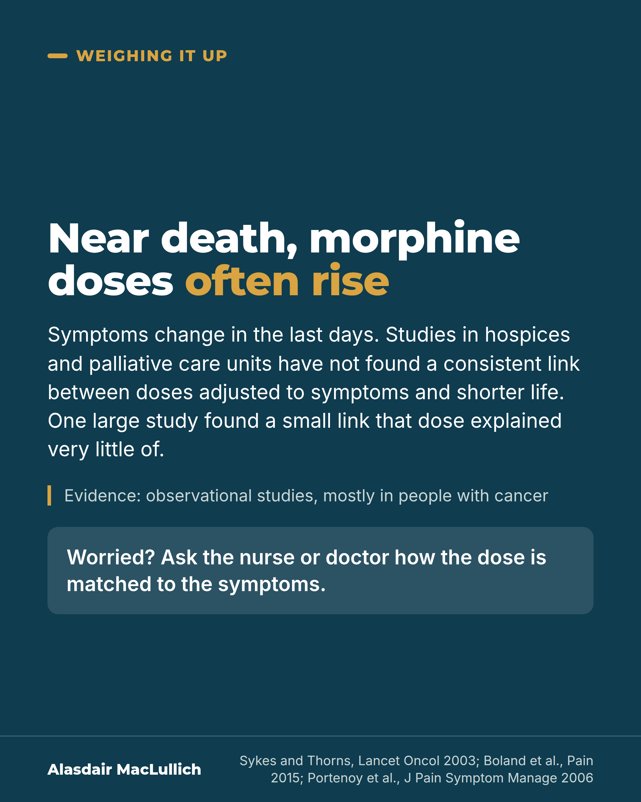

# G098: Morphine near the end of life and the fear of shortening it

- Category: C10 Pain
- Audience: public
- Series: Weighing it up
- Post type: public_explanation
- Visual format: statement card
- Status: text text_final, visual final
- Working id: C10-P04 (candidate C10-25)

## Insight

Doses of morphine and similar medicines often rise in the last days of life because symptoms change; studies in hospices and palliative care units have not found that doses adjusted to symptoms shorten life.

## Angle and position

Timing looks like cause because rising doses and death come close together; separating the two lets families ask for relief without fear.

Basis: mixed: the absence of a consistent link is an empirical finding from observational studies; that the fear should be discussed openly and not delay relief is ethical judgement.

## X (912 characters)

```text
Doses of morphine and similar medicines often go up in the last days of life. Symptoms change as death comes closer.

Doses rise as death comes closer, so it can look as if the higher dose caused the death. Families may worry about this. Studies of people dying in hospices and palliative care units have not found that giving or increasing these medicines to relieve symptoms shortens life.

The studies only watched what happened, and most were of low quality. Almost all the people had cancer. One large hospice study found a small link between higher doses and shorter survival. The dose accounted for very little of the difference in survival. The link may reflect how ill people were. Its authors said fear of shortening life should not stop pain relief.

If the worry about shortening life is on your mind at a bedside, say so to the nurse or doctor, and ask how the dose is being matched to the symptoms.
```

## LinkedIn (1414 characters)

```text
Doses of morphine and similar medicines often go up in the last days of life. Symptoms change as death comes closer.

Doses rise as death comes closer, so it can look as if the higher dose caused the death. Families may worry about this.

What the studies show:

1. Reviews of studies in hospices and palliative care units have not found that starting or increasing morphine and similar medicines to relieve symptoms shortens life.

2. One UK palliative care unit looked back at 238 people who died. Those whose dose of morphine or a similar medicine was increased near the end did not die sooner than those whose dose was not. The study came from a single unit and was based on past records.

3. One large hospice study found a small link between higher doses and shorter survival, but dose accounted for very little of the difference. The link may reflect how ill people were. The authors concluded that fear of shortening life should not stop pain relief.

The limits: the studies only watched what happened, mostly by looking back at records, and most were of low quality. Almost all participants had cancer. So the safest summary is: no consistent link was found.

In our view, the fear should be spoken about openly so that it does not delay relief. If you are sitting with someone who is dying and this worry is on your mind, say so to the nurse or doctor. Ask how the dose is being matched to the symptoms.
```

## Bluesky (286 characters)

```text
Morphine doses often rise in the last days of life. Hospice studies did not find that raising doses to ease symptoms shortened life. They only watched what happened, mostly in people with cancer. One found a small link to shorter survival. If this worries you, tell the nurse or doctor.
```

## Threads (495 characters)

```text
Doses of morphine often go up in the last days of life, because symptoms change.

Studies of people dying in hospices and palliative care units have not found that raising doses to relieve symptoms shortens life. The studies only watched what happened and mostly involved people with cancer. One found a small link between higher doses and shorter survival, but dose explained very little of it.

If you worry about this, tell the nurse or doctor and ask how the dose is matched to the symptoms.
```

## Source reply

Sources: Sykes and Thorns, Lancet Oncol 2003 https://doi.org/10.1016/s1470-2045(03)01079-9 ; Boland et al., Pain 2015 https://doi.org/10.1097/j.pain.0000000000000306 ; Thorns and Sykes, Lancet 2000 https://doi.org/10.1016/S0140-6736(00)02534-4 ; Portenoy et al., J Pain Symptom Manage 2006 https://doi.org/10.1016/j.jpainsymman.2006.08.003

## Visual



Alt text: Text card on deep teal: near death, morphine doses often rise because symptoms change. Hospice and palliative care studies found no consistent link between symptom-matched doses and shorter life; one large study found a small link that dose explained very little of. Observational, mostly cancer. Ask how the dose is matched.

Editable source: `visuals/src/G098.html`

Design instructions: Single dark card, centred text, gold emphasis on 'often rise', evidence note with gold rule, translucent question panel. No drawing (kept typographic).

## Sources and verification

- C10-25-a (supported_with_qualification): Opioid doses tend to rise as death approaches, but reviews of palliative care studies found no evidence that starting or increasing opioids to control symptoms brings death forward.
  - Source: Sykes N, Thorns A. The use of opioids and sedatives at the end of life. Lancet Oncol. 2003;4(5):312-8.; Boland JW, Ziegler L, Boland EG, McDermid K, Bennett MI. Is regular systemic opioid analgesia associated with shorter survival in adult patients with cancer? A systematic literature review. Pain. 2015;156(11):2152-63.
  - Passage: "Sykes 2003: "We conclude that patients are more likely to receive higher doses of both opioids and sedatives as they get closer to death. However, there is no evidence that initiation of treatment, or increases in dose of opioids or sedatives, is associated with precipitation of death." Boland 2015: "Thirteen end-of-life studies, including 11 very low-quality retrospective studies, did not find a consistent association between opioid analgesic treatment and survival; this evidence comes from low-quality studies, so should be interpreted with caution."" (Abstracts (Sykes 2003 conclusion; Boland 2015 results))
- C10-25-b (supported_with_qualification): In 238 consecutive deaths in a palliative care unit, people whose opioid doses were increased at the end of life did not live for a shorter time than those with no increase.
  - Source: Thorns A, Sykes N. Opioid use in last week of life and implications for end-of-life decision-making. Lancet. 2000;356(9227):398-9.
  - Passage: ""We retrospectively analysed the pattern of opioid use in the last week of life in 238 consecutive patients who died in a palliative care unit. Median doses of opioid were low (26.4 mg) in the last 24 h of life and patients who received opioid increases at the end of life did not show shorter survival than those who received no increases."" (Abstract (research letter))
- C10-25-c (supported): A larger US hospice study found higher opioid doses were statistically linked with shorter survival, but dose explained very little of the difference in how long people lived, and the authors concluded that concern about hastening death does not justify withholding opioids.
  - Source: Portenoy RK, Sibirceva U, Smout R, Horn S, Connor S, Blum RH, et al. Opioid use and survival at the end of life: a survey of a hospice population. J Pain Symptom Manage. 2006;32(6):532-40.
  - Passage: ""Multivariate models demonstrated a significant association between shorter survival and higher opioid dose, a cancer diagnosis, unresponsiveness, and pain of <5 on a 0-10 scale, but none of these models explained >10% of the variance in time till death." ... "This analysis revealed that opioid dosing was associated with time till death, but this factor would explain very little of the variation in survival." ... "Based on these findings, concern about hastening death does not justify withholding opioid therapy."" (Abstract)

Verification notes: Sykes 2003 and Boland 2015 (abstracts): no evidence that symptom-guided opioids precipitate death; observational, very low quality, cancer. Thorns 2000 (abstract): 238 deaths, single UK unit, example only, no mg figure. Portenoy 2006 (abstract): small link, little explained variance, authors' conclusion. NICE NG31 not used. No reference to assisted dying or double effect.

## Attention and follow potential

Pause: Relatives at a bedside who fear that the syringe driver or extra doses will hasten death.

Gain: An accurate reading of the evidence and permission to raise the worry.

Follow: Careful handling of a hard question without false reassurance.

## Open issues

None.
