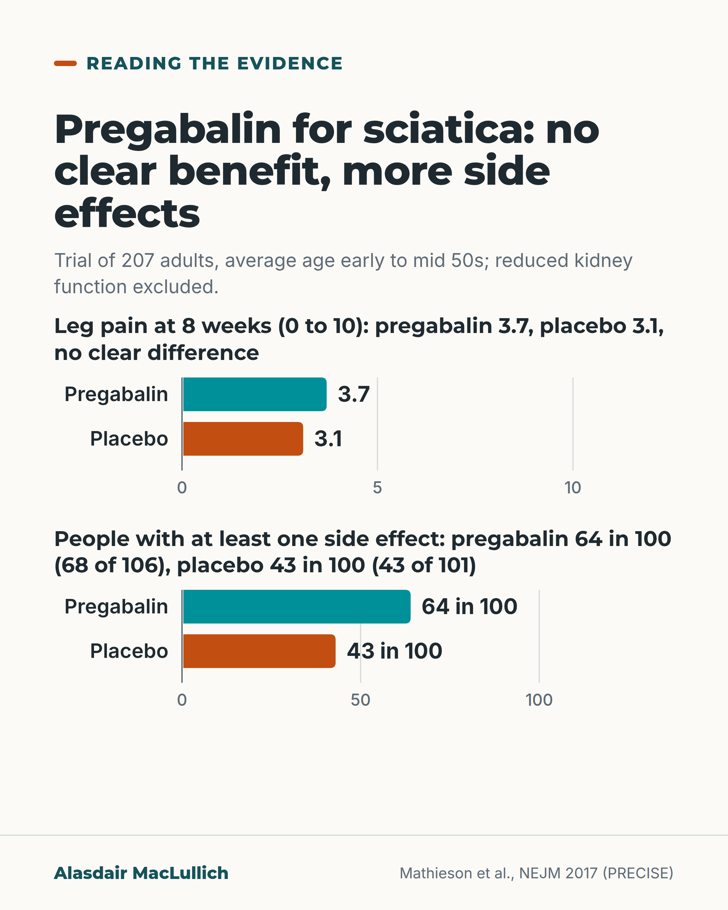

# G099: Pregabalin for sciatica: what the trial found

- Category: C10 Pain
- Audience: practitioners
- Series: Reading the evidence
- Post type: evidence_interpretation
- Visual format: chart (bars)
- Status: text text_final, visual final
- Working id: C10-P05 (candidate C10-26)

## Insight

In the main placebo-controlled trial, pregabalin did not ease sciatica leg pain more than placebo at 8 weeks or 1 year, and more people on it had side effects; the trial excluded reduced kidney function and had an average age in the early to mid 50s.

## Angle and position

A trial that under-represented older people gives no reason to expect benefit in them, while the side effects weigh more for someone already unsteady; the position is not to start gabapentinoids for sciatica and to review existing prescriptions.

Basis: mixed: trial and review results are empirical; the extension to older people and the advice not to start are clinical interpretation and judgement.

## X (879 characters)

```text
In the PRECISE trial, 207 adults with sciatica took pregabalin or a dummy capsule. At 8 weeks, average leg pain was 3.7 out of 10 on pregabalin and 3.1 on placebo (a higher score means more pain).

The trial showed no clear difference at 8 weeks or at 1 year. The uncertainty ran from slight benefit to slight harm, and did not favour pregabalin.

About 64 in 100 people on pregabalin had at least one side effect, against 43 in 100 on placebo; dizziness was more common on pregabalin. Pooled reviews found the same for gabapentin and pregabalin in back pain and sciatica.

Participants averaged their early to mid 50s, and anyone with reduced kidney function was excluded. In our judgement, dizziness is a reason not to start a medicine that has not been shown to help in an older person who is already unsteady. It is also a reason to review prescriptions started for sciatica.
```

## LinkedIn (1824 characters)

```text
In the PRECISE trial, 207 adults with sciatica took pregabalin or a dummy capsule. At 8 weeks, average leg pain was 3.7 out of 10 on pregabalin and 3.1 on placebo.

The trial showed no clear difference at 8 weeks or at 1 year. The confidence interval for the 8-week difference ran from slight benefit to slight harm, and did not favour pregabalin.

About 64 in 100 people on pregabalin (68 of 106) had at least one side effect, against about 43 in 100 on placebo (43 of 101). These counts are people, not individual side effects. Dizziness was more common on pregabalin than on placebo.

The trial does not stand alone. Reviews that pooled the trials found that gabapentin and pregabalin did not ease back pain or sciatica more than placebo, and people taking them had more side effects, most often drowsiness, dizziness and nausea. Those trials were mostly in working-age adults. The evidence on side effects was graded very low to moderate quality in one review and high quality in the other.

What the trial leaves open: the participants were on average in their early to mid 50s, and anyone with creatinine clearance below 60 ml/min was excluded. So it says little about older people directly. Nothing in it suggests pregabalin would work better in them; that is our inference.

Direct evidence on gabapentinoids and falls in older people is mixed, so this is a judgement, not a finding about falls. In our judgement, dizziness and drowsiness are the commonest side effects, and for someone already unsteady that is a reason not to start a medicine that has not been shown to help.

What guidelines agree on for sciatica: explain the condition, help the person stay active, and refer if things do not improve or there is foot weakness (foot drop). And look at the repeat list for gabapentinoids started for this purpose.
```

## Bluesky (297 characters)

```text
207 adults with sciatica (average age early to mid 50s) took pregabalin or placebo: no clear difference in leg pain at 8 weeks or 1 year. 64 in 100 on pregabalin had a side effect vs 43 on placebo; dizziness more common. In our judgement, dizziness is a reason not to start it in someone unsteady.
```

## Threads (500 characters)

```text
In the PRECISE trial, 207 adults with sciatica took pregabalin or placebo. It showed no clear difference in leg pain at 8 weeks or 1 year.

About 64 in 100 on pregabalin had at least one side effect against 43 in 100 on placebo, and dizziness was more common on pregabalin. Pooled reviews agree for gabapentin too.

Average age was early to mid 50s. In our judgement, dizziness in an older person who is already unsteady is a reason not to start it for sciatica, and to review existing prescriptions.
```

## Source reply

Sources: Mathieson et al., NEJM 2017 https://doi.org/10.1056/NEJMoa1614292 ; Enke et al., CMAJ 2018 https://doi.org/10.1503/cmaj.171333 ; Shanthanna et al., PLoS Med 2017 https://doi.org/10.1371/journal.pmed.1002369 ; Khorami et al., J Clin Med 2021 https://doi.org/10.3390/jcm10112482

## Visual



Alt text: Two bar charts for the PRECISE sciatica trial of 207 adults. Leg pain at 8 weeks out of 10: pregabalin 3.7, placebo 3.1, no clear difference. At least one side effect: pregabalin 64 in 100 (68 of 106), placebo 43 in 100 (43 of 101). Kidney impairment excluded.

Editable source: `visuals/src/G099.html`

Design instructions: Single card. Two barChart calls (pain max 10; side effects max 100) with direct row labels; teal pregabalin, orange placebo. Data: C10-26-a.

## Sources and verification

- C10-26-a (supported): In the PRECISE trial, pregabalin did not reduce sciatica leg pain more than placebo at 8 weeks or at 1 year, did not improve any secondary outcome, and caused more adverse events, dizziness most often.
  - Source: Mathieson S, Maher CG, McLachlan AJ, Latimer J, Koes BW, Hancock MJ, et al. Trial of pregabalin for acute and chronic sciatica. N Engl J Med. 2017;376(12):1111-20.; Enke O, New HA, New CH, Mathieson S, McLachlan AJ, Latimer J, et al. Anticonvulsants in the treatment of low back pain and lumbar radicular pain: a systematic review and meta-analysis. CMAJ. 2018;190(26):E786-93.
  - Passage: "Mathieson 2017: "A total of 209 patients underwent randomization, of whom 108 received pregabalin and 101 received placebo; after randomization, 2 patients in the pregabalin group were determined to be ineligible and were excluded from the analyses. At week 8, the mean unadjusted leg-pain intensity score was 3.7 in the pregabalin group and 3.1 in the placebo group (adjusted mean difference, 0.5; 95% confidence interval [CI], -0.2 to 1.2; P=0.19). At week 52, the mean unadjusted leg-pain intensity score was 3.4 in the pregabalin group and 3.0 in the placebo group (adjusted mean difference, 0.3; 95% CI, -0.5 to 1.0; P=0.46). No significant between-group differences were observed with respect to any secondary outcome at either week 8 or week 52. A total of 227 adverse events were reported in the pregabalin group and 124 in the placebo group. Dizziness was more common in the pregabalin group than in the placebo group." Enke 2018, Figure 3 (any adverse event): "Mathieson et al.: 68/106 (pregabalin) vs. 43/101 (placebo); RR 1.5 (95% CI 1.2 to 2.0)"" (Mathieson: Abstract, Results; Enke: Figure 3 (read via Undermind))
- C10-26-b (supported): PRECISE participants were adults of working age on average (mean ages 52 and 55); the trial took adults aged 18 or older and excluded people with estimated creatinine clearance below 60 ml/min, so many older people were not eligible.
  - Source: Enke O, New HA, New CH, Mathieson S, McLachlan AJ, Latimer J, et al. Anticonvulsants in the treatment of low back pain and lumbar radicular pain: a systematic review and meta-analysis. CMAJ. 2018;190(26):E786-93.; Mathieson S, Maher CG, McLachlan AJ, Latimer J, Koes BW, Hancock MJ, et al. PRECISE - pregabalin in addition to usual care for sciatica: study protocol for a randomised controlled trial. Trials. 2013;14:213.
  - Passage: "Enke 2018, Table 1: "207 participants with acute (7 d to < 3 mo) or chronic (≥ 3 mo) sciatica. Mean age ± SD: pregabalin group 52.4 ± 17.2 yr; placebo group 55.2 ± 16.0 yr." PRECISE protocol: "pain duration of current episode of at least 1 week and up to 1 year; age 18 years or older" and "contraindications to pregabalin (known allergy to pregabalin or significant renal impairment. Pregabalin is predominantly renally excreted, so patients with an estimated creatinine clearance of <60 ml/minute will be excluded)"" (Enke: Table 1 (p E789); Protocol: Methods/Design, Participants and recruitment (read via Undermind))
- C10-26-c (supported): Systematic reviews found gabapentinoids ineffective for low back pain and lumbar radicular pain (sciatica) compared with placebo, with a higher risk of adverse effects, most often drowsiness, dizziness and nausea.
  - Source: Enke O, New HA, New CH, Mathieson S, McLachlan AJ, Latimer J, et al. Anticonvulsants in the treatment of low back pain and lumbar radicular pain: a systematic review and meta-analysis. CMAJ. 2018;190(26):E786-93.; Shanthanna H, Gilron I, Rajarathinam M, AlAmri R, Kamath S, Thabane L, et al. Benefits and safety of gabapentinoids in chronic low back pain: a systematic review and meta-analysis of randomized controlled trials. PLoS Med. 2017;14(8):e1002369.
  - Passage: "Enke 2018: "Nine trials compared topiramate, gabapentin or pregabalin to placebo in 859 unique participants. Fourteen of 15 comparisons found anticonvulsants were not effective to reduce pain or disability in low back pain or lumbar radicular pain; for example, there was high-quality evidence of no effect of gabapentinoids versus placebo on chronic low back pain in the short term (pooled mean difference [MD] −0.0, 95% confidence interval [CI] −0.8 to 0.7) or for lumbar radicular pain in the immediate term (pooled MD −0.1, 95% CI −0.7 to 0.5). The lack of efficacy is accompanied by increased risk of adverse events from use of gabapentinoids, for which the level of evidence is high." Full text: "Pooled results indicate high-quality evidence that gabapentinoids were associated with an increased risk of adverse events compared with placebo (pooled risk ratio [RR] 1.4, 95% CI 1.2 to 1.7, 6 studies)." and "The most common adverse events reported in participants taking a gabapentinoid were drowsiness or somnolence, dizziness and nausea". Shanthanna 2017: "Compared with placebo, the following adverse events were more commonly reported with GB: dizziness-(RR = 1.99, 95% CI [1.17 to 3.37], I2 = 49); fatigue (RR = 1.85, 95% CI [1.12 to 3.05], I2 = 0); difficulties with mentation (RR = 3.34, 95% CI [1.54 to 7.25], I2 = 0); and visual disturbances (RR = 5.72, 95% CI [1.94 to 16.91], I2 = 0)."" (Enke: Abstract and Results, Adverse events (full text via Undermind); Shanthanna: Abstract)
- C10-26-e (supported): For sciatica, guidelines consistently recommend explanation and education and commonly recommend physical activity; recommendations on medicines are inconsistent.
  - Source: Khorami AK, Oliveira CB, Maher CG, Bindels PJE, Machado GC, Pinto RZ, et al. Recommendations for diagnosis and treatment of lumbosacral radicular pain: a systematic review of clinical practice guidelines. J Clin Med. 2021;10(11):2482.
  - Passage: ""The consistent recommendation for 'should do' is: educational care [,,,,] and the common recommendation for 'should do' is physical activity [,,,,,,,]. Exercise/physical therapies [,,,,,] is consistently recommended as 'could do'." and "For all the other medications, such as paracetamol, Non-steroidal anti-inflammatory drugs (NSAIDs), opioids, anticonvulsants, muscle relaxants, antidepressants, corticosteroids and antibiotics, the recommendations are highly inconsistent." and "Referral to a specialist is recommended when conservative therapy fails or when steppage gait is present."" (Full text, Results 3.4.1 and 3.4.2; Abstract)
- C10-26-f (partly_supported): In older people, dizziness and drowsiness from gabapentinoids raise the risk of falls.
  - Source: Chaitoff A, Desai RJ, Choudhry NK, Jungo KT, Haff N, Lauffenburger JC. Assessing the risk for falls in older adults after initiating gabapentin versus duloxetine. Ann Intern Med. 2025;178(2):187-98.; Oh G, Moga DC, Fardo DW, Harp JP, Abner EL. The association of gabapentin initiation with cognitive and behavioral changes in older adults with cognitive impairment: a retrospective cohort study. Drugs Aging. 2024;41(7):623-32.
  - Passage: "Chaitoff 2025: "Our analytic cohort included 57 086 older adults with a diagnosis of interest initiating treatment with gabapentin (= 52 152) or duloxetine (= 4934). [...] At 6-month follow-up, incident gabapentin users had lower hazard of falls (hazard ratio, 0.52 [95% CI, 0.43 to 0.64]), but there was no difference in the hazards of experiencing severe falls. [...] Claims may contain fewer frail adults and undercount falls. Compared with incident use of duloxetine, incident use of gabapentin was not associated with increased fall-related visits." Oh 2024: "gabapentin initiation was significantly associated with increased odds of new falls at the index + 2 visit (odds ratio [95% confidence interval] 2.5 [1.3, 4.6])."" (Both: Abstract, Results and Conclusions)

Verification notes: Mathieson 2017 (abstract) and PRECISE protocol (full text): pain scores, no clear difference, per-person side effects, exclusion of CrCl below 60. Enke 2018 (full text) and Shanthanna 2017 (abstract): pooled reviews. Khorami 2021 (full text): guideline agreement on explanation, staying active, referral. Falls framed as judgement (C10-26-f). NICE NG59 not cited (search extract only).

## Attention and follow potential

Pause: Prescribers who start gabapentin or pregabalin for sciatica as 'nerve pain'.

Gain: The trial numbers, what they do and do not cover, and an alternative plan.

Follow: Reads a trial for what it shows in older people, not just the headline.

## Open issues

None.
