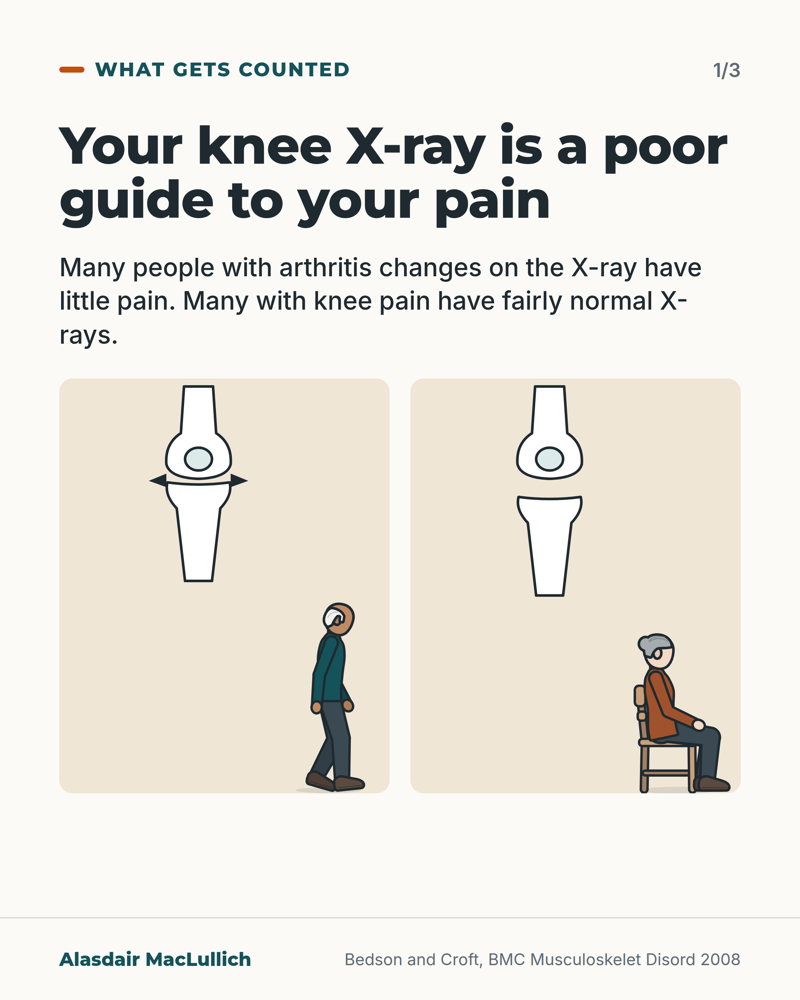
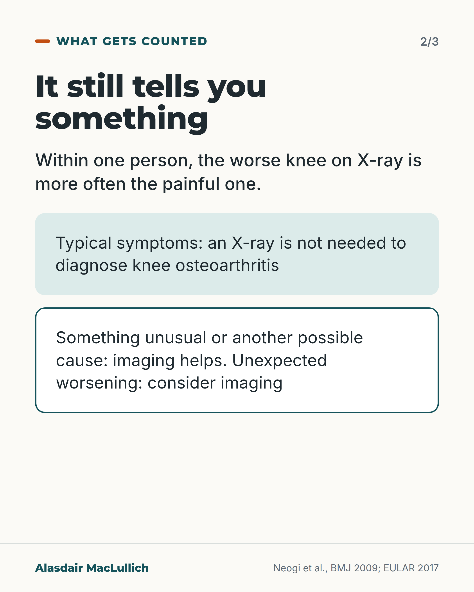
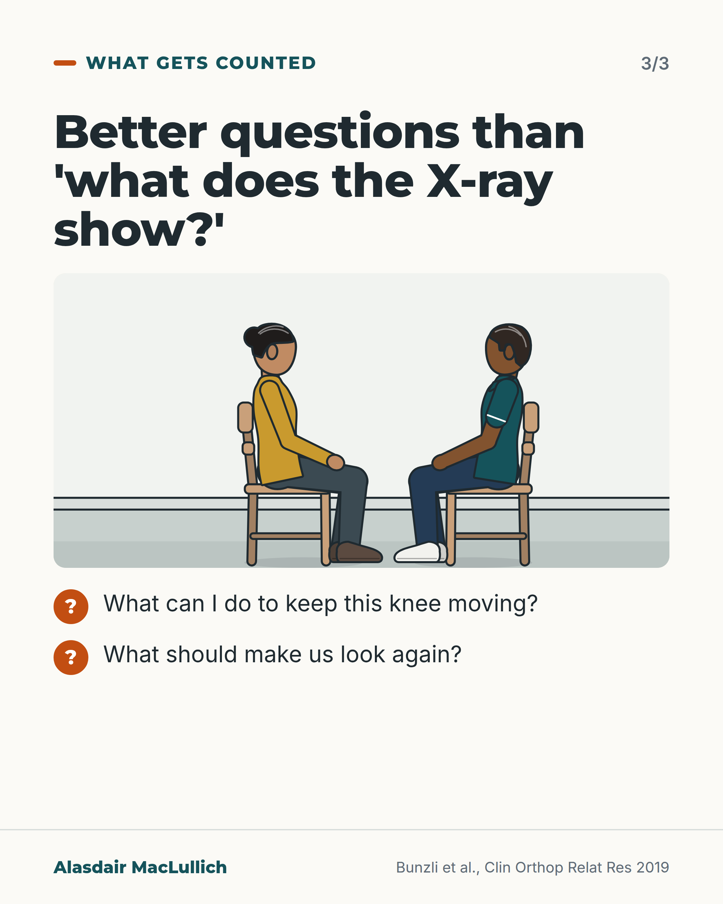

# G100: The knee X-ray is a poor guide to the pain

- Category: C10 Pain
- Audience: public
- Series: What gets counted
- Post type: public_explanation
- Visual format: carousel
- Status: text text_final, visual final
- Working id: C10-P06 (candidate C10-16)

## Insight

A knee X-ray matches pain poorly between people, though worse changes do go with more pain within a person; an X-ray is not needed to diagnose typical knee osteoarthritis.

## Angle and position

What the X-ray shows is often treated as the measure of the knee; the person's pain and what they can do should guide care, and 'bone on bone' beliefs deserve a conversation.

Basis: mixed: discordance, the within-person link, EULAR advice and the interview findings are empirical; that treatment should follow symptoms and function is clinical interpretation.

## X (1011 characters)

```text
A knee X-ray shows the bones. It is a poor guide to how much that knee will hurt, or what you can do with it.

Studies of the general population find many people with arthritis changes on the X-ray who have little or no pain. They also find many people with knee pain whose X-rays look fairly normal.

The X-ray still means something. When researchers compared each person's two knees, the knee with worse changes was much more often the painful one.

European rheumatology guidance says an X-ray is not needed to diagnose osteoarthritis when the symptoms are typical. A scan or X-ray helps when something is unusual or another cause is possible.

In interviews with 27 Australians waiting for knee replacement, all described their knee as 'bone on bone'. Many believed exercise could damage the joint, and many had stopped exercising. This small study describes beliefs and does not tell us how common they are.

Two better questions: what can I do to keep this knee moving, and what should make us look again?
```

## LinkedIn (1756 characters)

```text
A knee X-ray shows the bones. It is a poor guide to how much that knee will hurt, or to what you can do with it.

Studies of the general population find that many people with arthritis changes on a knee X-ray have little or no pain. Many people with knee pain have X-rays that look fairly normal. How often this happens varies widely, depending on how arthritis and pain are defined. The authors of one review concluded that a knee X-ray should not be used on its own to judge a person's knee pain.

The X-ray is not meaningless. When researchers compared each person's two knees, the knee with worse X-ray changes was much more often the painful one. Comparing the two knees of one person removes differences between people, such as mood or sensitivity to pain. Those differences help explain why X-rays match pain poorly from one person to the next.

European rheumatology guidance (EULAR, 2017) says an X-ray is not needed to diagnose osteoarthritis when the symptoms are typical. A scan or X-ray helps when something is unusual or another cause is possible, and should be considered if the knee gets worse unexpectedly.

Many people describe their knee as 'bone on bone'. In interviews with 27 people waiting for a knee replacement in Australia, all of them did. Many believed exercise or physiotherapy would make it worse or damage the joint, and many had set exercise aside. That small study describes what people believed. It does not tell us how common these beliefs are.

In our view, care should follow the person's pain and what they want to do, with the X-ray as one piece of information.

If you have knee pain, two questions help more than 'what does the X-ray show?':

What can I do to keep this knee moving?

What should make us look again?
```

## Bluesky (299 characters)

```text
A knee X-ray is a poor guide to how much your knee will hurt. Many people with X-ray changes have little pain, and many with knee pain have fairly normal X-rays. In one person, the worse-looking knee is more often the painful one. Ask how to keep the knee moving, and what should make us look again.
```

## Threads (473 characters)

```text
A knee X-ray is a poor guide to how much your knee will hurt, or what you can do with it.

Many people with arthritis changes on the X-ray have little pain, and many with knee pain have fairly normal X-rays. Within one person, the worse knee on X-ray is more often the painful one, so it still means something.

European guidance says typical knee arthritis doesn't need an X-ray to diagnose. Ask: what can I do to keep this knee moving, and what should make us look again?
```

## Source reply

Sources: Bedson and Croft, BMC Musculoskelet Disord 2008 https://doi.org/10.1186/1471-2474-9-116 ; Neogi et al., BMJ 2009 https://doi.org/10.1136/bmj.b2844 ; Sakellariou et al. (EULAR), Ann Rheum Dis 2017 https://doi.org/10.1136/annrheumdis-2016-210815 ; Bunzli et al., Clin Orthop Relat Res 2019 https://doi.org/10.1097/CORR.0000000000000784

## Visual



Alt text: Two schematic knee outlines, one with a narrowed joint space and one with a normal space, above an older man walking and an older woman seated. Many people with X-ray arthritis changes have little pain; many with knee pain have fairly normal X-rays.



Alt text: Text card. Within one person, the worse knee on X-ray is more often the painful one. Typical symptoms: no X-ray needed to diagnose knee osteoarthritis. Something unusual or another possible cause: imaging helps; consider imaging for unexpected worsening.



Alt text: Drawn physiotherapy room: an older woman and a physiotherapist sit facing each other. Better questions than what the X-ray shows: what can I do to keep this knee moving, and what should make us look again?

Editable source: `visuals/src/G100.html`

Design instructions: 3-card carousel. Card 1: two schematic knees (narrow vs normal joint space, spurs) with Kit walking man and seated woman. Card 2: text with mint and outlined panels. Card 3: Kit gp_room scene, seated older woman and physio, two question ticks.

## Sources and verification

- C10-16-a (supported_with_qualification): In population studies, knee X-ray changes and knee pain match poorly: 15% to 76% of people with knee pain had X-ray osteoarthritis, and 15% to 81% of people with X-ray osteoarthritis had pain, depending on definitions.
  - Source: Bedson J, Croft PR. The discordance between clinical and radiographic knee osteoarthritis: a systematic search and summary of the literature. BMC Musculoskelet Disord. 2008;9:116.
  - Passage: ""The proportion of those with knee pain found to have radiographic osteoarthritis ranged from 15-76%, and in those with radiographic knee OA the proportion with pain ranged from 15% - 81%. Considerable variation occurred with x ray view, pain definition, OA grading and demographic factors" and "Radiographic knee osteoarthritis is likewise an imprecise guide to the likelihood that knee pain or disability will be present. Both associations are affected by the definition of pain used and the nature of the study group. The results of knee x rays should not be used in isolation when assessing individual patients with knee pain."" (Abstract, Results and Conclusions)
- C10-16-b (supported): On average, worse X-ray changes do go with more pain: comparing a person's two knees, the knee with more severe X-ray osteoarthritis was far more likely to be the painful one.
  - Source: Neogi T, Felson D, Niu J, Nevitt M, Lewis CE, Aliabadi P, et al. Association between radiographic features of knee osteoarthritis and pain: results from two cohort studies. BMJ. 2009;339:b2844.
  - Passage: ""696 people from MOST and 336 people from Framingham were included. Kellgren and Lawrence grades were strongly associated with frequent knee pain-for example, for Kellgren and Lawrence grade 4 v grade 0 the odds ratio for pain was 151 (95% confidence interval 43 to 526) in MOST and 73 (16 to 331) in Framingham (both P<0.001 for trend). [...] Joint space narrowing was more strongly associated with each pain measure than were osteophytes." and "Using a method that minimises between person confounding, this study found that radiographic osteoarthritis and individual radiographic features of osteoarthritis were strongly associated with knee pain."" (Abstract, Results and Conclusions)
- C10-16-c (supported): Specialist guidance says imaging is not needed to diagnose osteoarthritis in people with typical symptoms; imaging helps when the presentation is atypical or another diagnosis is suspected, or with unexpected rapid worsening, and plain X-ray is the first choice when imaging is needed.
  - Source: Sakellariou G, Conaghan PG, Zhang W, Bijlsma JWJ, Boyesen P, D'Agostino MA, et al. EULAR recommendations for the use of imaging in the clinical management of peripheral joint osteoarthritis. Ann Rheum Dis. 2017;76(9):1484-94.
  - Passage: ""17 011 references were identified from which 390 studies were included in the SLR. Seven recommendations were produced, covering the lack of need for diagnostic imaging in patients with typical symptoms; the role of imaging in differential diagnosis; the lack of benefit in monitoring when no therapeutic modification is related, though consideration is required when unexpected clinical deterioration occurs; CR as the first-choice imaging modality; consideration of how to correctly acquire images and the role of imaging in guiding local injections."" (Abstract)
- C10-16-e (supported_with_qualification): People told their knee is 'bone on bone' often come to believe that loading the knee will damage it and that exercise and physiotherapy will make it worse, and some then set aside exercise-based treatment.
  - Source: Bunzli S, O'Brien P, Ayton D, Dowsey M, Gunn J, Choong P, et al. Misconceptions and the acceptance of evidence-based nonsurgical interventions for knee osteoarthritis. A qualitative study. Clin Orthop Relat Res. 2019;477(9):1975-83.
  - Passage: ""Thirty-seven patients were approached and 27 participated. Participants were 48% female; mean age was 67 years." and "All participants believed that their knee OA was "bone on bone" (identity beliefs) and most (> 14 participants) believed it was caused by "wear and tear" (causal beliefs). Most (> 14 participants) believed that loading the knee could further damage their "vulnerable" joint (consequence beliefs) and all believed that their pain would deteriorate over time (timeline beliefs). Many (>20 participants) believed that physiotherapy and exercise interventions would increase pain and could not replace lost knee cartilage." and "Once the participants in this study had been "diagnosed" with "bone-on-bone" changes, many disregarded exercise-based interventions which they believed would damage their joint, in favor of alternative and experimental treatments, which they believed would regenerate lost knee cartilage."" (Abstract, Results and Conclusions)

Verification notes: Bedson 2008 (abstract): discordance, wide ranges, not used alone. Neogi 2009 (abstract): within-person link, no odds ratios quoted. EULAR 2017 via Sakellariou (abstract): no X-ray for typical presentation; exact wording not seen. Bunzli 2019 (abstract): 27 interviews, beliefs only, no causal wording. NICE NG226 not cited (search extract only). No claim that exercise helps is made as fact.

## Attention and follow potential

Pause: People who have been told their knee is 'bone on bone'.

Gain: A fairer reading of the X-ray and two questions to take to the appointment.

Follow: Explains what tests can and cannot say, in plain words.

## Open issues

None.
